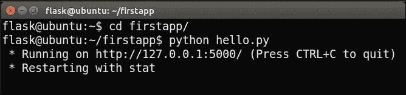
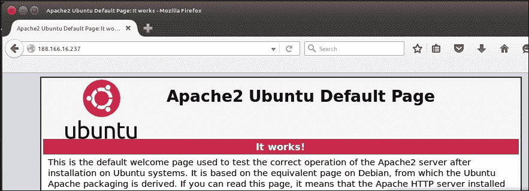

# 第一章，你好，世界！

读者好！让我们开始构建一些 Flask 应用程序。烧瓶是极简主义，足以让您的选择和灵活性；与大型框架不同的是，您可以选择您想要做的事情，然后操纵 Flask 来完成您的出价，并且它已经足够完整，可以立即工作。

我们将一起讨论三个 web 应用程序的开发；第一种方法很简单，可以让您在构建一个非平凡的 web 应用程序时，在烧瓶上切齿并习惯新技术和术语；第二部分将让您开始构建一个利用传统 SQL 数据库的 web 应用程序；最后一个是最具特色的，它将利用一个**NoSQL**数据库和一个前端框架来创建一个有用且美观的 web 应用程序。

在本章中，我们将简要介绍一下烧瓶是什么，也许更重要的是，它不是什么。我们将继续设置我们的基本开发环境和 web 服务器，并将安装 Python 包管理器和 Flask 本身。在本章结束时，我们将有我们第一个应用程序的概要，并且，按照古老的传统，我们将使用我们的新技能来显示文本“Hello，World！”。

简而言之，我们将介绍以下主题：

*   引种瓶
*   创造我们的发展环境
*   写“你好，世界！”
*   将应用程序部署到生产环境

# 引入瓶

Flask 是 Python web 开发的微观框架。用最简单的术语来说，框架是一个库或库集合，旨在解决一般问题的一部分，而不是一个完整的特定问题。在构建 web 应用程序时，始终需要解决一些问题，例如从 URL 到资源的路由、将动态数据插入 HTML 以及与最终用户的交互。

Flask 是一个微框架，因为它只实现核心功能（包括路由），但将更高级的功能（包括身份验证和数据库 ORMs）留给扩展。这样做的结果是，对于第一次使用的用户，初始设置更少，而对于经验丰富的用户，则有更多的选择和灵活性。这与“更完整”的框架形成对比，例如**Django**，它们规定了自己的 ORM 和身份验证技术。

正如我们将要讨论的，Flask 中的 Hello World 应用程序只能用七行代码编写，整个应用程序由一个文件组成。听起来好吗？我们走吧！

# 创造我们的发展环境

开发环境由开发人员在构建软件时使用的所有软件组成。首先，我们将安装 Python 包管理器（**pip**和Flask 包。在本书中，我们将展示在**Ubuntu 14.04**的干净安装上使用**Python 2.7**进行开发的详细步骤，但所有内容都应易于翻译到 Windows 或 OS X。

## 安装管道

对于我们的 Hello World 应用程序，我们只需要 Python Flask 包，但我们将在三个应用程序的整个开发过程中安装几个 Python 包。为了管理这些包，我们将使用Python 包管理器 pip。如果到目前为止您还没有使用包管理器使用 Python 开发，那么您会喜欢使用 pip 下载、安装、删除和更新包是多么容易。如果您已经在使用它，那么跳到下一步，我们将使用它来安装 Flask。

pip 管理器包含在 Python 的 3.4+和 2.7.9+版本中。对于较早版本的 Python，需要安装 pip。要在 Ubuntu 上安装 pip，请打开终端并运行以下命令：

```py
sudo apt-get update
sudo apt-get install python-pip

```

### 注

要在Windows 或 OS X 上安装 pip，您可以从 pip 主页[下载并运行`get-pip.py`文件 https://pip.pypa.io/en/latest/installing/#install-或升级 pip](https://pip.pypa.io/en/latest/installing/#install-or-upgrade-pip)。

就这样！现在可以通过 pip 轻松安装所需的任何 Python 包。

## 安装烧瓶

通过管道安装烧瓶再简单不过了。只需运行以下命令：

```py
pip install –-user flask

```

您可能会在终端中看到一些警告，但在最后，您还应该看到**成功安装了烧瓶**。现在，您可以将 Flask 导入 Python 程序，就像导入任何其他库一样。

### 注

如果您习惯于使用 VirtualEnv 进行 Python 开发，那么可以在 VirtualEnv 环境中安装 Flask。我们将在[附录](12.html "Appendix A. A Sneak Peek into the Future")*中进一步讨论这一点，这是对未来*的展望。

# 写“你好，世界！”

现在，我们将创建一个基本网页，并使用 Flask 的内置服务器将其发送到`localhost`。这意味着我们将在本地机器上运行一个 web 服务器，我们可以轻松地从本地机器发出请求。这对于开发非常有用，但不适用于生产应用程序。稍后，我们将了解如何使用流行的 ApacheWeb 服务器为 FlaskWeb 应用程序提供服务。

## 编写代码

我们的应用程序将是一个 Python 文件。在主目录中创建一个名为`firstapp`的目录，并在此目录中创建一个名为`hello.py`的文件。在`hello.py`文件中，我们将编写代码来为包含静态字符串“Hello，World！”的网页提供服务。代码如下所示：

```py
from flask import Flask

app = Flask(__name__)

@app.route("/")
def index():
    return "Hello, World!"

if __name__ == '__main__':
    app.run(port=5000, debug=True)
```

### 提示

**下载示例代码**

您可以从您的帐户[下载本书的示例代码文件 http://www.packtpub.com](http://www.packtpub.com) 。如果您在其他地方购买了本书，您可以访问[http://www.packtpub.com/support](http://www.packtpub.com/support) 并注册，将文件直接通过电子邮件发送给您。

您可以通过以下步骤下载代码文件：

*   使用您的电子邮件地址和密码登录或注册我们的网站。
*   将鼠标指针悬停在顶部的“支持”选项卡上。
*   点击代码下载和勘误表。
*   在搜索框中输入图书的名称。
*   选择要下载代码文件的书籍。
*   从您购买本书的下拉菜单中选择。
*   点击代码下载。

下载文件后，请确保使用以下最新版本解压或解压缩文件夹：

*   WinRAR/7-Zip for Windows
*   适用于 Mac 的 Zipeg/iZip/UnRarX
*   适用于 Linux 的 7-Zip/PeaZip

让我们来分析一下它的作用。第一行应该熟悉；它只是从包装`flask`中导入烧瓶。第二行使用模块名称作为参数创建 Flask 对象的实例。Flask 使用它来解析资源，在复杂的情况下，可以在这里使用`__name__`以外的东西。出于我们的目的，我们将始终使用`__name__`，它将我们的模块链接到 Flask 对象。

第 3 行是 Python 装饰程序。Flask 使用 decorators 进行 URL 路由，因此这行代码意味着，每当用户访问我们的 web应用程序的*根*主页面（由单正斜杠定义）时，应该调用它正下方的函数。如果您不熟悉装饰器，那么这些是漂亮的 Python 快捷方式，一开始看起来有点像黑魔法。本质上，它们调用一个函数，该函数接受在 decorator 下定义的函数（在本例中为`index()`），并返回一个修改后的函数。

接下来的两行应该也很熟悉。它们定义了一个非常简单的函数来返回我们的消息。由于当用户访问我们的应用程序时，Flask 会调用此函数，因此此函数的返回值将是响应请求我们登录页的用户而发送的值。

第 6 行是您可能熟悉的 Python 习惯用法。这是一个简单的条件语句，如果我们的应用程序直接运行，它的计算结果为`True`。它用于防止 Python 脚本在导入到其他 Python 文件时意外运行。

最后一行在本地机器上启动 Flask 的开发服务器。我们将其设置为在`port 5000`上运行（我们将使用`port 80`进行生产），并将调试设置为`True`，这将帮助我们直接在 web 浏览器中查看详细错误。

## 运行代码

要运行我们的开发 web 服务器，只需启动一个终端并运行`hello.py`文件。如果您使用与上一节所述相同的结构，则命令如下：

```py
cd firstapp/hello
python hello.py

```

您应获得与以下屏幕截图中类似的输出：



此外，您应该看到该进程继续运行。这是我们的 web 服务器，正在侦听请求。那么，让我们提出一个请求！

启动网络浏览器——我使用随 Ubuntu 打包的 Firefox，并导航到`localhost:5000`。

URL 的`localhost`部分是环回地址的快捷方式，通常为`127.0.0.1`，它要求您的计算机向自身发出 web 请求。冒号后面的数字（`5000`是它应该向其发出请求的端口。默认情况下，所有 HTTP（web）流量都通过`port 80`进行传输。目前，我们将使用`5000`，因为它不太可能与任何现有服务发生冲突，但我们将在生产中改用`port 80`，这是传统的，因此您不必担心冒号。

您应该会在浏览器中看到“Hello，World！”字符串，如下面的屏幕截图所示。祝贺您，您已经使用 Flask 构建了第一个 web 应用程序！


# 将我们的应用程序部署到生产环境中

有一个运行的应用程序很好，但 web 应用程序的固有理念是我们希望其他人能够使用它。由于我们的应用程序是基于 Python 的，我们在如何在 web 服务器上运行应用程序方面有点受限（许多传统的 web 主机只配置为运行 PHP 和/或.NET 应用程序）。让我们考虑如何使用 SurvivsT1 虚拟私人服务器 ORT T2（MultT3VIP PosiT4）来运行烧瓶应用程序，运行 AutoT5 服务器 Ubuntu 服务器、Apache 和 WSGI。

从这一点开始，我们将维持*两个*环境。第一个是我们的**开发**环境，我们刚刚建立了这个环境，我们将在这里编写代码，并使用`localhost`上运行的 Flask 服务器查看其结果（正如我们刚才所做的）。第二个是**生产**环境。这将是一个服务器，我们可以将我们的 web 应用程序部署到该服务器上，并使世界能够访问它们。当我们在开发环境中安装新的 Python 库或其他软件时，我们通常希望在生产环境中镜像我们的操作。

## 设置虚拟专用服务器

虽然从理论上讲，您可以在本地计算机上托管 web 应用程序并允许其他人使用它，但这有一些严重的限制。首先，每次你关闭电脑时，你的应用程序都不可用。此外，您的计算机可能通过 Internet 服务提供商（ISP）和无线路由器连接到 Internet。这意味着您的 IP 地址是动态的，并且经常变化，这使得应用程序的用户很难跟上！最后，很可能你与互联网的连接不对称，这意味着你的上传速度比下载速度慢。

在服务器上托管应用程序可以解决所有这些问题。在“云”流行之前，承载 web 应用程序的传统方式是购买一台物理服务器，然后找到一个数据中心来承载它。现在，事情简单多了。在几分钟内，您就可以启动一个虚拟服务器，在您看来，它就像一个物理服务器，您可以登录到它，对它进行配置，并享受对它的完全控制，但它实际上只是一个虚拟的“部分”，由云提供商拥有和控制。

在撰写本文时，云提供商领域的主要参与者包括亚马逊网络服务、微软 Azure、谷歌云计算和数字海洋。所有这些公司都允许您在按小时付费的情况下租用一台或多台虚拟服务器。如果你把学习 Flask 作为一种爱好，并且不愿意付钱给任何人来托管你的 web 应用程序，那么你很可能会很容易在其中一家提供商那里找到免费试用版。任何提供商提供的最小服务都可以承载我们将运行的所有应用程序。

选择前面的一个提供程序或您选择的另一个提供程序。如果你以前从未做过类似的事情，Digital Ocean 通常被认为拥有注册和创建新机器的最简单流程。一旦您选择了一个提供者，您应该能够按照他们各自的说明启动一个运行 Ubuntu 服务器 14.04 和 SSH 的 VPS。您可以完全控制机器，但有一点不同：您没有显示器或鼠标。

您将在本地终端上输入命令，该终端实际上将在远程计算机上运行。提供商将提供有关如何连接到 VPS 的详细说明，但如果您使用 Ubuntu，它应该与运行以下命令一样简单：

```py
ssh user@123.456.789.000

```

或者，如果您使用公钥-私钥身份验证进行设置，其中`yourkey.pem` 是私钥文件的完整路径，下面是要运行的命令：

```py
ssh user@123.456.78.000 –i yourkey.pem

```

这里，`user`是 VPS 上的默认用户，`yourkey`是您的私钥文件的名称。

**来自其他操作系统的 SSH:**

### 提示

OSX 上的 SSH 应该与 Ubuntu 相同，但如果您使用的是 Windows，则必须下载 PuTTY。参见[http://www.putty.org/](http://www.putty.org/) 下载并获取完整的使用说明。请注意，如果使用密钥文件进行身份验证，则必须将其转换为与 PuTTY 兼容的格式。转换工具也可以在 PuTTY 网站上找到。

一旦我们连接到VPS，安装烧瓶的过程与之前相同：

```py
sudo apt-get update
sudo apt-get install python-pip
pip install --user Flask

```

要安装 web 服务器、Apache 和 WSGI，我们将运行以下程序：

```py
sudo apt-get install apache2
sudo apt-get install libapache2-mod-wsgi

```

Apache 是我们的 web 服务器。它将侦听 web 请求（由用户使用浏览器访问我们的 web 应用程序生成），并将这些请求交给我们的 Flask 应用程序。由于我们的应用程序是 Python，我们还需要**WSGI（Web 服务器网关接口）**。

这是 web 服务器和 Python 应用程序之间的通用接口，它允许 Apache 与 Flask 对话，反之亦然。架构概述见下图：


## 配置我们的服务器

现在我们已经安装了 Apache，我们可以看到我们的第一个结果。您可能已经习惯于使用 URL 访问网站，例如`http://example.com`。我们将直接使用 VPS 的 IP 地址访问我们的 web 应用程序。您的 VP 应该有一个静态公共地址。Static表示它不会定期更改，public 表示它是全局唯一的。当您通过 SSH 连接到 VPS 时，您可能使用公共 IP 来实现这一点。如果找不到，请在 VPS 上运行以下命令，您应该会在输出中看到一个`inet addr`部分，其中包含您的公共 IP：

```py
ifconfig

```

IP 地址应类似于`123.456.78.9`。在浏览器的地址栏中输入您的 IP 地址，您会看到一个页面，上面写着“**Apache2 Ubuntu 默认页面：它可以工作！**”或类似的内容，如以下屏幕截图所示：



这意味着我们现在可以为任何有互联网连接的人提供 web 内容！然而，我们仍然需要：

*   将我们的代码复制到 VPS
*   连接 Apache 和 Flask
*   配置 Apache 以服务于我们的 Flask 应用程序

第一步，我们将在本地机器上设置一个 Git 存储库，并将该存储库克隆到 VPS。对于第二步，我们将使用与 Apache 一起安装的 WSGI 模块。最后，我们将了解如何编写一个虚拟主机，使 Apache 在默认情况下为我们的 Flask 应用程序提供服务。

## 安装和使用 Git

Git 是一个版本控制系统。版本控制系统可以自动保存代码库的多个版本。这对于撤销意外更改或甚至删除非常有用；我们可以简单地恢复到以前版本的代码。它还包括许多用于分布式开发的功能，也就是说，许多开发人员在单个项目上工作。不过，我们将主要使用它的备份和部署功能。

要在本地计算机和 VPS 上安装 Git，请在每台计算机上运行以下命令：

```py
sudo apt-get update
sudo apt-get install git

```

### 注

确保您熟悉使用终端在自己的机器上运行命令和通过 SSH 连接在服务器上运行命令之间的区别。在许多情况下，我们需要为每个环境运行相同的命令两次。

既然你有了软件，你需要一个地方来存放你的 Git 存储库或“repo”。两种流行的免费 Git 托管服务是 GitHub（[http://github.com](http://github.com) 和比特桶（[http://bitbucket.org](http://bitbucket.org) 。前往其中一个，创建一个帐户，然后按照它们提供的说明创建一个新的存储库。当您选择为存储库命名时，请将其命名为`firstapp`，以匹配我们将用于代码库的目录名称。一旦你创建了一个新的存储库，你应该被赋予一个唯一的 URL 到你的存储库。请注意这一点，因为我们将使用它来推动我们的**你好，世界！**应用程序使用`git`并将其部署到我们的 VPS。

在本地计算机上，打开终端并将目录更改为 Flask 应用程序。初始化新存储库并通过以下命令将其链接到远程 Git 存储库：

```py
cd firstapp
git init
git remote add origin <your-git-url>

```

告诉`git`您是谁，让它自动向您的代码更改添加元数据，如下所示：

```py
git config --global user.email "you@example.com"
git config --global user.name "Your Name"

```

Git 允许您完全控制哪些文件是存储库的一部分，哪些不是。尽管我们在`firstapp`目录中初始化了 Git repo，但我们的 repo 当前不包含任何文件。将我们的应用程序添加到 repo，提交，然后推送，如下所示：

```py
git add hello.py
git commit -m "Initial commit"
git push -u origin master

```

这些是我们将在本书中使用的主要 Git 命令，所以让我们简单地看看每一个都做了些什么。`add`命令将新的或修改过的文件添加到我们的存储库中。这会告诉 Git 哪些文件实际上是我们项目的一部分。可以将`commit`命令看作是在当前状态下拍摄项目的快照。此快照保存在本地计算机上。对代码库进行任何重大更改都可以创建一个新的`commit`，因为如果稍后的`commit`破坏了我们的应用程序，我们可以很容易地恢复到以前的`commits`。最后，`push`命令将本地更改推送到远程 Git 服务器。这有利于备份，还允许我们获取 VPS 上的更改，从而使本地计算机上的代码与 VPS 上的代码保持同步。

现在，再次使用 SSH 连接到您的 VPS，并获得我们的代码副本，如下所示：

```py
cd /var/www
git clone <your-git-url>

```

### 注

上面命令的`<your-git-url>`部分实际上是 Git 存储库 URL 的占位符。

如果在尝试克隆 Git 存储库时出现`permission denied`错误，您可能需要为正在使用的 Linux 用户取得`/var/www`目录的所有权。如果您使用`tom@123.456.789.123`登录服务器，您可以运行以下命令，将授予您的用户对`/var/www`的所有权，并允许您将 Git 存储库克隆到其中。`tom`也是以下情况中使用的占位符：

```py
sudo chown -R tom /var/www

```

如果您使用`firstapp`作为远程存储库的名称，则应创建一个名为`firstapp`的新目录。让我们使用以下方法验证代码是否存在：

```py
cd firstapp
ls

```

你应该看看你的`hello.py`档案。现在，我们需要配置 Apache 以使用 WSGI。

## 为我们的烧瓶应用程序提供 WSGI

首先，我们将在应用程序目录中创建一个非常简单的`.wsgi`文件。然后，我们将在 Apache 查找可用站点的目录中创建一个 Apache配置文件。

关于这两个步骤，唯一有点棘手的部分是，我们将直接在 VPS 上创建文件，由于我们的 VPS 没有显示，这意味着我们必须使用命令行界面文本编辑器。当然，我们可以在本地创建文件，然后将它们传输到我们的 VP，就像我们在代码库中所做的那样，但是对于配置文件的小更改，这通常是不值得的。使用没有鼠标的文本编辑器需要一点习惯，但这是一项很好的学习技能。Ubuntu 上的默认文本编辑器是 Nano，其他流行的选择是 vi 或 Vim。有些人使用 Emacs。如果你已经有了最爱，那就去吧。如果没有，我们将在本书的示例中使用 Nano（它已经安装好了，可以说是最简单的）。然而，如果你想多走一步，我建议你学习使用 Vim。

假设您仍然连接到 VPS，并已按照最新步骤导航到`/var/www/firstapp`目录，请运行以下命令：

```py
nano hello.wsgi

```

这将创建`hello.wsgi`文件，您现在可以通过 Nano 进行编辑。键入以下内容：

```py
import sys
sys.path.insert(0, "/var/www/firstapp")
from hello import app as application

```

这只是 Python 语法，它将应用程序修补到 PATH 系统中，以便 Apache 可以通过 WSGI 找到它。然后我们将`app`（我们在`hello.py`应用程序中用`app = Flask(__name__)`行将其命名）导入到名称空间中。

点击*Ctrl*+*X*退出 Nano并在提示保存更改时输入*Y*。

现在，我们将创建一个指向刚才创建的`.wsgi`文件的Apache 配置文件，如下所示：

```py
cd /etc/apache2/sites-available
nano hello.conf

```

### 注

如果您在编辑或保存文件时遇到权限问题，您可能也需要拥有`apache2`目录的所有权。运行以下命令，将用户名替换为 Linux 用户：

`sudo chown –R tom /etc/apache2`

在这个文件中，我们将为 Apache 虚拟主机创建一个配置。这将允许我们从一台服务器为多个站点提供服务，这将在以后我们希望使用单个 VP 为其他应用程序提供服务时非常有用。在 Nano 中，输入以下配置：

```py
<VirtualHost *>
    ServerName example.com

    WSGIScriptAlias / /var/www/firstapp/hello.wsgi
    WSGIDaemonProcess hello
    <Directory /var/www/firstapp>
       WSGIProcessGroup hello
       WSGIApplicationGroup %{GLOBAL}
        Order deny,allow
        Allow from all
    </Directory>
</VirtualHost>
```

这看起来可能很复杂，但实际上非常简单。我们将创建一个`virtualhost`并指定我们的域名、我们的`.wsgi`脚本在哪里、我们的应用程序的名称以及允许谁访问它。我们将在最后一章讨论域名，但现在，您可以将其保留为`example.com`，因为我们将通过其 IP 地址访问我们的应用程序。

### 注

如果您在这一步上遇到困难，Flask 网站提供了大量关于配置和故障排除 Apache配置的资源。您可以在[找到它 http://flask.pocoo.org/docs/0.10/deploying/mod_wsgi/](http://flask.pocoo.org/docs/0.10/deploying/mod_wsgi/) 。

当再次提示保存并退出文件时，点击*Ctrl*+*X*并输入*Y*。现在，我们需要启用配置并将其设置为默认站点。

### 配置 Apache 为我们的 Flask 应用程序服务

Apache 站点的工作方式如下：有一个`sites-available`目录（我们在其中创建了新的虚拟主机配置文件）和一个`sites-enabled`目录，其中包含我们想要激活的所有配置文件的快捷方式。默认情况下，您将在名为`000-default.conf`的`sites-available`目录中看到一个文件。这就是我们在第一次安装 Apache 时看到一个默认的**Apache 页面的原因。我们不想再这样了；相反，我们希望使用我们的应用程序作为默认站点。因此，我们将禁用默认 Apache 站点，启用我们自己的站点，然后重新启动 Apache 以使更改生效。运行以下命令以执行此操作：**

```py
sudo a2dissite 000-default.conf
sudo a2ensite hello.conf
sudo service apache2 reload

```

### 注

所需的 Apache 配置和命令可能因您使用的平台而异。如果您按照建议使用 Ubuntu 服务器，前面的步骤应该都能顺利完成。如果没有，您可能需要了解一下如何为特定平台配置 Apache。

您应该注意输出中的`reloading web server apache2`。如果显示错误，则可能是错误配置了前面命令中的某些内容。如果是这种情况，请仔细阅读错误消息，然后回顾前面的步骤，看看为什么事情没有按预期工作。

要测试一切正常，请在本地计算机上打开 web 浏览器，然后再次在地址栏中键入 IP 地址。你应该看看**你好，世界！**显示在您的浏览器中，而不是我们以前看到的默认 Apache 页面。

如果您得到的是**错误 500**，这意味着我们的应用程序由于某种原因而失败。不要害怕；您最好现在就习惯处理这个错误，因为修复可能很简单，而不是以后添加更多可能损坏或配置错误的组件。要找出哪里出了问题，请在 VPS 上运行以下命令：

```py
sudo tail –f /var/log/apache2/error.log

```

`tail`命令只输出作为参数传递的文件的最后几行。`-f`用于 follow，这意味着如果文件更改，输出将被更新。如果您无法立即确定哪些行表示我们正在查找的错误，请再次访问本地机器上的web 浏览器中的站点，您将看到相应地更新了`tail`命令的输出。以下屏幕截图显示无错误时，`tail`命令的输出；但是，如果出现任何错误，您将看到在所有信息消息中打印错误输出。


一些可能的触发点是错误配置的 WSGI 和 Apache 文件（例如，确保您的`WSGIDaemonProcess`和`daemon name`匹配）或错误配置的 Python（您可能忘记在 VPS 上安装 Flask）。如果你无法理解错误消息的含义，互联网搜索该消息（删除应用程序中特定于错误的部分，如名称和路径）通常会为你指明正确的方向。如果做不到这一点，Stack Overflow 和 Google 组上有强大且非常友好的 Flask 和 WSGI 社区，通常有人愿意帮助初学者。请记住，如果你遇到问题，并且无法在网上找到现有的解决方案，请不要因为提出问题而感到难过；你将帮助无数面临类似问题的人。

# 总结

我们在第一章中读了很多资料！我们进行了一些初始设置和内部管理，然后使用 Flask 编写了第一个 web 应用程序。我们看到它在本地运行，然后讨论了如何使用 Git 将代码复制到服务器。我们将服务器配置为向公众提供应用程序；然而，我们的应用程序只是一个静态页面，向访问我们页面的任何人打印“Hello，World！”字符串。这对很多人来说都没有用处，可以通过使用静态 HTML 页面来实现。然而，通过我们付出的额外努力，我们现在已经拥有了应用程序背后 Python 的所有功能；我们只是还没有使用它！

在下一章中，我们将发现如何利用 Python 使我们的 web 应用程序更加有用！