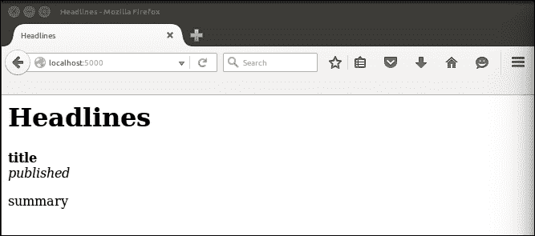
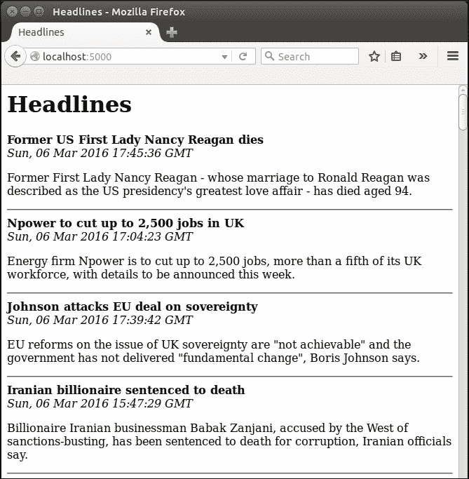
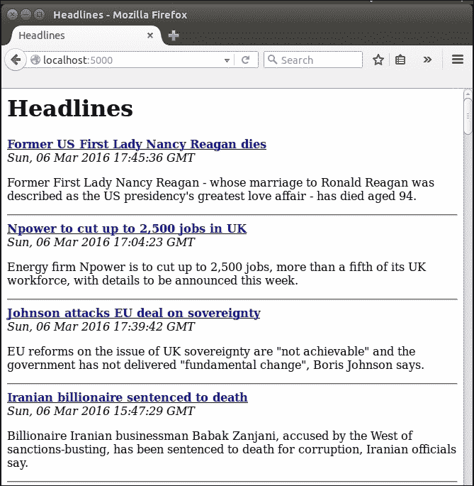

# 第三章，在我们的项目中使用模板

在上一章中，我们看到了一种将静态 HTML 与动态内容结合起来创建网页的方法。但是它很混乱，我们不想为了构建网页而攻击 Python 字符串。混合使用 HTML 和 Python 并不理想，原因有几个：首先，这意味着如果我们想要更改静态文本，比如标题中出现的文本，我们必须编辑 Python 文件，这还需要将这些文件重新加载到 Apache 中。如果我们雇佣前端开发人员来处理 HTML，我们就有可能让他们错误地破坏不熟悉的 Python 代码，而且要正确地构造任何其他前端代码（如 JavaScript 和 CSS）要困难得多。理想情况下，我们应该致力于前端和后端组件之间的完全隔离。我们可以在很大程度上使用 Jinja 来实现这一点，但与生活的大多数方面一样，一些妥协是必要的。

到本章结束时，我们将扩展应用程序以显示所选出版物的多个标题。我们将为每个出版物显示几篇文章，每一篇都有一个到原始文章的链接，我们的逻辑和视图组件将在很大程度上分开。在本章中，我们将介绍以下主题：

*   金贾简介
*   Jinja 模板的基本用法
*   Jinja 模板的高级使用

# 介绍金贾

Jinja 是一个 Python 模板引擎。它允许我们轻松定义由 Python 填充的 HTML 动态块。HTML 模板甚至对于具有多个页面的静态网站也很有用。通常，每个页面上都有一些常用元素，例如页眉和页脚。虽然可以单独维护静态网站的每个页面，但如果对共享部分进行更改，则需要在多个位置进行单个更改。烧瓶是建在 Jinja 之上的，因此，尽管可以在没有烧瓶的情况下使用 Jinja，但 Jinja 仍然是烧瓶固有的一部分，烧瓶提供了几种直接使用 Jinja 的方法。一般来说，Flask 对应用程序的结构不作任何假设，只考虑您告诉它的内容，并且更喜欢通过可选插件提供功能。Jinja 在某种程度上是个例外。Flask 默认为您提供 Jinja，并假设您将所有 Jinja 模板存储在应用程序名为`templates`的子目录中。

创建模板后，我们将从 Flask 应用程序调用以呈现这些模板。呈现包括解析 Jinja 代码、插入任何动态数据以及创建纯 HTML 以返回到用户浏览器。所有这些都是在幕后完成的，所以在哪里做什么会让人有点困惑。我们会一步一步来。

# Jinja 模板的基本使用

使用 Jinja 模板的第一步是在我们的应用程序中创建一个包含模板文件的目录，因此导航到您的`headlines`目录，并创建一个名为`templates`的目录。与前面的步骤不同，此名称是应用程序其他部分所期望的，并且区分大小写，因此在创建它时要小心。在最基本的层次上，Jinja 模板可以只是一个 HTML 文件，我们将对所有 Jinja 模板使用`.html`扩展名。在`templates`目录中创建一个名为`home.html`的新文件。这将是我们的用户在访问我们的应用程序时看到的页面，并且将包含我们以前在 Python 字符串中拥有的所有 HTML。

### 注

在本书中，我们将只使用 Jinja 来构建 HTML 文件，但是 Jinja 在生成任何基于文本的格式时都非常灵活。尽管我们对 Jinja 模板使用`.html`扩展名，但文件本身并不总是纯 HTML。

现在，将以下静态 HTML 代码放入该文件中。在下一步中，我们将研究如何在 Python 和模板之间传递动态数据。

```py
<html>
    <head>
        <title>Headlines</title>
    </head>
    <body>
        <h1>Headlines</h1>
        <b>title</b><br />
        <i>published</i><br />
        <p>summary</p>
    </body>
</html>
```

现在在我们的 Python 代码中，我们将呈现这个模板并返回它，而不是构建字符串并在路由函数中返回它。在`headlines.py`中，在顶部添加导入：

```py
from flask import render_template
```

`render_template`函数是魔术，它以 Jinja 模板作为输入，生成纯 HTML，能够被任何浏览器读取，作为输出。现在，一些神奇的东西已经消失了，因为我们将给它纯 HTML 作为输入，并在浏览器中查看与输出相同的内容。

## 呈现基本模板

在`get_news()`函数中，删除`return`语句，该语句也包含我们的三重引号 HTML 字符串。保留前面从`feedparser`获取数据的行，因为我们很快会再次使用它。

更新`return`语句，使`get_news()`函数现在看起来如下：

```py
@app.route("/")
@app.route("/<publication>"
def get_news(publication="bbc"):
  feed = feedparser.parse(RSS_FEEDS[publication])
  first_article = feed['entries'][0]
 return render_template("home.html")

```

尽管我们当前的 HTML 文件是纯 HTML 文件，并且还没有使用我们稍后将看到的任何 Jinja 语法，但实际上我们已经在做很多事情了。这个调用在我们的`templates`目录中查找名为`home.html`的文件，读取该文件，解析任何 Jinja 逻辑，并创建一个 HTML 字符串返回给用户。完成上述两项更改后，使用`python headlines.py`再次运行应用程序，并在浏览器中导航到`localhost:5000`。

再一次，为了前进，我们后退了一步。如果您现在运行应用程序并在浏览器中查看结果，您应该会看到类似于我们原始页面的内容，除了看到的不是真实的新闻数据，而是字符串**title**、**published**和**summary**，如下图所示：



让我们来看看如何在我们的 To.t0 调用中填充这些字段，这样我们就可以再次看到真实的新闻内容。

## 将动态数据传递给我们的模板

首先，在我们的 Python 文件中，我们将把作为命名变量传递。再次更新`get_news()`函数，并将需要显示的所有数据作为参数传递给`render_template()`，如下所示：

```py
@app.route("/")
@app.route("/<publication>"
def get_news(publication="bbc"):
  feed = feedparser.parse(RSS_FEEDS[publication])
  first_article = feed['entries'][0]
 render_template("home.html",title=first_article.get("title"),published=first_article.get("published"),summary=first_article.get("summary"))

```

`render_template`函数将模板的文件名作为其第一个参数，然后可以将任意数量的命名变量作为后续参数。每个变量中的数据都将使用变量名供模板使用。

## 在我们的模板中显示动态数据

在我们的`home.html`文件中，我们只需要在占位符的两侧放置两个大括号。将其更改为如下所示：

```py
<html>
    <head>
        <title>Headlines</title>
    </head>
    <body>
        <h1>Headlines</h1>
        <b>{{title}}</b><br />
        <i>{{published}}</i><br />
        <p>{{summary}}</p>
    </body>
</html>
```

双大括号{}向 Jinja 指出，其中的任何内容都不应被视为文本 HTML 代码。因为我们的*占位符*、*标题*、*发布的*和*摘要*与传递到`render_template`调用中的 Python 变量名相同，只需添加周围的大括号，就意味着`render_template`调用将用它们替换真实数据，返回纯 HTML 页面。尝试一下，确保我们可以再次看到真实的新闻数据，如下图所示：


# Jinja 模板的高级使用

现在我们已经将后端和前端组件完美分离，但是我们的应用程序没有比以前做更多的事情。让我们来看看如何从一个选定的出版物显示多个新闻文章。我们不想为每篇文章的`render_template`调用添加三个新参数（如果我们决定只显示一篇文章的标题、日期和摘要，还可以添加几十个额外参数）。

幸运的是，Jinja 可以接管 Python 的一些逻辑。这就是我们必须小心的地方：我们花费了所有的努力来分离我们的逻辑和视图组件，当我们发现 Jinja 语言实际上有多么强大时，我们很容易将大量逻辑移到模板文件中。这将使我们回到难以维护的代码的起点。然而，在某些情况下，前端代码必须处理一些逻辑，比如现在我们不想用太多重复的参数污染后端代码。

## 使用 Jinja 对象

首先要学习的是 Jinja 如何处理对象。Jinja 可以理解所有基本的 Python 数据结构，例如变量、对象、列表和字典，并且可以以与我们在 Python 中使用的非常类似的方式进行处理。例如，我们可以传入`first_article`对象并在 Jinja 中处理分离，而不是将本文的三个组件分别传递给模板。让我们看看怎么做。将 Python 代码更改为并将一个命名参数传入`render_template`，即`first_article`，前端代码从中获取所需的位。

`render_template`调用现在应该如下所示：

```py
render_template("home.html", article=first_article)
```

模板现在有一个名为`article`的引用，我们可以使用它来获得与之前相同的结果。将 home.html 的相关部分更改为：

```py
<b>{{article.title}}</b><br />
<i>{{article.published</i><br />
<p>{{article.summary}}</p>
```

请注意，与 Python 相比，在 Jinja 中从字典访问项目略有不同。我们使用句号来访问属性，因此要访问文章的标题，我们使用前面示例中的`{{article.title}}`，而不是 Python 等效的`article["title"]`或`article.get("title")`。我们的代码同样整洁，但仍然没有额外的功能。

## 将循环逻辑添加到我们的模板中

不需要太多额外的努力，我们就可以将整个文章列表提供给 Jinja。在 Python 代码中，将`render_template`调用更改为如下所示：

```py
render_template("home.html", articles=feed['entries'])
```

您可以删除代码中定义`first_article`变量的前一行正上方的，因为我们不再需要它了。我们的模板现在可以访问我们通过`feedparser`获取的完整文章列表。

在我们的 Jinja 模板中，我们现在可以`add {{articles}}`或`{{articles[0]}}`看到我们正在传递的所有信息的完整转储，或者只看到第一篇文章的转储。如果您感兴趣，可以尝试将此作为中间步骤，但在下一步中，我们将循环浏览所有文章并显示我们想要的信息。

通过给我们的模板提供更多的数据，我们传递了一些理想情况下应该由 Python 代码来处理的逻辑职责，但是我们也可以在 Jinja 中非常干净地处理这个问题。类似于我们使用双大括号`{{``}}`来表示变量的方式，我们使用大括号和百分比组合``来表示控制逻辑。通过看一个例子，这一点会更清楚。将模板代码的`<body>`部分改为：

```py
<body>
    <h1>Headlines</h1>
    
        <b>{{article.title}}</b><br />
        <i>{{article.published}}</i><br />
        <p>{{article.summary}}</p>
        <hr />
    
</body>
```

我们可以看到 Jinja for 循环类似于 Python。它循环遍历我们从 Python 代码传入的*文章*列表，并为循环的每次迭代创建一个新变量`article`，每次引用列表中的下一项。`article`变量可以像任何其他 Jinja 变量一样使用（使用双括号）。因为与 Python 不同，Jinja 中的空格是不相关的，所以我们必须定义循环以``行结束的位置。最后，HTML 中的`<hr />`创建了一条水平线，作为每篇文章之间的分隔符。

使用新模板文件在本地运行应用程序，并在浏览器中查看结果。您应该会看到类似下图的内容：



## 向我们的模板添加超链接

现在我们想将每个标题链接到原始文章。如果标题看起来很有趣，我们的用户可能会发现这很有用，他或她可以很容易地阅读文章的全文。RSS 提要的所有者通常也会要求或请求使用提要链接的任何人返回到原始文章。（再次检查与大多数大型提要一起发布的条款和条件。）因为我们已经将整个`article`对象传递给了我们的模板，所以我们不需要对 Python 代码做任何进一步的更改来实现这一点；我们只需要利用现有的额外数据。

在模板文件中，搜索以下内容：

```py
<b>{{article.title}}</b><br />
```

将此行更改为以下内容：

```py
<b><a href="{{article.link}}">{{article.title}}</a></b><br />
```

如果您是 HTML 新手，那么这里会发生很多事情。让我们把它分开：HTML 中的`<a>`标记表示超链接（在大多数浏览器中通常默认显示为蓝色并带下划线），`href`属性指定链接的目的地或 URL，链接以`</a>`标记结束。也就是说，`<a>`和`</a>`之间的任何文本都可以点击，并且我们的用户浏览器会以不同的方式显示。请注意，我们可以使用双括号来表示一个变量，即使在用于定义目标属性的双引号内也是如此。

如果您在浏览器中刷新页面，您现在应该可以看到标题为粗体链接，如下图所示，单击其中一个链接可以转到原始文章。



## 将我们的代码推送到服务器

现在是将代码推送到 VPS 的好时机。这是我们最后一次详细介绍如何实现这一点，但希望您现在已经对 Git 和 Apache 足够熟悉，不会有任何意外。在本地计算机上，从`headlines`目录运行：

```py
git add headlines.py
git add templates
git commit -m "with Jinja templates"
git push origin master

```

在您的 VPS 上（通常使用 SSH），切换到适当的目录，从 Git 存储库中提取更新，然后重新启动 Apache 以重新加载代码：

```py
cd /var/www/headlines
git pull
sudo service apache2 reload

```

通过从本地计算机上的 web 浏览器访问 VP 的 IP 地址，并检查您看到的输出是否与我们在本地看到的相同，确保一切正常，如下图所示：


# 总结

我们现在有一个基本的新闻摘要网站！您可以显示多个不同网站的最新新闻，查看每篇最新文章的标题、日期和摘要，并可以单击任何标题访问原始文章。您只看到了 Jinja 语言强大功能的一小部分示例，尽管我们在以后的章节中扩展了这个项目和其他项目，您将看到它如何用于继承、条件语句等。

在下一章中，我们将向应用程序中添加天气和货币信息，并研究与用户交互的方法。