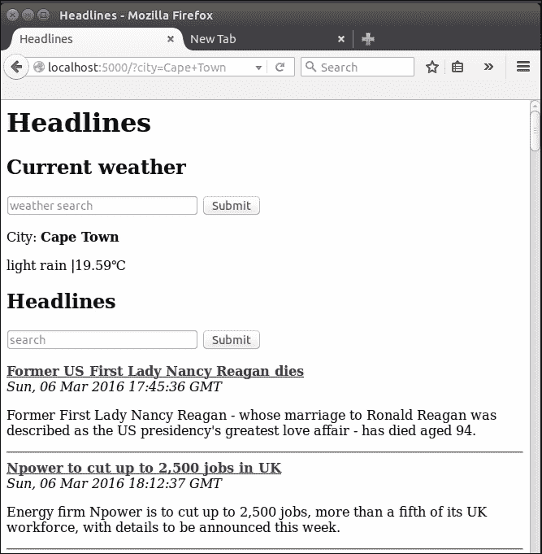
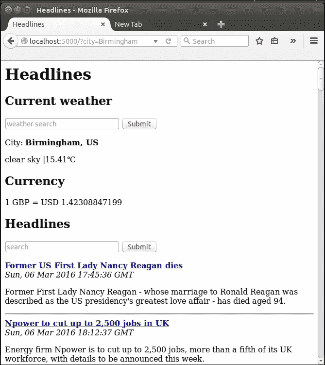
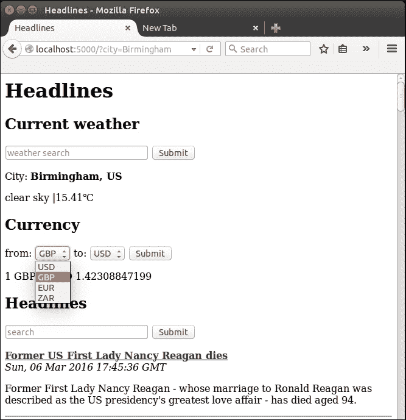
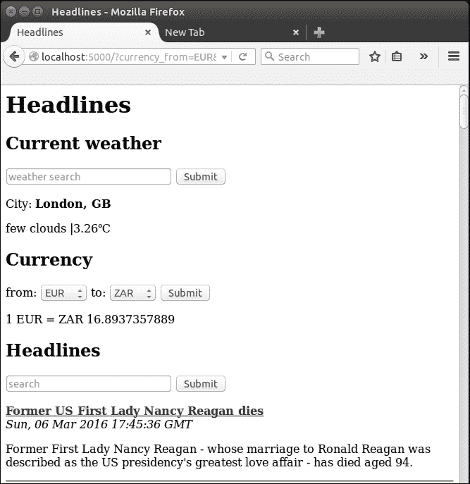

# 第四章，我们项目的用户输入

还记得我们如何允许用户使用 URL 中的`<variable>`部分指定要查看的出版物吗？虽然我们有效地从用户那里获取了输入，但这是一种检索输入的方法，有一些相当大的限制。让我们来看一些与用户交互的更强大的方法，并向应用程序添加一些更有用的信息。从这里开始，我们将对代码文件进行一些增量更改，因此请记住，如果您需要任何概述，可以随时参考附带的代码包。

在本章中，我们将介绍一些更灵活、更强大的获取输入的方法。在此过程中，我们还会遇到一些更高级的 Git 功能，并花点时间解释如何使用它们。

本章将介绍以下主题：

*   使用 HTTP GET 获取用户输入
*   使用 HTTP POST 获取用户输入
*   添加天气和货币数据

# 使用 HTTP GET 获取用户输入

HTTP GET 请求是从用户检索输入的最简单方法。您可能在浏览网页时注意到 URL 中有问号。当在网站的搜索框中提交一个词时，您的搜索词通常会出现在 URL 中，如下所示：

`example.com/search?query=weather`

问号后的位表示命名的 GET 参数。名称为`query`，值为`weather`。尽管这些参数通常是通过 HTML 输入框自动创建的，但用户也可以手动将它们插入 URL，或者它们可以是发送给用户的可单击链接的一部分。HTTP GET 设计用于从用户获取有限的非敏感信息，以便服务器按照 GET 参数的请求返回页面。按照惯例，GET 请求不应该以产生副作用的方式修改服务器状态，也就是说，用户应该能够多次发出完全相同的请求，并且总是得到完全相同的结果。

因此，GET 请求非常适合允许用户指定要查看的发布。让我们扩展我们的标题项目，以包括基于 GET 请求选择标题。首先，让我们修改 Python 代码以执行以下操作：

*   从 Flask 导入请求上下文
*   删除动态 URL 变量
*   检查用户是否输入了有效的发布作为 GET 参数
*   将用户查询和发布传递给模板

更新`headlines.py`文件如下：

```py
import feedparser
from flask import Flask
from flask import render_template
from flask import request

app = Flask(__name__)

RSS_FEEDS = {'bbc': 'http://feeds.bbci.co.uk/news/rss.xml',
             'cnn': 'http://rss.cnn.com/rss/edition.rss',
             'fox': 'http://feeds.foxnews.com/foxnews/latest',
             'iol': 'http://www.iol.co.za/cmlink/1.640'}

@app.route("/")
def get_news():
 query = request.args.get("publication")
 if not query or query.lower() not in RSS_FEEDS:
 publication = "bbc"
 else:
 publication = query.lower()
        feed = feedparser.parse(RSS_FEEDS[publication])
 return render_template("home.html",articles=feed['entries']

if __name__ == "__main__":
    app.run(port=5000, debug=True)
```

第一个新更改是 Flask 请求上下文的新导入。这是另一种让我们的生活更轻松的魔法。它提供了一个全局上下文，我们的代码可以使用它来访问有关向应用程序发出的最新请求的信息。这对我们很有用，因为我们的用户作为请求的一部分传递的 GET 参数在`request.args`中自动可用，我们可以从中访问键值对，就像使用 Python字典一样（尽管它是不可变的）。请求上下文还简化了请求处理的其他部分，这意味着我们不必担心线程或请求的顺序。您可以在以下网站上阅读更多关于请求上下文如何工作以及其作用的信息：

[http://flask-cn.readthedocs.org/en/latest/reqcontext/](http://flask-cn.readthedocs.org/en/latest/reqcontext/)

我们使用返回`None`的`get()`方法检查是否设置了发布密钥。如果密钥不存在。如果参数存在，我们确保该值是有效的（也就是说，它由我们的`RSS_FEEDS`映射进行解释），如果是，我们返回匹配的发布。

我们可以通过访问 URL 并后跟`get`参数来测试代码，例如：`localhost:5000/?publication=bbc`。不幸的是，根据我们的用户体验，我们使应用程序变得不那么友好，而不是更加友好。我们为什么要这样做？事实证明，我们的用户不必手动修改 URL，只需做一个很小的更改，我们就可以自动填充 URL 参数，这样用户根本不必触摸 URL。修改`home.html`模板，并在标题下方添加以下 HTML：

```py
<form>
  <input type="text" name="publication" placeholder="search" />
  <input type="submit" value="Submit" />
</form>
```

这很简单，但是让我们把它分开，看看它是如何工作的。首先，我们创建一个 HTML 表单元素。默认情况下，这将在提交时创建 HTTP GET 请求，方法是将任何输入作为 GET 参数传递到 URL 中。我们有一个名为`publication`的文本输入。此名称很重要，因为 GET 参数将使用此名称。`placeholder`是可选的，但它将给我们的用户带来更好的体验，因为浏览器将使用它来指示文本字段的用途。最后，我们有另一个类型为`submit`的输入。这会自动为表单创建一个漂亮的**提交**按钮，按下该按钮后，将获取输入中的任何文本并将其提交到 Python 后端。

保存模板，然后重新加载页面以查看它现在的工作方式。您应该在页面顶部看到输入表单，如下面的屏幕截图所示。我们已经为四行 HTML 获得了很多功能，现在我们可以看到，虽然 GET arguments 最初看起来像是在创建更多的任务和管理，但实际上它们使我们的 web 应用程序更简单、更友好。


# 使用 HTTP POST 获取用户输入

HTTP GET 的替代方案是 HTTP POST，并且可能并不总是很明显要使用哪个。HTTP POST 用于将较大的数据块或更敏感的数据发布到服务器。通过 POST 请求发送的数据在 URL 中不可见，尽管这并不使其本身更安全（默认情况下不提供加密或验证），但它确实提供了一些安全优势。URL 通常由浏览器缓存，并在用户下次键入类似 URL 时通过自动完成功能建议。

因此，通过 GET 请求发送的数据可能会被保留。使用 POST 还可以防止某人通过查看用户的肩膀（肩上冲浪）来查看数据。尤其是在输入时，密码通常会因使用 HTML 密码字段而变得模糊，使其在浏览器中显示为星号（*******）或点（••••）。但是，如果使用 GET 发送数据，URL 中的数据仍然清晰可见，因此应该始终使用 POST。

虽然我们的搜索查询很难保密或过长，但我们现在要花点时间看看如何使用 POST 而不是 GET 实现相同的功能。如果你只是想继续完成我们的标题应用程序，请跳过本节，但请记住，我们将在以后的项目中使用 POST 请求，无需进一步解释。完成 POST 示例后，我们将把应用程序恢复到当前的状态（使用 GET 请求），因为这更适合我们的用例。

## 在 Git 中创建分支

为了对我们不确定是否需要的代码库进行更改，我们将使用 Git 的分支功能。把一根树枝想象成一个岔路口，除非我们可以随时改变主意，回到决策点。首先，我们需要确保当前分支（主分支）是最新的，所有本地更改都已提交。打开终端，并从标题目录运行以下命令：

```py
git add headlines.py
git add templates/home.html
git commit -m "Using GET"
git push origin master

```

我们不需要严格地将其推送到服务器 Git 在本地保存完整的修订历史记录，没有推送，我们的更改在理论上仍然是安全的。但是，我们的代码处于工作状态，因此备份到远程服务器并没有什么害处。现在，我们将创建新分支并切换到使用它进行下一组更改：

```py
git branch post-requests
git checkout post-requests

```

我们现在正在代码库的一个新分支中工作。通常，我们最终会将这个分支合并回主分支，但在我们的情况下，一旦我们完成了所需的工作，我们就会放弃它。由于 Git 在幕后做很多事情，所以很难想象发生了什么，因此如果您感兴趣并可能在未来的项目中使用 Git，那么就值得一读。否则，就把它看作一个检查点，这样我们就可以自由地进行实验，而不用担心弄乱代码。

## 在烧瓶中添加柱路径

要使用POST 请求，我们需要对 Python 和 HTML 代码进行一些小的更改。在`headlines.py`文件中，进行以下更改：

*   将`request.args.get`更改为`request.form.get`
*   将`@app.route("/")`更改为`@app.route("/", methods=['GET', 'POST'])`

第一个更改的原因是我们现在从表单中获取用户数据，因此 Flask 会在`request.form`中自动向我们提供这些数据。这与`request.get`的工作方式相同，只是它从 POST 请求而不是 GET 收集数据。第二个变化并不那么明显。我们之前没有提到的是，所有路由装饰器都可以指定如何访问函数：通过 GET 请求、POST 请求，或者两者都可以。默认情况下，只允许 GET，但我们现在希望可以通过 GET（当我们只访问主页并默认使用 BBC 时）或 POST（当我们通过表单请求包含附加查询数据的页面时）访问默认页面。`methods`参数接受 HTTP 方法列表，应该允许这些方法访问应用程序的特定路由。

## 让我们的 HTML 表单使用 POST

我们的模板需要类似的更改。将`home.html`文件中的开启`<form>`标签改为：

```py
<form action="/" method="POST">
```

就像 Flask 一样，HTML表单默认使用 GET，因此我们必须明确定义我们想要使用 POST。`action`属性并不是绝对必要的，但通常，当我们使用 POST 时，我们会将用户重定向到确认页面或类似页面，下面页面的 URL 会出现在这里。在本例中，我们明确表示，我们希望在提交表单后被重定向到同一页面。

保存对 Python 和 HTML 文件的更改，并在浏览器中刷新页面以查看更改是否生效。功能应该完全相同，只是我们在 URL 中看不到任何数据。对于许多应用程序来说，这可能更干净，但在我们的例子中，这并不是我们想要的。首先，我们希望搜索词被用户的浏览器缓存。如果用户习惯性地对 FOX 进行查询，我们希望浏览器能够在他开始为我们的应用程序键入 URL 后自动完成查询。此外，我们希望用户能够轻松共享包含查询的链接。

如果一个用户（我们称他为 Bob）在我们的应用程序中键入**cnn**后看到一堆有趣的标题，并希望与另一个用户（Jane）共享所有这些标题，我们不希望 Bob 必须给 Jane 发消息，告诉她访问我们的网站，然后在搜索表单中键入特定的查询。相反，Bob 应该能够共享一个 URL，允许 Jane 直接访问他所看到的页面（例如，`example.com/?publication=cnn`）。Jane 只需点击 Bob 发送的链接即可查看相同的标题（假设她在 RSS 提要更新之前访问了我们的页面）。

## 恢复我们的 Git 存储库

我们需要将代码恢复到以前的状态。因为上一节中的所有更改都是在我们的实验 post 请求分支中进行的，所以我们不需要手动重新编辑更改的行。相反，我们将把更改提交到此分支，然后切换回主分支，在那里我们将在离开时找到所有内容。在终端中，运行以下操作：

```py
git add headlines.py
git add templates/home.html
git commit –m "POST requests"
git checkout master

```

打开`headlines.py`和`templates/home.html`文件以确定，但它们应该与我们在试验 POST 之前留下的完全相同！

# 添加天气和货币数据

现在，让我们添加更多功能。我们展示了来自三个不同来源的媒体头条，但我们的用户可能不仅仅对时事感兴趣。我们将看看在页面顶部显示当前天气和一些汇率是多么容易。对于天气数据，我们将使用 OpenWeatherMapAPI，对于货币数据，我们将使用开放汇率。在撰写本文时，这些 API 是免费提供的，尽管它们都需要注册。

## 引入 OpenWeatherMap API

在您的 web浏览器中，访问URL[http://api.openweathermap.org/data/2.5/weather?q=London，英国&单位=公制&应用 ID=CB932829EACB6A0E9EE4F38BFF112ED](http://api.openweathermap.org/data/2.5/weather?q=London,uk&units=metric&appid=cb932829eacb6a0e9ee4f38bfbf112ed)。您应该会看到与以下屏幕截图类似的：


这是伦敦的 JSON 天气数据，设计用于自动读取，而不是由人类读取。在研究如何将这些数据读入标题应用程序之前，请注意我们访问的 URL 有一个`appid`参数。尽管天气数据是免费提供的，但每个访问数据的开发者都需要使用 OpenWeatherMap 注册一个免费帐户，并获得一个唯一的 API 密钥作为`appid`参数的值传递。这是为了防止人们通过发出太多请求和占用可用带宽来滥用 API。在撰写本文时，OpenWeatherMap 允许每分钟调用 60 次 API，每天调用 50000 次，这是其免费访问计划的一部分，因此我们的项目不太可能达到这些限制。

### 与 OpenWeatherMap 签约

你应该为自己的 API 密钥注册，而不是使用本书中发布的 API 密钥。通常，您的 API 密钥应该保密，并且您应该避免共享它（特别是避免在书中发布）。要获取自己的 API 密钥，请访问[www.openweathermap.org](http://www.openweathermap.org)，点击页面顶部的注册链接完成注册过程。填写电子邮件地址、用户名和密码。注册页面应类似于以下屏幕截图：


## 正在检索您的 OpenWeatherMap API 密钥

一旦你注册了，你就可以登录到 OpenWeatherMap。您可以通过导航至[home.openweathermap.org](http://home.openweathermap.org)并向下滚动至**API 密钥**文本框来查找您的个人 API 密钥。您应该看到 API 密钥，如下图中红色矩形所示：


将密钥复制到您的剪贴板，因为我们将很快在 Python 代码中使用它。

## 用 Python 解析 JSON

现在我们可以使用 URL 通过 HTTP 访问结构化天气数据。但在浏览器中这样做并没有多大好处，因为我们希望从 Python 代码中自动读取这些数据。幸运的是，Python 有一系列适用于此用例的有用标准库！

## 引入 JSON

JSON 是一种结构化的数据格式，非常类似于 Python 字典，从前面的示例中可以明显看出这一点。事实上，在本例中，它是相同的，我们可以非常简单地将其转换为 Python 字典，以便在 Flask 应用程序中使用，方法是将其作为字符串加载并在其上运行内置 Python`eval`函数。然而，JSON 并不总是与 Python 字典完全相同。例如，它使用`true`和`false`而不是`True`和`False`（注意大小写的区别）——将我们无法完全控制的任何内容传递给`eval()`通常是个坏主意。因此，我们将使用`Python json`库来安全地解析它。我们还将使用 Python`urllib2`库从 web 下载数据，并使用 Python`urllib`库正确编码 URL 参数。

## 在 Python 中检索和解析 JSON

为了在 Python 中检索和解析 JSON，第一步是将我们需要的三个新导入添加到我们的`headlines.py`文件中：

```py
import json
import urllib2
import urllib
```

**风格提示：**

### 提示

为了获得好的 Python 风格，请保持导入按字母顺序排列。您可以在以下站点上阅读有关订购导入的约定的更多信息：[https://www.python.org/dev/peps/pep-0008/#imports](https://www.python.org/dev/peps/pep-0008/#imports)

现在添加一个新函数`get_weather()`，它将通过特定查询调用 weather API。它非常简单，看起来像下面的代码。用从 OpenWeatherMap 页面复制的 API 键替换`<your-api-key-here>`占位符。

```py
def get_weather(query):
    api_url = http://api.openweathermap.org/data/2.5/weather?q={}&units=metric&appid=<your-api-key-here>
    query = urllib.quote(query)
    url = api_url.format(query)
    data = urllib2.urlopen(url).read()
    parsed = json.loads(data)
    weather = None
    if parsed.get("weather"):
        weather = {"description":parsed["weather"][0]["description"],"temperature":parsed["main"]["temp"],"city":parsed["name"]
                  }
    return weather
```

我们使用了之前在浏览器中看到的相同 URL，但是我们对查询部分进行了配置，以便检索天气数据的城市是动态的。我们在查询变量上使用`urllib.quote()`，因为 URL 中不能包含空格，但我们要检索天气的城市名称可能包含空格。`quote()`函数为我们处理这个问题，例如，将一个空格转换为“`%20`”，这是在 URL 中表示空格的方式。然后我们使用`urllib2`库通过 HTTP 将数据加载到 Python 字符串中。在我们的 feedparsing 示例中，通过 Internet 下载数据总是可能不稳定的，对于实际应用程序，我们需要添加一些异常处理，并在此处重试逻辑。

然后，我们使用 json 库的`loads()`函数（load string）将我们下载的 json 字符串转换为 Python 字典。最后，我们在 API 返回的 JSON 字典的基础上手动构建了一个更简单的 Python 字典，因为 OpenWeatherMap 提供了我们的应用程序不需要的全部属性。

## 使用我们的天气代码

现在对`get_news()`函数做两个小改动，以便使用我们的`get_weather()`函数。我们需要调用`get_weather()`函数（现在我们将作为常量传递到伦敦），然后将天气数据传递到我们的模板。`get_news()`功能现在应如下所示：

```py
@app.route("/")
def get_news():
        query = request.args.get("publication")
        if not query or query.lower() not in RSS_FEEDS:
                publication = "bbc"
        else:
                publication = query.lower()
        feed = feedparser.parse(RSS_FEEDS[publication])
        weather = get_weather("London,UK")
        return render_template("home.html",articles=feed["entries"],weather=weather)

```

现在，它将伦敦的简化数据加载到天气变量中，并将其传递到模板文件中，以便我们可以向用户显示数据。

## 显示天气数据

现在，我们只需要调整模板以考虑额外的数据。我们将在新闻标题上方显示天气数据，并添加一些 2 级标题，以保持应用程序的不同部分井然有序。

将以下三行添加到 home.html 模板中，就在开始`<h1>`标记之后：

```py
<body>
  <h1>Headlines</h1>
  <h2>Current weather</h2>
  <p>City: <b>{{weather.city}}</b></p>
  <p>{{weather.description}} |{{weather.temperature}}℃</p>
  <h2>Headlines</h2>

```

这里没有我们以前没见过的东西。我们只需使用大括号从天气变量中获取所需的部分。有趣的`&#8451;`部分是显示摄氏度的符号。如果您是能够理解华氏温度概念的人之一，那么请从 API URL 中删除`&units=metric`（这将告诉 OpenWeatherData 以华氏温度为单位提供温度），并在模板中使用`&#8457;`为用户显示*F*符号。

## 允许用户自定义城市

如前所述，我们并不总是想展示伦敦的天气。让我们为城市添加第二个搜索框！搜索通常很难，因为用户输入的数据永远不会一致，而计算机喜欢一致性。幸运的是，我们使用的API 在灵活性方面做得非常好，因此我们将直接传递用户的输入，并将困难留给其他人处理。

### 向我们的模板添加另一个搜索框

我们将一如既往地将搜索框添加到模板中。此表格直接位于`home.html`文件中的*当前天气*标题下。

```py
<form>
  <input type="text" name="city" placeholder="weather search">
  <input type="submit" value="Submit">
</form>
```

前面代码片段中定义的表单只使用命名文本输入和提交按钮，就像我们为发布输入添加的按钮一样。

### 在 Python 代码中使用用户的城市搜索

在 Python 代码中，我们需要在 GET 请求中查找`city`参数。我们的`get_news()`功能不再是一个好名字，因为它不仅仅是获取新闻。让我们做一点重构。之后，我们将有一个`home()`函数来调用以获取新闻和天气数据（以及稍后的货币数据），而我们的`get_news()`函数将再次只负责获取新闻。对于不同的东西，我们也会有很多默认值，因此我们将添加一个`DEFAULTS`字典作为全局字典，而不是全部硬编码，当我们的代码在 GET 参数中找不到信息时，它将返回到从那里获取所需信息。代码的更改部分（不包括导入、全局 URL 和结尾的主要部分）现在如下所示：

```py
# ...

DEFAULTS = {'publication':'bbc',
            'city': 'London,UK'}

@app.route("/")
def home():
    # get customized headlines, based on user input or default
    publication = request.args.get('publication')
    if not publication:
        publication = DEFAULTS['publication']
    articles = get_news(publication)
    # get customized weather based on user input or default
    city = request.args.get('city')
    if not city:
        city = DEFAULTS['city']
    weather = get_weather(city)
return render_template("home.html", articles=articles,weather=weather)

def get_news(query):
    if not query or query.lower() not in RSS_FEEDS:
        publication = DEFAULTS["publication"]
    else:
        publication = query.lower()
    feed = feedparser.parse(RSS_FEEDS[publication])
    return feed['entries']

def get_weather(query):
    query = urllib.quote(query)
    url = WEATHER_URL.format(query)
    data = urllib2.urlopen(url).read()
    parsed = json.loads(data)
    weather = None
    if parsed.get('weather'):
        weather = {'description':parsed['weather'][0]['description'],'temperature':parsed['main']['temp'],'city':parsed['name']}
    return weather
```

现在我们有了一个很好的关注点分离功能`get_weather()`功能获取天气数据，我们的`get_news()`功能获取新闻，我们的`home()`功能将两者结合起来，处理用户的输入，向访客显示定制的数据。

## 检查我们的新功能

如果一切顺利，我们现在应该有一个显示可定制新闻和天气数据的网站。如前所述，天气搜索非常灵活。尝试使用一些不同的输入，您会看到类似下图的页面：



## 处理重复的城市名称

OpenWeatherMapAPI 可以很好地处理重复的城市名称，尽管默认值有时有点违反直觉。例如，如果我们搜索伯明翰，我们将得到美国的伯明翰。如果我们想在英国寻找伯明翰，我们可以搜索英国伯明翰。为了不让我们的观众感到困惑，我们将对城市旁边的乡村进行一个小的修改。然后，他们将立即能够看到，他们是否得到了一个不同于他们预期的城市的结果。如果您查看我们的天气呼叫的完整 API 响应，您会发现在`sys`下列出的国家代码-我们将获取该代码，将其添加到我们的自定义词典中，然后在我们的模板中显示。

在`get_weather`函数中，修改我们构建字典的行：

```py
weather = {'description': parsed['weather'][0]['description'],
           'temperature': parsed['main']['temp'],
           'city': parsed['name'],
 'country': parsed['sys']['country']
          }
```

在我们的模板中，将显示城市的行修改为：

```py
<p>City: <b>{{weather.city}}, {{weather.country}}</b></p>
```

检查是否正常工作–如果重新启动应用程序并重新加载页面，您应该会看到在**当前天气**搜索框中键入`Birmingham`现在会在城市名称旁边显示国家代码。


## 货币

货币数据被认为比天气数据更有价值。许多商业服务提供的 API经常更新且非常可靠。然而，免费的有点少。一个免费提供有限 API 的服务是开放汇率，同样，我们需要注册一个免费帐户来获得 API 密钥。

### 获取开放汇率 API 的 API 密钥

前往[openexchangerates.com](http://openexchangerates.com)完成注册流程。点击**注册**链接后，可能看起来他们只有付费计划，因为这些计划更显眼地显示在上。然而，在大型付费计划选项下面，有一行文字描述了他们的免费产品，并有一个选择链接。单击此按钮，然后输入您的详细信息。

如果您没有自动重定向，请前往他们网站上的仪表板，您将看到显示的**API 键**（应用程序 ID）。复制这个，因为我们需要将它添加到 Python 代码中。您可以在以下屏幕截图中看到一个在何处查找 API 密钥的示例：


### 使用开放式汇率 API

`currency`API 像API 一样返回 JSON，因此我们可以很容易地将其集成到我们的应用程序中。我们需要将 URL 添加为全局 URL，然后添加一个新函数来计算费率。不幸的是，API 的免费版本仅限于返回所有主要货币对美元的汇率，因此我们必须计算我们自己不涉及美元的近似兑换率，并依靠完美的市场尽可能准确地保持我们的信息（见 [http://en.wikipedia.org/wiki/Triangular_arbitrage](http://en.wikipedia.org/wiki/Triangular_arbitrage) ）。

将变量`CURRENCY_URL`添加到现有`WEATHER_URL`下方的全局变量中，如下面的代码片段所示。您需要替换自己的应用程序 ID。

```py
WEATHER_URL = "http://api.openweathermap.org/data/2.5/weather?q={}&units=metric&APPID=<your-api-key-here>"
CURRENCY_URL = "https://openexchangerates.org//api/latest.json?app_id=<your-api-key-here>"
```

增加`get_rates()`功能如下：

```py
def get_rate(frm, to):
        all_currency = urllib2.urlopen(CURRENCY_URL).read()

        parsed = json.loads(all_currency).get('rates')
        frm_rate = parsed.get(frm.upper())
        to_rate = parsed.get(to.upper())
        return to_rate/frm_rate
```

注意我们在最后所做的计算。如果请求是从美元到任何其他货币，我们可以简单地从返回的 JSON 中获取正确的数字。但在这种情况下，计算非常简单，因此不值得添加额外的逻辑步骤来计算是否需要进行计算。

### 使用我们的货币功能

现在我们需要从我们的`home()`函数中调用`get_rates()`函数，并将数据传递给我们的模板。我们还需要在`DEFAULTS`字典中添加默认货币。按照以下突出显示的代码进行更改：

```py
DEFAULTS = {'publication':'bbc',
            'city': 'London,UK',
 'currency_from':'GBP',
 'currency_to':'USD'
}

@app.route("/")
def home():
    # get customized headlines, based on user input or default
    publication = request.args.get('publication')
    if not publication:
        publication = DEFAULTS['publication']
    articles = get_news(publication)
    # get customized weather based on user input or default
    city = request.args.get('city')
    if not city:
        city = DEFAULTS['city']
    weather = get_weather(city)
    # get customized currency based on user input or default
    currency_from = request.args.get("currency_from")
    if not currency_from:
        currency_from = DEFAULTS['currency_from']
    currency_to = request.args.get("currency_to")
    if not currency_to:
        currency_to = DEFAULTS['currency_to']
    rate = get_rate(currency_from, currency_to)
    return render_template("home.html", articles=articles,weather=weather,
                           currency_from=currency_from, currency_to=currency_to, rate=rate)
```

### 在我们的模板中显示币种数据

最后，我们需要修改模板以显示新数据。在`home.html`中的天气部分下方，添加：

```py
<h2>Currency</h2>
1 {{currency_from}} = {{currency_to}} {{rate}}
```

一如既往，检查浏览器中的所有内容是否正常工作。如下图所示，您应该看到英镑到美元转换的默认货币数据：



### 增加输入供用户选择币种

现在，我们需要添加另一个用户输入来定制要显示的货币。我们可以很容易地添加另一个文本搜索，就像前两个一样，但这会变得很混乱。我们需要用户输入两位：来自货币的*和来自*到*货币的*。我们可以添加两个输入，或者我们可以要求用户在同一个输入中输入这两个输入，但是前者会使我们的页面非常混乱，而后者意味着我们需要担心如何正确地分割用户输入数据（这几乎肯定是不一致的）。相反，让我们看看另一个输入元素，HTML`select`。你几乎可以肯定地在其他网页上看到过这些，它们是下拉菜单，用户可以从中选择值列表。让我们看看如何在 HTML 中构建它们，以及如何在 Flask 中从它们获取数据。**

### 创建 HTML 选择下拉元素

首先，让我们在每个下拉菜单中硬编码四种货币。代码应该插入到`home.html`模板中**货币**标题的正下方，如下图：

```py
<form>
    from: <select name="currency_from">
            <option value="USD">USD</option>
            <option value="GBP">GBP</option>
            <option value="EUR">EUR</option>
            <option value="ZAR">ZAR</option>
          </select>

     to: <select name="currency_to">
           <option value="USD">USD</option>
           <option value="GBP">GBP</option>
           <option value="EUR">EUR</option>
           <option value="ZAR">ZAR</option>
         </select>
         <input type="submit" value="Submit">
</form>
```

GET 请求参数使用的名称是 select 标记本身的一个属性（类似于我们的`<input type="text">`标记中使用的名称属性）。在我们的例子中，它们是`currency_from`和`currency_to`，这是我们在前面的 Python 代码中指定的。这个值稍微复杂一些，我们有在 GET 请求中传递的值（例如，`currency_from=EUR`），然后是显示给用户的值。在这种情况下，我们将使用相同的货币代码，但这不是强制性的。例如，我们可以在显示值中使用货币的全名，例如美元，在请求中传递的值中使用代码。参数值被指定为选项标记的属性，每个标记都是`<select>`的子项。显示值插入打开和关闭`<option>`和`</option>`标签之间。

通过保存模板并重新加载页面，对其进行测试以确保其正常工作。您应该看到出现下拉输入，如下图所示：



### 将所有货币添加到选择输入

当然，我们可以像上一节所做的那样来获取完整的列表。但是我们是程序员，不是数据捕获者，所以我们将使列表动态化，使用`for`循环插入选项，并保持模板的最新和干净。要获取货币列表，我们只需获取 JSON`all_currency`对象的键，以便让`get_rate()`函数返回一个元组，即计算出的汇率和货币列表。然后，我们可以将（排序的）列表传递给模板，模板可以循环遍历这些列表并使用它们构建下拉列表。这方面的变化如下所示：

在`home()`功能中进行以下更改：

```py
        if not currency_to:
          currency_to=DEFAULTS['currency_to']
 rate, currencies = get_rate(currency_from, currency_to)
 return render_template("home.html", articles=articles,weather=weather, currency_from=currency_from, currency_to=currency_to,    rate=rate,currencies=sorted(currencies))
```

在`get_rate()`功能中：

```py
frm_rate = parsed.get(frm.upper())
to_rate = parsed.get(to.upper())
return (to_rate / frm_rate, parsed.keys())

```

在`home.html`模板中：

```py
        <h2>Currency</h2>
        <form>
                from: <select name="currency_from">
 
 <optionvalue="{{currency}}">{{currency}}</option>
 
                      </select>

                to: <select name="currency_to">
 
 <option value="{{currency}}">{{currency}}</option>
 

                    </select>
                <input type="submit" value="Submit">
        </form>
        1 {{currency_from}} = {{currency_to}} {{rate}}
```

### 下拉输入显示所选币种

在这之后，我们应该可以很容易地看到我们想要的任何货币的汇率。一个小问题是下拉列表默认总是显示顶部项目。如果我们的用户显示当前选择的值，则会更直观。我们可以通过在 select 标记中设置`selected="selected"`属性和一个简单的单行 Jinja`if`语句来确定要修改哪一行。将我们的`home.html`模板中货币输入的`for`循环更改为：

对于`currency_from`循环：

```py

    <option value="{{currency}}" {{'selected="selected"' if currency_from==currency}}>{{currency}}</option>

```

对于`currency_to`循环：

```py

    <option value="{{currency}}" {{'selected="selected"' if currency_to==currency}}>{{currency}}</option>

```

重新加载应用程序和页面，您现在应该能够从两个选择输入中选择任何可用货币，并且在页面加载所需货币数据后，选择输入也应自动显示当前货币，如下图所示。单击选择输入后，您还应该能够在键盘上键入内容，并根据键入内容的前几个字母选择选项。



我们现在可以同时看到新闻、天气和货币数据！您可以参考本章代码包中的完整代码。

# 总结

在本章中，我们研究了 HTTP GET 和 POST 请求之间的区别，并讨论了在哪里使用哪个请求比较好。虽然目前我们还没有很好地使用 HTTPPOST，但我们将在将来的项目中使用它，我们将从用户那里获取登录数据。幸运的是，我们对 HTTPPOST 所做的解释工作并没有丢失。我们还研究了 Git 可以帮助我们进行版本控制的一些更高级的方法，我们未使用的代码安全地存储在代码库的另一个分支中，以防我们以后需要引用它。最后但并非最不重要的一点是，我们将天气和货币数据添加到应用程序中，并查看了一些不同的选项，以允许用户将数据输入到应用程序中。我们的第一个项目快完成了！

在下一章中，我们将做一些修饰，看看如何记住我们的用户，这样他们就不必每次访问我们的网站时都执行完全相同的操作。