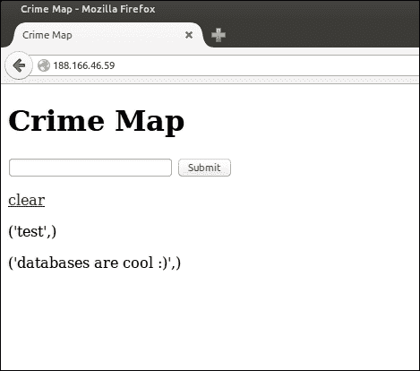
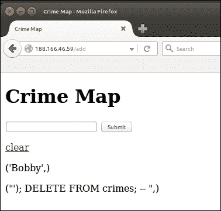

# 六、构建交互式犯罪地图

我们的第一个项目明显缺乏任何形式的长期记忆。虽然我们使用 cookie 来模拟长期存储，但我们也看到了这些问题的局限性。在这个项目中，我们将构建一个交互式的犯罪地图，允许用户用目击或经历过的犯罪活动的细节标记位置。由于我们希望长期保存数据并使其可供许多用户使用，因此我们不能依赖用户的本地和临时存储。

因此，我们项目的第一步是在 VPS 上建立一个 MySQL 数据库，并将其链接到一个新的 Flask web 应用。我们将使用 GoogleMapsAPI 允许用户查看我们的地图并向其添加新的标记（其中每个标记表示犯罪）。

与之前的项目相比，我们还有一些更高级的用户输入，允许用户过滤他们的地图视图，并向地图添加相当复杂的数据。因此，我们将更加关注输入验证和消毒。

我们的项目目标是一个包含交互式地图的网页。用户应该能够通过选择地图的位置并输入犯罪的日期、类别和描述来提交新的犯罪。用户还应能够通过从地图上选择相关图标，查看地图上所有以前记录的犯罪图标，以及有关任何特定犯罪的更多详细信息。地图的要点是能够轻松查看犯罪率高的地区，并帮助调查人员发现犯罪模式和趋势。

本章的大部分内容用于在我们的 VPS 上建立一个 MySQL 数据库，并为犯罪数据创建一个数据库。接下来，我们将设置一个包含地图和文本框的基本页面。我们将看到如何通过将输入的数据存储到数据库的文本框中，将 Flask 链接到 MySQL。

在上一个项目中，我们将避免使用几乎肯定会在“真实世界”项目中使用的框架和自动化工具。由于我们将重点关注学习，较低级别的抽象是有用的。因此，我们不会将**对象关系映射**（**ORM**用于我们的数据库查询，也不会将 JavaScript 框架用于用户输入和交互。这意味着 SQL 和 vanilla JavaScript 的编写将是一项艰巨的工作，但重要的是，在盲目使用之前，要充分了解工具和框架存在的原因以及它们解决的问题。

在本章中，我们将介绍：

*   设置新的 Git 存储库
*   理解关系数据库
*   在我们的 VPS 上安装和配置 MySQL
*   在 MySQL 中创建我们的犯罪地图数据库
*   创建基本数据库 web 应用

# 建立新的 Git 存储库

我们将为我们的新代码库创建一个新的Git 存储库，因为尽管有些设置类似，但我们的新项目应该与我们的第一个项目完全无关。如果您在这一步需要更多帮助，请返回[第 1 章](01.html "Chapter 1. Hello, World!")、*你好，世界！*，并遵循*安装和使用 Git*部分中的详细说明。如果您有信心，请检查您是否可以仅通过以下摘要来完成此操作：

*   前往 Bitbucket、GitHub 或您在第一个项目中使用的任何托管平台的网站。登录并创建新的存储库
*   命名您的存储库`crimemap`，并记下您收到的 URL
*   在本地计算机上，启动终端并运行以下命令：

    ```py
    mkdir crimemap
    cd crimemap
    git init
    git remote add origin <git repository URL>

    ```

由于需要在 VPS 上设置一个数据库，因此我们暂时将此存储库保留为空。一旦安装了数据库，我们将回到这里来设置 Flask 项目。

# 理解关系数据库

在其最简单的形式中，关系数据库管理系统，如 MySQL，是一个美化的电子表格程序，如 Microsoft Excel。我们使用它来存储行和列中的数据。每一行都是一个“*事物*”，每一列都是相关行中关于“*事物”*的特定信息。我把“*东西*用倒逗号表示，因为我们不局限于存储对象。事实上，在现实世界和解释数据库中，最常见的例子就是关于人的数据。存储电子商务网站客户信息的基本数据库可能类似于以下内容：

<colgroup><col style="text-align: left"> <col style="text-align: left"> <col style="text-align: left"> <col style="text-align: left"> <col style="text-align: left"></colgroup> 
| 

身份证件

 | 

名字

 | 

姓

 | 

电子邮件地址

 | 

电话

 |
| --- | --- | --- | --- | --- |
| 1. | 佛罗多 | 巴金斯 | `fbaggins@example.com` | +1 111 111 1111 |
| 2. | 比尔博 | 巴金斯 | `bbaggins@example.com` | +1 111 111 1010 |
| 3. | 山姆卫斯 | 甘吉 | `sgamgee@example.com` | +1 111 111 1001 |

如果我们在一行中从左向右看，我们将得到关于一个人的所有信息。如果我们从上到下查看一列，我们将获得每个人的一条信息（例如，电子邮件地址）。两者都是有用的；如果我们想添加一个新的人或联系一个特定的人，我们可能会对某一行感兴趣。如果我们想向所有客户发送时事通讯，我们只会对电子邮件专栏感兴趣。

那么，为什么我们不能用电子表格代替数据库呢？如果我们进一步以电子商务商店为例，我们很快就会看到其局限性。如果我们想存储我们提供的所有项目的列表，我们可以创建另一个类似于前面的表，其中包含列，如`Item name`、`Description`、`Price`和`Quantity in stock`。我们的模型仍然有用；然而，现在，如果我们想存储 Frodo 曾经购买过的所有物品的列表，就没有好的地方来放置数据。我们可以在 customer 表中添加 1000 列（如前所示），例如`Purchase 1`、`Purchase 2`等等，直到`Purchase 1000`，并希望 Frodo 购买的物品不会超过 1000 件。这既不可扩展，也不易于使用。我们如何得到佛罗多上周二购买的物品的描述？我们是否只将`name`项存储在我们的新专栏中？没有唯一名称的项目会发生什么情况？

很快，我们就会意识到，我们需要向后思考。我们需要创建一个名为`Orders`的新表，并在每个订单中存储对客户的引用，而不是将个人购买的物品存储在`Customers`表中。因此，订单“知道”它属于哪个客户，但客户对哪些订单属于他/她没有固有的知识。

虽然我们的模型仍然可以快速地放入电子表格中，但随着数据模型和大小的增长，电子表格变得更加繁琐。我们需要做一些复杂的查询，比如“我想看看所有有库存、在过去六个月内至少订购过一次、价格超过 10 美元的商品”。

进入**关系数据库管理系统**（**关系数据库管理系统**。它们已经存在了几十年，是解决常见问题（如以有组织和可访问的方式存储具有复杂关系的数据）的一种尝试和测试的方法。我们不会在犯罪地图中提及它们的全部功能（事实上，如果需要的话，我们可能会将数据存储在文本文件中），但如果您对构建 web 应用感兴趣，您将在某个时候需要一个数据库。因此，让我们从小事做起，将强大的 MySQL 工具添加到我们不断增长的工具箱中。

我强烈建议您了解更多有关数据库的信息！如果您对构建我们当前项目的经验感兴趣，请阅读并了解数据库。RDBMS 的历史很有趣，规范化和数据库种类（包括 NoSQL 数据库，我们将在下一个项目中看到）的复杂性和微妙性值得我们花更多的时间来研究，而不是我们在一本专注于 Python web 开发的书中所花的时间。

# 在我们的 VPS 上安装和配置 MySQL

安装和配置 MySQL 是一项非常常见的任务。因此，您可以在预构建的图像或为您构建整个*堆栈*的脚本中找到它。一个常见的堆栈称为**LAMP 堆栈**，它代表**Linux**、**Apache**、**MySQL**、**PHP**等，很多 VPS 提供商提供一键式 LAMP 堆栈映像。

由于我们将使用 Linux，并且已经手动安装了 Apache，在安装 MySQL 之后，我们将非常接近传统的 LAMP 堆栈；我们将使用P 来表示 Python，而不是 PHP。为了实现“教育第一”的目标，我们将手动安装 MySQL，并通过命令行进行配置，而不是安装 GUI 控制面板。如果您以前使用过 MySQL，请随意进行设置。

**MySQL 和 Git**

### 注

请记住，MySQL 的设置和存储在其中的数据都不是 Git 存储库的一部分。要小心，因为在数据库级别犯下的任何错误，包括错误配置或删除数据，都很难撤消。

## 在我们的 VPS 上安装 MySQL

在我们的服务器上安装MySQL 非常简单。SSH 到 VPS 中并运行以下命令：

```py
sudo apt-get update
sudo apt-get install mysql-server

```

您应该会看到一个界面，提示您输入 MySQL 的根密码。输入密码并在出现提示时重复。安装完成后，您可以通过键入以下命令获得 live SQL shell：

```py
mysql –p

```

然后，输入前面提示时选择的密码。我们可以使用这个 shell 创建一个数据库和模式，但我们更愿意通过 Python 来实现这一点；因此，如果您打开 MySQL shell，请键入`quit`并点击*输入*键终止它。

## 安装 MySQL 的 Python 驱动程序

由于我们想使用 Python 与我们的数据库对话，我们需要安装另一个包。Python 有两个主要的 MySQL 连接器：*PyMySQL*和*MySQLdb*。从简单易用的角度来看，第一种方法更可取。它是一个纯 Python 库，这意味着它没有依赖项。MySQLdb 是一个 C 扩展，因此有一些依赖项，但理论上要快一点。一旦安装，它们的工作原理非常相似。在本章的示例中，我们将使用 PyMySQL。

要安装它，请运行（仍在 VPS 上）以下命令：

```py
pip install --user pymysql

```

# 在 MySQL 中创建我们的犯罪地图数据库

SQL 语法的一些知识将对本章的其余部分很有用，但您应该能够遵循任何一种方法。我们需要做的第一件事是为我们的 web 应用创建一个数据库。如果您喜欢使用命令行编辑器，可以直接在 VPS 上创建以下脚本，因为这样可以使它们更易于调试，并且我们不会在本地运行它们。然而，在 SSH 会话上开发远远不够理想；因此，我建议您在本地编写它们，并在运行之前使用 Git 将它们传输到服务器。

这可能会使调试有点令人沮丧，因此在编写这些脚本时要格外小心。如果您愿意，可以直接从本书附带的代码包中获取它们。在这种情况下，您只需填充`dbconfig.py`文件中的用户和密码字段。没错，一切都应该正常。

## 创建数据库设置脚本

在本章开头我们初始化了 Git 存储库的中的`crimemap`目录中，创建一个名为`db_setup.py`的 python 文件，其中包含以下代码：

```py
import pymysql
import dbconfig
connection = pymysql.connect(host='localhost',
                             user=dbconfig.db_user,
                             passwd=dbconfig.db_password)

try:
        with connection.cursor() as cursor:
                sql = "CREATE DATABASE IF NOT EXISTS crimemap"
                cursor.execute(sql)
                sql = """CREATE TABLE IF NOT EXISTS crimemap.crimes (
id int NOT NULL AUTO_INCREMENT,
latitude FLOAT(10,6),
longitude FLOAT(10,6),
date DATETIME,
category VARCHAR(50),
description VARCHAR(1000),
updated_at TIMESTAMP,
PRIMARY KEY (id)
)"""
                cursor.execute(sql);
        connection.commit()
finally:
        connection.close()
```

让我们来看看这个代码是怎么做的。首先，我们导入了刚刚安装的`PyMySQL`库。我们还导入了`dbconfig`，我们将在本地创建它，并使用数据库凭据填充它（我们不想将它们存储在我们的存储库中）。然后，我们将使用`localhost`（因为我们的数据库与我们的代码安装在同一台机器上）和尚不存在的凭据创建到数据库的连接。

现在我们已经连接到数据库，我们可以得到一个游标。您可以将光标想象为文字处理器中的闪烁对象，它指示开始键入时文本将出现的位置。数据库游标是指向数据库中要创建、读取、更新或删除数据的位置的对象。一旦我们开始处理数据库操作，就会出现各种异常。我们总是希望关闭与数据库的连接，因此我们将在`try`块中创建一个游标（并执行所有后续操作），在`finally`块中创建`connection.close()`（无论`try`块是否成功，`finally`块都将被执行）。

光标也是一个资源，所以我们将抓取一个并在`with:`块中使用它，这样当我们使用完它时，它将自动关闭。安装完成后，我们可以开始执行 SQL 代码。

当我们调用函数`cursor.execute()`时，我们将传入的 SQL 代码将使用数据库引擎运行，如果结果合适，光标将填充结果。稍后我们将讨论如何使用游标和`execute()`函数读取和写入数据。

### 创建数据库

SQL 的阅读方式类似于英语，因此，即使编写新代码有点棘手，但通常也很容易理解现有 SQL 代码的功能。如果`crimemap`数据库不存在，我们的第一条 SQL 语句将创建一个`crimemap`数据库（这意味着如果我们回到这个脚本，我们可以保留这一行，而不会每次删除整个数据库）。我们将创建第一个 SQL 语句作为字符串，并使用`sql`变量来存储它。然后，我们将使用我们创建的游标执行该语句。

### 看我们的表列

现在我们知道我们有一个数据库，我们可以创建一个表。该表将存储我们记录的所有犯罪的数据，每个犯罪都在表的一行中。因此，我们需要几个列。在我们的`create table`语句中可以看到每一列以及将存储在此列中的数据类型。要解决这些问题，我们有：

*   **id**：这是一个唯一的号码，自动记录我们的每一次犯罪。我们不需要太担心这个字段，因为每次我们添加新的犯罪数据时，MySQL 都会自动为我们插入它，从 1 开始，并根据需要递增。
*   **纬度和经度**：这些字段将用于存储每个犯罪的位置。我们将在浮点数后指定`(10, 6)`，这意味着每个浮点数最多可以是 10位，小数点后最多可以是 6 位。
*   **日期**：这是犯罪的日期和时间。
*   **类别**：我们将定义几个类别来分类不同类型的犯罪。这将有助于以后过滤犯罪。`VARCHAR(50)`表示该数据长度可变，最多 50 个字符。
*   **说明**：此与`Category`相似，但最多 1000 个字符。
*   **更新**：这是另一个我们不需要担心的领域。MySQL 将在插入或编辑数据时将其设置为当前时间。例如，如果我们想删除在特定时间错误插入的一组数据，这可能非常有用。

### 索引和提交

我们的`create table`查询的最后一行将我们的`id`列指定为*主键*。这意味着它将被索引（因此，如果我们在查询数据库时使用它，我们将能够非常高效地查找数据），并将具有各种其他有用的属性，例如强制存在性和唯一性。

一旦我们定义了这个更为复杂的 SQL 片段，我们也将在下面的行中执行它。然后，我们将把更改提交到数据库。把这看作是保存我们的变化；如果我们在没有提交的情况下关闭连接，我们的更改将被丢弃。

**SQL 提交**：

### 提示

忘记提交更改是 SQL 初学者的一个常见错误。如果您的数据库的行为不符合预期，并且无法找出原因，请检查您是否在代码中的某个地方忘记了提交。

## 使用数据库设置脚本

本地保存我们的脚本并将其推送到存储库。按此顺序参考以下命令：

```py
git add db_setup.py
git commit –m "database setup script"
git push origin master

```

使用以下命令 SSH 连接到 VPS 并将新存储库克隆到/var/www 目录：

```py
ssh user@123.456.789.123
cd /var/www
git clone <your-git-url>
cd crimemap

```

### 向我们的安装脚本添加凭据

现在，我们仍然没有脚本所依赖的凭证。在使用安装脚本之前，我们将做两件事：

*   使用数据库和密码创建`dbconfig.py`文件
*   将此文件添加到`.gitignore`以防止其添加到我们的存储库中

使用`nano`直接在您的 VPS 上创建并编辑`dbconfig.py`文件，如下所示：

```py
nano dbconfig.py

```

然后，使用安装 MySQL 时选择的密码键入以下：

```py
db_user = "root"
db_password = "<your-mysql-password>"
```

点击*Ctrl*+*X*并在提示时输入*Y*保存。

现在，使用类似的`nano`命令创建、编辑和保存`.gitignore`，应该包含以下内容：

```py
dbconfig.py
*.pyc

```

第一行防止我们的`dbconfig`文件被添加到我们的 Git 存储库中，这有助于防止未经授权使用我们的数据库密码。第二行阻止将编译好的 Python 文件添加到存储库中，因为这些只是运行时优化，并且与我们的项目相关。

### 运行我们的数据库设置脚本

完成此操作后，您可以运行：

```py
python db_setup.py

```

假设一切进展顺利，你现在应该有一个数据库和一个表来存储犯罪。Python 将输出任何 SQL 错误，允许您在必要时进行调试。如果从服务器对脚本进行更改，请运行与从本地计算机执行的相同的`git add`、`git commit`和`git push`命令。

**git 状态：**

### 提示

您可以从终端运行`git status`（确保您在存储库目录中）以查看提交的文件摘要。您可以现在（在`git push`之前）使用此选项来确保您没有提交`dbconfig`文件。

我们的初步数据库设置到此结束！现在，我们可以创建一个使用数据库的基本 Flask 项目。

# 创建基础数据库 web 应用

我们将首先构建犯罪地图应用的框架。这将是一个基本的烧瓶应用，只有一个页面：

*   显示我们数据库`crimes`表中的所有数据
*   允许用户输入数据并将此数据存储在数据库中
*   有一个**清除**按钮，删除所有以前输入的数据

虽然我们将要存储和显示的内容还不能真正描述为*犯罪数据*，但我们会将其存储在我们之前创建的`crimes`表中。我们现在只使用`description`字段，忽略所有其他字段。

设置烧瓶应用的过程与我们之前所做的非常相似。我们将把数据库逻辑分离成一个单独的文件，将主`crimemap.py`文件留给 Flask 设置和路由。

## 建立我们的目录结构

在本地计算机上，切换到`crimemap`目录。如果您在服务器上创建了数据库设置脚本或对其进行了任何更改，请确保在本地同步更改。然后，创建目录，并通过运行以下命令（或使用 GUI 文件资源管理器，如果您愿意），触摸我们将使用的文件：

```py
cd crimemap
git pull origin master
mkdir templates
touch templates/home.html
touch crimemap.py
touch dbhelper.py

```

## 查看我们的申请代码

将以下代码添加到`crimemap.py`文件中。这本书没有什么出人意料的地方，应该大家都熟悉我们的头条新闻项目。唯一要指出的是 AUT1 T1 类，我们将考虑下一个代码。我们只需在初始化应用后立即创建一个全局`DBHelper`实例，然后在相关方法中使用它从数据库中获取数据，将数据插入数据库，或从数据库中删除所有数据：

```py
from dbhelper import DBHelper
from flask import Flask
from flask import render_template
from flask import request

app = Flask(__name__)
DB = DBHelper()

@app.route("/")
def home():
    try:
        data = DB.get_all_inputs()
    except Exception as e:
        print e
        data = None
    return render_template("home.html", data=data)

@app.route("/add", methods=["POST"])
def add():
  try:
    data = request.form.get("userinput")
    DB.add_input(data)
  except Exception as e:
    print e
  return home()

@app.route("/clear")
def clear():
  try:
    DB.clear_all()
  except Exception as e:
    print e
  return home()

if __name__ == '__main__':
  app.run(port=5000, debug=True)
```

## 查看我们的 SQL 代码

从我们的数据库帮助程序代码中，还有一些SQL 需要学习。将以下代码添加到`dbhelper.py`文件中：

```py
import pymysql
import dbconfig

class DBHelper:

  def connect(self, database="crimemap"):
    return pymysql.connect(host='localhost',
              user=dbconfig.db_user,
              passwd=dbconfig.db_password,
              db=database)

  def get_all_inputs(self):
  connection = self.connect()
    try:
      query = "SELECT description FROM crimes;"
      with connection.cursor() as cursor:
        cursor.execute(query)
      return cursor.fetchall()
    finally:
      connection.close()

  def add_input(self, data):
    connection = self.connect()
    try:
      # The following introduces a deliberate security flaw. See section on SQL injection below
      query = "INSERT INTO crimes (description) VALUES ('{}');".format(data)
      with connection.cursor() as cursor:
        cursor.execute(query)
        connection.commit()
    finally:
      connection.close()

  def clear_all(self):
    connection = self.connect()
    try:
      query = "DELETE FROM crimes;"
      with connection.cursor() as cursor:
        cursor.execute(query)
        connection.commit()
    finally:
      connection.close()
```

在我们的设置脚本中，我们需要与数据库建立连接，然后从连接中获取光标，以便执行任何有意义的操作。同样，我们将在`try:``finally:`块中执行所有操作，以确保连接已关闭。

在我们的助手中，我们将考虑四个主要数据库操作中的三个。**CRUD****创建、读取、更新**和**删除**描述了基本的数据库操作。我们将创建和插入新数据、读取现有数据、修改现有数据或删除现有数据。我们不需要在我们的基础应用中更新数据，但创建、读取和删除数据肯定是有用的。

### 读取数据

让我们从阅读开始，假设数据库中已经有一些数据。在 SQL 中，这是使用`SELECT`语句完成的；我们将根据一组条件选择要检索的数据。在我们的例子中，`get_all_inputs`函数中的查询是`SELECT description FROM crimes;`。稍后我们将了解如何优化`SELECT`查询，但这一查询只获取`crimes`表中每一行的`description`字段。这与我们在本章开头提到的示例类似，在该示例中，我们希望发送一份时事通讯，并需要每个客户的电子邮件地址。在这里，我们要的是我们每一个罪行的描述。

一旦游标执行查询，它将指向包含结果的数据结构的开头。我们将在游标上执行`fetchall()`，它将结果集转换为一个列表，以便我们可以将它们传递回应用代码。（如果您在 Python 中使用过生成器，那么将数据库游标视为生成器可能会有所帮助。它知道如何迭代数据，但本身并不包含所有数据）。

### 插入数据

接下来是我们的`add_input()`函数。这将获取用户输入的数据，*将其插入*数据库。使用`INSERT`关键字在SQL 中创建数据。我们的查询（假设`foobar`是我们传入的数据）是`INSERT into crimes (description) VALUES ('foobar')`。

这可能看起来过于复杂，但请记住，我们仍然在处理单个字段（描述）。我们将在后面讨论如何设计`INSERT`来接受多个但任意的列，这些列都可以在第一组括号中命名，然后在`VALUES`之后的第二组括号中为每个列匹配值。

当我们对数据库进行更改时，我们需要*提交*我们的连接，以使这些更改永久化。

### 删除数据

最后，我们将看看 SQL 中的语句有多简洁。`DELETE FROM crimes`清除`crimes`数据库中的所有数据。稍后我们将考虑如何通过指定仅删除某些数据的条件来使该关键字不象核。

同样，这会对数据库进行更改，因此我们需要提交这些更改。

如果所有新的 SQL 命令似乎都有很多需要接受的地方，那么可以在一个在线沙盒中，甚至在我们之前讨论过如何访问的 live SQL shell 中使用它们。你会发现 SQL 在一段时间后变得非常自然，因为它的大多数关键字都是从一种自然语言中获取的，而且它使用的符号很少。

最后，让我们看看我们的 HTML 模板。

## 创建我们的视图代码

Python 和 SQL 编写起来很有趣，它们确实是我们应用的主要部分。然而，在时刻，我们有一栋没有门窗的房子；困难和令人印象深刻的部分已经完成，但无法使用。让我们添加几行 HTML，让世界在没有我们编写的代码的情况下进行交互。

在`templates/home.html`中，添加以下内容：

```py
<html>
<body>
  <head>
    <title>Crime Map</title>
  </head>

  <h1>Crime Map</h1>
  <form action="/add" method="POST">
    <input type="text" name="userinput">
    <input type="submit" value="Submit">
    </form>
  <a href="/clear">clear</a>
  
    <p>{{userinput}}</p>
    
</body>
</html>
```

没有什么我们以前没见过的。在这里，我们有一个表单，通过调用我们应用的`/add`功能将数据添加到我们的数据库中，在它的正下方，我们循环遍历所有现有数据，并在`<p>`标记中显示每一块数据。

## 在我们的 VPS 上运行代码

最后，我们需要让全世界都能访问我们的代码。这意味着将其推送到我们的`git`回购协议，将其拉到 VPS 上，并配置 Apache 为其提供服务。在本地运行以下命令：

```py
git add .
git commit –m "Skeleton CrimeMap"
git push origin master
ssh <username>@<vps-ip-address>

```

现在，在 VPS 上运行以下操作：

```py
cd /var/www/crimemap
git pull origin master

```

现在，我们需要一个`.wsgi`文件将 Python 链接到 Apache，可以通过运行以下命令创建该文件：

```py
nano crimemap.wsgi

```

`.wsgi`文件应包含以下内容：

```py
import sys
sys.path.insert(0, "/var/www/crimemap")
from crimemap import app as application
```

现在，点击*Ctrl*+*X*，在提示保存时输入*Y*。

我们还需要创建一个新的 Apache`.conf`文件，并将其设置为默认值（而不是`headlines`，`.conf`文件是我们当前的默认值）。运行以下命令以创建文件：

```py
cd /etc/apache2/sites-available
nano crimemap.conf

```

接下来，添加以下代码：

```py
<VirtualHost *>
    ServerName example.com

 WSGIScriptAlias / /var/www/crimemap/crimemap.wsgi
 WSGIDaemonProcess crimemap
 <Directory /var/www/crimemap>
 WSGIProcessGroup crimemap
       WSGIApplicationGroup %{GLOBAL}
        Order deny,allow
        Allow from all
    </Directory>
</VirtualHost>
```

这与我们为上一个项目创建的`headlines.conf`文件非常相似，您可能会发现复制上一个文件并根据需要进行替换更容易。

最后，我们需要停用旧站点并激活新站点，如下所示：

```py
sudo a2dissite headlines.conf
sudo a2ensite crimemap.conf
sudo service apache2 reload

```

现在，一切都应该正常了。如果手动复制代码，几乎可以肯定会有一两个 bug 需要处理。不要因此而气馁；请记住，调试是开发的重要组成部分！如有必要，在加载站点时运行`tail –f /var/log/apache2/error.log`以记录任何错误。如果失败，在`crimemap.py`和`dbhelper.py`中添加一些打印语句，以缩小问题的范围。

一旦一切正常，您应该能够通过单一文本输入查看网页。当您通过输入提交文本时，您应该看到页面上显示的文本，如下例所示：



请注意，我们从数据库中获取的数据是一个元组，因此它被括号包围，后面有一个逗号。这是因为我们从`crimes`表中只选择了一个字段`'description'`，而理论上，我们可以处理每个犯罪的多个列（很快我们就会这样做）。

## 缓解 SQL 注入

我们的应用包含一个致命缺陷。我们从用户那里获取输入，并使用 Python 字符串格式将其插入到 SQL 语句中。当用户按预期输入一个正常的字母数字字符串时，这种方法效果很好，但如果用户是恶意的，他们实际上可以注入自己的 SQL 代码并控制我们的数据库。尽管 SQL 注入是一种古老的攻击，大多数现代技术都会自动缓解这种攻击，但每年仍有数十起针对大公司的攻击，其中密码或财务数据因 SQL 注入漏洞而泄漏。我们将花一点时间讨论什么是 SQL 注入以及如何防止它。

### 将 SQL 注入我们的数据库应用

导航到我们的 web应用，点击**清除**链接删除任何保存的输入。现在，在输入中，键入`Bobby`并点击**提交**按钮。该页面现在应类似于下图：


在该输入中，现在键入：

`'); DELETE FROM crimes; --`

这里所有的人物都很重要。

输入需要以单引号开始，后跟一个右括号，后跟一个分号，然后是 delete 语句、另一个分号、一个空格，最后是两个连字符。当页面刷新时，您可能会看到第二行，在**Bobby**输出下面列出这个奇怪的字符串，但相反，您会看到一个空白页面，看起来与下面的屏幕截图类似：


这很奇怪，对吧？让我们来看看发生了什么。在我们的`DBHelper`类中，我们的 insert 语句有以下行：

```py
query = "INSERT INTO crimes (description) VALUES ('{}');".format(data)
```

这意味着在数据库上运行代码之前，用户的输入会被添加到 SQL 代码中。当我们将之前使用的外观奇怪的输入放入 SQL 语句的占位符中时，我们将得到以下字符串：

```py
"INSERT INTO crimes (description) VALUES (''); DELETE FROM crimes; -- ');"
```

这是两条 SQL 语句，而不是一条。我们用空值关闭了`INSERT`语句，然后用`DELETE`语句删除了`crimes`表中的所有内容。结尾的两个连字符构成 SQL 注释，因此额外的右引号和括号不会导致任何语法错误。当我们输入数据时，我们在数据库中插入一个空行，然后从`crimes`表中删除所有数据！

当然，创造性的攻击者可以运行任何 SQL 语句来代替我们选择的`DELETE`语句。他们可以放下一整张桌子（参考[https://xkcd.com/327/](https://xkcd.com/327/) 是一个幽默的例子），或者他们可以运行 select 语句来绕过数据库登录函数。或者，如果存储信用卡信息，可能会使用类似的攻击获取数据并将其显示给攻击者。一般来说，我们不希望 web 应用的用户能够在数据库上运行任意代码！

### 缓解 SQL 注入

减轻 SQL 注入的影响包括清理用户输入，并确保如果用户输入可能被解释为 SQL 语法的特殊字符，这些字符将被忽略。有不同的方法可以做到这一点，我们将使用 Python SQL 库自动提供的简单方法。有关此主题的更全面的信息，请参阅[https://www.owasp.org/index.php/SQL_Injection_Prevention_Cheat_Sheet](https://www.owasp.org/index.php/SQL_Injection_Prevention_Cheat_Sheet) 。

在`dbhelper.py`文件中，将`add_input()`方法更改为：

```py
def add_input(self, data):
    connection = self.connect()
  try:
      query = "INSERT INTO crimes (description) VALUES (%s);"
      with connection.cursor() as cursor:
          cursor.execute(query, data)
          connection.commit()
      finally:
          connection.close()
```

我们在这里使用的`%s`标记是一个类似于`%d`的字符串占位符，它在普通 Python 字符串中用作占位符，是大括号的一个较旧的替代方法。但是，我们将不使用 Python 的`str.format()`函数，而是将要插入占位符的字符串和值传递给 PyMySQL`cursor.execute()`函数。这将自动转义所有对 SQL 有意义的字符，这样我们就不必担心它们被执行了。

现在，如果您再次尝试输入，您将看到它们显示为预期的特殊字符，并在下面的屏幕截图中显示：



在本书的最后一章中，我们将简要介绍 ORM 技术，这些技术可以为 SQL 注入攻击提供更强的缓解。虽然这似乎是一个简单的问题，我们通过转义一些特殊的角色来解决，但它实际上可能变得相当微妙。**sqlmap**（[等工具 http://sqlmap.org/](http://sqlmap.org/) ）可以在同一想法上尝试数百个不同的变体（即针对数据库输入特殊字符的想法），直到有一个得到意外结果并发现漏洞。请记住，要使应用安全，必须针对每一个可能的漏洞进行保护；要使它不安全，它只需要容易受到一个攻击。

# 总结

这就是我们犯罪地图项目的介绍。我们讨论了如何在 VPS 上安装 MySQL 数据库以及如何将其连接到 Flask。我们研究了创建、读取、更新和删除数据，并创建了一个基本的数据库 web 应用，它可以接受用户输入并再次显示。最后，我们研究了 SQL 注入漏洞以及如何保护自己免受其影响。

接下来，我们将添加一个谷歌地图小部件和一些更好的美学。