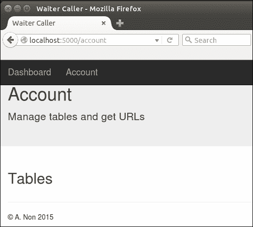
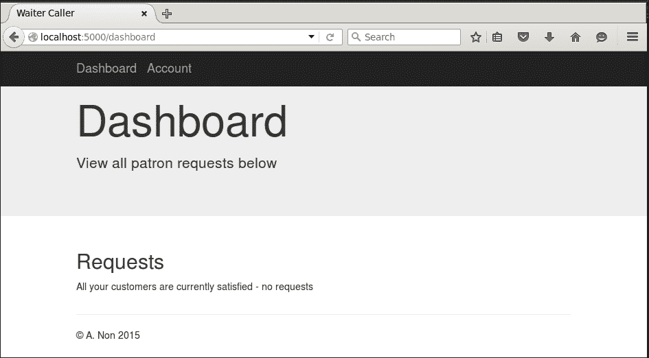
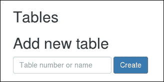
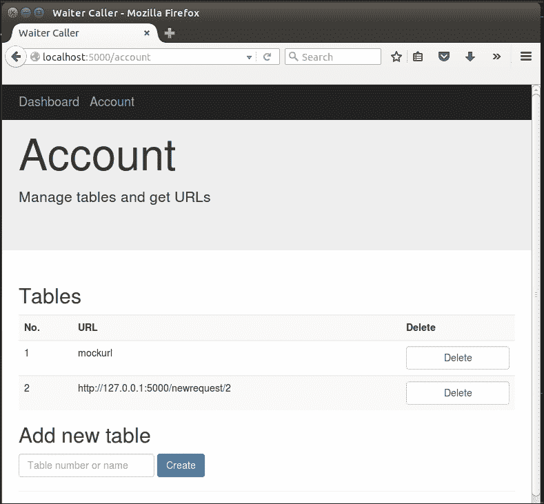
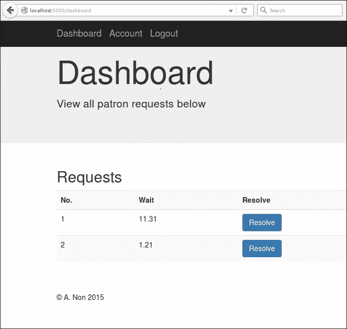
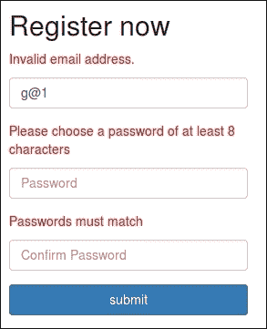
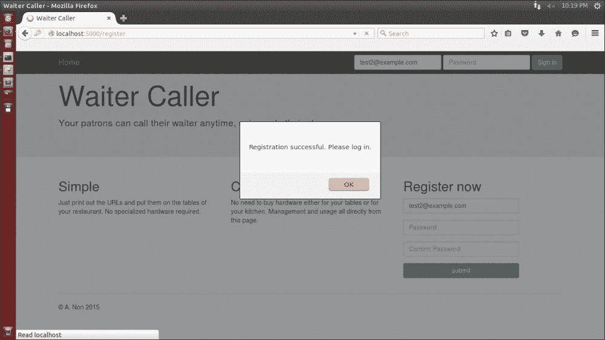
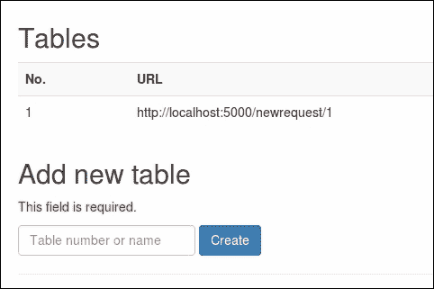

# 第 10 章：项目中的模板继承和 WTForms

在上一章中，我们创建了一个基本的用户帐户系统。然而，我们只做了一个非常简单的路由访问控制，它只显示字符串“youaregorgin”。在本章中，我们将添加更多所需的功能，并允许登录用户添加餐厅桌子，查看与这些桌子关联的 URL，以及查看来自客户的注意请求。我们将遇到的一个问题是希望在应用程序的不同页面上重用相同的元素。您将看到如何使用 Jinja 的继承系统在不重复代码的情况下解决这个问题。如前一章所述，当出现错误（如输入错误的密码）时，我们无法与用户很好地沟通。为了解决这个问题，我们将研究另一个 Flask 扩展 WTForms，并了解它如何简化表单的创建和验证。

在本章中，我们将介绍以下主题：

*   将帐户和仪表板页面添加到我们的应用程序
*   使用 bitly API 缩短 URL
*   添加处理注意请求的功能
*   通过 WTForms 添加用户反馈

# 添加账户和仪表板页面

我们希望在我们的应用程序中添加两个新页面：“Dashboard”（仪表板），可以查看特定餐厅顾客的所有请求；以及“Account”（帐户），餐厅可以在其中管理他们的表格并查看他们需要在表格上提供的 URL。

我们只需在`templates`目录中创建两个新的`.html`文件，然后从头开始编写 HTML。但我们很快就会发现，我们需要从主页上获取许多相同的元素（至少包括和配置引导的部分）。然后我们将尝试从主页复制并粘贴 HTML，然后从那里开始处理我们的新页面。

## 介绍 Jinja 模板

复制和粘贴代码通常是出现问题的标志。在应用程序代码中，这意味着您没有很好地模块化您的代码，您需要创建更多的类，并可能添加一对语句，以便在需要的地方包含重用的代码。使用 Jinja，我们可以通过使用*模板继承*遵循非常相似的模式。我们首先将主页拆分为两个单独的模板文件`base.html`和`home.html`，其中包含我们希望在基础文件中重用的所有元素。然后，我们可以让所有其他三个页面（主页、帐户和仪表板）继承*基本模板*，并且只编写三个页面之间不同的代码。

Jinja 通过使用*块*的概念处理继承。每个父模板都可以有命名块，扩展父模板的子模板可以使用自己的自定义内容填充这些块。Jinja 继承系统功能非常强大，它负责嵌套块和覆盖现有块。然而，我们只会触及其功能的表面。我们将让我们的基础模板包含所有可重用代码，它将包含一个名为`content`的空白块和一个名为`navbar`的空白块。我们的三个页面中的每一个都将从基本模板扩展，提供自己版本的内容块（用于主页内容）和导航栏。我们需要使导航栏动态化，因为页面顶部栏的**登录**字段只有在用户未登录时才会出现。

### 创建基础模板

在您的`templates`目录中创建一个名为`base.html`的新文件，并插入以下代码：

```py
<!DOCTYPE html>
<html lang="en">
  <head>
    <meta charset="utf-8">
    <meta http-equiv="X-UA-Compatible" content="IE=edge">
    <meta name="viewport" content="width=device-width, initial-scale=1">

    <title>Waiter Caller</title>

    <!-- Bootstrap core CSS -->
    <link href="../static/css/bootstrap.min.css" rel="stylesheet">

    <!-- HTML5 shim and Respond.js for IE8 support of HTML5 elements and media queries -->
    <!--[if lt IE 9]>
      <script src="https://oss.maxcdn.com/html5shiv/3.7.2/html5shiv.min.js"></script>
      <script src="https://oss.maxcdn.com/respond/1.4.2/respond.min.js"></script>
    <![endif]-->

  </head>
  <body>

    
    <nav class="navbar navbar-inverse navbar-fixed-top">
      <div class="container">
        <div class="navbar-header">
          <a class="navbar-brand" href="/dashboard">Dashboard</a>
          <a class="navbar-brand" href="/account">Account</a>
        </div>
      </div>
    </nav>
    

    
    

    <div class="container">

      <hr>
      <footer>
        <p>&copy; A. Non 2015</p>
      </footer>
    </div>
  <!-- Bootstrap core JavaScript
    ================================================== -->
    <!-- Placed at the end of the document so the pages load faster -->
    <script   src="https://ajax.googleapis.com/ajax/libs/jquery/1.11.3/jquery.min.js"></script>
    <script src="../static/js/bootstrap.min.js"></script>
  </body>
</html>
```

在前面的代码中，我们的所有页眉和页脚代码元素将在一个文件中的所有页面中通用。我们使用 Jinja 语法定义了两个块，这与我们看到的其他 Jinja 语句类似，即：

```py


```

和

```py

[...]

```

在本例中，`content`和`navbar`是我们块的名称，我们可以自由选择，而`block`和`endblock`是 Jinja 关键字，``符号用于表示前面示例中的 Jinja 语句。这本身就是一个完全有效的 Jinja 模板；即使内容块是空的，我们也可以直接从 Flask 应用程序呈现模板，我们会看到一个页面，它只是假装内容块不存在。

不过，我们也可以扩展这个模板；也就是说，我们可以使用它作为父对象来创建子对象。孩子们可以通过再次声明来选择*覆盖*任何指定的块。我们将`navbar`声明为一个块，因为我们的主页将使用我们之前编写的导航栏，其中包含一个登录表单。然而，一旦登录，我们的 dashboard 和 account 页面将具有与我们在基本模板中定义的完全相同的导航栏。

### 创建仪表板模板

我们的仪表板页面最终将显示所有客户的服务请求，以便服务员可以轻松看到哪些桌子需要注意。不过现在，我们只创建页面的大纲。在您的`templates`目录中创建一个名为`dashboard.html`的新文件，并添加以下代码：

```py



    <div class="jumbotron">
      <div class="container">
        <h1>Dashboard</h1>
        <p>View all patron requests below</p>
      </div>
    </div>

    <div class="container">
      <div class="row">
        <div class="col-md-12">
          <h2>Requests</h2>
          <p>All your customers are currently satisfied - no requests</p>
        </div>    
      </div>
    </div>

```

前面代码片段中最重要的一行是第一行，我们使用 Jinja`extends`关键字表示此模板应继承另一个模板中包含的所有代码。关键字后面是要从中继承的模板的文件名，包含在倒逗号中的。

接下来，我们只需以与在基本模板中完全相同的方式创建内容块。这一次，我们添加了一些 HTML 以显示在仪表板页面上，而不是将其留空。

### 创建账户模板

账户页面将是用户可以添加新表、删除表或获取现有表的 URL 的页面。同样，由于我们还没有任何应用程序代码来表示一个表，所以我们将只创建一个页面的大纲。在您的`templates`目录中创建一个名为`account.html`的文件，并添加以下代码：

```py



    <div class="jumbotron">
      <div class="container">
        <h1>Account</h1>
        <p>Manage tables and get URLs</p>
      </div>
    </div>

    <div class="container">
      <div class="row">
        <div class="col-md-12">
          <h2>Tables</h2>

        </div>    
      </div>
    </div>

```

### 创建主模板

`home.html`模板包含特定于我们主页的整个代码，它不是基本模板的一部分。代码包中的代码可以被视为`templates/home_1.html`，但由于太长，此处不包括该代码。看看它，看看我们如何定义一个新的`navbar`块，它包含`login`表单，并且覆盖了基础模板中提供的默认表单。类似地，它定义了内容块，它替换了我们在基本模板中定义的空内容块。最终的结果没有改变，我们仍然会看到完全相同的主页，但现在代码在`base.html`和`home.html`文件之间分离，允许我们将大部分代码重新用于我们之前创建的新页面。

### 增加路由代码

我们需要我们的 Python代码在访问`/account`和`/dashboard`时返回新的模板文件。将`dashboard()`功能添加到您的`waitercaller.py`文件中，并将账户`function()`修改为：

```py
@app.route("/dashboard")
@login_required
def dashboard():
  return render_template("dashboard.html")

@app.route("/account")
@login_required
def account():
  return render_template("account.html")
```

试试看新的页面！通过运行以下命令，像以前一样在本地启动应用程序：

```py
python waitercaller.py

```

导航至`http://localhost:5000`查看主页。使用表单登录，现在，您应该可以看到**账户**页面的一个外观更好的框架，而不是我们之前看到的简单消息，如下图所示：



点击顶部导航栏中的**仪表板**链接，您也会看到该页面的框架，如下图所示：



## 创建餐厅餐桌

现在我们需要在我们的应用程序中引入*表*的概念，并且能够在我们的数据库和应用程序代码中表示这一点。表应具有以下属性：

*   在我们应用程序的所有用户中唯一标识该表的 ID 号
*   可由用户定义且在特定用户表中唯一的名称
*   所有者，以便我们知道表属于哪个用户

如果我们遵循一种**面向对象编程**风格，我们将创建一个具有这些属性的`Table`类。然后，我们还将为应用程序中的所有内容创建一组其他类。按照这种方法，我们还将创建方法将每个对象序列化为可以存储在数据库中的内容，并创建更多方法将它们从数据库反序列化回对象。

为了简洁起见，并且由于我们的模型足够简单，我们将采用一种肯定会冒犯某些人的快捷方式，并简单地使用 Python 字典来表示大多数对象。我们将看到，当我们将 MongoDB 添加到应用程序中时，这些字典在数据库中的写入和读取都非常简单。

### 编写餐厅餐桌代码

让我们简单看看我们的桌子需要做什么。首先，我们应用程序的用户需要能够在`account`页面上添加和删除新表，无论是在注册帐户时，还是在需要更改时。其次，用户应该能够查看与每个表相关联的 URL，以便这些 URL 可以打印出来并在物理表中可用。添加新表时，我们需要创建一个模拟数据库。

首先，我们将在`account`页面上为用户提供一个输入框，用户可以在其中输入新表的名称或编号以创建它。创建新表时，我们将创建一个唯一的 ID 号，并使用该 ID 号创建一个新的 URL。然后，我们将使用 bitly API 创建 URL 的缩短版本，用户的用户可以更轻松地在智能手机中键入 URL。然后，我们将表名、ID 和缩短的 URL 存储在模拟数据库中。

#### 新增创建表表单

在`account.html`模板中，在`<h2>Tables</h2>`行正下方添加以下：

```py
<h2>Add new table</h2>
<form class="form-inline" action="/account/createtable" method="POST">
  <input type="text" name="tablenumber" placeholder="Table number or name" class="form-control">
  <input type="submit" value="Create" class="btn btn-primary">
</form>
```

这是一个非常基本的表单，只需输入一个新表名和一个提交表单的按钮。如果您加载应用程序并导航到**帐户**页面，您现在应该会看到如下图所示的内容：



#### 添加创建表路由

创建表后端并不太复杂，但它有一些需要理解的微妙之处。首先，我们的用户可以给表起任何他们想要的名字。对于大多数用户来说，这些名称可能只是从 1 开始递增数字，以餐厅中的桌子数结束，因为这是餐厅命名桌子的常用方式。由于许多餐厅经理将使用我们的应用程序，我们不能假设这些名称在所有帐户中都是唯一的。我们应用程序的大多数用户可能都有一个名为`1`的表。因此，当一位餐馆顾客表示他或她在 1 号桌并想要服务时，我们必须能够从潜在的许多餐馆中选择正确的 1 号桌。为了解决这个问题，我们数据库中的每个表都有一个唯一的 ID，我们将在 URL 中用于表标识，但我们将在**帐户**页面上显示用户选择的名称（例如，`1`，以允许我们的用户轻松管理他们的个人表列表。

当我们将一个新项目插入数据库时，我们将获得该项目的唯一 ID。但是，因为我们想使用 ID 作为 URL 的一部分，所以我们首先会遇到鸡或蛋的情况，我们需要将表插入数据库以获取 ID，但我们也需要 ID 以创建 URL，然后才能将表正确插入数据库。

为了解决这个问题，我们必须在数据库中插入一个半创建的表以获取 ID，然后使用 ID 创建 URL，然后更新刚刚创建的表以将其与 URL 关联。

将以下路径添加到您的`waitercaller.py`文件中，这样做（或者更确切地说，一旦我们在数据库代码中创建了所需的函数，就会这样做）：

```py
@app.route("/account/createtable", methods=["POST"])
@login_required
def account_createtable():
  tablename = request.form.get("tablenumber")
  tableid = DB.add_table(tablename, current_user.get_id())
  new_url = config.base_url + "newrequest/" + tableid
  DB.update_table(tableid, new_url)
  return redirect(url_for('account'))
```

请注意，我们在`sub-route /account/`下构建了与账户页面相关的应用程序的所有功能。我们在属于帐户的路由的函数名前面加上`account_`。这有助于我们在应用程序代码中有更清晰的部分，当我们添加越来越多的路由时，这些部分可能会变得混乱且无法维护。

我们必须将每个表与所有者关联，因此我们使用`FlaskLogin current_user`功能获取当前登录的用户 ID。我们还将使用`config.py`文件定义与表关联的基本 URL。

将以下导入添加到`waitercaller.py`以使用`current_user`功能并访问我们的`config`：

```py
from flask.ext.login import current_user
import config
```

将以下内容添加到`config.py`文件中（请记住，这不是 Git 存储库的一部分，因此此值仅用于本地开发）：

```py
base_url = "http://127.0.0.1:5000/"
```

前面的URL 与我们一直使用的`localhost:5000`完全相同，因为`127.0.0.1`是一个特殊的 IP 地址，总是指向您自己的机器。然而，我们将在`config`而不是`localhost`中使用 IP 地址来保持与 Bitly API 的兼容性，我们将在本章下一节使用 Bitly API 来缩短 URL。

#### 新增创建表数据库代码

我们表的模拟数据库代码与我们的用户和密码类似。在`mockdbhelper.py`文件顶部创建以下词典列表以存储表格：

```py
MOCK_TABLES = [{"_id": "1", "number": "1", "owner": "test@example.com","url": "mockurl"}]
```

前面的代码还创建了一个表`1`，并将其分配给我们的模拟用户。请注意，`1,`是`_id`键的值，是 ID 号，对于我们的生产系统，该 ID 号在所有用户帐户中都是唯一的。作为`number`键的值的`1`是用户选择的值，可能会在我们系统的不同用户之间复制。因为我们只有一个测试用户，所以我们将简化模拟代码，并始终对唯一 ID 和用户选择的编号使用相同的值。

对于我们的模拟数据库，添加一个表只是在现有模拟表列表中添加一个表示表的新字典。将以下方法添加到`mockdbhelper.py`文件中：

```py
def add_table(self, number, owner):
    MOCK_TABLES.append({"_id": number, "number": number, "owner":owner})
    return number
```

我们从这个函数返回`number`，它是模拟 ID。在我们的测试代码中，这是输入到此函数的相同值。在我们的实际代码中，这个数字将是生成的 ID，并且与输入不同。

最后，我们需要添加`update_table()`方法，该方法允许我们将 URL 与表相关联。将以下方法添加到`mockdbhelper.py`：

```py
def update_table(self, _id, url):
    for table in MOCK_TABLES:
        if table.get("_id") == _id:
            table["url"] = url
            break
```

我们的应用程序代码为前面的方法提供了由`add_table()`方法生成的表 ID 和与表关联的 URL。然后，`update_table()`方法找到正确的表，并将 URL 与表关联。同样，与使用字典相比，通过列表的 for 循环可能看起来效率低下，但对于我们的模拟数据库代码来说，使用与我们将在下一章中编写的真实数据库代码相同的思想是很重要的。因为我们的真实数据库将存储一组表，所以我们的模拟代码通过将它们存储在列表中来模拟这一点。

#### 增加视图表数据库代码

我们现在有了添加新表的功能，但是我们还不能看到它们。我们希望所有的现有表都列在账户页面上，这样我们就可以看到哪些表存在，能够删除它们，并查看它们的 URL。

将以下方法添加到`mockdbhelper.py`将允许我们访问特定用户的现有表：

```py
  def get_tables(self, owner_id):
    return MOCK_TABLES
```

同样，我们简化并让测试代码忽略`owner_id`参数并返回所有表（因为我们只有一个测试用户）。然而，我们的模拟方法采用与实际方法相同的输入和输出是很重要的，因为我们不希望应用程序代码知道它是在运行生产代码还是在运行测试代码。

#### 修改科目路由传递表数据

我们应该从数据库中获取关于表的最新信息，并在每次加载帐户页面时向用户显示这些表。修改`waitercaller.py`中的`/account`路由如下：

```py
@app.route("/account")
@login_required
def account():
    tables = DB.get_tables(current_user.get_id())
    return render_template("account.html", tables=tables)
```

前面的方法现在从数据库获取表，并将数据传递给模板。

#### 修改模板显示表格

我们的模板现在可以访问表数据，所以我们需要做的就是遍历每个表并显示相关信息。在这一点上，使用的术语可能会有点混乱，因为我们将使用一个 HTML 表来显示关于虚拟餐厅表的信息，即使 table 这个词的用法是不相关的。HTML 表格是显示表格数据的一种方式，在我们的例子中，表格数据是关于餐厅表格的数据。

在`account.html`文件中，在`<h2>tables</h2>`行下方添加以下代码：

```py
<table class="table table-striped">
  <tr>
    <th>No.</th>
    <th>URL</th>
    <th>Delete</th>
  </tr>
  
    <form class="form-inline" action="/account/deletetable">
      <tr>
        <td>{{table.number}}</td>
        <td>{{table.url}}</td>
        <td><input type="submit" value="Delete" class="form-control"></td>
        <input type="text" name="tableid" value="{{table._id}}" hidden>
      </tr>
    </form>
  
</table>
```

前面的代码创建了一个简单的表，其中显示了表号（用户选择）、URL 和每个表的删除按钮。事实上，每个表都是一个表单，用于提交删除该特定表的请求。为了做到这一点，我们还使用一个包含每个表唯一 ID 的隐藏输入。此 ID 随`delete`请求一起传递，以便我们的应用程序代码知道要从数据库中删除哪个表。

#### 将删除表路由添加到我们的后端代码中

将以下路径添加到您的`waitercaller.py`文件中，该文件只接受需要删除的表 ID，然后请求数据库将其删除：

```py
@app.route("/account/deletetable")
@login_required
def account_deletetable():
  tableid = request.args.get("tableid")
  DB.delete_table(tableid)
  return redirect(url_for('account'))
```

在`mockdbhelper.py`中创建以下方法，该方法接受表 ID 并删除该表：

```py
    def delete_table(self, table_id):
        for i, table in enumerate(MOCK_TABLES):
            if table.get("_id") == table_id:
                del MOCK_TABLES[i]
             break
```

与我们前面编写的更新代码类似，在删除它之前，有必要在模拟表中循环查找具有正确 ID 的表。

### 测试餐厅餐桌代码

我们在应用程序中添加了很多代码。由于我们添加的代码的许多不同部分相互依赖，因此在编写代码时很难实际运行代码。但是，现在我们有了创建、查看和删除表的功能，因此我们现在可以为应用程序进行另一次测试运行。启动应用程序，登录并导航至**账户**页面。您应该可以看到单个模拟表，并能够使用 createtable 表单添加更多内容。通过添加新表和删除现有表来解决问题。当您添加表时，它们应该根据编号获得与之关联的 URL（请记住，对于我们的生产应用程序，该编号将是一个长的唯一标识符，而不仅仅是我们为表选择的编号）。界面应如下图所示：



通过调整浏览器窗口的大小，使其足够窄以触发布局切换，还可以再次查看此页面的移动视图。请注意，因为我们使用了 Bootstrap 的响应布局功能，**删除**按钮向上分流，更靠近 URL，**创建**按钮移动到文本输入下方，如下图所示：


这看起来可能没有全尺寸视图那么好，但它肯定会对希望通过手机使用我们网站的访问者有所帮助，因为他们不需要担心放大或横向滚动来访问我们网站的所有功能。

# 使用 bitly API 缩短 URL

我们的用户不会想要输入我们目前提供的长 URL，用于呼叫服务员到他们的桌子。现在我们来看看如何使用 bitly API 创建与我们已经创建的 URL 相对应的更短的 URL。较短的 URL可以更容易地输入地址栏（特别是在移动设备上），然后将显示为与相应的表相关联，而不是我们现在拥有的较长的表。

## 点滴介绍

Bitly 和许多类似服务背后的前提很简单。给定任意长度的 URL，服务返回一个更短的 URL，格式为`bit.ly/XySDj72`。Bitly 和类似的服务通常有很短的根域（bit.ly 是五个字母），它们只是维护一个数据库，将创建的短 URL 链接到用户输入的长 URL。因为它们使用小写和大写字符以及数字的组合来创建缩短的 URL，所以即使保持 URL 的总长度非常短，也不缺少可使用的组合。

## 使用 bitly API

与我们使用的其他 API 一样，bitly 可以在一定的限制范围内自由使用，但需要注册才能获得 API 令牌。bitly API 通过 HTTPS 访问并返回 JSON 响应（类似于我们之前看到的）。为了与 API 接口，我们将使用几行 Python 以及`urllib2`和`json`标准库。

## 得到一个小小的 oauth 代币

在撰写本文时，bitly提供了两种使用 API 进行身份验证的方法。第一个是使用注册时提供给您的 API 令牌。第二种方法是使用 oauth 令牌。由于 bitly 不推荐使用 API 令牌，我们将使用 oauth 令牌。

第一步是在[bitly.com](http://bitly.com)上注册一个帐户，并确认您的电子邮件地址。只需前往[bitly.com](http://bitly.com)，点击**注册**按钮，输入用户名、电子邮件地址和密码。单击他们发送到提供的电子邮件的确认链接，然后登录到您的 bitly 帐户。

要注册oauth 令牌，请转到[https://bitly.com/a/oauth_apps](https://bitly.com/a/oauth_apps) 并在提示时再次输入您的密码。您现在应该可以在屏幕上看到新的 oauth 令牌。复制它，因为我们将在即将编写的 Python 代码中需要它。应该是这样的：`ad922578a7a1c6065a3bb91bd62b02e52199afdb`

## 创建 bitlyhelper 文件

按照我们在整个 web 应用程序构建过程中使用的模式，我们将创建一个`BitlyHelper`类来缩短 URL。同样，这是一个很好的实践，因为它允许我们在需要时轻松地用另一个链接缩短服务替换模块。在您的`waitercaller`目录中创建一个名为`bitlyhelper.py`的文件，并添加以下代码，根据需要替换您的 bitly oauth 令牌。以下代码段中的令牌对此服务生调用方应用程序有效。您应该按照上述步骤替换收到的令牌。

```py
import urllib2
import json

TOKEN = "cc922578a7a1c6065a2aa91bc62b02e41a99afdb"
ROOT_URL = "https://api-ssl.bitly.com"
SHORTEN = "/v3/shorten?access_token={}&longUrl={}"

class BitlyHelper:

    def shorten_url(self, longurl):
        try:
            url = ROOT_URL + SHORTEN.format(TOKEN, longurl)
            response = urllib2.urlopen(url).read()
            jr = json.loads(response)
            return jr['data']['url']
        except Exception as e:
            print e
```

此类`BitlyHelper`提供了一个方法，该方法接收长 URL 并返回短 URL。最后一段代码应该没有什么难懂的地方，因为它只使用了我们在 HTTP 上使用基于 JSON 的 API 时已经看到的思想。

## 使用 bitly 模块

要使用 bitly 代码，我们只需在主应用程序代码中创建一个`BitlyHelper`对象，然后在每次创建新的餐厅表时使用它创建一个短 URL。修改`waitercaller.py`的 globals 部分如下：

```py
DB = DBHelper()
PH = PasswordHelper()
BH = BitlyHelper()

```

并将`BitlyHelper()`的导入添加到`waitercaller.py`的导入部分：

```py
from bitlyhelper import BitlyHelper
```

现在修改`createtable`方法如下：

```py
@app.route("/account/createtable", methods=["POST"])
@login_required
def account_createtable():
  tablename = request.form.get("tablenumber")
  tableid = DB.add_table(tablename, current_user.get_id())
 new_url = BH.shorten_url(config.base_url + "newrequest/" + tableid)
  DB.update_table(tableid, new_url)
  return redirect(url_for('account'))
```

启动应用程序，再次进入账户页面。创建一个新表，您应该看到新表的 URL 是一个位 URL。如果您在浏览器中访问此 URL，您将看到它会自动重定向到类似于`http://127.0.0.1/newrequest/2`的内容（这反过来会引发服务器错误）。

现在，我们可以将一个短 URL 与创建的每个新表相关联，我们需要将*请求*添加到我们的应用程序中，以便当我们的用户访问这些 URL 时，我们通知餐厅注意该请求。

# 增加处理注意请求的功能

我们需要处理注意请求的两个方面。如前所述，第一种方法是在用户访问 URL 时创建新请求。第二是允许餐厅服务员查看这些请求并将其标记为已解决。

## 编写注意请求代码

当用户访问 URL 时，我们应该创建一个注意请求并将其存储在数据库中。此注意请求应包括：

*   提出请求的时间
*   提出请求的表格

和前面一样，我们将使用 Python 字典来表示*注意请求对象*。我们需要让应用程序代码创建新的注意请求，并允许从数据库中添加、检索和删除这些请求。

### 添加注意请求路由

将以下路线添加到`waitercaller.py`：

```py
@app.route("/newrequest/<tid>")
def new_request(tid):
  DB.add_request(tid, datetime.datetime.now())
  return "Your request has been logged and a waiter will be withyou shortly"
```

此路由匹配一个动态表 ID。因为我们的 URL 使用全局唯一的表 ID，而不是用户选择的表号，所以我们不需要担心哪个餐厅拥有该表。我们告诉数据库创建一个新请求，其中包含表 ID 和当前时间。然后，我们向用户显示一条消息，通知他或她请求成功。请注意，这是我们用户的用户将使用的应用程序的唯一路径。其余的路线都只供餐厅经理或服务员自己使用。

我们还需要 Python`datetime`模块来获取当前时间。在`waitercaller.py`中的“导入”部分添加以下行：

```py
import datetime
```

### 添加注意请求数据库代码

注意力请求的数据库代码使用了与我们最近添加的用于处理餐厅桌子的代码相同的思想。在`mockdbhelper.py`顶部添加以下全局变量：

```py
MOCK_REQUESTS = [{"_id": "1", "table_number": "1","table_id": "1", "time": datetime.datetime.now()}]
```

前面的全局设置为表 1（现有模拟表）创建一个模拟注意请求，并通过运行以下命令将请求时间设置为启动`waitercaller`应用程序的时间：

```py
python waitercaller.py

```

每当我们在开发过程中对应用程序进行更改时，服务器都会重新启动，而这一次也会在发生这种情况时更新为当前时间。

我们还需要将`datetime`模块的导入添加到`dbconfig.py`文件的顶部：

```py
import datetime
```

对于实际的`add_request()`方法，区分表号（用户选择）和表 ID（在所有用户中全局唯一）同样重要。用于创建请求的 URL 使用了全局唯一 ID，但等待者希望看到请求通知旁边的可读表名。因此，在添加请求时，我们会找到与表 ID 关联的表号，并将其作为存储请求的一部分。

在`mockdbhelper.py`中增加以下方法：

```py
    def add_table(self, number, owner):
        MOCK_TABLES.append(
            {"_id": str(number), "number": number, "owner": owner})
        return number
```

同样，我们使用`table_id`作为表示请求的字典的唯一 ID。和前面一样，当我们添加一个真实的数据库时，我们将在这里生成一个新的请求 ID，它与表 ID 不同。

### 增加注意请求的获取和删除方法

我们在编辑数据库代码的同时，还添加了以下方法：

```py
def get_requests(self, owner_id):
    return MOCK_REQUESTS

def delete_request(self, request_id):
    for i, request [...]
        if requests [...]
            del MOCK_REQUESTS[i]
            break
```

第一种方法获取特定用户的所有注意请求，并将用于使用需要服务员注意的所有未解决请求填充仪表板页面。第二个选项删除特定的请求，并将在等待者将请求标记为已解决时使用（也从仪表板页面）。

### 注

如果我们的服务员呼叫器应用程序旨在提供更高级的功能，我们可能会在请求中添加一个属性，将它们标记为已解决，而不是直接删除它们。如果我们想提供一个关于提出了多少请求、平均需要多长时间才能解决的分析，那么保留已解决的请求是至关重要的。对于我们的简单实现，已解决的请求不再具有用途，我们只需删除它们。

### 修改仪表板路径以使用注意请求

当餐厅经理或服务员打开应用程序的仪表板时，他们应该会看到所有当前的注意请求以及发出请求的时间（这样就可以优先考虑等待时间更长的顾客）。我们有记录请求的时间，因此我们将计算自发出请求以来经过的时间。

将`waitercaller.py`中的`dashboard()`路由修改如下：

```py
@app.route("/dashboard")
@login_required
def dashboard():
    now = datetime.datetime.now()
    requests = DB.get_requests(current_user.get_id())
    for req in requests:
        deltaseconds = (now - req['time']).seconds
        req['wait_minutes'] = "{}.{}".format((deltaseconds/60), str(deltaseconds % 60).zfill(2))
    return render_template("dashboard.html", requests=requests)
```

修改后的`dashboard()`路由像以前一样使用`current_user.get_id()`抓取属于当前登录用户的所有注意请求。我们计算每个请求的*增量时间*（当前时间减去请求时间），并将其作为每个请求的属性添加到请求列表中。然后我们将更新后的列表传递给模板。

### 修改模板代码显示注意请求

我们希望仪表板代码检查是否存在任何注意请求，然后以类似于账户页面上表格显示的方式显示每一个注意请求。每一个注意请求都应该有一个**解决**按钮，让服务员表明他已经处理了请求。

如果不存在注意请求，我们应该显示与之前在仪表板页面上显示的相同的消息，表明所有用户当前都满意。

将以下代码添加到`dashboard.html`的正文中，删除我们之前添加的占位符语句：

```py
<h2>Requests</h2>

  <table class="table table-striped">
    <tr>
      <th>No.</th>
      <th>Wait</th>
      <th>Resolve</th>
    </tr>
    
      <tr>
        <form class="form-inline" action="/dashboard/resolve">
          <td>{{request.table_number}}</td>
          <td>{{request.wait_minutes}}</td> 
          <input type="text" name="request_id" value="{{request._id}}" hidden>
          <td><input type="submit" value="Resolve" class="btn btn-primary"></td>
        </form>
      </tr>
    
  </table>

  <p>All your customers are currently satisfied - no requests</p>

```

前面的代码与我们在`accounts`模板中看到的表代码非常相似。我们没有使用**删除**按钮，而是使用**解析**按钮，该按钮同样使用包含请求 ID 的隐藏文本输入来解析正确的注意请求。

### 新增解析请求申请代码

让我们添加应用程序代码来处理解析请求。与我们对所有账户功能使用子路径`/account`的方式类似，我们以前面讨论的形式使用`/dashboard`。将以下路线添加到`waitercaller.py`：

```py
@app.route("/dashboard/resolve")
@login_required
def dashboard_resolve():
  request_id = request.args.get("request_id")
  DB.delete_request(request_id)
  return redirect(url_for('dashboard'))
```

我们已经添加了数据库代码来删除注意请求，所以这里我们只需要使用正确的请求 ID 调用该代码，我们从模板中的隐藏字段中获得了该 ID。

这样，应用程序的大部分功能都应该是可测试的。让我们试试看！

### 测试注意请求代码

启动应用程序，测试所有新功能。首先，导航到**账户**页面，然后在一个新选项卡中，导航到为测试表列出的 URL（或者添加一个新表，并使用新 URL 重新测试早期代码）。您应该会看到“**您的请求已被记录，服务员将很快与您一起**消息，如下图所示：


现在返回应用程序并导航到**仪表板**页面。您应该可以看到模拟请求以及通过访问 URL 创建的新请求，如以下屏幕截图所示：



刷新页面，注意“**等待**列中的值会适当增加（每次刷新都会重新计算应用程序代码中的增量）。

### 自动刷新仪表板页面

服务员不会为了检查新的请求和更新现有请求的等待时间而不断刷新仪表板。我们将添加一个 meta-HTML 标记，告诉浏览器页面应该定期刷新。我们将在基本模板中为元标记添加一个通用占位符，然后在`dashboard.html`模板中用刷新标记覆盖它。

在`dashboard.html`文件中，在内容块上方添加一个包含 meta HTML 标记的 Jinja 块：

```py

 <meta http-equiv="refresh" content="10" > 

```

Meta HTML 标记表示与我们提供的内容不直接相关的消息。它们还可用于添加有关页面作者的信息，或提供搜索引擎在索引页面时可能使用的关键字列表。在我们的例子中，我们指定了一个元标记，要求浏览器每 10 秒刷新一次。

在`base.html`文件中，创建一个等效的空占位符：

```py
  
    <title>Waiter Caller</title>
```

现在再次在浏览器中打开应用程序，并导航到仪表板页面。每 10 秒，您应该会看到页面刷新和等待时间更新。如果您创建了新的注意请求，您也会在自动刷新后看到这些请求。

# 使用 WTForms 添加用户反馈

我们现在有一个 web应用程序，它基本上是功能性的，但仍然无法向用户提供有用的反馈，特别是在提交 web 表单时。让我们看看如何在用户成功或失败完成各种操作时提供反馈，从而使我们的应用程序更加直观。

为了让我们的生活更轻松，我们将使用另一个 Flask 附加组件 WTForms，它允许我们通过使用预先指定的模式或创建自己的模式来验证输入。我们将使用 WTForms 实现所有 web 表单，即：

*   登记表
*   签到表
*   创建表窗体

## 介绍表格

您可能已经注意到为新用户创建注册表单以注册我们的 web 应用程序有点麻烦。我们必须在模板文件中创建 HTML 表单，然后在 Python 后端代码中提交表单时获取所有输入数据。为了做到这一点，我们必须在 HTML 代码（用于`name`属性）和 Python 代码（用于将不同字段中的数据加载到变量中）中使用相同的字符串，例如`email`和`password`。这些字符串，`email`和`password`是有时被称为*魔术字符串*的例子。在创建应用程序时，我们似乎很明显，两个文件中的字符串必须相同，但对于将来可能需要维护应用程序的另一个开发人员，甚至对我们未来的自己来说，这种隐含的联系可能不那么明显，也更容易混淆。

此外，我们必须在应用程序代码中使用相当难看的`if`语句来确保密码匹配。事实证明，我们希望对用户输入进行更多的验证，而不仅仅是检查密码是否匹配。我们可能还想验证电子邮件地址是否看起来像电子邮件地址，密码是否太短，此外可能还要验证更多。随着用户输入表单变得越来越长，验证规则变得越来越复杂，我们可以看到，如果我们继续开发表单，我们的应用程序代码将很快变得非常混乱。

最后，如前所述，当出现问题时，我们的表单无法向用户提供有用的反馈。

WTForms 以简单直观的方式解决了所有这些问题。我们将很快解释如何创建 Python 类来表示表单。这些类将在同一位置包含验证规则、字段类型、字段名称和反馈消息。然后，我们的 Jinja 模板和应用程序代码可以使用*相同的对象*呈现表单（当用户查看页面时）和处理输入（当用户提交表单时）。因此，使用 WTForms 允许我们保持代码更干净，并加快开发速度。在深入研究如何使用它改进应用程序之前，我们将快速了解一下如何为 Flask 安装 WTForms。

请注意，WTForms 是一个通用的 Python web 开发插件，可与许多不同的 Python web 开发框架（如 Flask、Django 等）和模板管理器（如 Jinja2、Mako 等）一起使用。我们将安装一个特定于 Flask 的扩展，该扩展将安装 WTForms，并使其易于与 Flask 应用程序接口。

## 安装烧瓶 WTF

我们需要为 Flask 安装 WTForms 附加组件。这与我们之前的扩展相同。只需运行以下命令（与往常一样，记住在本地和 VPS 上执行此操作）：

```py
pip install --user Flask-WTF

```

## 创建登记表

现在让我们来看看建筑形式。我们将构建一些表单，因此我们将在项目中创建一个新的 Python 文件来保存所有这些表单。在您的`waitercaller`目录中，创建一个名为`forms.py`的文件，并添加以下代码：

```py
from flask_wtf import Form
from wtforms import PasswordField
from wtforms import SubmitField
from wtforms.fields.html5 import EmailField
from wtforms import validators

class RegistrationForm(Form):
    email = EmailField('email', validators=[validators.DataRequired(), validators.Email()])
    password = PasswordField('password', validators=[validators.DataRequired(), validators.Length(min=8, message="Please choose a password of at least 8 characters")])
    password2 = PasswordField('password2', validators=[validators.DataRequired(), validators.EqualTo('password', message='Passwords must match')])
    submit = SubmitField('submit', [validators.DataRequired()])
```

类`RegistrationForm`继承自`Form`，这是我们在`flask_wtf`扩展中找到的一个通用表单对象。其他所有内容都直接来自`wtforms`模块（而不是烧瓶专用扩展）。在我们的例子中，表单是从许多不同的字段构建的，一个`EmailField`、两个`PasswordFields`和一个`Submit`字段。所有这些都将在我们的模板中呈现为它们的 HTML 等价物。我们将每个所需字段分配给变量。

我们将使用这些变量呈现字段并从字段中检索数据。每次创建字段时，都会传入一些参数。第一个是用于命名表单的字符串参数。第二个参数是验证器列表。**验证器**是一组我们可以用来区分有效输入和无效输入的规则。WTForms 提供了我们需要的所有验证器，但编写自定义验证器也很容易。我们使用以下验证器：

*   `DataRequired`：这只是表示如果该字段为空，则该表单对所有字段无效。
*   `Email`：此使用正则表达式确保电子邮件地址由字母数字字符组成，并在其适当位置有@符号和句号。（有趣的事实：这是一个异常复杂的问题！参见[http://www.regular-expressions.info/email.html](http://www.regular-expressions.info/email.html)
*   `EqualTo`：确保该字段中输入的数据与另一字段中输入的数据相同。
*   `Length`：此验证器采用可选的最小和最大参数来定义数据应包含的字符数。我们将其设置为至少 8，以确保用户不会选择非常弱的密码。

回想一下我们讨论的后端和前端验证之间的权衡，注意这些都是后端验证方法，都是服务器端完成的。因此，即使用户浏览器支持 HTML5，也值得添加`Email`验证器；它是一个`email`字段，这将防止用户提交无效的电子邮件地址（使用前端验证检查）。

关于验证器的另一件事是，我们可以为每个验证器添加消息参数，而不仅仅是为每个字段，每个字段可以有多个验证器。稍后我们将看到，如果特定验证检查失败，如何向用户显示此消息。

需要注意的是，您为每个表单字段选择的变量名（我们之前创建的注册表中的`email`、`password`和`password2`比大多数变量名更重要，因为最终 HTML 字段的`name`和`id`属性将取自变量名。

## 出示登记表

下一步是当用户加载我们的主页时，使用我们的表单对象呈现一个空的注册表单。为此，我们必须修改应用程序代码（创建注册表单类的实例并将其传递给模板）和前端代码（从类的变量呈现字段，而不是用 HTML 硬编码字段）。

### 更新申请代码

在我们的`waitercaller.py`文件中，我们需要导入我们创建的表单，实例化它，并将其传递给我们的模板。

为我们的注册表添加导入：

```py
from forms import RegistrationForm
```

现在在`home()`函数中实例化表单，并将表单传递给模板。最后的`home()`函数应如下所示：

```py
@app.route("/")
def home():
  registrationform = RegistrationForm()
  return render_template("home.html", registrationform=registrationform)
```

### 更新模板代码

现在，我们的模板可以访问实例化的`RegistrationForm`对象，我们可以使用 Jinja 来呈现表单的字段。更新`home.html`中的登记表如下：

```py
<h2>Register now</h2>
<form class="form-horizontal" action="/register" method="POST">
  {{ registrationform.csrf_token }}
    <div class="form-group">
      <div class="col-sm-9">
        {{ registrationform.email(class="form-control", placeholder="Email Address" )}}
      </div>
    </div>
    <div class="form-group">
      <div class="col-sm-9">
        {{ registrationform.password(class="form-control", placeholder="Password" )}}
      </div>
    </div>
    <div class="form-group">
      <div class="col-sm-9">
        {{ registrationform.password2(class="form-control", placeholder="Confirm Password" )}}
      </div>
    </div>
    <div class="form-group">
      <div class="col-sm-9">
        {{ registrationform.submit(class="btn btn-primary btn-block")}}
      </div>
    </div>
</form>
```

Bootstrap 样板（指定 Bootstrap 类的 div 标记）保持不变，但是现在，我们不在 HTML 中创建输入字段，而是调用属于`home()`路由传入的`registrationform`变量的函数。我们在`RegistrationForm`类（`email`、`password`、`password2`和`submit`中声明的每个变量都可以作为函数使用，我们可以将其他 HTML 属性作为参数传递给它们。`name`和`id`属性将根据我们在编写表单时提供的变量名自动设置，我们可以在这里传入更多属性，如`class`和`placeholder`。与前面一样，我们使用“`form-control`”作为输入类，并指定“`placeholder`”值以提示用户输入信息。

我们还在新代码的开头呈现`csrf_token`字段。这是 WTForms 提供的非常有用的安全默认设置。更常见的 web 应用程序漏洞之一称为**跨站点请求伪造**（**CSRF**。虽然对该漏洞的详细描述不在本书的范围内，但简而言之，它利用了 cookie 是在浏览器级别而不是网页级别实现的这一事实。由于Cookie 用于身份验证，如果您登录到易受 CSRF 攻击的站点，然后在新选项卡中导航到可利用 CSRF 漏洞的恶意站点，则恶意站点可以代表您对易受攻击的站点执行操作。这是通过发送合法 cookie（您在登录易受攻击的站点时创建的 cookie）以及需要身份验证的操作来实现的。在最坏的情况下，易受攻击的站点是您的网上银行，恶意站点在您不知情的情况下，使用 CSRF 漏洞代表您进行金融交易。CSRF 令牌通过向每个表单添加一个隐藏字段，并使用一组加密安全的随机生成的字符来缓解此漏洞。因为恶意站点无法访问此隐藏字段（即使它可以访问我们的 cookie），所以我们知道包含这些字符的 POST 请求来自我们的站点，而不是恶意的第三方站点。如果您对这一级别的 web 应用程序安全感兴趣，请在**开放式 web 应用程序安全项目**（**OWASP**）网站（[上阅读更多关于 CSRF 漏洞的信息 https://www.owasp.org/index.php/Cross-Site_Request_Forgery_（CSRF）](https://www.owasp.org/index.php/Cross-Site_Request_Forgery_(CSRF))。无论哪种方式，您都应该始终在所有表单中包含 CSRF 字段。事实上，如果您忽略它，验证步骤将失败。

### 测试新表单

由于我们在表单中使用了与之前相同的 Id 和名称属性，因此在提交表单时用于处理数据处理的申请代码仍然有效。因此，启动应用程序并确保此时一切仍在工作。如果一切顺利，应用程序的主页将与上次测试应用程序时完全相同。您还应该能够使用浏览器的“查看源代码”功能检查各种表单字段是否按预期转换为各种 HTML 输入类型。

### 在我们的申请代码中使用 WTForms

下一步是更新我们的应用程序代码，以使用 WTForms 捕获通过表单输入的数据。现在，我们不必记住使用了哪些“name”属性，只需实例化一个新的`RegistrationForm`对象，并从接收到的 post 数据后端填充它。我们还可以轻松地运行所有验证规则，并获得每个字段的错误列表。

在`waitercaller.py`中，将`register()`功能修改为：

```py
@app.route("/register", methods=["POST"])
def register():
  form = RegistrationForm(request.form)
  if form.validate():
    if DB.get_user(form.email.data):
      form.email.errors.append("Email address already registered")
      return render_template('home.html', registrationform=form)
    salt = PH.get_salt()
    hashed = PH.get_hash(form.password2.data + salt)
    DB.add_user(form.email.data, salt, hashed)
    return redirect(url_for("home"))
  return render_template("home.html", registrationform=form)
```

在前面的代码中，第一个更改是函数的第一行。我们实例化一个新的`RegistrationForm`并通过传入`request.form`对象来填充它，我们之前从中分别提取每个字段。如前所述，我们现在不必硬编码字段名，这很好！我们可以通过表单属性访问用户的输入数据，例如`form.email.data`。

第二行也是一个很大的变化。我们可以调用`form.validate()`来运行所有的验证规则，只有当所有规则都通过时，才会返回`True`，否则它会用所有相关的失败消息填充表单对象。因此，只有在存在验证错误时才会调用函数的最后一行。在本例中，我们现在重新呈现我们的主页模板，传递表单的一个新副本（现在有一个对错误的引用。我们将在下一步中看到如何显示这些错误）。

如果在数据库中找到了电子邮件地址，我们现在会在电子邮件字段的错误消息中附加一条错误消息，并重新呈现模板以将此错误传递回前端。

请注意，之前，我们的三个返回选项都只是重定向到主页，使用 Flask`redirect()`功能创建。现在我们已经用`render_template()`调用替换了它们，因为我们需要将新表单（添加了错误消息）传递到前端。

### 向我们的用户显示错误

我们新注册表的最后一步是向用户显示任何错误，以便用户可以修复错误并重新提交表单。为此，我们将向模板中添加一些 Jinja`if`语句，以检查表单对象中是否存在任何错误，如果存在，则显示它们。然后我们将添加一些 CSS 以使这些错误显示为红色。最后，我们将看看如何更简洁地完成所有这些工作（如果我们有更多更大的表单，我们肯定会希望如此）。

#### 在我们的模板中显示错误

要显示错误，我们需要做的就是在每个输入字段上方添加一个`if`语句，检查该字段是否有要显示的错误（记住，当我们运行`validate()`方法时，WTForms 会自动填充表单对象的错误列表）。如果我们发现该字段要显示的错误，我们需要遍历所有错误并显示每个错误。虽然，在我们的例子中，每个字段只能有一个错误，但请记住，我们可以向每个字段添加多个验证器，因此，对于每个字段，有多个错误的表单是绝对可能的。我们不希望用户必须修复一个错误并重新提交，而只是发现还有其他错误。相反，用户希望在提交表单后收到所有错误的通知。

将`home.html`中的登记表修改如下：

```py
<div class="form-group">
  <div class="col-sm-9">
 
 <ul class="errors"><li>{{ error }}</li></ul>
 
    {{ registrationform.email(class="form-control", placeholder="Email Address" )}}
  </div>
</div>
<div class="form-group">
  <div class="col-sm-9">
 
 <ul class="errors"><li>{{ error }}</li></ul>
 
    {{ registrationform.password(class="form-control", placeholder="Password" )}}
  </div>
</div>
<div class="form-group">
  <div class="col-sm-9">
 
 <ul class="errors"><li>{{ error }}</li></ul>
 
    {{ registrationform.password2(class="form-control", placeholder="Confirm Password" )}}
  </div>
</div>
```

请注意，我们通过构建一个列表（在`<ul>`标记内）来显示错误，并将这些列表分配给`errors`的 class 属性。我们还没有任何 CSS 代码来定义错误列表应该是什么样子，所以让我们快速修复它。

#### 为错误添加 CSS

错误的 CSS 代码是我们将在项目中使用的唯一定制 CSS 代码（我们的CSS 的其余部分都是免费的）。因此，可以直接将 CSS 添加到`base.html`模板文件中（我们也将在其他模板中使用它），而不是创建新的外部 CSS 文件或编辑引导文件。

如果您感到好奇，请查看`static/css`目录中的`bootstrap.min.css`文件，注意它很难读取和修改（都在一行中！）。这样做的原因是为了使页面加载速度更快，每个空格和换行符都会使文件变大一点，这意味着用户的浏览器下载显示网页所需的 CSS 文件所需的时间会更长。这就是为什么大型 CSS 和 JavaScript 库（比如引导库）会有一个*缩小的*版本（这就是`bootstrap.min.css`中的“min”代表的意思）。如果我们想将新的 CSS 代码添加到引导文件中，我们可能会将其添加到非精简版本中，然后对其进行重新精简，以创建我们将在生产中使用的精简版本。

在`base.html`文件的`<head>`标记之间添加以下样式：

```py
<style type="text/css">
  ul.errors {
    list-style-type: none;
    padding: 0;
    color: red;
  }
</style>
```

前面样式代码中的第一行意味着它应该只应用于有一类错误的`<ul>`元素（即我们刚刚添加到主页的反馈消息）。接下来的三行删除列表默认使用的项目符号，删除列表默认使用的缩进，并将字体颜色设置为红色。

### 测试最终登记表

我们的注册表现在已经完成。它现在使用 WTForms，因此更干净、更易于维护，我们不必依赖开发人员知道 HTML`name`属性必须与 Python 代码匹配。让我们看一看，以确保一切正常，并确保新的错误消息在我们期望时显示，而在我们不希望时不显示。

再次运行应用程序并尝试注册新帐户。尝试各种错误组合，例如使用已注册的电子邮件地址（请记住，每次重新启动应用程序时，我们的测试数据库都会被清除）、使用太短的密码、为两个`password`字段使用不匹配的字符串，或使用无效的电子邮件地址。如果一切都按计划进行，则出现错误的表单应与以下表单相似：



关于最后一张图片，有一些有趣的事情需要注意。首先，请注意，电子邮件地址`g@1`被 HTML5 输入框（前端验证）视为有效，而不是被`Email()`验证程序（后端验证）视为有效。这就是为什么我可以提交表单，即使我使用的浏览器支持 HTML5 电子邮件字段，并且在数据传输到后端后才被告知电子邮件地址无效。其次，请注意，提交表单后，电子邮件地址会自动重新填充，而密码字段现在为空。这是大多数浏览器的默认设置。在修复错误后，我们可能希望在第二轮提交类似的信息，但出于安全原因，我们始终希望尽快删除密码。

注意上图中的“**无效电子邮件地址**”消息。在我们的`forms.py`文件中，我们只为密码太短的情况指定了错误消息，但 WTForms 为其内置验证器提供了默认消息。类似地，如果您将密码字段留空，您将看到消息“**此字段为必填项**”——这是我们不必编写的另一个有用的默认值。

这是表单验证和用户反馈的大部分繁重工作。现在，您已经从概念上很好地掌握了一切工作原理，我们将快速回顾一下：

*   当用户注册成功时显示反馈（目前我们比较悲观的是，似乎只确认失败，但如果一切顺利，用户会想知道账户注册成功）。
*   将我们的登录表单移动到 WTForms，并在用户登录失败时添加反馈。
*   将我们的“`new table`”表格移至 WTForms，并在必要时添加反馈。

### 添加成功注册通知

通常情况下，我们会在成功注册后向用户显示一个新页面，感谢他们注册，并告知他们一切都成功（如果我们为编写此应用程序，请参阅下一章中更完整的改进内容列表）生产环境，而不是将其用作教育项目）。为了使我们的应用程序尽可能少的页面，并防止这本书变得太长，我们将向用户显示一个 JavaScript 弹出框。一般来说，在创建用户界面时，我们希望尽可能避免弹出窗口，因为用户会觉得它们很烦人。然而，它们有时是必要的，所以在这里使用它们将有助于保持应用程序的简单性，并让我们有机会学习更多的 JavaScript。

JavaScript 是基于事件的。这意味着我们可以编写由用户操作（如鼠标单击）或其他事件（如“`onload`”事件）触发的代码，该事件在用户浏览器中加载特定资源时触发。之前，在我们的犯罪地图项目中，我们在加载了`<body>`标记后，使用它初始化 JavaScript Google 地图小部件。现在我们将做一些类似的事情，但使用它来显示 JavaScript 警报框。我们还将使消息动态化，并将其从后端代码传递到前端。

#### 从应用代码传递消息

这方面的后端更改很容易。如果我们处理所有输入数据时没有任何错误，只需将`register()`函数更改为传入相应的消息。在`waitercaller.py`中，更新 `register()`函数如下：

```py
hashed = PH.get_hash(form.password2.data + salt)
DB.add_user(form.email.data, salt, hashed)
return render_template("home.html", registrationform=form, onloadmessage="Registration successful. Please log in.")
return render_template("home.html", registrationform=form)
```

#### 使用模板代码中的消息

在我们的模板中实现这个更改稍微有点困难，因为我们实际上无法访问`home.html`模板中的`<body>`标记（我们希望在其中指定 JavaScript 警报）。相反，我们的`<body>`是在我们的`base.html`骨架模板中定义的，我们的所有其他模板都从中继承。

要仅在我们的`home.html`模板中修改`<body>`标记，我们需要使`<body>`标记出现在可继承的 Jinja 块中，类似于我们的内容块。为此，我们需要对`base.html`模板和`home.html`模板进行更改。

在`base.html`中，在创建`<body>`标记的位置进行以下更改：

```py
  </head>
 
  <body>
 

```

现在`<body>`标记可以被子模板覆盖，因为它出现在可配置块中。在`home.html`中，如果指定了警报消息，我们将直接覆盖第一行后面的`<body>`块。请记住，如果未指定此消息，`home.html`模板将简单地从`base.html`模板继承默认的`<body>`标记。在`home.html`中，在第一行后直接添加以下代码：

```py

  <body  onload="alert('{{onloadmessage}}');" >

```

唯一稍微棘手的部分是匹配`onload`属性中的所有引号和括号。整个`alert`函数（我们想要运行的 JavaScript）应该出现在双引号内。`alert`函数内的字符串（实际显示给用户的消息）应在单引号内。最后，`onloadmessage`变量应该在双括号内，这样我们就可以得到变量的内容，而不是变量名的字符串。

现在，在成功注册后，用户将看到一个警报，确认一切正常，并且可以登录，如下图所示。最好是添加一个新页面来正确地通知用户注册成功，但为了保持我们的应用程序简单（这样我们就可以引入 onload 功能，这通常很有用），我们选择了一种稍微混乱的沟通方式。



## 修改登录表单

将登录表单移动到 WTForms 所需的更改与我们对注册表所做的更改非常相似，因此我们将提供代码，只需很少的讨论。如果不确定在何处插入代码或进行更改，请参阅代码包。

### 在应用程序代码中创建新的 LoginForm

在`forms.py`中增加类`LoginForm`类：

```py
class LoginForm(Form):
    loginemail = EmailField('email', validators=[validators.DataRequired(), validators.Email()])
    loginpassword = PasswordField('password', validators=[validators.DataRequired(message="Password field is required")])
    submit = SubmitField('submit', [validators.DataRequired()])
```

在这里，我们为密码字段的`DataRequired`验证器指定一条自定义消息，因为错误消息不会像注册表单那样与字段对齐。我们还使用变量名`loginemail`和`loginpassword`，因为它们将成为 HTML 元素`id`和`name`属性，最好不要被同一页面上注册表中的`login`和`password`字段覆盖。

在`waitercaller.py`中，添加登录表单的导入：

```py
from forms import LoginForm
```

并将`login()`函数重写如下：

```py
@app.route("/login", methods=["POST"])
def login():
    form = LoginForm(request.form)
    if form.validate():
        stored_user = DB.get_user(form.loginemail.data)
        if stored_user and PH.validate_password(form.loginpassword.data, stored_user['salt'], stored_user['hashed']):
            user = User(form.loginemail.data)
            login_user(user, remember=True)
            return redirect(url_for('account'))
        form.loginemail.errors.append("Email or password invalid")
    return render_template("home.html", loginform=form, registrationform=RegistrationForm())
```

似乎“**电子邮件或密码无效**错误非常模糊，可能更具体。的确，用户可能会发现知道错误所在很有帮助，因为许多人使用许多不同的电子邮件地址和密码。因此，了解您作为用户是否输入了错误的电子邮件，是否需要尝试记住您注册的电子邮件地址，或者您是否有正确的电子邮件地址，是否错误地记住了您的周年纪念日或出生日期，或者您用于记住密码的任何助记符，都是很方便的。然而，这种便利被另一个安全问题所抵消。如果当用户输入正确的电子邮件地址但密码不正确时，我们显示“**无效密码【T4]”，这将允许恶意攻击者针对我们的网站尝试大量电子邮件地址列表，并慢慢建立属于我们用户的电子邮件地址列表。攻击者可以利用这些用户是我们的客户的知识，将这些用户作为网络钓鱼攻击的目标。这是另一个例子，说明了开发人员必须时刻警惕他们可能允许攻击者推断的信息，即使这些信息不是直接提供的。**

我们需要做的最后一个后端更改是在呈现`home.html`模板时初始化并传入一个新的`LoginForm`对象。必须进行以下更改：

*   一旦进入`home()`功能
*   在`register()`功能中三次

将`home()`功能更改为：

```py
@app.route("/")
def home():
  return render_template("home.html", loginform=LoginForm(), registrationform=RegistrationForm())
```

将`register()`功能的最后两行更改为：

```py
  return render_template("home.html", loginform=LoginForm(), registrationform=form, onloadmessage="Registration successful. Please log in.")
  return render_template("home.html", loginform=LoginForm(), registrationform=form)
```

而`register()`函数中间的中的`return`语句用于：

```py
  return render_template("home.html", loginform=LoginForm(), registrationform=form)
```

### 在模板中使用新的 LoginForm

对于模板变更，`home.html`现在应使用以下`login`形式：

```py
<form class="navbar-form navbar-right" action="/login" method="POST">
  
    <ul class="errors">
      
        
          <li>{{ error }}</li>
        
      
    </ul>
  
  {{ loginform.csrf_token}}
  <div class="form-group">
    {{ loginform.email(class="form-control", placeholder="Email Address")}}
  </div>
  <div class="form-group">
    {{ loginform.password(class="form-control", placeholder="Password")}}
  </div>
  <div class="form-group">
    {{ loginform.submit(value="Sign in", class="btn btn-success")}}
  </div>
</form>
```

我们不会像注册表单那样在每个字段上方显示错误，我们只会在登录表单上方显示所有错误。为此，我们可以使用`loginform.errors`属性，它是每个字段到其错误列表的字典映射。因此，错误显示代码要稍微详细一些，因为它必须循环遍历此字典的所有键和值，并且我们在显示错误之前使用`convenient |dictsort`Jinja 符号对字典进行排序。

## 修改创建表表单

我们需要做的最后一个表单更改是创建表表单，因为当一个已经登录的用户将一个新的餐厅表添加到他或她的帐户时。要添加到`forms.py`的新表单如下所示：

```py
class CreateTableForm(Form):
  tablenumber = TextField('tablenumber', validators=[validators.DataRequired()])
  submit = SubmitField('createtablesubmit', validators=[validators.DataRequired()])
```

这也需要在`forms.py`中进行新的导入：

```py
from wtforms import TextField
```

在`waitercaller.py`中，我们需要导入具有以下内容的新表单：

```py
from forms import CreateTableForm
```

将`account_createtable()`功能更新为：

```py
@app.route("/account/createtable", methods=["POST"])
@login_required
def account_createtable():
  form = CreateTableForm(request.form)
  if form.validate():
    tableid = DB.add_table(form.tablenumber.data, current_user.get_id())
    new_url = BH.shorten_url(config.base_url + "newrequest/" + tableid)
    DB.update_table(tableid, new_url)
    return redirect(url_for('account'))

  return render_template("account.html", createtableform=form, tables=DB.get_tables(current_user.get_id()))
```

`account()`路线为：

```py
@app.route("/account")
@login_required
def account():
    tables = DB.get_tables(current_user.get_id())
    return render_template("account.html", createtableform=CreateTableForm(), tables=tables)
```

最后，`account.html`模板中的表单应更改为：

```py
<form class="form-inline" action="/account/createtable" method="POST">
  <div class="form-group">
    
      <ul class="errors"> 
        
          <li>{{error}}</li> 
         
      </ul> 
    
    {{ createtableform.csrf_token}}
    {{ createtableform.tablenumber(class="form-control", placeholder="Table number or name")}}
    {{ createtableform.submit(value="Create", class="btn btn-primary") }}
  </div>
</form>
```

此时，如果用户将字段留空并点击**创建**按钮，我们只能在`create table`表单上显示一个错误，即，**此字段为必填项**，我们可以在下面的屏幕截图中看到：



考虑到这一点，for 循环是否应该遍历所有错误消息是有争议的。一方面，过多地“证明未来”是不好的，因为您只剩下一个代码库，其中包含大量过于复杂的不必要代码。另一方面，我们可能会在 WTForm 中添加更多错误消息（例如，如果用户试图创建一个已经存在数字的表），因此，添加 for 循环是值得的。

剩下的一个表格是`delete table`表格，我们还没有转换成 WTForms。由于这仅仅是一个**提交**按钮，因此这只是一个练习（将此表单移动到 WTForms 时，CSRF 保护仍然是值得的）。

# 总结

我们已经充实了应用程序的功能，现在它的功能更加强大。我们添加了**仪表板**和**账户**页面，并编写了所有的应用程序代码、数据库代码和前端代码来处理我们的需求。

我们研究了 Jinja 模板，以避免重复前端代码，还研究了如何使用 bitly API 缩短链接。

然后，我们添加了 WTForms，并了解了这如何使我们的用户反馈更容易，表单更容易验证，web 应用程序更安全。我们的用户现在可以随时了解有关其注册、登录和应用程序使用情况的最新信息。

在下一章中，我们将向代码中添加一个真实的数据库，然后进行一些收尾工作。