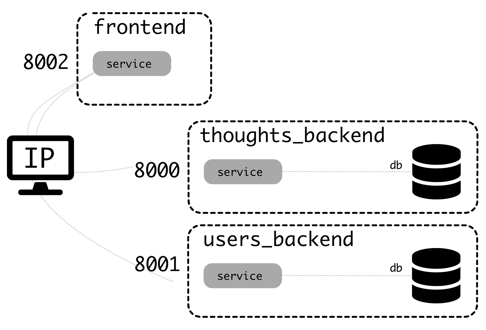
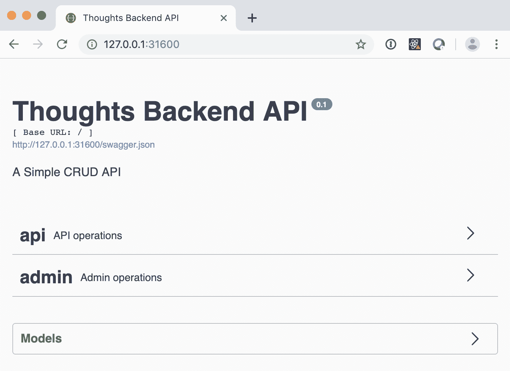
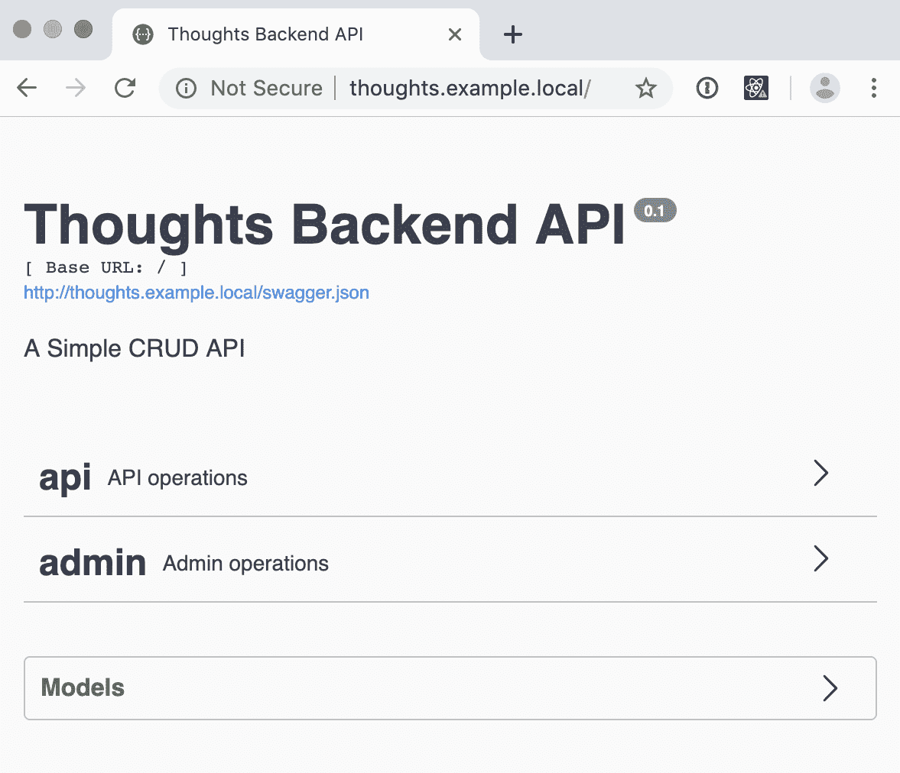
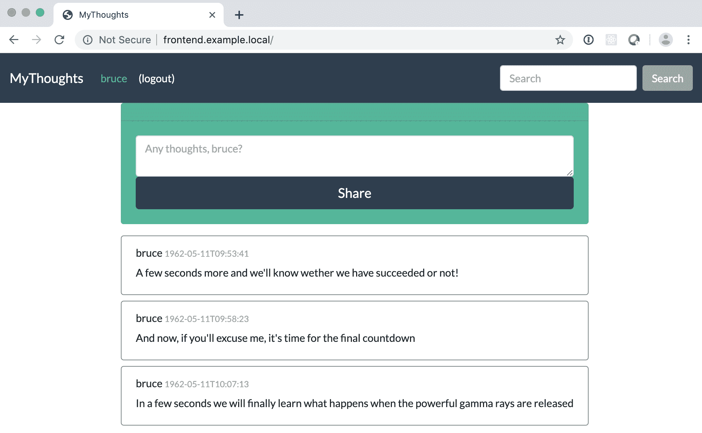

# 与 Kubernetes 合作的地方发展

在本章中，您将学习如何定义集群、部署所有交互的微服务，以及如何在本地进行开发。我们将以上一章介绍的概念为基础，描述如何在 Kubernetes 中实际配置整个系统，部署多个微服务，以及如何使其在您自己的本地计算机上作为一个整体工作。

这里，我们将介绍另外两种微服务：前端和用户后端。在*战略规划*部分中[第 1 章](01.html)、*制定行动——设计、计划和执行*中对其进行了讨论。我们将在本章中看到如何配置它们以在 Kubernetes 中工作。这是在[第 2 章](02.html)中介绍的思想基础上，*使用 Python 创建 REST 服务；*[第 3 章](03.html)*使用 Docker*构建、运行和测试您的服务，以及[第 4 章](04.html)*创建管道和工作流*。我们将讨论如何正确配置这三个组件，并添加一些其他选项，以确保它们在部署到生产环境中后能够顺利运行。

本章将介绍以下主题：

*   实现多种服务
*   配置服务
*   在本地部署完整系统

到本章结束时，您将拥有一个可工作的本地 Kubernetes 系统，其中三个微服务作为一个整体部署和工作。您将了解不同元素的工作方式以及如何配置和调整它们。

# 技术要求

对于本章，您需要有一个本地 Kubernetes 实例，如前一章所述运行。记住安装入口控制器。

您可以检查我们将在 GitHub 存储库中使用的完整代码（[https://github.com/PacktPublishing/Hands-On-Docker-for-Microservices-with-Python/tree/master/Chapter06](https://github.com/PacktPublishing/Hands-On-Docker-for-Microservices-with-Python/tree/master/Chapter06) ）。

# 实现多种服务

在 GitHub repo 中，您可以找到我们将在本章中使用的三种微服务。它们基于[第 1 章](01.html)中介绍的整体*移动——设计、计划和执行*，并分为三个要素：

*   **思想后端**：如前一章所述，它处理思想的存储和搜索。
*   **用户后端**：存储用户并允许用户登录。根据身份验证方法的描述，这将创建一个令牌，该令牌可用于针对其他系统进行身份验证。
*   **前端**：它来自 monolith，但它不是直接访问数据库，而是向用户发出请求，并通过后端复制功能。

Note that the static files are still being served by the Frontend, even though we described the final stage of the cluster serving them independently. This is done for simplicity and to avoid having an extra service.

上述服务的停靠方式与[第 3 章](03.html)*中思想后端使用 Docker*构建、运行和测试服务的方式类似。让我们看看其他微服务的一些细节。

# 描述用户后端微服务

用户后端代码可在[找到 https://github.com/PacktPublishing/Hands-On-Docker-for-Microservices-with-Python/tree/master/Chapter06/users_backend](https://github.com/PacktPublishing/Hands-On-Docker-for-Microservices-with-Python/tree/master/Chapter06/users_backend) 。该结构与 Thinks 后端非常相似，后者是一个与 PostgreSQL 数据库通信的 Flask RESTPlus 应用程序。

它有两个端点，如其 Swagger 界面所示：


端点如下所示：

|  | **终点** | **输入** | **返回** |
| `POST` | `/api/login` | `{username: <username>, password: <password>}` | `{Authorized: <token header>}` |
| `POST` | `/admin/users` | `{username: <username>, password: <password>}` | `<new_user>` |

`admin`端点允许您创建新用户，登录 API 返回可用于后端的有效头。

用户以以下模式存储在数据库中：

| **字段** | **格式** | **评论** |
| `id` | `Integer` | 主键 |
| `username` | `String (50)` | 用户名 |
| `password` | `String(50)` | 密码存储在纯文本中，这是一个坏主意，但简化了示例 |
| `creation` | `Datetime` | 创建用户的时间 |

在 SQLAlchemy 模型定义中，使用以下代码描述此模式：

```py
class UserModel(db.Model):
    id = db.Column(db.Integer, primary_key=True)
    username = db.Column(db.String(50))
    # DO NOT EVER STORE PLAIN PASSWORDS IN DATABASES
    # THIS IS AN EXAMPLE!!!!!
    password = db.Column(db.String(50))
    creation = db.Column(db.DateTime, server_default=func.now())
```

Note that the creation date gets stored automatically. Also, note that we store the password in plain text. This is a *terrible, terrible idea in a production service*. You can check out an article called *How to store a password in the database?* ([https://www.geeksforgeeks.org/store-password-database/](https://www.geeksforgeeks.org/store-password-database/)) to get general ideas for encrypting passwords with a salt seed. You can use a package such as `pyscrypt` ([https://github.com/ricmoo/pyscrypt](https://github.com/ricmoo/pyscrypt)) to implement this kind of structure in Python.

将用户*bruce*和*stephen*添加到`db`示例中，作为获取示例数据的一种方式。

# 描述前端微服务

前端代码在 GitHub repo 中提供。它基于 Django 巨石（[https://github.com/PacktPublishing/Hands-On-Docker-for-Microservices-with-Python/tree/master/Chapter01/Monolith](https://github.com/PacktPublishing/Hands-On-Docker-for-Microservices-with-Python/tree/master/Chapter01/Monolith) 在[第 1 章](01.html)中介绍，*移动——设计、计划和执行*。

与 monolith 的主要区别在于数据库不可访问。因此，Django ORM 没有任何用途。它们被替换为对其他后端的 HTTP 请求。为了提出请求，我们使用了奇妙的`requests`库。

例如，`search.py`文件被转换为以下代码，将搜索委托给后端微服务。注意客户的请求如何转换为对`GET /api/thoughts`端点的内部 API 调用。结果在 JSON 中解码并在模板中呈现：

```py
import requests

def search(request):
    username = get_username_from_session(request)
    search_param = request.GET.get('search')

    url = settings.THOUGHTS_BACKEND + '/api/thoughts/'
    params = {
        'search': search_param,
    }
    result = requests.get(url, params=params)
    results = result.json()

    context = {
        'thoughts': results,
        'username': username,
    }
    return render(request, 'search.html', context)
```

可在回购协议的`Chapter01`子目录（[中对整块石等效代码进行比较 https://github.com/PacktPublishing/Hands-On-Docker-for-Microservices-with-Python/blob/master/Chapter01/Monolith/mythoughts/thoughts/search.py](https://github.com/PacktPublishing/Hands-On-Docker-for-Microservices-with-Python/blob/master/Chapter01/Monolith/mythoughts/thoughts/search.py) 。

Note how we make a `get` request through the `requests` library to the defined search endpoint, which results in the `json` format being returned and rendered.

`THOUGTHS_BACKEND`根 URL 来自设置，采用通常的 Django 方式。

这个例子很简单，因为不涉及身份验证。参数从用户界面捕获，然后路由到后端。请求在后端和获得结果后都会正确格式化，然后呈现。这是两个微服务协同工作的核心。

一个更有趣的例子是`list_thought`（[https://github.com/PacktPublishing/Hands-On-Docker-for-Microservices-with-Python/blob/master/Chapter06/frontend/mythoughts/thoughts/thoughts.py#L18](https://github.com/PacktPublishing/Hands-On-Docker-for-Microservices-with-Python/blob/master/Chapter06/frontend/mythoughts/thoughts/thoughts.py#L18) 视图。以下代码列出了登录用户的想法：

```py
def list_thoughts(request):
    username = get_username_from_session(request)
    if not username:
        return redirect('login')

    url = settings.THOUGHTS_BACKEND + '/api/me/thoughts/'
    headers = {
        'Authorization': request.COOKIES.get('session'),
    }
    result = requests.get(url, headers=headers)
    if result.status_code != http.client.OK:
        return redirect('login')

    context = {
        'thoughts': result.json(),
        'username': username,
    }
    return render(request, 'list_thoughts.html', context)
```

在这里，在做任何事情之前，我们需要检查用户是否登录。这在`get_username_from_session`调用中完成，如果他们没有登录，则返回`username`或`None`。如果他们没有登录，返回将重定向到登录屏幕。

由于该端点需要身份验证，我们需要在`Authorization`头中将来自用户的会话添加到我们的请求中。用户的会话可以从`request.COOKIES`字典中获取。

作为保护措施，我们需要检查从后端返回的状态代码是否正确。对于此调用，任何不是 200（HTTP 调用正确）的结果状态代码都将重定向到登录页面。

For simplicity and clarity, our example services are not handling different error cases. In a production system, there should be a differentiation between errors where the issue is that either the user is not logged in or there's another kind of user error (a 400 error), or the backend service is not available (a 500 status code).

Error handling, when done properly, is difficult, but worth doing well, especially if the error helps users to understand what happened.

`get_username_from_session`函数封装了对`validate_token_header`的调用，与前一章介绍的调用相同：

```py
def get_username_from_session(request):
    cookie_session = request.COOKIES.get('session')
    username = validate_token_header(cookie_session,
                                     settings.TOKENS_PUBLIC_KEY)
    if not username:
        return None

    return username
```

`settings`文件包含解码令牌所需的公钥。

In this chapter, for simplicity, we copied the key directly into the `settings` file. This is not the way to go for a production environment. Any secret should be obtained through the Kubernetes environment configuration. We will see how to do this in the following chapters.

环境文件需要指定用户后端和 Thinks 后端的基本 URL 的位置，以便能够连接到它们。

# 连接服务

只有使用`docker-compose`才能测试协同工作的服务。检查用户后端和 Thinks 后端中的`docker-compose.yaml`文件是否在外部公开了不同的端口。

思想后端公开端口`8000`，用户后端公开端口`8001`。这允许前端连接到它们（并暴露端口`8002`。此图显示了此系统的工作原理：



您可以看到这三个服务是如何隔离的，因为`docker-compose`将为它们创建自己的连接网络。两个后端都有自己的容器，充当数据库。

前端服务需要连接到其他服务。服务的 URL 应添加到`environment.env`文件中，并应使用计算机的 IP 指示该服务。

An internal IP such as localhost or `127.0.0.1` does not work, as it gets interpreted **inside the container.** You can obtain the local IP by running `ifconfig`.

例如，如果您的本地 IP 为`10.0.10.3`，则`environment.env`文件应包含以下内容：

```py
THOUGHTS_BACKEND_URL=http://10.0.10.3:8000
USER_BACKEND_URL=http://10.0.10.3:8001
```

如果在浏览器中访问前端服务，它应连接到其他服务。

A possibility could be to generate a bigger `docker-compose` file that includes everything. This could make sense if all the microservices are in the same Git repo, a technique known as **monorepo** ([https://gomonorepo.org/](https://gomonorepo.org/)). Possible problems include keeping both the internal `docker-compose` to work with a single system and the general one in sync so that the automated tests should detect any problems.

这种结构有点麻烦，因此我们可以将其转换为一个适当的 Kubernetes 集群，以实现本地发展。

# 配置服务

要在 Kubernetes 中配置应用程序，我们需要为每个应用程序定义以下 Kubernetes 对象：

*   **部署**：部署将控制 POD 的创建，因此 POD 始终可用。它还将基于映像创建它们，并在需要时添加配置。pod 运行应用程序。
*   **服务**：该服务将使 RESTful 请求在集群内可用，并使用一个简短的名称。这会将请求路由到任何可用的 pod。
*   **入口**：这使得服务在集群外部可用，因此我们可以从集群外部访问应用程序。

在本节中，我们将以 Thinks 后端配置为例详细介绍。稍后，我们将看到不同部分如何连接。我们创建了一个 Kubernetes 子目录（[https://github.com/PacktPublishing/Hands-On-Docker-for-Microservices-with-Python/tree/master/Chapter06/thoughts_backend/kubernetes](https://github.com/PacktPublishing/Hands-On-Docker-for-Microservices-with-Python/tree/master/Chapter06/thoughts_backend/kubernetes) 用于存储包含每个定义的`.yaml`文件。

我们将使用`example`名称空间，因此请确保已创建该名称空间：

```py
$ kubectl create namespace example
```

让我们从第一个 Kubernetes 对象开始。

# 配置部署

对于 Thinks 后端部署，我们将部署一个包含两个容器的 pod，一个包含数据库，另一个包含应用程序。这种配置使本地工作变得容易，但请记住，重新创建 pod 将重新启动两个容器。

配置文件在此完全可用（[https://github.com/PacktPublishing/Hands-On-Docker-for-Microservices-with-Python/blob/master/Chapter06/thoughts_backend/kubernetes/deployment.yaml 让我们看看它的不同部分。第一个元素描述它是什么、它的名称以及它所在的名称空间：](https://github.com/PacktPublishing/Hands-On-Docker-for-Microservices-with-Python/blob/master/Chapter06/thoughts_backend/kubernetes/deployment.yaml)

```py
---
apiVersion: apps/v1
kind: Deployment
metadata:
    name: thoughts-backend
    labels:
        app: thoughts-backend
    namespace: example
```

然后，我们生成`spec`。它包含我们应该保留多少豆荚以及每个豆荚的模板。`selector`定义监控哪些标签，并与模板中的`labels`匹配：

```py
spec:
    replicas: 1
    selector:
        matchLabels:
            app: thoughts-backend
```

`template`部分在其自身`spec`部分中定义了容器：

```py

    template:
        metadata:
            labels:
                app: thoughts-backend
        spec:
            containers:
                - name: thoughts-backend-service
                  ...
                - name: thoughts-backend-db
                  ...
```

`thoughts-backend-db`更简单。唯一需要的元素是定义容器和图像的名称。我们需要将拉取策略定义为`Never`以表明该映像在本地 Docker repo 中可用，并且不需要从远程注册表中拉取它：

```py
- name: thoughts-backend-db
  image: thoughts_backend_db:latest
  imagePullPolicy: Never
```

`thoughts-backend-service`需要定义服务的公开端口以及环境变量。变量值是我们之前在创建数据库时使用的值，除了`POSTGRES_HOST`，我们的优势是同一 pod 中的所有容器共享相同的 IP：

```py
 - name: thoughts-backend-service
   image: thoughts_server:latest
   imagePullPolicy: Never
   ports:
   - containerPort: 8000
   env:
   - name: DATABASE_ENGINE
     value: POSTGRESQL
   - name: POSTGRES_DB
     value: thoughts
   - name: POSTGRES_USER
     value: postgres
   - name: POSTGRES_PASSWORD
     value: somepassword
   - name: POSTGRES_PORT
     value: "5432"
   - name: POSTGRES_HOST
     value: "127.0.0.1"
```

要在 Kubernetes 中获得部署，需要应用该文件，如下所示：

```py
$ kubectl apply -f thoughts_backend/kubernetes/deployment.yaml
deployment "thoughts-backend" created
```

现在已在群集中创建部署：

```py
$ kubectl get deployments -n example
NAME             DESIRED CURRENT UP-TO-DATE AVAILABLE AGE
thoughts-backend 1       1       1          1         20s
```

这会自动创建豆荚。如果 pod 被删除或崩溃，部署将使用其他名称重新启动它：

```py
$ kubectl get pods -n example
NAME                              READY STATUS  RESTARTS AGE
thoughts-backend-6dd57f5486-l9tgg 2/2   Running 0        1m
```

部署正在跟踪最新映像，但除非将其删除，否则不会创建新的 pod。要进行更改，请确保手动删除 pod，然后重新创建：

```py
$ kubectl delete pod thoughts-backend-6dd57f5486-l9tgg -n example
pod "thoughts-backend-6dd57f5486-l9tgg" deleted
$ kubectl get pods -n example
NAME                              READY STATUS  RESTARTS AGE
thoughts-backend-6dd57f5486-nf2ds 2/2   Running 0        28s
```

该应用程序在集群内仍然不可发现，除了通过其特定的 pod 名称引用它之外，它可能会更改，因此我们需要为此创建一个服务。

# 配置服务

我们创建一个 Kubernetes 服务，为创建的部署公开的应用程序创建一个名称。可以在`service.yaml`文件中检查服务。让我们来看一看：

```py
---
apiVersion: v1
kind: Service
metadata:
    namespace: example
    labels:
        app: thoughts-service
    name: thoughts-service
spec:
    ports:
        - name: thoughts-backend
          port: 80
          targetPort: 8000
    selector:
        app: thoughts-backend
    type: NodePort
```

初始数据与部署类似。`spec`部分定义开放端口，将对`80`端口上的服务的访问路由到`thoughts-backend`容器中的`8000`端口，即部署的名称。`selector`部分将所有请求路由到匹配的任何 pod。

类型为`NodePort`以允许从集群外部进行访问。一旦我们发现外部暴露的 IP，这允许我们检查它是否正常工作：

```py
$ kubectl apply -f kubernetes/service.yaml
service "thoughts-service" configured
$ kubectl get service -n example
NAME CLUSTER-IP EXTERNAL-IP PORT(S) AGE
thoughts-service 10.100.252.250 <nodes> 80:31600/TCP 1m
```

我们可以通过使用所描述的 pod 访问 localhost 来访问 Thinks 后端。在这种情况下，`http://127.0.0.1:31600`：



该服务为我们提供了一个内部名称，但是如果我们想要控制它如何在外部公开，我们需要配置入口。

# 配置入口

最后，我们描述了`ingress.yaml`（[中的入口 https://github.com/PacktPublishing/Hands-On-Docker-for-Microservices-with-Python/blob/master/Chapter06/thoughts_backend/kubernetes/ingress.yaml](https://github.com/PacktPublishing/Hands-On-Docker-for-Microservices-with-Python/blob/master/Chapter06/thoughts_backend/kubernetes/ingress.yaml) 。文件复制到这里。请注意，我们如何将元数据设置为位于适当的命名空间中：

```py
---
apiVersion: extensions/v1beta1
kind: Ingress
metadata:
    name: thoughts-backend-ingress
    namespace: example
spec:
    rules:
        - host: thoughts.example.local
          http:
            paths:
              - backend:
                  serviceName: thoughts-service
                  servicePort: 80
                path: /
```

此入口将使服务向端口`80`上的节点公开。由于可以在同一节点上公开多个服务，因此可以通过主机名来区分它们，在本例中为`thoughts.example.local`。

The Ingress controller we are using only allows exposing ports `80` (HTTP) and `443` (HTTPS) in `servicePort`.

应用该服务后，我们可以尝试访问该页面，但是，除非我们将呼叫发送到正确的主机，否则将出现 404 错误：

```py
$ kubectl apply -f kubernetes/ingress.yaml
ingress "thoughts-backend-ingress" created
$ kubectl get ingress -n example
NAME                     HOSTS                  ADDRESS  PORTS  AGE
thoughts-backend-ingress thoughts.example.local localhost 80 1m
$ curl http://localhost
<html>
<head><title>404 Not Found</title></head>
<body>
<center><h1>404 Not Found</h1></center>
<hr><center>nginx/1.15.8</center>
</body>
</html>
```

我们需要能够将任何请求指向`thoughts.example.local`我们的本地主机。在 Linux 和 macOS 中，最简单的方法是更改`/etc/hosts`文件以包含以下行：

```py
127.0.0.1 thoughts.example.local
```

然后，我们可以使用浏览器检查我们的应用程序，这次在`http://thoughts.example.local`（和端口`80`）中：



定义不同的主机条目允许我们从外部访问所有服务，以便能够调整它们并调试问题。我们将以同样的方式定义其余的入口。

If you get a `Connection refused` error and the word `localhost` does not appear when running `kubectl get ingress -n example`, your Kubernetes installation does not have the Ingress controller installed. Double-check the installation documentation at [https://github.com/kubernetes/ingress-nginx/blob/master/docs/deploy/index.md.](https://github.com/kubernetes/ingress-nginx/blob/master/docs/deploy/index.md)

现在我们在 Kubernetes 本地部署了一个工作应用程序！

# 在本地部署完整系统

我们的每个微服务都独立工作，但要让整个系统工作，我们需要部署其中三个（Thinks 后端、Users 后端和 Frontend），并将它们相互连接。前端尤其需要另外两个微服务启动并运行。有了 Kubernetes，我们可以在本地部署它。

要部署整个系统，我们需要首先部署用户后端，然后部署前端。我们将描述这些系统中的每一个，并将它们与已经部署的 Thinks 后端相关联，我们之前已经看到了如何部署 Thinks 后端。

# 部署用户后端

用户后端文件与 Thinks 后端非常相似。您可以在 GitHub 回购协议（[中查看 https://github.com/PacktPublishing/Hands-On-Docker-for-Microservices-with-Python/tree/master/Chapter06/users_backend/kubernetes](https://github.com/PacktPublishing/Hands-On-Docker-for-Microservices-with-Python/tree/master/Chapter06/users_backend/kubernetes) 。确保`deployment.yaml`值中的环境设置正确：

```py
$ kubectl apply -f users_backend/kubernetes/deployment.yaml
deployment "users-backend" created
$ kubectl apply -f users_backend/kubernetes/service.yaml
service "users-service" created
$ kubectl apply -f users_backend/kubernetes/ingress.yaml
ingress "users-backend-ingress" created
```

记住一定要在`/etc/hosts`中包含新主机名：

```py
127.0.0.1 users.example.local
```

您可以在`http://users.example.local`中访问用户后端。

# 添加前端

前端服务和入口与以前的非常相似。部署略有不同。让我们来看看配置，在三组：

1.  首先，我们添加了`namespace`、`name`和`kind`（部署）的元数据，如下代码所示：

```py
---
apiVersion: apps/v1
kind: Deployment
metadata:
    name: frontend
    labels:
        app: frontend
    namespace: example
```

2.  然后，我们用模板和`replicas`的编号定义`spec`。对于本地系统，只有一个副本可以：

```py
spec:
    replicas: 1
    selector:
        matchLabels:
            app: frontend
    template:
        metadata:
            labels:
                app: frontend
```

3.  最后我们`spec`用容器定义出来模板：

```py
        spec:
            containers:
                - name: frontend-service
                  image: thoughts_frontend:latest
                  imagePullPolicy: Never
                  ports:
                     - containerPort: 8000
                  env:
                      - name: THOUGHTS_BACKEND_URL
                        value: http://thoughts-service
                      - name: USER_BACKEND_URL
                        value: http://users-service
```

与之前定义的后端部署的主要区别在于，只有一个容器，并且其上的环境更简单。

我们将后端 URL 环境定义为服务端点。这些端点在集群内可用，因此它们将被定向到适当的容器。

Remember that the `*.example.local` addresses are only available in your computer, as they only live in `/etc/hosts`. Inside the container, they won't be available.

This is suitable for local development, but an alternative is to have a DNS domain that can be redirected to `127.0.0.1` or similar.

我们应该在`/etc/hosts`文件中添加一个新域名：

```py
127.0.0.1 frontend.example.local
```

Django 要求您设置`ALLOWED_HOSTS`设置的值，以允许它接受主机名，因为默认情况下，它只允许来自本地主机的连接。参见 Django 文档（[https://docs.djangoproject.com/en/2.2/ref/settings/#allowed-主机](https://docs.djangoproject.com/en/2.2/ref/settings/#allowed-hosts)，了解更多信息。为了简化，我们可以允许任何主机使用`'*'`。查看 GitHub（[上的代码 https://github.com/PacktPublishing/Hands-On-Docker-for-Microservices-with-Python/blob/master/Chapter06/frontend/mythoughts/mythoughts/settings.py#L28](https://github.com/PacktPublishing/Hands-On-Docker-for-Microservices-with-Python/blob/master/Chapter06/frontend/mythoughts/mythoughts/settings.py#L28) ）。

In production, it's good practice to limit the hosts to the **Fully Qualified Domain Name** (**FQDN**), the full DNS name of a host, but the Kubernetes Ingress will check the host header and reject it if it's not correct.

前端应用程序的部署方式与我们之前所做的相同：

```py
$ kubectl apply -f frontend/kubernetes/deployment.yaml
deployment "frontend" created
$ kubectl apply -f frontend/kubernetes/service.yaml
service "frontend-service" created
$ kubectl apply -f frontend/kubernetes/ingress.yaml
ingress "frontend-ingress" created
```

然后我们可以访问整个系统，登录，搜索，等等。

Remember that there are two users, `bruce` and `stephen`. Their passwords are the same as their usernames. You don't need to be logged in to search.

在浏览器中，转至`http://frontend.example.local/`：



祝贺您有一个工作的 Kubernetes 系统，包括不同部署的微服务。您可以独立访问每个微服务来调试它或执行操作，如创建新用户等。

如果您需要部署新版本，请使用`docker-compose`构建构建构建适当的容器，并删除 pod 以强制重新创建它。

# 总结

在本章中，我们了解了如何在 Kubernetes 本地集群中部署微服务，以允许本地开发和测试。在本地计算机上部署整个系统大大简化了开发新功能或调试系统行为的过程。生产环境将非常相似，这也为它奠定了基础。

我们首先描述了缺失的两个微服务。用户后端处理用户认证，前端是[第 1 章](01.html)中所述的巨石的修改版本，*移动——设计、计划和执行*，连接到两个后端。我们展示了如何以`docker-compose`的方式构建和运行它们。

之后，我们描述了如何在 Kubernetes 中设置`.yaml`文件组合以正确配置应用程序。每个微服务都有自己的部署来定义可用的 POD、定义稳定访问点的服务和允许外部访问的入口。我们详细描述了它们，然后将它们应用到所有的微服务中。

在下一章中，我们将看到如何从本地部署转移到部署 Kubernetes 集群，以准备生产。

# 问题

1.  我们正在部署的三种微服务是什么？
2.  哪项微服务需要另外两项才可用？
3.  为什么在`docker-compose`中运行时需要使用外部 IP 连接微服务？
4.  每个应用程序所需的主要 Kubernetes 对象是什么？
5.  是否有任何对象不是必需的？
6.  如果我们将任何微服务扩展到多个吊舱，您会看到任何问题吗？
7.  我们为什么要使用`/etc/hosts`文件？

# 进一步阅读

您可以在*Kubernetes for Developers】一书*（[中了解更多关于 Kubernetes 的信息 https://www.packtpub.com/eu/virtualization-and-cloud/kubernetes-developers](https://www.packtpub.com/eu/virtualization-and-cloud/kubernetes-developers) 和*库伯内特斯食谱-第二版*（ [https://www.packtpub.com/in/virtualization-and-cloud/kubernetes-cookbook-second-edition](https://www.packtpub.com/in/virtualization-and-cloud/kubernetes-cookbook-second-edition) 。