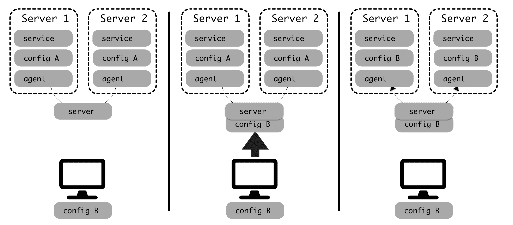

# 使用 GitOps 原则

在了解了如何配置 Kubernetes 集群之后，我们将学习如何使用 GitOps 实践，而不是应用手动命令和文件。GitOps 意味着使用 Git repo 来管理集群配置，以存储和跟踪包含配置的 YAML 文件。我们将看到如何将 GitHub repo 与集群链接，以便使用 Flux 定期更新它。

这种方法允许我们以确定性的方式存储配置，用代码描述对基础设施的更改。可以查看更改，集群可以从头恢复或复制，我们将在[第 9 章](09.html)、*管理工作流*中看到。

本章将介绍以下主题：

*   理解 GitOps 的描述
*   设置通量以控制 Kubernetes 群集
*   配置 GitHub
*   通过 GitHub 更改 Kubernetes 群集
*   在生产中工作

在本章结束时，您将知道如何将 Kubernetes 配置存储在 Git 存储库中，并自动应用合并到主分支中的任何更改。

# 技术要求

本章中示例的代码可在 GitHub 上获得：[https://github.com/PacktPublishing/Hands-On-Docker-for-Microservices-with-Python/tree/master/Chapter08](https://github.com/PacktPublishing/Hands-On-Docker-for-Microservices-with-Python/tree/master/Chapter08) 。

您需要安装`fluxctl`工具。然后，我们将使用此工具手动同步，并获取 SSH 密钥，以允许 Flux 与 Git repo 交互。请参见其文档中的安装方法：[https://docs.fluxcd.io/en/stable/tutorials/get-started.html](https://docs.fluxcd.io/en/stable/tutorials/get-started.html) 。

# 理解 GitOps 的描述

操作中的一个重大传统问题是确保不同的服务器保持适当的配置。当您拥有一组服务器时，部署一个服务并保持它们的正确配置并不是一项简单的任务。

For this chapter, we will use *configuration* as a way of describing a service and all the required configuration to run it in production. This includes the particular version of the service, but also things such as the underlying infrastructure (OS version, number of servers, and so on) or packages and configuration of the dependent services (load balancers, third-party libraries, and so on).

*Configuration management* will, therefore, be the way to make changes to that.

随着基础架构的增长，在所有服务器中保持配置正常运行是一项挑战。最常见的更改是部署新版本的服务，但还有其他可能性。例如，需要添加到负载平衡器的新服务器、NGINX 的新配置调整以修复安全漏洞、或服务的新环境变量以启用功能。

最初的阶段是手动配置，但过一段时间后就很难实现了。

# 管理配置

手动配置意味着团队中有人跟踪少量服务器，当需要更改时，分别在每个服务器上登录并进行所需更改。

这种操作方式是工作密集型的，并且在多台服务器上容易出错，因为它们很容易分散。

因此，经过一段时间后，可以通过使用 Fabric（[的一些脚本进行改进 http://www.fabfile.org/](http://www.fabfile.org/) 或 Capistrano（[https://capistranorb.com/](https://capistranorb.com/) ）。基本模型是将配置和新代码推送到服务器，并执行许多自动化任务，最后重新启动服务。通常，这是作为一个手动步骤直接从团队的计算机上完成的。

The code and configuration are normally present on Git, but the manual process makes it possible to change this, as it is detached. If you work this way, ensure that only files stored under source control are being deployed.

服务器维护的某些元素，如操作系统升级或库更新，可能仍然需要手动完成。

下图显示了如何从进行配置更改的团队成员的计算机中推送代码：


在此阶段，可以手动或使用 Terraform（[等工具添加新的基础设施 https://www.terraform.io/](https://www.terraform.io/) 与云服务交互。

一个更复杂的替代方法是使用诸如 Puppet（[之类的工具 https://puppet.com/](https://puppet.com/) 或厨师（[https://www.chef.io/](https://www.chef.io/) ）。它们使用客户机-服务器体系结构。它们允许我们使用自己的声明性语言描述服务器的状态，当服务器中的状态发生更改时，所有客户端都将更新以遵循定义。服务器将报告任何问题或偏差，并集中配置定义。

下图总结了该过程：



在某些情况下，这些工具可能能够在云服务中分配资源；例如，在 AWS 中添加新的 EC2 实例。

A configuration management tool also helps in monitoring and performs a number of remediation tasks. For example, it can restart services that should be running, or retry if there has been a problem changing the configuration.

It also scales better for a higher number of servers.

所有这些策略都需要专门的工具，通常由特定的运营团队处理。这使得需要协调以进行配置更新的开发人员无法访问配置。

这种分工产生了一些摩擦，随着时间的推移，德沃斯运动提出了构建这项工作的其他方式。

# 理解 DevOps

传统的分工方式是创建一个控制基础设施和部署的运营团队，以及一个创建服务的开发团队。

这种方法的问题在于，开发人员通常不会真正理解他们的代码在生产中是如何工作的，同时，操作人员也不会确切地知道部署包含哪些内容。这可能会导致*我不知道它是什么*/*我不知道它在哪里*，两支球队之间存在分歧。DevOps 最终被创建为一种填补这一空白的方法。

A typical problem is one where a service frequently fails in production and is detected by operations, which performs remediation tactics (for example, restarting the service).

However, the development team doesn't know exactly what makes it fail and they have other pressing priorities, so they won't fix the problem.

Over time, this may compromise the stability of the system.

DevOps 是一组用于改进操作端和开发端之间协作的技术。它的目标是通过让开发人员了解整个操作方面来实现快速部署，并通过尽可能使用自动化来简化操作。

it 的核心是使团队能够控制自己的基础架构和部署，加快部署速度，了解基础架构以帮助及早发现问题。团队在部署和支持基础架构时应该是自主的。

要启用 DevOps 实践，您需要一些工具以可控的方式控制不同的操作。GitOps 是一个有趣的选择，特别是如果您使用 Kubernetes。

# 定义 GitOps

GitOps 的思想很简单，我们使用 Git 来描述我们的基础设施和配置管理。对已定义分支的任何更改都将触发相关更改。

如果您能够通过代码定义整个系统，Git 会给您带来很多好处：

*   对基础架构或配置管理的任何更改都会进行版本控制。它们是显式的，如果有问题可以回滚。版本之间的变化可以通过 diff 来观察，这是一种正常的 Git 操作。
*   Git repo 可以充当备份，在底层硬件发生灾难性故障时可以从头开始恢复。
*   它是最常见的源代码管理工具。公司里的每个人都可能知道它是如何工作的，并且能够使用它。它还可以轻松地与现有工作流（如评论）集成。

GitOps 概念由 Weaveworks 在一篇博客文章（[中介绍并命名 https://www.weave.works/blog/gitops-operations-by-pull-request](https://www.weave.works/blog/gitops-operations-by-pull-request) ）。从那时起，它在公司中的应用越来越多。

虽然 GitOps 可以应用于其他类型的部署（当然是这样），但它与 Kubernetes 有很好的协同作用，这实际上是 Weaveworks 博客文章中的描述。

Kubernetes 集群可以使用 YAML 文件进行完全配置，YAML 文件封装了几乎整个系统定义。正如我们在前一章中所看到的，这可能包括诸如负载平衡器之类的元素的定义。Kubernetes 集群外部的元素（如外部 DNS）不包括在 YAML 文件中，很少更改。

The servers and infrastructure can be automated with other tools, like Terraform, or with the automated procedures described in [Chapter 7](07.html), *Configuring and Securing the Production System*.

For pragmatic reasons, it is entirely feasible that some infrastructure operations are manual. For example, upgrading the Kubernetes version of an EKS cluster is an operation that can be done through the AWS console, and it is rare enough that it is fine to do so manually.

It is also fine to have these kinds of operations remain manual, since automating them probably won't pay dividends.

正如我们在[第 6 章](06.html)*与 Kubernetes*的本地开发中所看到的，Kubernetes YAML 文件包含可与`kubectl apply -f <file>`命令一起应用的元素定义。Kubernetes 非常灵活，因为一个文件可以包含多个元素或单个元素。

将所有 YAML 文件分组到一个目录结构下，并将它们置于 Git 控制下，这是应用更改的一种非常明确的方式。这就是我们的运作方式。

此操作并不复杂，但我们将使用 Weaveworks 创建的现有工具，称为**通量**。

# 设置通量以控制 Kubernetes 群集

流量（[https://github.com/fluxcd/flux](https://github.com/fluxcd/flux) 是确保 Kubernetes 集群的状态与 Git repo 中存储的文件相匹配的工具。

它作为另一个部署部署在 Kubernetes 集群中。它每 5 分钟运行一次，并检查 Git repo 和 Docker 注册表。然后，它应用任何更改。这有助于访问 Git repo，因为不需要在 CI 系统中创建任何推送机制。

我们将看到如何在 Kubernetes 内部启动一个从 GitHub 回购中提取的通量容器。

# 启动系统

为了简单起见，我们将使用本地 Kubernetes。我们将使用[第 6 章](06.html)、*本地开发与 Kubernetes*中描述的图像，因此请务必运行以下命令：

```py
$ cd Chapter06
$ cd frontend
$ docker-compose build server
...
Successfully tagged thoughts_frontend:latest
$ cd ..
$ cd thoughts_backend/
$ docker-compose build server db
...
Successfully tagged thoughts_frontend:latest
$ cd ..
$ cd users_backend
$ docker-compose build server db
...
Successfully tagged users_server:latest
```

基本 Kubernetes 配置存储在示例文件夹（[中 https://github.com/PacktPublishing/Hands-On-Docker-for-Microservices-with-Python/tree/master/Chapter08/example](https://github.com/PacktPublishing/Hands-On-Docker-for-Microservices-with-Python/tree/master/Chapter08/example) 子目录。

您可以使用以下命令部署整个系统：

```py
$ cd Chapter08/example
$ kubectl apply -f namespace.yaml
namespace/example created
$ kubectl apply -f . --recursive
deployment.apps/frontend created
ingress.extensions/frontend-ingress created
service/frontend-service created
namespace/example unchanged
deployment.apps/thoughts-backend created
ingress.extensions/thoughts-backend-ingress created
service/thoughts-service created
deployment.apps/users-backend created
ingress.extensions/users-backend-ingress created
service/users-service created
```

这将创建整个系统。

Apply the `namespace.yaml` file to avoid not being able to deploy elements as the namespace is not present, but you can run the `kubectl apply -f . --recursive` command twice.

如果您检查系统，现在应该部署，如运行`kubectl get pods`命令所示：

```py
$ kubectl get pods -n example
NAME                   READY STATUS  RESTARTS AGE
frontend-j75fp         1/1   Running 0        4m
frontend-n85fk         1/1   Running 0        4m
frontend-nqndl         1/1   Running 0        4m
frontend-xnljj         1/1   Running 0        4m
thoughts-backend-f7tq7 2/2   Running 0        4m
users-backend-7wzts    2/2   Running 0        4m
```

注意`frontend`共有四份。我们将在本章中更改 POD 的数量，作为如何更改部署的示例。

现在，删除部署以从头开始：

```py
$ kubectl delete namespace example
namespace "example" deleted
```

有关此设置的更多详细信息，请查看[第 6 章](06.html)*与 Kubernetes 的本地开发*中的*在本地部署整个系统*部分。

# 配置流量

我们将准备一个 Flux 系统，它将帮助我们跟踪 Git 配置。我们根据本回购协议中的流量示例编制了一份报告（[https://github.com/fluxcd/flux/tree/master/deploy](https://github.com/fluxcd/flux/tree/master/deploy) ），可在`Chapter08/flux`子目录中找到。

主文件为`flux-deployment.yaml`。大部分都是评论模板，但看看回购协议的定义：

```py
# Replace the following URL to change the Git repository used by Flux.
- --git-url=git@github.com:PacktPublishing/Hands-On-Docker-for-Microservices-with-Python.git
- --git-branch=master
# Include this if you want to restrict the manifests considered by flux
# to those under the following relative paths in the git repository
- --git-path=Chapter08/example
```

这些行告诉 Flux 要使用的回购协议、分支和任何路径。如果对路径进行了注释（在您的案例中可能是这样），它将使用整个回购协议。在下一节中，我们需要将回购协议更改为使用您自己的回购协议。

Note that we use the `flux` namespace to deploy all these elements. You can reuse your main namespace or use the default one if it works better for you.

要使用 Flux，请创建名称空间，然后应用完整的`flux`目录：

```py
$ kubectl apply -f flux/namespace.yaml
namespace/flux created
$ kubectl apply -f flux/
serviceaccount/flux created
clusterrole.rbac.authorization.k8s.io/flux created
clusterrolebinding.rbac.authorization.k8s.io/flux created
deployment.apps/flux created
secret/flux-git-deploy created
deployment.apps/memcached created
service/memcached created
namespace/flux unchanged
```

使用以下代码，可以检查所有内容是否按预期运行：

```py
$ kubectl get pods -n flux
NAME                       READY STATUS  RESTARTS AGE
flux-75fff6bbf7-bfnq6      1/1   Running 0        34s
memcached-84f9f4d566-jv6gp 1/1   Running 0        34s
```

但是，为了能够从 Git repo 部署，我们需要对其进行配置。

# 配置 GitHub

虽然我们可以配置任何 Git repo，但通常我们会使用 GitHub 进行设置。我们需要设置一个有效的密钥来访问 Git 回购。

最简单的方法是允许 Flux 生成自己的密钥，并将其添加到 GitHub repo。但要做到这一点，我们需要创建自己的 GitHub 回购协议。

# 分叉 GitHub 回购协议

配置回购协议的第一步是分叉。让我们看一下以下步骤以了解更多详细信息：

1.  转到 GitHub 回购协议页面获取代码（[https://github.com/PacktPublishing/Hands-On-Docker-for-Microservices-with-Python/](https://github.com/PacktPublishing/Hands-On-Docker-for-Microservices-with-Python/) ）并点击右上角的 Fork 生成您自己的副本。
2.  一旦您拥有自己的副本，它将有一个类似于以下内容的 URL：

```py
https://github.com/<YOUR GITHUB USER>/Hands-On-Docker-for-Microservices-with-Python/
```

3.  现在，您需要在`--git-url`参数的`Chapter08/flux/flux-deployment.yaml`文件中替换它。
4.  更改后，使用以下命令重新应用通量配置：

```py
$ kubectl apply -f flux/flux-deployment.yaml
deployment.apps/flux changed
```

现在，Flux 正在您的完全控制下跟踪您自己的回购协议，您可以对其进行更改。首先，我们需要允许 Flux 访问 GitHub repo，这可以通过部署密钥实现。

# 添加部署密钥

为了允许 Flux 访问 GitHub，我们需要将其密钥添加为有效的部署密钥。使用`fluxctl`可轻松获取当前`ssh`键；只需运行以下命令：

```py
$ fluxctl identity --k8s-fwd-ns flux
ssh-rsa <secret key>
```

有了这些信息，请转到分叉 GitHub 项目的设置|部署密钥部分。用描述性名称填写标题，在密钥部分填写之前获得的密钥，然后选择添加密钥：


确保选中“允许写入访问”复选框。现在，Flux 将能够联系 GitHub。

下一步是同步 GitHub 和集群上的状态。

# 同步磁通

我们可以与 Flux 同步，因此使用以下命令在集群中应用 GitHub 中的描述：

```py
$ fluxctl sync --k8s-fwd-ns flux
Synchronizing with git@github.com:<repo>.git
Revision of master to apply is daf1b12
Waiting for daf1b12 to be applied ...
Done.
Macbook Pro:Chapter08 $ kubectl get pods -n example
NAME                   READY STATUS  RESTARTS AGE
frontend-8srpc         1/1   Running 0        24s
frontend-cfrvk         1/1   Running 0        24s
frontend-kk4hj         1/1   Running 0        24s
frontend-vq4vf         1/1   Running 0        24s
thoughts-backend-zz8jw 2/2   Running 0        24s
users-backend-jrvcr    2/2   Running 0        24s
```

同步需要一点时间，您可能会收到一个错误，说明它正在克隆回购协议：

```py
$ fluxctl sync --k8s-fwd-ns flux
Error: git repository git@github.com:<repo>.git is not ready to sync (status: cloned)
Run 'fluxctl sync --help' for usage
```

请等待几分钟，然后重试：

```py
$ fluxctl sync --k8s-fwd-ns flux
Synchronizing with git@github.com:<repo>.git
Revision of master to apply is daf1b12
Waiting for daf1b12 to be applied ...
Done.
$
```

因此，您的 Flux 部署和本地 Kubernetes 集群现在与 Git 中的配置同步，并将随任何更改而更新。

# 通过 GitHub 更改 Kubernetes 群集

您的本地 Kubernetes 集群将通过 Flux 进行更新，以反映 Git repo 中的变化。Git 中的任何更改都将在几分钟后传播到集群。

让我们通过更新前端部署中 POD 数量的测试来了解这一点：

1.  更改您的分叉回购中的`Chapter08/example/frontend/deployment.yaml`文件，如下所述：

```py
---
apiVersion: apps/v1
kind: Deployment
metadata:
    name: frontend
    labels:
        app: frontend
    namespace: example
spec:
    replicas: 2
```

这将副本的数量从`4`更改为`2`。

2.  将更改提交到`master`分支，并推送到 GitHub 回购。
3.  使用以下命令监视群集：

```py
$ kubectl get pods -n example -w
```

您将看到前端吊舱的数量在几分钟后将如何减少。您可以通过手动同步通量来加快速度。

4.  还原更改并查看如何添加它们。

Flux won't delete elements to avoid problems. This means that removing a file of a deployment or service won't eliminate it from the repo. To do so, you need to remove it manually.

You can disable pods controlled by a deployment by setting the number of replicas to zero.

祝贺现在您有了一个由 GitHub repo 控制的集群。

让我们看一下如何在生产环境中有效地使用此方法的一些想法。

# 在生产中工作

GitOps 主要针对生产环境，生产环境比我们在本章中使用的示例本地集群更大、更复杂。在本节中，我们将介绍如何利用 Git 的优势提高部署和更改的清晰度，以及如何确保在源代码管理下构建不同的文件以避免混淆。

# 创建结构

构建 YAML 文件对于大型部署至关重要。从技术上讲，您可以将所有内容合并到一个文件中，但这不是在文件增长时处理它的最佳方式。Kubernetes 允许很大的灵活性，所以试着找到一个适合你的结构。

一个简单的方法是通过名称空间然后通过微服务创建子目录。这就是我们在本例中构建它的方式。该结构将相关元素保持在一起，并为任何接触微服务的人提供了清晰的路径。如果部署只影响一个微服务（正如我们在[第 1 章](01.html)中所讨论的那样，*在*并行部署和开发速度*一节中移动——设计、计划和执行*，这将在同一子目录中保持更改。

但不要觉得局限于这种结构。如果对你有意义，你可以尝试不同的东西；例如，按元素划分，即一个目录下的所有部署，另一个目录下的所有服务，等等。不要害怕尝试和移动元素，为您的项目寻找最佳结构。

所有这些文件都在 GitHub 的源代码管理下，这使我们能够充分利用它们的特性。

# 使用 GitHub 功能

考虑到任何与主分支的合并都会触发集群中的更改，因此在开始使用之前应该对此进行审查。

您可以通过要求在合并之前需要批准的拉取请求来实现。批准可以来自专门跟踪集群的 Ops 团队，也可以来自微服务的所有者；例如，团队领导或经理。

You can enforce code owners natively in GitHub. This means that a change in a particular file or directory requires some user or team to approve it. Check the GitHub documentation for more info ([https://help.github.com/en/articles/about-code-owners](https://help.github.com/en/articles/about-code-owners)).

单个 GitHub repo 还可以跟踪多个环境，例如，运行测试的暂存环境和可供客户使用的生产环境。您可以按分支或子目录划分它们。

但是 GitHub 特性并不是唯一可用的，常规的 Git 标记非常通用，允许我们定义要部署的特定容器。

# 使用标签

在本例中，我们使用了图像的`latest`标记。这将使用最近构建的容器，该容器可以在每次构建图像时更改。对于生产，我们应该使用链接到不可变容器的特定标记，正如我们在[第 3 章](03.html)、*使用 Docker*构建、运行和测试您的服务、*使用远程注册表*部分以及[第 4 章](04.html)、*创建管道和工作流*中所讨论的，在 Travis CI 部分的*推送 Docker 图像。*

这意味着更换以下行：

```py
spec:
  containers:
  - name: frontend-service
    image: thoughts_frontend:latest
```

我们将其替换为以下内容：

```py
spec:
  containers:
  - name: frontend-service
    image: <registry>/thoughts_frontend:v1.5
```

这就是能够以可控的方式更新图像的地方。您将使用管道（如[第 4 章](04.html)、*创建管道和工作流*中所述）来构建标记图像并将其推送到远程注册表，然后您可以控制在集群中部署哪个特定版本。

In some cases, it may be needed to stop the syncing. Flux works with the concept of workloads, which are updateable elements, in the same way as deployments.

You can stop the automatic updating of them or control how they are updated. Refer to the documentation for more information: [https://github.com/fluxcd/flux/blob/master/docs/using/fluxctl.md#workloads](https://github.com/fluxcd/flux/blob/master/docs/using/fluxctl.md#workloads).

将此版本置于 Git 控制下，可以使开发人员轻松恢复到或返回到以前的版本。

To follow the continuous integration principles, try to make small changes and apply them quickly. Git will help you revert a bad change, but small incremental changes are easy to test and reduce the risk of breaking the system.

大多数操作都是简单的更改—更改要部署的映像的版本，或调整参数，如副本数量或环境变量。

# 总结

本章首先回顾了最常见的不同类型的配置管理策略，以及它们在项目发展过程中的应用。我们讨论了 DevOps 方法如何使团队掌握他们的部署，并帮助填补开发和运营之间的传统差距。

我们看到了称为 GitOps 的最新方法如何在 Kubernetes 集群中很好地工作，因为配置被紧密地描述为一组文件。我们讨论了使用 Git 跟踪配置的优点。

我们引入了 Flux，这是一个部署在集群内部并从 Git repo 分支获取更改的工具。我们给出了一个示例配置，将其部署在本地 Kubernetes 集群中，并将 GitHub 配置为能够使用它。这使得对 GitHub 中 Git 分支的任何推送都能够反映在本地集群中。

我们在本章结尾介绍了一些在生产中工作的策略。我们研究了如何利用 GitHub 的特性确保 Kubernetes YAML 文件的结构正确，并学习了如何发布和回滚标记的图像。

在下一章中，我们将描述集群整个开发周期的过程，从引入新特性到在生产环境中部署。我们将描述在实时系统中工作时的一些有用策略，以便部署的代码能够顺利工作并具有高质量。

# 问题

1.  使用脚本将新代码推送到服务器和使用配置管理工具（如 Puppet）之间有什么区别？
2.  DevOps 背后的核心思想是什么？
3.  使用 GitOps 的优势是什么？
4.  GitOps 只能在 Kubernetes 集群中使用吗？
5.  Flux 部署在哪里？
6.  为了允许 Flux 访问它，您需要在 GitHub 中配置什么？
7.  对于在生产环境中工作，GitHub 提供哪些功能可以帮助确保对部署的控制？

# 进一步阅读

您可以在以下书籍中了解有关 DevOps 实践和想法的更多信息：*实用 DevOps–第二版*（[https://www.packtpub.com/virtualization-and-cloud/practical-devops-second-edition](https://www.packtpub.com/virtualization-and-cloud/practical-devops-second-edition) 、*德沃斯悖论*（[https://www.packtpub.com/web-development/devops-paradox](https://www.packtpub.com/web-development/devops-paradox) ).