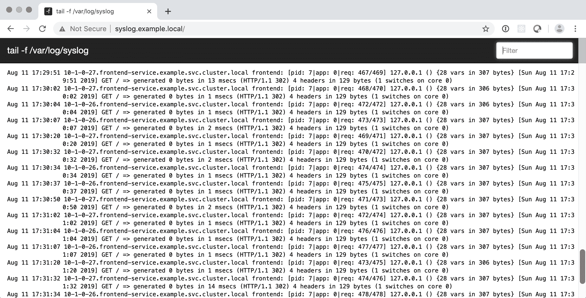
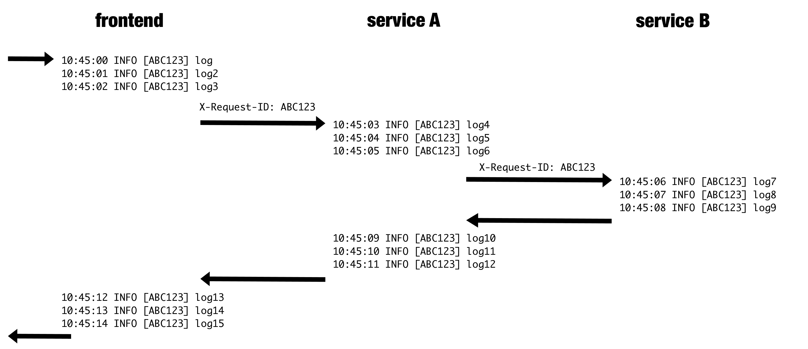
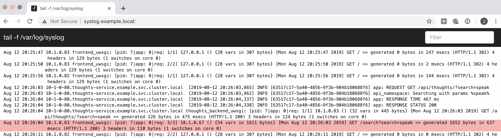
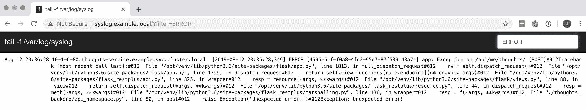
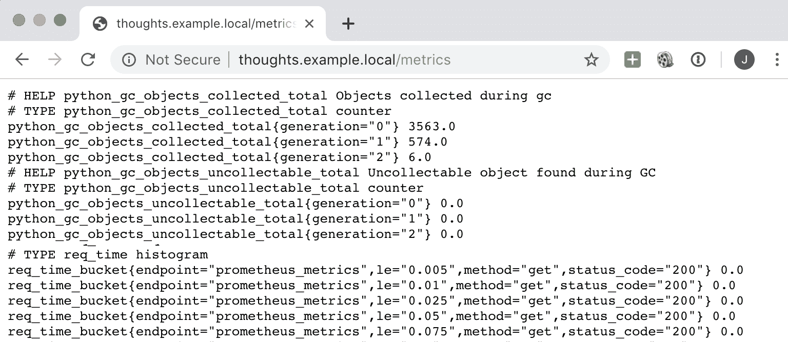
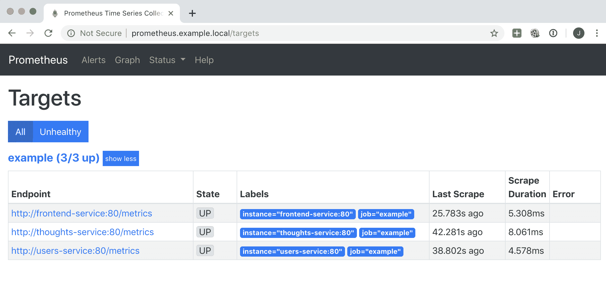

# 监控日志和指标

在实际操作中，快速检测和调试问题的能力至关重要。在本章中，我们将讨论两个最重要的工具，可以用来发现在处理大量请求的生产集群中发生了什么。第一个工具是日志，它帮助我们了解单个请求中发生了什么，而另一个工具是度量，它对系统的聚合性能进行分类。

本章将介绍以下主题：

*   活系统的可观测性
*   设置日志
*   通过日志检测问题
*   建立度量标准
*   积极主动

在本章结束时，您将了解如何添加日志，以便它们可用于检测问题，以及如何添加和绘制度量，并了解两者之间的差异。

# 技术要求

我们将在本章中使用示例系统，并对其进行调整，以包括集中式日志记录和度量。本章的代码可以在本书的 GitHub 存储库中找到：[https://github.com/PacktPublishing/Hands-On-Docker-for-Microservices-with-Python/tree/master/Chapter10](https://github.com/PacktPublishing/Hands-On-Docker-for-Microservices-with-Python/tree/master/Chapter10) 。

要安装群集，您需要构建每个单独的微服务：

```py
$ cd Chapter10/microservices/
$ cd frontend
$ docker-compose build
...
$ cd thoughts_backend
$ docker-compose build
...
$ cd users_backend
$ docker-compose build
...
```

The microservices in this chapter are the same ones that we introduced previously, but they add extra log and metrics configuration.

现在，我们需要创建示例名称空间，并使用`Chapter10/kubernetes`子目录中的`find`配置启动 Kubernetes 集群：

```py
$ cd Chapter10/kubernetes
$ kubectl create namespace example
$ kubectl apply --recursive -f .
...
```

为了能够访问不同的服务，您需要更新您的`/etc/hosts`文件，使其包含以下代码行：

```py
127.0.0.1 thoughts.example.local
127.0.0.1 users.example.local
127.0.0.1 frontend.example.local
127.0.0.1 syslog.example.local
127.0.0.1 prometheus.example.local
127.0.0.1 grafana.example.local
```

这样，您就可以访问本章的日志和指标。

# 活系统的可观测性

可观察性是指知道在一个活动系统中发生了什么的能力。我们可以处理低可观测性系统，我们无法知道发生了什么，或者处理高可观测性系统，我们可以通过工具从外部推断事件和内部状态。

可观测性是系统本身的特性。通常，监视是获取有关系统当前或过去状态的信息的操作。这是一个命名的争论，但是你监控系统来收集它的可观察部分。

在大多数情况下，监控很容易。有很多很棒的工具可以帮助我们捕获和分析信息，并以各种方式呈现信息。但是，系统需要公开相关信息以便收集。

公开正确数量的信息是困难的。太多的信息会产生大量噪声，从而隐藏相关信号。信息太少不足以检测问题。在本章中，我们将研究不同的策略来应对这一问题，但每个系统都必须自己探索和发现这一点。期待在您自己的系统中进行实验和更改！

分布式系统，例如遵循微服务体系结构的系统，也会出现问题，因为系统的复杂性会使理解其内部状态变得困难。在某些情况下，行为也可能是不可预测的。这种规模上的系统从本质上来说永远不会完全健康；总会有一些小问题。您需要制定一个优先系统，以确定哪些问题需要立即采取行动，哪些问题可以在稍后阶段解决。

用于观察微服务的主要工具是**日志**和**度量**。社区非常了解和使用它们，有很多工具可以极大地简化它们的使用，既可以作为本地安装的软件包，也可以作为有助于数据保留和降低维护成本的云服务。

Using cloud services for monitoring will save you from maintenance costs. We will talk about this later in the *Setting up logs* and *Setting up metrics* sections.

Another alternative when it comes to observability is services such as Data Dog ([https://www.datadoghq.com/](https://www.datadoghq.com/)) and New Relic ([https://newrelic.com/](https://newrelic.com/)). They receive events – normally logs – and are able to derive metrics from there.

集群状态的最重要细节可以通过`kubectl`进行检查，正如我们在前面的章节中所看到的。这将包括诸如已部署的版本、重新启动、拉取映像等详细信息。

For production environments, it may be good to deploy a web-based tool to display this kind of information. Check out Weave Scope, an open source tool that shows data in a web page similar to the one that can be obtained with `kubectl`, but in a nicer and more graphical way. You can find out more about this tool here: [https://www.weave.works/oss/scope/](https://www.weave.works/oss/scope/).

日志和度量有不同的目标，两者都可能是复杂的。我们将在本书中介绍它们的一些常见用法。

# 理解日志

日志跟踪系统中发生的唯一事件。每个日志存储一条消息，该消息在执行代码的特定部分时生成。日志可以是完全通用的（*函数 X 被称为*），也可以包含特定的细节（*函数 X 被参数 A*调用）。

日志最常见的格式是将它们生成为普通字符串。这是非常灵活的，通常与日志相关的工具用于文本搜索。

每个日志都包含一些元数据，这些元数据涉及谁生成了日志、创建日志的时间等。这也通常在日志的开头编码为文本。标准格式有助于排序和筛选。

日志还包括严重性级别。这允许进行分类，以便我们能够捕获消息的重要性。严重程度可按重要性顺序为`DEBUG`、`INFO`、`WARNING`或`ERROR`。这种严重性允许我们过滤掉不重要的日志，并确定我们应该采取的行动。可以将日志记录设施配置为设置阈值；不太严重的日志将被忽略。

There are many severity levels, and you can define custom intermediate levels if you wish. However, this isn't very useful except in very specific situations. Later in this chapter, in the *Detecting problems through logs* section, we will describe how to set a strategy per level; too many levels can add confusion.

在 web 服务环境中，大多数日志将作为 web 请求响应的一部分生成。这意味着一个请求将到达系统，被处理并返回一个值。沿途将生成多个日志。请记住，在负载下的系统中，多个请求将同时发生，因此来自多个请求的日志也将同时生成。例如，请注意第二个日志如何来自不同的 IP：

```py
Aug 15 00:15:15.100 10.1.0.90 INFO app: REQUEST GET /endpoint
Aug 15 00:15:15.153 10.1.0.92 INFO api: REQUEST GET /api/endpoint
Aug 15 00:15:15.175 10.1.0.90 INFO app: RESPONSE TIME 4 ms
Aug 15 00:15:15.210 10.1.0.90 INFO app: RESPONSE STATUS 200
```

可以将公共请求 ID 添加到为单个请求生成的所有相关日志的组中。我们将在本章后面看到如何做到这一点。

每个单独的日志都可能相对较大，并且总体上会占用大量磁盘空间。日志在负载下的系统中可能会快速增长，超出比例。不同的日志系统允许我们调整它们的保留时间，这意味着我们只保留它们一定的时间。在保存日志以查看过去发生的事情和使用合理的空间之间找到平衡是很重要的。

Be sure to check the retention policies when enabling any new log service, whether it be local or cloud-based. You won't be able to analyze what happened before the time window. Double-check that the progress rate is as expected – you don't want to find out that you went unexpectedly over quota while you were tracking a bug.

有些工具允许我们使用原始日志生成聚合结果。他们可以计算特定日志出现的次数，并生成每分钟的平均次数或其他统计信息。不过，这很昂贵，因为每个日志占用空间。为了观察这种聚合行为，最好使用特定的度量系统。

# 理解度量

度量标准处理聚合信息。它们显示的信息不是单个事件，而是一组事件。这使我们能够以比使用日志更好的方式检查集群的一般状态。

We will use typical examples related to web services, mainly dealing with requests metrics, but don't feel restricted by them. You can generate your own metrics that are specific to your service!

当日志保存关于每个单独事件的信息时，度量将信息减少到事件发生的次数，或将其减少到一个值，然后可以以某种方式进行平均或聚合。

这使得度量比日志更加轻量级，并允许我们根据时间绘制度量。度量提供信息，例如每分钟请求数、一分钟内请求的平均时间、排队请求数、每分钟错误数等。

The resolution of the metrics may depend on the tool that was used to aggregate them. Keep in mind that a higher resolution will require more resources. A typical resolution is 1 minute, which is small enough to present detailed information unless you have a very active system that receives 10 or more requests per second.

捕获和分析与性能相关的信息，例如平均请求时间，使我们能够检测可能的瓶颈并快速采取行动，以提高系统的性能。平均而言，这更容易处理，因为单个请求可能无法捕获足够的信息，我们无法看到全局。它还帮助我们预测未来的瓶颈。

根据所使用的工具，有许多不同类型的度量标准。最常用的支持方法如下：

*   **计数器**：每次发生事件都会生成一个触发器。这将被计算和汇总。这方面的一个例子是请求数和错误数。
*   **仪表**：唯一的单个数字。它可以向上或向下移动，但最后一个值会覆盖上一个值。例如，队列中的请求数和可用工作线程数。
*   **度量**：具有与之相关联的数字的事件。这些数字可以以某种方式进行平均、求和或聚合。与量规相比，区别在于之前的测量仍然是独立的；例如，当我们以毫秒为单位请求时间，以字节为单位请求大小时。度量也可以用作计数器，因为它们的数量可能很重要；例如，跟踪请求时间还统计请求数。

度量标准的工作方式主要有两种：

*   每次发生事件时，一个事件被*推向*度量收集器。
*   每个系统维护自己的度量，然后定期从度量系统中*提取*。

每种方法都有其优缺点。推送事件会产生更高的流量，因为每个事件都需要发送；这可能导致瓶颈和延迟。拉取事件只会对信息进行采样，并且会错过样本之间发生的事情，但它本身就具有更高的可伸缩性。

While both approaches are used, the trend is moving toward pulling systems for metrics. They reduce the maintenance that's required for pushing systems and are much more easier to scale.

我们将建立普罗米修斯，它使用第二种方法。第一种方法中使用最多的指数是石墨。

还可以组合度量以生成其他度量；例如，我们可以将返回错误的请求数除以生成错误请求的请求总数。这些衍生指标可以帮助我们以有意义的方式呈现信息。

可以在仪表板中显示多个指标，以便我们了解服务或集群的状态。一目了然，这些图形工具使我们能够检测系统的一般状态。我们将设置 Grafana，使其显示图形信息：


与日志相比，度量占用的空间要小得多，并且可以捕获更大的时间窗口。甚至可以保留系统生命周期的指标。这与日志不同，日志永远无法存储那么长时间。

# 设置日志

我们将把系统生成的所有日志集中到一个 pod 中。在本地开发中，该 pod 将通过 web 界面公开所有接收到的日志。

日志将通过`syslog`协议发送，这是传输日志的最标准方式。Python 以及几乎所有处理日志记录并支持 Unix 的系统中都有对`syslog`的本机支持。

Using a single container makes it easy to aggregate logs. In production, this system should be replaced with a container that relays the received logs to a cloud service such as Loggly or Splunk.

有多个`syslog`服务器能够接收日志并聚合日志；`syslog-ng`（[https://www.syslog-ng.com/](https://www.syslog-ng.com/) 和`rsyslog`（[https://www.rsyslog.com/](https://www.rsyslog.com/) 是最常见的。最简单的方法是接收日志并将其存储在文件中。让我们用`rsyslog`服务器启动一个容器，它将存储接收到的日志。

# 设置 rsyslog 容器

在本节中，我们将创建自己的`rsyslog`服务器。这是一个非常简单的容器，您可以在 GitHub 上查看`docker-compose`和`Dockerfile`以了解有关日志的更多信息（[https://github.com/PacktPublishing/Hands-On-Docker-for-Microservices-with-Python/tree/master/Chapter10/kubernetes/logs](https://github.com/PacktPublishing/Hands-On-Docker-for-Microservices-with-Python/tree/master/Chapter10/kubernetes/logs) ）。

We will set up logs using the UDP protocol. This is the standard protocol for `syslog`, but it's less common than the usual HTTP over TCP that's used for web development.

The main difference is that UDP is connectionless, so the log is sent and no confirmation that it has been delivered is received. This makes UDP lighter and faster, but also less reliable. If there's a problem in the network, some logs may disappear without warning.

This is normally an adequate trade-off since the number of logs is high and the implications of losing a few isn't big. `syslog` can also work over TCP, thus increasing reliability but also reducing the performance of the system.

Dockerfile 安装`rsyslog`并复制其配置文件：

```py
FROM alpine:3.9

RUN apk add --update rsyslog

COPY rsyslog.conf /etc/rsyslog.d/rsyslog.conf
```

配置文件主要在`5140`端口启动服务器，并将接收到的文件存储在`/var/log/syslog`中：

```py
# Start a UDP listen port at 5140
module(load="imudp")
input(type="imudp" port="5140")
...
# Store the received files in /var/log/syslog, and enable rotation
$outchannel log_rotation,/var/log/syslog, 5000000,/bin/rm /var/log/syslog
```

对于日志旋转，我们在`/var/log/syslog`文件的一侧设置了一个限制，这样它就不会无限制地增长。

我们可以使用通常的`docker-compose`命令构建容器：

```py
$ docker-compose build
Building rsyslog
...
Successfully built 560bf048c48a
Successfully tagged rsyslog:latest
```

这将创建一个 pod、一个服务和一个入口的组合，就像我们对其他微服务所做的一样，以收集日志并允许从浏览器进行外部访问。

# 定义系统日志吊舱

`syslog`吊舱将包含`rsyslog`容器和另一个用于显示日志的容器。

为了显示日志，我们将使用 FrontRail，一个将日志文件流式传输到 web 服务器的应用程序。我们需要在同一个 pod 中跨两个容器共享文件，最简单的方法是通过卷。

我们使用一个部署来控制吊舱。您可以在[查看部署配置文件 https://github.com/PacktPublishing/Hands-On-Docker-for-Microservices-with-Python/blob/master/Chapter10/kubernetes/logs/deployment.yaml](https://github.com/PacktPublishing/Hands-On-Docker-for-Microservices-with-Python/blob/master/Chapter10/kubernetes/logs/deployment.yaml) 。让我们来看看下面章节中最有趣的部分。

# 原木体积

`log-volume`创建跨两个容器共享的空目录：

```py
  volumes:
  - emptyDir: {}
    name: log-volume
```

这允许容器在将信息存储在文件中的同时进行通信。`syslog`容器将向其写入，而前导轨将从中读取。

# 系统日志容器

`syslog`容器启动`rsyslogd`过程：

```py
spec:
  containers:
  - name: syslog
    command:
      - rsyslogd
      - -n
      - -f
      - /etc/rsyslog.d/rsyslog.conf
    image: rsyslog:latest
    imagePullPolicy: Never
    ports:
      - containerPort: 5140
        protocol: UDP
    volumeMounts:
      - mountPath: /var/log
        name: log-volume
```

`rsyslogd -n -f /etc/rsyslog.d/rsyslog.conf`命令使用前面描述的配置文件启动服务器。`-n`参数将进程保持在前台，从而保持容器运行。

已指定 UDP 端口`5140`，该端口是已定义的用于接收日志的端口，并且`log-volume`已安装到`/var/log`。稍后在文件中，将定义`log-volume`。

# 前纵梁集装箱

前纵梁集装箱从官方集装箱图像开始：

```py
  - name: frontrail
    args:
    - --ui-highlight
    - /var/log/syslog
    - -n
    - "1000"
    image: mthenw/frontail:4.6.0
    imagePullPolicy: Always
    ports:
    - containerPort: 9001
      protocol: TCP
    resources: {}
    volumeMounts:
    - mountPath: /var/log
      name: log-volume
```

我们用`frontrail /var/log/syslog`命令启动它，指定端口`9001`（我们用来访问`frontrail`的端口），然后挂载`/var/log`，就像我们对`syslog`容器所做的一样，以共享日志文件。

# 允许外部访问

和其他微服务一样，我们将创建一个服务和入口。该服务将被其他微服务使用，以便它们可以发送日志。入口将用于访问 web 界面，以便我们可以在日志到达时查看日志。

YAML 文件位于 GitHub（[上）https://github.com/PacktPublishing/Hands-On-Docker-for-Microservices-with-Python/tree/master/Chapter10/kubernetes/logs `service.yaml`和`ingress.yaml`文件中的](https://github.com/PacktPublishing/Hands-On-Docker-for-Microservices-with-Python/tree/master/Chapter10/kubernetes/logs)。

服务很直接,；唯一的特点是它有两个端口—一个 TCP 端口和一个 UDP 端口—并且每个端口都连接到不同的容器：

```py
spec:
  ports:
  - name: fronttail
    port: 9001
    protocol: TCP
    targetPort: 9001
  - name: syslog
    port: 5140
    protocol: UDP
    targetPort: 5140
```

入口仅暴露前导轨端口，这意味着我们可以通过浏览器访问它。请记住，DNS 需要添加到您的`/etc/host`文件中，如本章开头所述：

```py
apiVersion: extensions/v1beta1
kind: Ingress
metadata:
  name: syslog-ingress
  namespace: example
spec:
  rules:
  - host: syslog.example.local
    http:
      paths:
      - backend:
          serviceName: syslog
          servicePort: 9001
        path: /
```

进入浏览器中的`http://syslog.example.local`将允许您访问前导轨界面：



您可以使用右上角的框过滤日志。

Remember that, most of the time, logs reflect the readiness and liveness probes, as shown in the preceding screenshot. The more health checks you have in your system, the more noise you'll get.

You can filter them out at the `syslog` level by configuring the `rsyslog.conf` file, but be careful not to leave out any relevant information.

现在，我们需要看看其他微服务是如何配置和发送日志的。

# 发送日志

我们需要在 uWSGI 中配置微服务，以便将日志转发到日志服务。我们将以 Thinks 后端为例，即使在`Chapter10/microservices`目录下的前端和用户后端也启用了此配置。

打开`uwsgi.ini`配置文件（[https://github.com/PacktPublishing/Hands-On-Docker-for-Microservices-with-Python/blob/master/Chapter10/microservices/thoughts_backend/docker/app/uwsgi.ini](https://github.com/PacktPublishing/Hands-On-Docker-for-Microservices-with-Python/blob/master/Chapter10/microservices/thoughts_backend/docker/app/uwsgi.ini) 。您将看到以下行：

```py
# Log to the logger container
logger = rsyslog:syslog:5140,thoughts_backend
```

这将以`rsyslog`格式向端口`5140`处的`syslog`服务发送日志。我们还添加了*设施*，这就是日志的来源。这会将字符串添加到来自此服务的所有日志中，这有助于排序和筛选。每个`uwsgi.ini`文件都应该有自己的工具来帮助过滤。

In old systems that support the `syslog` protocol, the facility needs to fit predetermined values such as `KERN`, `LOCAL_7`, and more. But in most modern systems, this is an arbitrary string that can take any value.

uWSGI 的自动日志很有趣，但我们还需要设置自己的日志进行自定义跟踪。让我们看看如何。

# 生成应用程序日志

Flask 自动为应用程序配置记录器。我们需要按以下方式添加日志，如`api_namespace.py`文件（[所示 https://github.com/PacktPublishing/Hands-On-Docker-for-Microservices-with-Python/blob/master/Chapter10/microservices/thoughts_backend/ThoughtsBackend/thoughts_backend/api_namespace.py#L102](https://github.com/PacktPublishing/Hands-On-Docker-for-Microservices-with-Python/blob/master/Chapter10/microservices/thoughts_backend/ThoughtsBackend/thoughts_backend/api_namespace.py#L102) ：

```py
from flask import current_app as app

...
if search_param:
    param = f'%{search_param}%'
    app.logger.info(f'Searching with params {param}')
    query = (query.filter(ThoughtModel.text.ilike(param)))
```

`app.logger`可以调用`.debug`、`.info`、`.warning`或`.error`生成日志。注意，`app`可以通过导入`current_app`进行检索。

记录器遵循 Python 中的标准`logging`模块。它可以以不同的方式进行配置。看一看`app.py`文件（[https://github.com/PacktPublishing/Hands-On-Docker-for-Microservices-with-Python/blob/master/Chapter10/microservices/thoughts_backend/ThoughtsBackend/thoughts_backend/app.py](https://github.com/PacktPublishing/Hands-On-Docker-for-Microservices-with-Python/blob/master/Chapter10/microservices/thoughts_backend/ThoughtsBackend/thoughts_backend/app.py) ）要查看不同的配置，我们将在以下小节中介绍。

# 字典配置

日志记录的第一级通过默认的`dictConfig`变量。该变量由 Flask 自动定义，并允许我们按照 Python 文档（[中定义的方式配置日志 https://docs.python.org/3.7/library/logging.config.html](https://docs.python.org/3.7/library/logging.config.html) ）。您可以在`app.py`文件中查看日志的定义：

```py
from logging.config import dictConfig

dictConfig({
    'version': 1,
    'formatters': {
        'default': {
            'format': '[%(asctime)s] %(levelname)s in 
                        %(module)s: %(message)s',
        }
    },
    'handlers': {
        'wsgi': {
            'class': 'logging.StreamHandler',
            'stream': 'ext://flask.logging.wsgi_errors_stream',
            'formatter': 'default'
        }
    },
    'root': {
        'level': 'INFO',
        'handlers': ['wsgi']
    }
})
```

`dictConfig`字典有三个主要级别：

*   `formatters`：检查日志的格式。要定义格式，可以使用 Python 文档（[中提供的自动值 https://docs.python.org/3/library/logging.html#logrecord-属性](https://docs.python.org/3/library/logging.html#logrecord-attributes)。这将收集每个日志的信息。
*   `handlers`：检查日志的去向。您可以为记录器分配一个或多个。我们定义了一个名为`wsgi`的处理程序，并对其进行了配置，使其向上，朝向 uWSGI。
*   `root`：这是日志的最高级别，因此以前未记录的任何内容都将引用此级别。我们在这里配置`INFO`日志记录级别。

这将设置默认配置，以便我们不会丢失任何日志。但是，我们可以创建更复杂的日志处理程序。

# 记录请求 ID

分析大量日志时的问题之一是将它们关联起来。我们需要看看哪些是相互关联的。一种可能是通过生成日志的 pod 过滤日志，该 pod 存储在日志的开头（例如，`10-1-0-27.frontend-service.example.svc.cluster.local`。这类似于生成日志的主机。但是，这个过程很麻烦，在某些情况下，单个容器可以同时处理两个请求。我们需要为每个请求添加一个唯一的标识符，该标识符被添加到单个请求的所有日志中。

为此，我们将使用`flask-request-id-header`包（[https://pypi.org/project/flask-request-id-header/](https://pypi.org/project/flask-request-id-header/) ）。这将添加一个`X-Request-ID`头（如果不存在），我们可以使用它记录每个请求。

Why do we set up a header instead of storing a randomly generated value in memory for the request? This is a common pattern that allows us to inject the request ID into the backend. The request ID allows us to carry over the same request identifier through the life cycle of a request for different microservices. For example, we can generate it on the Frontend and pass it over to the Thoughts Backend so that we can trace several internal requests that have the same origin.

Although we won't be including this in our example for simplicity, as a microservices system grows, this becomes crucial for determining flows and origins. Generating a module so that we can automatically pass it over internal calls is a good investment.

下图显示了一个**前端**和两个服务之间的流程。请注意，**前端**服务到达后，`X-Request-ID`报头未设置，需要转发到任何呼叫：



我们还需要将日志直接发送到`syslog`服务，以便我们可以创建一个处理程序来为我们执行此操作。

当从脚本执行代码时，与在 web 服务器中运行代码相比，我们不使用此处理程序。直接运行脚本时，我们希望日志转到前面定义的默认记录器。在`create_app`中，我们将设置一个参数来区分它们。

The Python logging module has a lot of interesting features. Check out the Python documentation for more information ([https://docs.python.org/3/library/logging.html](https://docs.python.org/3/library/logging.html)).

Setting logs properly is trickier than it looks. Don't be discouraged and keep tweaking them until they work.

我们将在`app.py`文件中设置所有日志配置。让我们对配置的每个部分进行分解：

1.  首先，我们将生成一个附加了`request_id`的格式化程序，以便它在生成日志时可用：

```py
class RequestFormatter(logging.Formatter):
    ''' Inject the HTTP_X_REQUEST_ID to format logs '''

    def format(self, record):
        record.request_id = 'NA'

        if has_request_context():
            record.request_id = request.environ.get("HTTP_X_REQUEST_ID")

        return super().format(record)
```

如您所见，`HTTP_X_REQUEST_ID`头在`request.environ`变量中可用。

2.  稍后，在`create_app`中，我们将设置附加到`application`记录器的处理程序：

```py
# Enable RequestId
application.config['REQUEST_ID_UNIQUE_VALUE_PREFIX'] = ''
RequestID(application)

if not script:
    # For scripts, it should not connect to Syslog
    handler = logging.handlers.SysLogHandler(('syslog', 5140))
    req_format = ('[%(asctime)s] %(levelname)s [%(request_id)s] '
                    %(module)s: %(message)s')
    handler.setFormatter(RequestFormatter(req_format))
    handler.setLevel(logging.INFO)
    application.logger.addHandler(handler)
    # Do not propagate to avoid log duplication
    application.logger.propagate = False
```

我们只在运行脚本时设置处理程序。`SysLogHandler`包含在 Python 中。在此之后，我们设置了格式，其中包括`request_id`。格式化程序使用我们前面定义的`RequestFormatter`。

Here, we are hardcoding the values of the logger level to `INFO` and the `syslog` host to `syslog`, which corresponds to the service. Kubernetes will resolve this DNS correctly. Both values can be passed through environment variables, but we didn't do this here for the sake of simplicity.

记录器尚未传播，因此请避免将其发送到会复制日志的`root`记录器。

# 记录每个请求

每个请求中都有我们需要捕获的公共元素。Flask 允许我们在请求前后执行代码，因此我们可以使用它来记录每个请求的公共元素。让我们学习如何做到这一点。

从`app.py`文件中，我们将定义`logging_before`函数：

```py
from flask import current_app, g

def logging_before():
    msg = 'REQUEST {REQUEST_METHOD} {REQUEST_URI}'.format(**request.environ)
    current_app.logger.info(msg)

    # Store the start time for the request
    g.start_time = time()
```

这将创建一个带有单词`REQUEST`的日志，以及每个请求的两个基本部分——方法和 URI，它们来自`request.environ`。然后，它们被添加到应用程序记录器的`INFO`日志中。

我们还使用`g`对象来存储请求启动的时间。

The `g` object allows us to store values through a request. We will use it to calculate the time the request is going to take.

还有相应的`logging_after`函数。它收集请求结束时的时间，并以毫秒为单位计算差值：

```py
def logging_after(response):
    # Get total time in milliseconds
    total_time = time() - g.start_time
    time_in_ms = int(total_time * 1000)
    msg = f'RESPONSE TIME {time_in_ms} ms'
    current_app.logger.info(msg)

    msg = f'RESPONSE STATUS {response.status_code.value}'
    current_app.logger.info(msg)

    # Store metrics
    ...

    return response
```

这将允许我们检测需要更长时间并将存储在度量中的请求，我们将在下一节中看到。

然后，在`create_app`功能中启用这些功能：

```py
def create_app(script=False):
    ...
    application = Flask(__name__)
    application.before_request(logging_before)
    application.after_request(logging_after)
```

这将在每次生成请求时创建一组日志。

生成日志后，我们可以在`frontrail`界面中进行搜索。

# 搜索所有日志

来自不同应用程序的所有不同日志将被集中并可在`http://syslog.example.local`处搜索。

如果您致电`http://frontend.example.local/search?search=speak`搜索想法，您会在日志中看到相应的想法后端，如下图所示：



我们可以根据请求 ID 进行过滤，即`63517c17-5a40-4856-9f3b-904b180688f6`，以获取后端请求日志。紧接着就是`thoughts_backend_uwsgi`和`frontend_uwsgi`请求日志，它们显示了请求的流程。

在这里，您可以看到我们前面提到的所有元素：

*   请求前的`REQUEST`日志
*   `api_namespace`请求，包含应用程序数据
*   后`RESPONSE`日志，包含结果和时间

在 Thinks 后端的代码中，我们故意留下了一个错误。如果用户试图分享一个新的想法，它将被触发。我们将使用它来学习如何通过日志调试问题。

# 通过日志检测问题

对于运行系统中的任何问题，都可能发生两种错误：预期错误和意外错误。

# 检测预期错误

预期错误是通过在代码中显式创建`ERROR`日志而引发的错误。如果正在生成错误日志，这意味着它反映了事先计划好的情况；例如，您无法连接到数据库，或者某些数据以旧的、不推荐的格式存储。我们不希望这种情况发生，但我们看到了发生这种情况的可能性，并准备了处理这种情况的代码。他们通常能很好地描述情况，使问题显而易见，即使解决方案不是这样。

它们相对容易处理，因为它们描述了可预见的问题。

# 捕获意外错误

意外错误是可能发生的其他类型的错误。事情发生了意想不到的变化。意外错误通常是由 Python 异常在代码中的某个点引发而未被捕获而产生的。

如果日志记录已正确配置，任何未捕获的异常或错误都将触发一个`ERROR`日志，其中包括堆栈跟踪。这些错误可能不会立即显现，需要进一步调查。

To help explain these errors, we introduced an exception in the code for the Thoughts Backend in the `Chapter10` code. You can check the code on GitHub ([https://github.com/PacktPublishing/Hands-On-Docker-for-Microservices-with-Python/tree/master/Chapter10/microservices/thoughts_backend/ThoughtsBackend/thoughts_backend](https://github.com/PacktPublishing/Hands-On-Docker-for-Microservices-with-Python/tree/master/Chapter10/microservices/thoughts_backend/ThoughtsBackend/thoughts_backend)). This simulates an unexpected exception.

在尝试为登录用户发布新想法时，我们发现一个奇怪的行为，并在日志中看到以下错误。如下面截图右上角所示，我们正在通过`ERROR`过滤问题：



如您所见，堆栈跟踪显示在一行中。这可能取决于您捕获和显示日志的方式。Flask 将自动生成状态代码为 500 的 HTTP 响应。如果调用者没有准备好接收 500 响应，这可能会在路径上触发更多错误。

然后，堆栈跟踪将让您知道发生了什么。在本例中，我们可以看到在第 80 行的`api_namespace.py`文件中有一个`raise Exception`命令。这允许我们定位异常。

Since this is a synthetic error that's been generated specifically as an example, it is actually easy to find out the root cause. In the example code, we are explicitly raising an exception, which produces an error. This may not be the case in a real use case, where the exception could be generated in a different place than the actual error. Exceptions can be also originated in a different microservice within the same cluster.

在检测到错误之后，目标应该是在微服务中通过单元测试来复制它，以便生成异常。这将允许我们在受控环境中复制条件。

如果我们对`Chapter10`中可用的 Thinks 后端代码运行测试，我们将看到由此产生的错误。请注意，日志显示在失败的测试中：

```py
$ docker-compose run test
...
___ ERROR at setup of test_get_non_existing_thought ___
-------- Captured log setup ---------
INFO flask.app:app.py:46 REQUEST POST /api/me/thoughts/
INFO flask.app:token_validation.py:66 Header successfully validated
ERROR flask.app:app.py:1761 Exception on /api/me/thoughts/ [POST]
Traceback (most recent call last):
 File "/opt/venv/lib/python3.6/site-packages/flask/app.py", line 1813, in full_dispatch_request
 rv = self.dispatch_request()
 File "/opt/venv/lib/python3.6/site-packages/flask/app.py", line 1799, in dispatch_request
 return self.view_functions[rule.endpoint](**req.view_args)
 File "/opt/venv/lib/python3.6/site-packages/flask_restplus/api.py", line 325, in wrapper
 resp = resource(*args, **kwargs)
 File "/opt/venv/lib/python3.6/site-packages/flask/views.py", line 88, in view
 return self.dispatch_request(*args, **kwargs)
 File "/opt/venv/lib/python3.6/site-packages/flask_restplus/resource.py", line 44, in dispatch_request
 resp = meth(*args, **kwargs)
 File "/opt/venv/lib/python3.6/site-packages/flask_restplus/marshalling.py", line 136, in wrapper
 resp = f(*args, **kwargs)
 File "/opt/code/thoughts_backend/api_namespace.py", line 80, in post
 raise Exception('Unexpected error!')
Exception: Unexpected error!
INFO flask.app:app.py:57 RESPONSE TIME 3 ms
INFO flask.app:app.py:60 RESPONSE STATUS 500 
```

一旦错误在单元测试中重现，修复它通常是微不足道的。添加单元测试以捕获触发错误的条件集，然后修复它。新的单元测试将检测每个自动构建是否重新引入了错误。

To fix the example code, remove the `raise` line of code. Then, things will work again.

有时，问题无法解决，因为它可能是外部的。可能数据库中的某些行有问题，或者另一个服务返回的数据格式不正确。在这些情况下，我们无法完全避免错误的根本原因。但是，可以捕获问题，进行一些修正，并从意外错误转移到预期错误。

请注意，并非每一个检测到的意外错误都值得花费时间。有时，未捕获的错误提供了关于问题所在的足够信息，这超出了 web 服务应该处理的范围；例如，可能存在网络问题，web 服务无法连接到数据库。当你想花时间在发展上时，运用你的判断力。

# 日志策略

当我们处理日志时会出现问题。特定消息的适当级别是多少？这是`WARNING`还是`ERROR`？这应该是一个`INFO`声明吗？

大多数日志级别的描述都使用诸如*程序显示潜在有害情况*或*程序突出显示请求*的进度等定义。这些是模糊的，在现实生活中不是很有用。相反，尝试通过将日志级别与预期的后续操作关联来定义每个日志级别。这有助于明确在找到特定级别的日志时要做什么。

下表显示了不同级别的一些示例以及应采取的措施：

| **日志级别** | **采取的行动** | **评论** |
| `DEBUG` | 没有什么 | 没有跟踪。 |
| `INFO` | 没有什么 | `INFO`日志显示有关请求流的一般信息，以帮助跟踪问题。 |
| `WARNING` | 音轨号码。提高警戒级别。 | `WARNING`日志跟踪已自动修复的错误，例如重试连接（但最终连接）或数据库数据中可修复的格式错误。突然增加可能需要调查。 |
| `ERROR` | 音轨号码。提高警戒级别。全部复习。 | `ERROR`日志跟踪无法修复的错误。突然增加可能需要立即采取行动，以便对此进行补救。 |
| `CRITICAL` | 立即响应。 | `CRITICAL`日志表示系统发生灾难性故障。即使是一个也会表明系统不工作，无法恢复。 |

这只是一项建议，但它对如何应对提出了明确的期望。根据您的团队和预期服务水平的工作方式，您可以根据您的用例调整它们。

在这里，层次结构非常清晰，可以接受将生成一定数量的`ERROR`日志。并非所有问题都需要立即解决，但它们应该被记录和审查。

In real life, `ERROR` logs will be typically categorized as "we're doomed" or "meh." Development teams should actively either fix or remove "mehs" to reduce them as much as possible. That may include lowering the level of logs if they aren't covering actual errors. You want as few `ERROR` logs as possible, but all of them need to be meaningful.

Be pragmatic, though. Sometimes, errors can't be fixed straight away and time is best utilized in other tasks. However, teams should reserve time to reduce the number of errors that occur. Failing to do so will compromise the reliability of the system in the medium term.

`WARNING`日志表明，有些事情可能没有我们预期的那么顺利，但除非数字增加，否则没有必要恐慌。`INFO`只是在出现问题时为我们提供上下文，但在其他情况下应被忽略。

Avoid the temptation to produce an `ERROR` log when there's a request returning a 400 BAD REQUEST status code. Some developers will argue that if the customer sent a malformed request, it is actually an error. But this isn't something that you should care about if the request has been properly detected and returned. This is business as usual. If this behavior can lead to indicate something else, such as repeated attempts to send incorrect passwords, you can set a `WARNING` log. There's no point in generating `ERROR` logs when your system is behaving as expected.

As a rule of thumb, if a request is not returning some sort of 500 error (500, 502, 504, and so on), it should not generate an `ERROR` log. Remember the categorization of 400 errors as *you (customer) have a problem* versus 500 errors, which are categorized as *I have a problem*.

This is not absolute, though. For example, a spike in authentication errors that are normally 4XX errors may indicate that users cannot create logs due to a real internal problem.

记住这些定义，您的开发和运营团队将有一个共同的理解，这将帮助他们采取有意义的行动。

随着系统的成熟，您可能需要调整系统并更改一些日志级别。

# 在开发时添加日志

正如我们已经看到的，正确配置`pytest`将使测试中的任何错误显示捕获的日志。

这是一个检查在开发功能时是否生成了预期日志的机会。任何检查错误条件的测试都应该添加相应的日志，并检查它们是否在功能开发期间生成。

You can check the logs as part of testing with a tool such as `pytest-catchlog` ([https://pypi.org/project/pytest-catchlog/](https://pypi.org/project/pytest-catchlog/)) to enforce that the proper logs are being produced.

Typically, though, just taking a bit of care and checking during development that logs are produced is enough for most cases. However, be sure that developers understand why it's useful to have logs while they're developing.

在开发过程中，`DEBUG`日志可以用来显示关于流程的额外信息，这些信息对于生产来说太多了。这可以填补`INFO`日志之间的空白，帮助我们养成添加日志的习惯。如果在测试期间发现`DEBUG`日志有助于跟踪生产中的问题，则可以将其升级为`INFO`。

在受控情况下，`DEBUG`日志可能会在生产中启用，以跟踪一些困难的问题，但要注意拥有大量日志的含义。

Be sensible with the information that's presented in `INFO` logs. In terms of the information that's displayed, avoid sensible data such as passwords, secret keys, credit card numbers, or personal information. This is the same for the number of logs.

Keep an eye on any size limitations and how quickly logs are being generated. Growing systems may have a log explosion while new features are being added, more requests are flowing through the system, and new workers are being added.

此外，请仔细检查日志是否正确生成和捕获，以及它们是否在所有不同级别和环境下工作。所有这些配置可能需要一点时间，但您需要非常确保能够捕获生产中的意外错误，并且所有管道都设置正确。

让我们来看看另一个关键元素在可观察性：度量。

# 建立度量标准

为了与普罗米修斯建立度量标准，我们需要了解该过程是如何工作的。它的关键组成部分是，每个被度量的服务都有自己的 Prometheus 客户端，它跟踪度量。Prometheus 服务器中的数据将可用于 Grafana 服务，该服务将绘制度量。

下图显示了总体架构：


普罗米修斯服务器定期提取信息。这种操作方法非常轻量级，因为注册度量只会更新服务的本地内存，并且可以很好地扩展。另一方面，它显示特定时间的采样数据，不记录每个单独的事件。这在存储和表示数据方面具有一定的含义，并对数据的分辨率施加了限制，特别是对于非常低的速率。

There are lots of available metrics exporters that will expose standard metrics in different systems, such as databases, hardware, HTTP servers, or storage. Check out the Prometheus documentation for more information: [https://prometheus.io/docs/instrumenting/exporters/](https://prometheus.io/docs/instrumenting/exporters/).

这意味着我们的每个服务都需要安装一个 Prometheus 客户端，并以某种方式公开其收集的度量。我们将为 Flask 和 Django 使用标准客户端。

# 为后端定义度量

对于烧瓶应用，我们将使用`prometheus-flask-exporter`包（[https://github.com/rycus86/prometheus_flask_exporter](https://github.com/rycus86/prometheus_flask_exporter) ），已添加到`requirements.txt`中。

它在`app.py`文件（[中被激活 https://github.com/PacktPublishing/Hands-On-Docker-for-Microservices-with-Python/blob/master/Chapter10/microservices/thoughts_backend/ThoughtsBackend/thoughts_backend/app.py#L95](https://github.com/PacktPublishing/Hands-On-Docker-for-Microservices-with-Python/blob/master/Chapter10/microservices/thoughts_backend/ThoughtsBackend/thoughts_backend/app.py#L95) 创建应用程序时。

`metrics`对象在没有 app 的情况下设置，然后在`created_app`函数中实例化：

```py
from prometheus_flask_exporter import PrometheusMetrics

metrics = PrometheusMetrics(app=None)

def create_app(script=False):
    ...
    # Initialise metrics
    metrics.init_app(application)
```

这将在`/metrics`服务端点中生成一个端点，即`http://thoughts.example.local/metrics`，该端点以普罗米修斯格式返回数据。普罗米修斯格式为纯文本，如以下屏幕截图所示：



`prometheus-flask-exporter`捕获的默认指标是基于端点和方法（`flask_http_request_total`的请求调用，以及它们花费的时间（`flask_http_request_duration_seconds`）。

# 添加自定义指标

当涉及到应用程序详细信息时，我们可能希望添加更具体的指标。我们还在请求的末尾添加了一些额外的代码，这样我们就可以存储类似于`prometheus-flask-exporter`所允许的度量的信息。

特别是，我们在`logging_after`函数（[中添加了此代码 https://github.com/PacktPublishing/Hands-On-Docker-for-Microservices-with-Python/blob/master/Chapter10/microservices/thoughts_backend/ThoughtsBackend/thoughts_backend/app.py#L72](https://github.com/PacktPublishing/Hands-On-Docker-for-Microservices-with-Python/blob/master/Chapter10/microservices/thoughts_backend/ThoughtsBackend/thoughts_backend/app.py#L72) 使用较低级别`prometheus_client`。

此代码创建`Counter`和`Histogram`：

```py
from prometheus_client import Histogram, Counter

METRIC_REQUESTS = Counter('requests', 'Requests',
                          ['endpoint', 'method', 'status_code'])
METRIC_REQ_TIME = Histogram('req_time', 'Req time in ms',
                            ['endpoint', 'method', 'status_code']) 

def logging_after(response):
    ...
    # Store metrics
    endpoint = request.endpoint
    method = request.method.lower()
    status_code = response.status_code
    METRIC_REQUESTS.labels(endpoint, method, status_code).inc()
    METRIC_REQ_TIME.labels(endpoint, method, status_code).observe(time_in_ms)
```

在这里，我们创建了两个度量：一个名为`requests`的计数器和一个名为`req_time`的直方图。直方图是具有特定值的度量和事件的 Prometheus 实现，例如请求时间（在我们的例子中）。

The histogram stores the values in buckets, thereby making it possible for us to calculate quantiles. Quantiles are very useful to determine metrics such as the 95% value for times, such as the aggregate time, where 95% comes lower than it. This is much more useful than averages since outliers won't pull from the average.

There's another similar metric called summary. The differences are subtle, but generally, the metric we should use is a histogram. Check out the Prometheus documentation for more details ([https://prometheus.io/docs/practices/histograms/](https://prometheus.io/docs/practices/histograms/)).

在`METRIC_REQUESTS`和`METRIC_REQ_TIME`中，通过名称、度量和定义的标签定义了度量。每个标签都是度量的一个额外维度，因此您可以根据它们进行过滤和聚合。在这里，我们定义端点、HTTP 方法和生成的 HTTP 状态代码。

对于每个请求，将更新度量。我们需要设置标签，计数器调用，即`.inc()`，直方图调用，即`.observe(time)`。

You can find the documentation for the Prometheus client at [https://github.com/prometheus/client_python](https://github.com/prometheus/client_python).

我们可以在 metrics 页面上看到`request`和`req_time`指标。

**Setting up metrics for the Users Backend follows a similar pattern.** The Users Backend is a similar Flask application, so we install `prometheus-flask-exporter` as well, but no custom metrics. You can access these metrics at `http://users.example.local/metrics`.

下一步是建立一个 Prometheus 服务器，这样我们就可以收集度量并正确地聚合它们。

# 收集指标

为此，我们需要使用 Kubernetes 部署度量。我们准备了一个 YAML 文件，所有设置都已经在`Chapter10/kubernetes/prometheus.yaml`文件中设置好了。

此 YAML 文件包含部署、`ConfigMap`，其中包含配置文件、服务和入口。服务和入口是相当标准的，所以我们不会在这里评论它们。

`ConfigMap`允许我们定义一个文件：

```py
apiVersion: v1
kind: ConfigMap
metadata:
  name: prometheus-config
  namespace: example
data:
  prometheus.yaml: |
    scrape_configs:
    - job_name: 'example'

      static_configs:
        - targets: ['thoughts-service', 'users-service', 
                    'frontend-service']
```

注意`prometheus.yaml`文件是如何在`|`符号之后生成的。这是从`thoughts-service`、`users-service`和`frontend-service`服务器中删除的最小普罗米修斯配置。从前面的章节中我们知道，这些名称访问服务，并将连接到为应用程序提供服务的 POD。他们将自动搜索`/metrics`路径。

There is a small caveat here. From the point of view of Prometheus, everything behind the service is the same server. If you have more than one pod being served, the metrics that are being accessed by Prometheus will be load balanced and the metrics won't be correct.

This is fixable with a more complicated Prometheus setup whereby we install the Prometheus operator, but this is out of the scope of this book. However, this is highly recommended for a production system. In essence, it allows us to annotate each of the different deployments so that the Prometheus configuration is dynamically changed. This means we can access all the metrics endpoints exposed by the pods automatically once this has been set up. Prometheus Operator annotations make it very easy for us to add new elements to the metrics system.

Check out the following article if you want to learn how to do this: [https://sysdig.com/blog/kubernetes-monitoring-prometheus-operator-part3](https://sysdig.com/blog/kubernetes-monitoring-prometheus-operator-part3).

部署从`prom/prometheus`中的公共普罗米修斯图像创建一个容器，如下代码所示：

```py
spec:
  containers:
  - name: prometheus
    image: prom/prometheus
    volumeMounts:
    - mountPath: /etc/prometheus/prometheus.yml
      subPath: prometheus.yaml
      name: volume-config
    ports:
    - containerPort: 9090
    volumes:
    - name: volume-config
      configMap:
        name: prometheus-config
```

它还将`ConfigMap`作为卷装入，然后作为文件装入`/etc/prometheus/prometheus.yml`。这将使用该配置启动 Prometheus 服务器。容器打开端口`9090`，这是普罗米修斯的默认端口。

At this point, note how we delegated for the Prometheus container. This is one of the advantages of using Kubernetes: we can use standard available containers to add features to our cluster with minimal configuration. We don't even have to worry about the operating system or the packaging of the Prometheus container. This simplifies operations and allows us to standardize the tools we use.

部署的 Prometheus 服务器可在`http://prometheus.example.local/`访问，如入口和服务中所述。

这将显示可用于绘制图形的图形界面，如以下屏幕截图所示：


表达式搜索框还将自动完成度量，有助于发现过程。

该界面还显示普罗米修斯的其他有趣元素，如目标的配置或状态：



这个界面中的图形是可用的，但是我们可以通过 Grafana 设置更复杂和有用的仪表盘。让我们看看这个设置是如何工作的。

# 绘制图形和仪表盘

所需的 Kubernetes 配置`grafana.yaml`可在本书的 GitHub 存储库的`Chapter10/kubernetes/metrics`目录中找到。就像我们对普罗米修斯所做的那样，我们使用一个文件来配置 Grafana。

出于与前面解释的相同原因，我们将不显示入口和服务。部署很简单，但我们装载了两个卷，而不是一个卷，如下代码所示：

```py
spec:
  containers:
    - name: grafana
      image: grafana/grafana
      volumeMounts:
        - mountPath: /etc/grafana/provisioning
                     /datasources/prometheus.yaml
          subPath: prometheus.yaml
          name: volume-config
        - mountPath: /etc/grafana/provisioning/dashboards
          name: volume-dashboard
      ports:
        - containerPort: 3000
  volumes:
    - name: volume-config
      configMap:
        name: grafana-config
    - name: volume-dashboard
      configMap:
        name: grafana-dashboard
```

`volume-config`卷共享一个配置 Grafana 的文件。`volume-dashboard`卷添加了一个仪表板。后者装载一个包含两个文件的目录。这两个挂载都位于 Grafana 期望配置文件的默认位置。

`volume-config`卷将数据源设置在 Grafana 接收绘图数据的位置：

```py
---
apiVersion: v1
kind: ConfigMap
metadata:
  name: grafana-config
  namespace: example
data:
  prometheus.yaml: |
      apiVersion: 1

      datasources:
      - name: Prometheus
        type: prometheus
        url: http://prometheus-service
        access: proxy
        isDefault: true
```

数据来自`http://prometheus-service`并指向我们之前配置的普罗米修斯服务。

`volume-dashboard`定义了`dashboard.yaml`和`dashboard.json`两个文件：

```py
---
apiVersion: v1
kind: ConfigMap
metadata:
  name: grafana-dashboard
  namespace: example
data:
  dashboard.yaml: |
    apiVersion: 1

    providers:
    - name: 'Example'
      orgId: 1
      folder: ''
      type: file
      editable: true
      options:
        path: /etc/grafana/provisioning/dashboards
  dashboard.json: |-
    <JSON FILE>
```

`dashboard.yaml`是一个简单的文件，指向我们可以找到描述系统可用仪表盘的 JSON 文件的目录。我们指向同一个目录，用一个卷装载所有内容。

`dashboard.json` is redacted here to save space; check out this book's GitHub repository for the data.

`dashboard.json`以 JSON 格式描述仪表板。该文件可以通过 Grafana UI 自动生成。添加更多的`.json`文件将创建新的仪表板。

# 格拉法纳乌伊

通过访问`http://grafana.example.local`并使用您的登录/密码详细信息，即`admin/admin`（默认值），您可以访问 Grafana UI：


从那里，您可以查看仪表板，该仪表板位于左中柱：


这捕获了对 Flask 的调用，无论是在数量上还是在*95<sup>th</sup>*百分位时间内。每个单独的图表都可以编辑，以便我们可以看到产生它的配方：


左侧的图标允许我们更改系统中运行的查询、更改可视化（单位、颜色、条形或线条、打印比例等）、添加名称等常规信息以及创建警报。

The Grafana UI allows us to experiment and so is highly interactive. Take some time to try out the different options and learn how to present the data.

查询部分允许我们添加和显示来自普罗米修斯的度量。请注意，接近默认值的普罗米修斯徽标是数据源。

每个查询都有一个从 Prometheus 提取数据的度量部分。

# 质疑普罗米修斯

普罗米修斯有自己的查询语言 PromQL。这种语言非常强大，但也有一些特点。

The Grafana UI helps by autocompleting the query, which makes it easy for us to search for metric names. You can experiment directly in the dashboard, but there's a page on Grafana called Explore that allows you to make queries out of any dashboard and has some nice tips, including basic elements. This is denoted by a compass icon in the left sidebar.

首先要记住的是理解普罗米修斯的度量标准。考虑到它的抽样方法，大多数都是单调递增的。这意味着绘制度量将显示一条不断上升的线。

要获取值在一段时间内的变化率，您需要使用`rate`：

```py
rate(flask_http_request_duration_seconds_count[5m])
```

这平均每秒生成请求，移动窗口为`5`分钟。可使用`sum`和`by`进一步聚合速率：

```py
sum(rate(flask_http_request_duration_seconds_count[5m])) by (path)
```

要计算时间，可以使用`avg`代替。您还可以按多个标签进行分组：

```py
avg(rate(flask_http_request_duration_seconds_bucket[5m])) by (method, path)
```

但是，您也可以设置分位数，就像我们在图形中一样。我们乘以 100 以毫秒为单位，而不是以秒为单位，并用`method`和`path`分组。现在，`le`是一个自动创建的特殊标记，它将数据划分为多个存储桶。`histogram_quantile`函数使用它来计算分位数：

```py
histogram_quantile(0.95, sum(rate(flask_http_request_duration_seconds_bucket[5m])) by (method, path, le)) * 1000

```

可以筛选指标，以便仅显示特定标签。它们也可以用于不同的函数，如除法、乘法等。

Prometheus queries can be a bit long and complicated when we're trying to display the result of several metrics, such as the percentage of successful requests over the total. Be sure to test that the result is what you expect it to be and allocate time to tweak the requests, later.

如果您想了解更多信息，请务必查看普罗米修斯文档：[https://prometheus.io/docs/prometheus/latest/querying/basics/](https://prometheus.io/docs/prometheus/latest/querying/basics/) 。

# 更新仪表盘

可以以交互方式更改和保存仪表板，但在 Kubernetes 配置中，我们将包含文件的卷设置为非持久卷。因此，重新启动 Grafana 将放弃任何更改，并重新应用`Chapter10/kubernetes/metrics/grafana.yaml`文件中`volume-dashboard`中定义的配置。

这实际上是一件好事，因为我们应用相同的 GitOps 原则在 Git 源代码控制下将完整配置存储在存储库中。

但是，正如您所看到的，`grafana.yaml`文件中包含的仪表板的完整 JSON 描述非常长，因为参数数量众多，而且手动更改它们非常困难。

最好的方法是以交互方式更改仪表板，然后使用菜单顶部的“共享文件”按钮将其导出为 JSON 文件。然后，可以将 JSON 文件添加到配置中：


然后可以重新部署 Grafana pod，并在仪表板中包含已保存的更改。Kubernetes 配置可以通过通常的过程在 Git 中更新。

请务必探索仪表板的所有可能性，包括设置变量的选项，以便可以使用同一仪表板监视不同的应用程序或环境以及不同类型的可视化工具。有关更多信息，请参阅完整的 Grafana 文档：[https://grafana.com/docs/reference/](https://grafana.com/docs/reference/) 。

有了可用的度量标准，我们可以使用它们来主动了解系统并预测任何问题。

# 积极主动

度量显示整个集群状态的聚合视图。它们允许我们检测趋势问题，但很难找到一个虚假错误。

不过，不要低估他们。它们对于成功监控至关重要，因为它们告诉我们系统是否健康。在一些公司，最关键的指标在墙上的屏幕上显著显示，以便运营团队能够随时看到它们并快速做出反应。

为系统中的指标找到适当的平衡不是一项简单的任务，需要时间和反复试验。不过，在线服务有四个指标始终很重要。详情如下:

*   **延迟**：系统响应请求所需的毫秒数。

Depending on the times, a different time unit, such as seconds or microseconds, can be used. From my experience, milliseconds is adequate since most of the requests in a web application system should take between 50 ms and 1 second to respond. Here, a system that takes 50 ms is too slow and one that takes 1 second is a very performant one.

*   **流量**：单位时间内通过系统的请求数，即每秒或每分钟的请求数。
*   **错误**：收到的返回错误的请求的百分比。
*   **饱和**：集群的容量是否有足够的净空。这包括硬盘空间、内存等元素。例如，有 20%的可用 RAM 内存。

To measure saturation, remember to install the available exporters that will collect most of the hardware information (memory, hard disk space, and so on) automatically. If you use a cloud provider, normally, they expose their own set of related metrics as well, for example, CloudWatch for AWS.

这些指标在谷歌 SRE 手册中被称为*四个黄金信号*，被认为是成功监控的最重要的高层要素。

# 提醒

当指标出现问题时，应生成自动警报。普罗米修斯有一个内置的警报系统，当定义的指标满足定义的条件时触发。

Check out the Prometheus documentation on alerting for more information: [https://prometheus.io/docs/alerting/overview/](https://prometheus.io/docs/alerting/overview/).

普罗米修斯的 Alertmanager 可以执行某些操作，例如根据规则发送电子邮件以获得通知。该系统可以连接到集成的事件解决方案，如 OpsGenie（[https://www.opsgenie.com](https://www.opsgenie.com) ）以生成各种警报和通知，如电子邮件、短信、电话等。

日志还可用于创建警报。有一些工具允许我们在触发`ERROR`时创建条目，例如**哨兵**。这使我们能够检测问题并主动进行补救，即使集群的运行状况没有受到影响。

一些处理日志的商业工具，如 Loggly，允许我们从日志本身派生度量，根据日志的类型绘制图表，或者从中提取值并将其用作值。虽然不像普罗米修斯这样的系统那么完整，但它们可以监控某些值。它们还允许我们在达到阈值时发出通知。

The monitoring space is full of products, both free and paid, that can help us to handle this. While it's possible to create a completely in-house monitoring system, being able to analyze whether commercial cloud tools will be of help is crucial. The level of features and their integration with useful tools such as external alerting systems will be difficult to replicate and maintain.

警报也是一个持续的过程。一些元素将被发现，并且必须创建新的警报。一定要投入时间，以便一切都按预期进行。当系统不健康时，将使用日志和指标，在这些时刻，时间至关重要。您不想猜测日志，因为主机参数配置不正确。

# 准备中

同样，除非恢复过程已经过测试并且正在工作，否则备份是无用的，在检查监控系统是否正在生成有用的信息时，也要积极主动。

特别是，尝试将日志标准化，以便对要包含的信息及其结构有一个良好的预期。不同的系统可能会产生不同的日志，但最好让所有的微服务都以相同的格式记录。仔细检查是否正确记录了任何参数，如客户端引用或主机。

这同样适用于指标。拥有一套人人都能理解的指标和仪表盘将在跟踪问题时节省大量时间。

# 总结

在本章中，我们学习了如何使用日志和度量，以及如何设置日志并使用`syslog`协议将其发送到集中式容器。我们描述了如何向不同的应用程序添加日志，如何包含请求 ID，以及如何从不同的微服务生成自定义日志。然后，我们学习了如何定义策略以确保日志在生产中有用。

我们还描述了如何在所有微服务中设置标准和定制的普罗米修斯度量。我们启动了一个 Prometheus 服务器，并对其进行了配置，以便它从我们的服务中收集指标。我们启动了一个 Grafana 服务，这样我们就可以绘制指标并创建仪表盘，这样我们就可以显示集群的状态和正在运行的不同服务。

然后，我们向您介绍了普罗米修斯的警报系统，以及如何使用它来通知我们问题。请记住，有一些商业服务可以帮助您处理日志、度量和警报。分析您的选项，因为它们可以为您节省大量维护成本方面的时间和金钱。

在下一章中，我们将学习如何管理影响多个微服务的更改和依赖关系，以及如何处理配置和机密。

# 问题

1.  系统的可观测性是什么？
2.  日志中有哪些不同的严重性级别？
3.  指标用于什么？
4.  为什么需要向日志中添加请求 ID？
5.  普罗米修斯有哪些可用的指标？
6.  指标中的第 75 个百分位是什么？它与平均值有什么不同？
7.  四个黄金信号是什么？

# 进一步阅读

您可以通过阅读*监控 Docker*（[来了解使用 Docker 时使用不同工具和技术进行监控的更多信息 https://www.packtpub.com/virtualization-and-cloud/monitoring-docker](https://www.packtpub.com/virtualization-and-cloud/monitoring-docker) ）。要了解有关普罗米修斯和格拉法纳的更多信息，包括如何设置警报，请阅读*普罗米修斯基础设施监控实践*（[https://www.packtpub.com/virtualization-and-cloud/hands-infrastructure-monitoring-prometheus](https://www.packtpub.com/virtualization-and-cloud/hands-infrastructure-monitoring-prometheus) 。

监视只是成功可靠地运行服务的起点。要了解如何成功改进您的运营，请查看*真实世界的 SRE*（[https://www.packtpub.com/web-development/real-world-sre](https://www.packtpub.com/web-development/real-world-sre) ）。