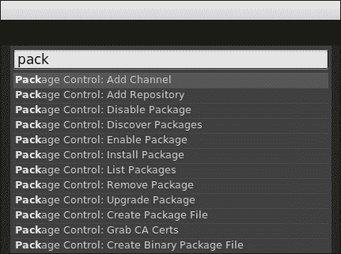
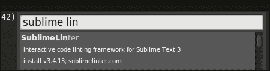
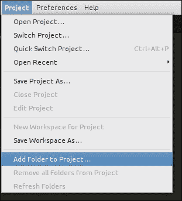
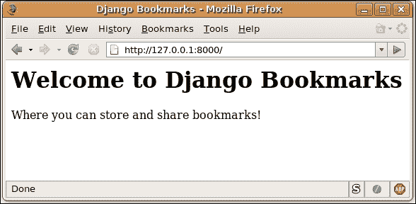

# 三、Django 的代码风格

由于您来自 Python 背景，您一定已经编写了很多代码，当然也很喜欢。

Python 代码易于维护，可用于小型项目或解决任何竞争性编程竞赛；您可以将 Python 代码存储在本地，也可以将其存储在公共文件夹中以便于共享。但是，如果您从事的是一个协作项目，尤其是 web 开发，那么它将使一切都不同于其他传统编码。这不仅需要纪律性，比如遵循项目的代码语法，还可能最终为代码编写大量文档。在使用任何版本控制工具（如 GIT）时，您的提交消息（在使其他开发人员更容易理解您一直在做什么或完成了什么方面起着重要作用）也会广播项目的当前进度。

本章将涵盖您需要遵循的所有基本主题，如更好的 Django web 开发的编码实践、使用哪种 IDE、版本控制等等。

在本章中，我们将学习以下主题：

*   Django 编码风格
*   使用 IDE 进行 Django web 开发
*   Django 项目结构
*   使用版本控制的最佳实践
*   Django 救援队（向 Django 提问的地点）
*   使用 Twitter 引导加快 web 开发

### 注

本章基于一个重要事实，即代码的阅读频率远远高于编写频率。因此，在您真正开始构建项目之前，我们建议您熟悉 Django 社区为 web 开发采用的所有标准实践。

# Django 编码风格

Django 的大多数重要实践都基于 Python。虽然您可能已经了解这些概念，但我们仍将休息一下，编写所有记录在案的实践，以便您在开始之前就了解这些概念。当然，在构建项目时，您可以回到本章快速查看。

为了将标准实践纳入主流，提出了 Python 增强建议，其中一个广泛采用的开发标准实践是 PEP8，它是 Python 代码的样式指南，是对 Guido van Rossum 编写的 Python 代码进行样式化的最佳方式。

文档中说，“PEP8 处理与 Python 文档字符串相关的语义和约定。”如需进一步阅读，请访问[http://legacy.python.org/dev/peps/pep-0008/](http://legacy.python.org/dev/peps/pep-0008/) 。

## 理解 Python 中的缩进

当您在编写Python 代码时，缩进起着非常重要的作用。在其他语言中，如**C**或**Perl**中，它充当块。但是我们是否应该使用制表符或空格，以及如果使用空格，应该使用多少个——两个、四个或八个，这一直是程序员讨论的问题。使用四个空格进行缩进比使用八个空格更好，如果嵌套块多一些，则使用八个空格进行缩进可能会占用比单行中显示的字符更多的字符。但是，这也是程序员的选择。

以下是不正确的缩进实践导致的结果：

```py
>>> def a():
...   print "foo"
...     print "bar"
IndentationError: unexpected indent

```

那么，我们应该使用哪一个：制表符还是空格？

选择其中任何一个*项*项，但不要在同一个项目中混淆标签和空格，否则维护起来会是一场噩梦。Python 中最流行的缩进方式是空格；标签排在第二位。如果您遇到的任何代码混合了制表符和空格，则应将其转换为独占使用空格。

### 正确进行缩进–每个缩进级别是否需要四个空格？

关于它有很多困惑，当然，Python 的语法都是关于缩进的。老实说，在大多数情况下都是这样。因此，强烈建议每个缩进级别使用四个空格，如果您一直遵循两个空格的方法，请停止使用它。它没有什么问题，但是当您处理多个第三方库时，您可能最终会遇到不同版本的意大利面条，这最终将变得难以调试。

现在是缩进。当您的代码位于延续行中时，您应该将其垂直对齐，或者可以进行挂起缩进。使用挂起缩进时，第一行不应包含任何参数，应使用进一步的缩进来清楚地将其区分为续行。

### 注

悬挂缩进（也称为负缩进）是一种缩进样式，除段落的第一行外，所有行都缩进。上段是悬挂缩进的例子。

以下示例说明了在编写代码时应如何使用适当的缩进方法：

```py
bar = some_function_name(var_first, var_second,
 var_third, var_fourth) 
# Here indentation of arguments makes them grouped, and stand clear from others.
def some_function_name(
 var_first, var_second, var_third,
 var_fourth):
 print(var_first)
# This example shows the hanging intent.

```

我们不鼓励使用以下编码风格，而且它在 Python 中也不会起作用：

```py
# When vertical alignment is not used, Arguments on the first line are forbidden
foo = some_function_name(var_first, var_second,
 var_third, var_fourth)
# Further indentation is required as indentation is not distinguishable between arguments and source code.
def some_function_name(
 var_first, var_second, var_third,
 var_fourth):
 print(var_first)

```

虽然不需要额外的缩进，但如果您想使用额外的缩进来确保代码正常工作，可以使用以下编码样式：

```py
# Extra indentation is not necessary.
if (this
 and that):
 do_something()

```

### 提示

理想情况下，应将每行最多限制为 79 个字符。它允许使用版本控制查看差异时使用`+`或`–`字符。更好的做法是将行数限制在 79 个字符以内，以实现编辑器之间的一致性。您可以将空间的其余部分用于其他目的。

### 空行的重要性

两个空行和单个空行的重要性如下：

*   **两个空行**：两个空行可以用来分隔顶级函数和类定义，增强代码可读性。
*   **单空行**：用例中可以使用单空行——例如，类中的每个函数可以用一行分隔，相关函数可以用一行组合在一起。您还可以用一行分隔源代码的逻辑部分。

## 导入一个包

导入包直接意味着代码的可重用性。因此，始终将导入放在源文件的顶部，紧跟在任何模块注释和文档字符串之后，以及模块的全局变量和常量之前。每次导入通常应在单独的行上。

导入包的最佳方式如下所示：

```py
import os
import sys

```

不建议在同一行中导入多个包，例如：

```py
import sys, os

```

您可以以下列方式导入包，但这是可选的：

```py
from django.http import Http404, HttpResponse

```

如果导入时间变长，可以使用以下方法声明它们：

```py
from django.http import (
Http404, HttpResponse, HttpResponsePermanentRedirect
)

```

### 对进口包装进行分组

包装进口可按以下方式分组：

*   **标准库导入**：如`sys`、os、`subprocess`等等。

    ```py
    import re
    import simplejson

    ```

*   **相关第三方导入**：这些通常从 Python 奶酪店下载，即**PyPy**（使用 pip 安装）。下面是一个例子：

    ```py
    from decimal import *

    ```

*   **本地应用/库特定导入**：此包括您项目的本地模块，如模型、视图等。

    ```py
    from models import ModelFoo
    from models import ModelBar

    ```

## Python/Django 中的命名约定

每个编程语言和框架都有自己的命名约定。Python/Django 中的命名约定大致相同，但这里值得一提。在创建变量名或全局变量名时，以及在命名类、包、模块等时，都需要遵循这一点。

这是我们应该遵循的通用命名约定：

*   **正确命名变量**y:切勿使用单个字符，例如“x”或“x”作为变量名。对于普通的 Python 脚本来说可能没问题，但是在构建 web 应用时，必须正确命名变量，因为它决定了整个项目的可读性。
*   **软件包和模块的命名**：模块建议使用小写和缩写名称。如果下划线的使用可以提高可读性，则可以使用下划线。Python 包也应该有短的、全小写的名称，尽管不鼓励使用下划线。
*   由于模块名映射到文件名（`models.py`、`urls.py`等），因此选择相当短的模块名非常重要，因为某些文件系统不区分大小写，并且会截断长名称。
*   **命名类**：类名称应遵循**CamelCase**命名约定，内部使用的类名称中可以有前导下划线。
*   **全局变量名**：首先，您应该避免使用全局变量，但如果需要使用，可以通过`__all__`或使用带前缀的下划线（旧的常规方式）来防止导出全局变量。
*   **函数名和方法参数**：函数名应为小写，并用下划线分隔，并且`self`作为实例化方法的第一个参数。对于类或方法，使用 CLS 或对象进行初始化。
*   **方法名称和实例变量**：根据需要使用函数命名规则小写，单词之间用下划线分隔，以提高可读性。仅对非公共方法和实例变量使用一个前导下划线。

# 使用 IDE 进行更快的开发

对于源代码编辑器，市场上有很多选择。一些人喜欢成熟的 IDE，而另一些人喜欢简单的文本编辑器。选择权完全属于你；挑选任何感觉更舒服的东西。如果您已经使用某个程序来处理 Python 源文件，我建议您继续使用它，因为它可以很好地处理 Django。否则，我可以提出一些建议，例如：

*   **升华文本**：这个编辑器是轻量级的，功能非常强大。它适用于所有主要平台，支持语法突出显示和代码完成，并且与 Python 配合良好。编辑器是开源的，您可以在[找到它 http://www.sublimetext.com/](http://www.sublimetext.com/)
*   **PyCharm**：我会说，这是所有代码编辑器中最智能的，并且具有高级功能，例如代码重构和代码分析，这使得开发更干净。Django 的特性包括模板调试（这是一个赢家）和快速文档，所以这个查找对于初学者来说是必须的。社区版是免费的，您可以在购买专业版之前试用 30 天。

# 使用 Sublime 文本编辑器设置项目

我们将在本书中向您展示的大多数示例将使用**崇高文本编辑器**编写。在本节中，我们将展示如何安装和设置 Django 项目。

1.  **下载和安装**：您可以从网站[www.sublimitext.com](http://www.sublimetext.com)的下载页签下载升华。单击下载的文件选项进行安装。
2.  **Setting up for Django**: Sublime has a very extensive plug-in ecosystem, which means that once you have downloaded the editor, you can install plug-ins for adding more features to it.

    安装成功后，如下图：

    

    ### 注

    最重要的是**包控制**，它是直接从 Sublime 内部安装额外插件的管理器。这将是您唯一的手动安装包。它将负责接下来的软件包安装。

    

使用 Sublime 开发 Python 的一些建议如下：

*   **Sublime Linter**: This gives instant feedback about the Python code as you write it. It also has PEP8 support; this plugin will highlight in real time the things we discussed about better coding in the previous section so that you can fix them.

    

*   **Sublime CodeIntel**: This is maintained by the developer of **SublimeLint**. Sublime CodeIntel have some of advanced functionalities, such as directly go-to definition, intelligent code completion, and import suggestions.

    

您还可以为 Sublime 开发其他插件，以提高您的工作效率。

# 设置 PyCharm IDE

您可以使用任何您喜欢的 IDE 进行 Django 项目开发。我们将在本书中使用 pycharm IDE。建议使用此 IDE，因为它将在调试时为您提供帮助，使用断点将为您节省大量时间，以找出实际出现的错误。

以下是如何为 Django 安装和设置**pycharm**IDE：

1.  **Download and installation**: You can check the features and download the pycharm IDE from the following link:

    [http://www.jetbrains.com/pycharm/](http://www.jetbrains.com/pycharm/)

    

2.  **Setting up for Django**: Setting up pycharm for Django is very easy. You just have to import the project folder and give the `manage.py` path, as shown in the following figure:

    

# Django 项目结构

在 1.6 版本中，Django 项目结构已更改。Django（`django-admin.py`）还有一个`startapp`命令来创建应用，所以现在是时候告诉您 Django 中的应用和项目之间的区别了。

**项目**是一个完整的网站或应用，而**应用**是一个小型、独立的 Django 应用。应用基于这样一个原则：它应该做一件事，并且做得对。

为了减轻从头开始构建 Django 项目的痛苦，Django 通过自动生成基本项目结构文件为您提供了一个优势，任何项目都可以从这些文件进行开发和功能添加。

因此，总而言之，我们可以说项目是应用的集合，应用可以作为单独的实体编写，并且可以方便地导出到其他应用以实现重用。

要创建您的第一个 Django 项目，请打开终端（或 Windows 用户的命令提示符），键入以下命令，然后点击*输入*：

```py
$ django-admin.py startproject django_mytweets

```

此命令将在当前目录中创建一个名为`django_mytweets`的文件夹，并在其中创建初始目录结构。让我们看看创建了什么类型的文件。

新的结构如下：

```py
django_mytweets///
django_mytweets/
manage.py
```

这是`django_mytweets/`的内容：

```py
django_mytweets/
__init__.py
settings.py
urls.py
wsgi.py
```

以下是这些文件的简要说明：

*   `django_mytweets` (the outer folder): This folder is the project folder. Contrary to the earlier project structure in which the whole project was kept in a single folder, the new Django project structure somehow hints that every project is an application inside Django.

    这意味着您可以导入与 Django 项目相同级别的其他第三方应用。此文件夹还包含`manage.py`文件，其中包含所有项目管理设置。

*   `manage.py`: This is utility script is used to manage our project. You can think of it as your project's version of `django-admin.py`. Actually, both `django-admin.py` and `manage.py` share the same backend code.

    ### 注

    我们将在调整更改时提供有关设置的进一步说明。

    让我们来看看`manage.py`文件：

    ```py
    #!/usr/bin/env python
    import os
    import sys
    if __name__ == "__main__":
        os.environ.setdefault("DJANGO_SETTINGS_MODULE", "django_mytweets.settings")
        from django.core.management import execute_from_command_line
        execute_from_command_line(sys.argv)
    ```

    阅读以下代码说明后，`manage.py`文件的源代码将是自解释的。

    ```py
    #!/usr/bin/env python

    ```

    第一行只是声明下面的文件是 Python 文件，后面是导入部分，其中导入了`os`和`sys`模块。这些模块主要包含与系统相关的操作。

    ```py
    import os
    import sys
    ```

    下一段代码检查 main 函数是否执行该文件，main 函数是要执行的第一个函数，然后将 Django 设置模块加载到当前路径。由于您已经在运行虚拟环境，这会将所有模块的路径设置为当前运行的虚拟环境的路径。

    ```py
    if __name__ == "__main__":
        os.environ.setdefault("DJANGO_SETTINGS_MODULE", "django_mytweets.settings")
    django_mytweets/ ( Inner folder)
    __init__.py
    ```

    Django 项目是 Python 包，需要这个文件来告诉 Python 这个文件夹将被视为一个包。Python 术语中的包是模块的集合，它们用于将相似的文件分组在一起并防止命名冲突。

*   `settings.py`: This is the main configuration file for your Django project. In it, you can specify a variety of options, including database settings, site language(s), what Django features need to be enabled, and so on. Various sections of this file will be explained as we progress with building our application during the following chapters.

    默认情况下，数据库配置为使用 SQLite 数据库，建议用于测试目的。在这里，我们将只看到如何在设置文件中输入数据库；它还包含基本的设置配置，只需在`manage.py`文件中稍加修改，就可以移动到另一个文件夹，如`config`或`conf`。

    为了使每个其他第三方应用成为项目的一部分，我们需要在`settings.py`文件中注册它。`INSTALLED_APPS`是一个变量，包含有关已安装应用的所有条目。随着项目的发展，管理变得越来越困难；因此，`INSTALLED_APPS`变量有三个逻辑分区，如下所示：

    *   `DEFAULT_APPS`：此参数包含默认 Django 安装的应用（如管理员）
    *   `THIRD_PARTY_APPS`：此参数包含用于社会认证的**SocialAuth**等其他应用
    *   `LOCAL_APPS`：此参数包含您创建的应用
*   `url.py`: This is another configuration file. You can think of it as a mapping between URLs and the Django view functions that handle them. This file is one of Django's more powerful features, and we will see how to utilize it in the next chapter.

    当我们开始为应用编写代码时，我们将在项目文件夹中创建新文件。因此，该文件夹还充当代码的容器。

现在您已经对 Django 项目的结构有了大致的了解，让我们来配置我们的数据库系统。

# 最佳实践–使用版本控制

版本控制是一个系统，它可以在项目不断进行的过程中记住您对项目所做的所有更改。在任何时候，您都可以看到对特定文件所做的更改；在一段时间内，您可以将其还原或进一步编辑。

对于一个有多个贡献者的项目来说，这更有意义，主要是那些同时处理同一个文件的人。版本控制是一个救命稻草，因为它保留文件两个版本的记录，并允许通过合并或放弃任何一个副本来保存这两个版本。

我们将使用分布式版本控制，也就是说，每个开发人员都有项目的完整副本（与 subversion 相反，在 subversion 中，存储库托管在系统服务器上）。

## Git–最新最流行的版本控制工具

**Git**是我们将用于项目的版本控制工具。它是最好的版本控制工具，也是开源的。Git 可以很好地处理其他类型的文件，除了源代码文件、生活图像、PDF 等等。您可以从以下 URL 下载 Git：

[http://git-scm.com/downloads](http://git-scm.com/downloads)

大多数现代 IDE 已经有内置的版本控制系统支持；与 PyCharm 一样，Sublime 也有一个插件，可以将 Git 集成到工作目录中。Git 可以使用`git`命令从终端初始化，您可以使用`git --help`命令查看它提供的更多选项。

### Git 是如何工作的

作为开发人员，我们拥有与远程服务器（通常称为存储库）同步的项目本地副本，并可以将其发送到远程存储库。当其他开发人员想要将更改推送到远程存储库时，他们必须首先拉取您的更改。这将使每个开发人员都处于同步状态的中央存储库上发生冲突的可能性降至最低。整个工作流程将在下一节中显示。

### 设置你的 Git

任何项目都可以添加到 Git 以进行版本控制，从而将文件夹创建到 Git 存储库中。为此，请使用以下命令：

*   `$git init`：如果您想复制现有的 Git 存储库，如果您的朋友已经在**GitHub**或**Bitbucket**上托管了它，则可能会出现这种情况，请使用以下命令：
    *   `$git clone URL`：远程存储库的 URL，如[https://github.com/AlienCoders/web-development.git](https://github.com/AlienCoders/web-development.git) 。

**暂存区**：暂存区是您提交文件前必须首先列出所有文件的地方。简而言之，暂存需要作为中间步骤，而不是直接提交，因为当冲突发生时，它们会在暂存区域中标记。只有在解决冲突后，才能提交文件。

让我们看看下面的命令和它们的用途：

*   `$git add <file-name>`或`$git add`：用于将所有文件批量添加到暂存区。
*   `$git status`：了解您工作目录的状态，哪些文件已经添加，哪些文件还没有添加。
*   `$git diff`：获取修改和暂存的内容，或修改和未暂存的内容的状态。
*   `$ git commit -m`：要提交所做的更改，首先必须将其添加到暂存区；然后，您必须使用此命令提交它们。
*   `$ git rm <file-name>`：如果您错误地将任何文件添加到暂存区，您可以使用此命令将其从暂存区中删除。
*   `$git stash`：Git不跟踪重命名的文件。换句话说，如果重命名了已暂存的文件，则必须将其再次添加到暂存中，然后提交。使用以下命令，您可以通过不实际提交到存储库来保存更改。
*   `$git stash apply`：它接受所有当前更改并将其保存到堆栈中。然后，您可以继续使用更改。一旦您能够获取已保存的更改，就可以使用此命令执行此操作。

### Git 中的分支

版本控制的另一个概念是**分支**（Git）。分支类似于提交的路径，默认情况下，所有提交都在主分支上进行。分支主要用于跟踪项目中的要素。每一个特征都可以制作为待处理的分支；功能完成后，可以将其合并回主功能。

分支的基本工作流程如下：您最初拥有一个主分支，并为每个新功能创建一个新分支。更改被提交到新分支中，一旦使用该功能完成，您可以将其合并回主分支。这可以直观地表示如下：

*   `$git branch`: To list an existing branch using Git, we need to use this command.

    

*   `git checkout -b <new-branch-name>`: A new branch can be created in the existing repository using this command. We can see logically how it looks with the help of the following block diagram:

    

    您将收到一条消息，通知您已切换到新的分支机构。如果要切换回旧分支，可以使用以下命令：

*   `$git checkout <old-branch-name>`：您将看到消息`Switched to branch <old-branch-name>`。
*   `$git merge <branch-name>`：在功能完成后，您可以使用此命令将其合并到您选择的分支。这将把分支`<branch-name>`合并到您当前的分支。要将更改同步回`<branch-name>`，您可以从当前分支签出到分支`<branch-name>`并再次合并。您还可以使用标记标记提交历史记录中的重要点。
*   提交后，您可以使用`$git tag -a v1.0`命令标记重要的提交。
*   要从远程服务器获取新的更改，可以使用`$git fetch`命令从 Git 获取更改。
*   要将更改直接合并到当前分支，可以使用`$git pull`命令。
*   完成更改后，可以使用`$git push`命令提交并将其推送到远程存储库。

# 建立数据库

在部分中，我们将首次开始使用代码。因此，我们必须选择一个源代码编辑器来输入和编辑代码。您可以使用任何您喜欢的源代码编辑器。如前一节所述，我们已经使用 Sublime 文本编辑器为本书编写了代码。

好的，现在您已经准备好了源代码编辑器，让我们打开项目文件夹中的`settings.py`，看看它包含什么：

```py
# Django settings for django_mytweets project.
DEBUG = True
TEMPLATE_DEBUG = DEBUG
ADMINS = (
    # ('Your Name', 'your_email@domain.com'),
)
MANAGERS = ADMINS
DATABASE_ENGINE = ''   # 'postgresql_psycopg2', 'postgresql',
                       # 'mysql', 'sqlite3' or 'ado_mssql'.
DATABASE_NAME = ''     # Or path to database file 
                       # if using sqlite3.
DATABASE_USER = ''     # Not used with sqlite3.
DATABASE_PASSWORD = '' # Not used with sqlite3.
DATABASE_HOST = ''     # Set to empty string for localhost.
                       # Not used with sqlite3.
DATABASE_PORT = ''     # Set to empty string for default.
                       # Not used with sqlite3.
```

`settings.py`文件中还有很多行，但我们已经修剪了该文件的剩余内容。

正如您可能已经注意到的，该文件包含许多控制应用各个方面的变量。为变量输入新值就像执行 Python 赋值语句一样简单。此外，对该文件进行了广泛的注释，注释详细解释了哪些变量可以控制。

我们现在关心的是配置数据库。如前所述，Django 支持多个数据库系统，因此首先，我们必须指定要使用的数据库系统。这由`DATABASE_ENGINE`变量控制。如果已安装 SQLite，请将变量设置为`sqlite3`。否则，从变量名旁边的注释中选择与数据库引擎匹配的值。

接下来是数据库名称。我们将为您的数据库选择一个描述性名称；编辑`DATABASE_NAME`并将其设置为`django_mytweetsdb`。如果您使用的是 SQLite，这就是您需要做的全部事情。另一方面，如果您正在使用数据库服务器，请按照以下说明操作：

*   输入数据库的相关信息–用户名、密码、主机和端口（SQLite 不需要这些信息）。
*   在数据库服务器内创建实际的数据库，因为 Django 本身不会这样做。例如，在 MySQL 中，这是通过`mysql`命令行实用程序或`phpMyAdmin`完成的。

经过这些简单的编辑，`settings.py`中的数据库部分现在如下所示：

```py
DATABASE_ENGINE = 'sqlite3'
DATABASE_NAME = 'django_mytweetsdb'
DATABASE_USER = ''
DATABASE_PASSWORD = ''
DATABASE_HOST = ''
DATABASE_PORT = ''
```

最后，我们将告诉 Django 用表填充已配置的数据库。尽管我们还没有为我们的数据创建任何表（在下一章之前我们不会这样做），Django 需要数据库中的几个表才能使其某些功能正常工作。创建这些表与发出以下命令一样简单：

```py
$ python manage.py syncdb

```

如果一切正常，状态消息将在屏幕上滚动，表明正在创建表。当提示输入超级用户帐户时，请输入您的首选用户名、电子邮件和密码。另一方面，如果数据库配置错误，将打印一条错误消息以帮助您解决问题。

完成后，我们就可以启动我们的应用了。

### 注

**使用 python manage.py**

当您运行以`python manage.py`开头的命令时，请确保您当前位于`manage.py`文件所在的项目目录中。

# 启动开发服务器

正如前面所讨论的，Django 附带了一个轻量级 web 服务器，用于开发和测试应用。此服务器已预先配置为与 Django 一起使用，更重要的是，每当您修改代码时，它都会重新启动。

要启动服务器，请运行以下命令：

```py
$ python manage.py runserver

```

接下来，打开浏览器并导航到此 URL:`http://localhost:8000/`。您应该会看到一条欢迎消息，如以下屏幕截图所示：



祝贺您已经创建并配置了第一个 Django 项目。这个项目将是基础之上，我们将建立我们的书签应用。在下一章中，我们将开始开发我们的应用，web 服务器显示的页面将被我们自己编写的内容所取代！

您可能已经注意到，web 服务器默认在端口`8000`上运行。如果要更改端口，可以使用以下命令在命令行中指定端口：

```py
$ python manage.py runserver <port number>

```

此外，默认情况下，只能从本地计算机访问开发服务器。如果要从网络上的另一台计算机访问开发服务器，请使用以下命令行参数：

```py
$ python manage.py runserver 0.0.0.0:<port number>

```

# 更快的 web 开发

说到 web 开发，web 项目成功的一个主要原因是它的用户界面和用户体验。尽管 Django 负责后端的所有业务逻辑，但毫无疑问，我们需要一个很棒的前端设计框架，它不仅可以简化开发人员的编码工作，还可以增强整个 web 项目的用户体验。因此，我们选择在这里解释**推特引导**。

## 最小引导

**Bootstrap**是一个完整的前端框架，让您熟悉它的各个方面超出了本书的范围。你们一定想知道为什么我们会在 Django 的书中讨论 Bootstrap。您正被告知前端框架。这里的想法是帮助您构建一个可以直接用于生产的 web 应用，并将其部署到云上，如**AWS**和**Heroku**。你需要你的项目是一个生产级一旦你完成这本书。因此，通过使引导尽可能简单，您仍然可以构建一个漂亮的 Django web 应用。

有许多方法可以根据排列和组合来布局网页。为了帮助您理解这一点，我们将看几个例子。

**线框**是 web 开发的第一步，这意味着它必须处理内容在页面上的位置。如果您已经了解了网页设计的基础知识，本节将对您更有意义。如果没有，首先阅读一些文章，了解 web 开发的基本概念。查一下`div`和`span`之间的区别，你就会明白一切。您可以从这里了解更多信息：[https://developer.mozilla.org/en-US/Learn/HTML](https://developer.mozilla.org/en-US/Learn/HTML) 。引导基本页面线框分为行和列；每列又分为 12 个部分。通过这些小节，您可以使用排列来设计布局。

当我们从开发者的角度来看一个网站时，我们首先注意到的是所使用的线框。例如，当您访问[www.facebook.com](http://www.facebook.com)时，您会在页面中央看到您的新闻提要，并在页面左侧看到其他重要链接（如消息、页面和组的链接）。在右侧，您可以看到可以聊天的朋友。

在 Bootstrap 中可以想象与 2-8-2 相同的布局。左侧链接的列将是“2 列”，新闻提要将是“8 列”，聊天部分将是“2 列”。这是一个基本的线框。

### 提示

请记住，总和必须始终为 12，因为 Bootstrap 中的活液网格系统基于 12 网格柱原则工作，以实现更好、更灵活的布局。

现在，Bootstrap 不仅仅是为了使网页具有响应性——它还有许多其他组件可以使网页看起来更好、更干净。

要将引导与 Django 一起使用，有两种方法：

*   **Django 路**：`pip install django-bootstrap3`
*   **手动方式**：下载引导资源并复制到静态位置

### Django 路

如果您想要使用命令安装引导，那么您必须将`settings.py`文件中的`INSTALLED_APPS`变量附加上`bootstrap3`。

下面是一个 Django 模板示例，它使用此方法生成一个简单的 HTML 表单：

```py


<form action="action_url">
    
    
    
        <button type="submit" class="btn btn-primary">
             SUBMIT
        </button>
    
</form>
```

### 提示

要了解和探索更多信息，您可以参考以下链接：

[http://django-bootstrap3.readthedocs.org/](http://django-bootstrap3.readthedocs.org/)

### 手动安装引导程序

这个方法是推荐给初学者的，但是一旦你有信心，你可以按照命令的方法走捷径。

在这里，我们将学习项目文件的基本内容，其余内容将在接下来的章节中介绍。从在线来源（[下载引导后 http://getbootstrap.com](http://getbootstrap.com) ），解压后的文件夹结构如下：

```py
|-- css 
|   |-- bootstrap.css 
|   |-- bootstrap.css.map 
|   |-- bootstrap.min.css 
|   |-- bootstrap-theme.css 
|   |-- bootstrap-theme.css.map 
|   `-- bootstrap-theme.min.css 
|-- fonts 
|   |-- glyphicons-halflings-regular.eot 
|   |-- glyphicons-halflings-regular.svg 
|   |-- glyphicons-halflings-regular.ttf 
|   `-- glyphicons-halflings-regular.woff 
`-- js 
 |-- bootstrap.js 
 `-- bootstrap.min.js 

```

Django 中使用了两种类型的本地文件约定：一种是“静态”，另一种是“媒体”。静态文件是指项目的资产，如 CSS、JavaScript 等。项目中的媒体文件以上传的文件表示，主要包括图像、显示或下载的视频等。

将静态文件添加到项目中可以通过向`setting.py`文件中添加以下行来完成：

```py
STATICFILES_DIRS = (
    # put absolute path here as string not relative path.
    # forward slash to be used even in windows.
    os.path.join(
        os.path.dirname(__file__),
        'static',
    ),
)
```

现在，您所要做的就是在项目目录中创建一个文件夹，并复制所有引导资源。

# 总结

在本章中，我们准备了开发环境，创建了第一个项目，设置了数据库，并学习了如何启动 Django 开发服务器。我们学习了为 Django 项目编写代码的最佳方法，并看到了默认的 Django 项目结构。我们了解了命名约定、空行的意义以及应该使用的导入样式和位置。

我们看到哪个编辑器和 IDE 更适合基于 Python 和 Django 的 web 开发。我们学习了如何使用 Git 在存储库中保持代码的更新。我们学习了一些引导技术来进行前端开发。

下一章将带您参观 Django 的主要组件，并帮助为我们的 Twitter 应用开发一个工作原型。这将是一个有趣的章节，有许多新的东西要学习，所以继续阅读！