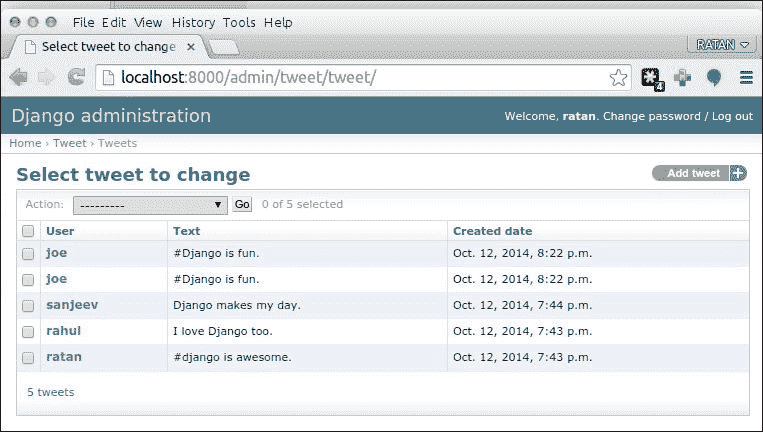
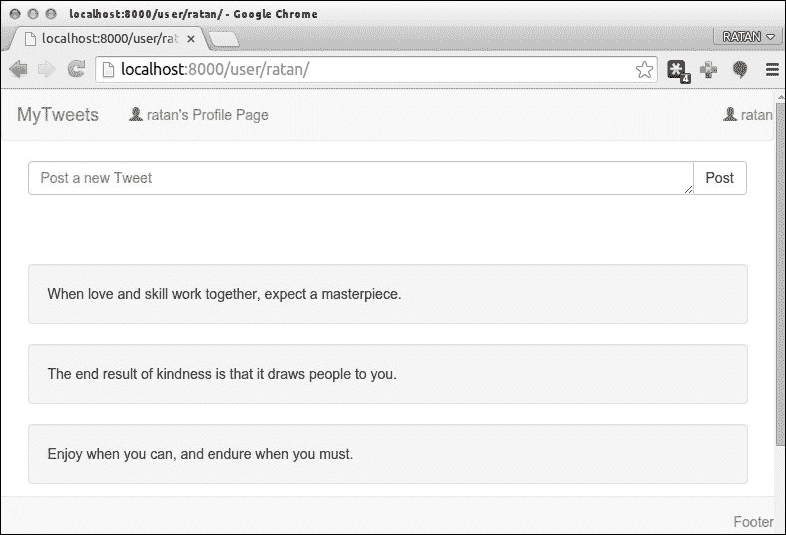

# 第八章创建管理界面

在本章中，我们将使用 Django 的内置特性学习管理员界面的特性。我们还将介绍如何以自定义方式显示推文，并启用侧栏或分页。我们将在本章中讨论以下主题：

*   自定义管理界面
*   自定义列表页面
*   覆盖管理模板
*   用户、组和权限
    *   用户权限
    *   组权限
    *   在视图中使用权限
*   将内容组织到页面中（分页）

# 定制管理界面

Django 提供的管理界面功能强大、灵活，从 1.6 版开始默认激活。这将为您的站点提供一个功能齐全的管理工具包。尽管管理应用程序应该足以满足大多数需求，但 Django 提供了几种定制和增强它的方法。除了指定管理界面中可用的模型外，还可以指定列表页面的显示方式，甚至覆盖用于呈现管理页面的模板。那么，让我们了解一下这些特性。

# 定制列表页面

正如我们在上一章中看到的，我们使用以下方法将模型类注册到管理接口：

*   `admin.site.register`（`Tweet`）
*   `admin.site.register`（`Hashtag`）
*   `admin.site.register`（`UserFollower`）

我们还可以自定义管理页面的几个方面。让我们通过例子来了解这一点。tweet 列表页面显示每个 tweet 的字符串表示，如下面的屏幕截图所示：


如果在单独的栏中显示发布推特的用户的姓名以及发布时间，该页面会更有用吗？事实证明，实现此功能只需要添加几行代码。

在`tweet/admin.py`文件中编辑 tweet 模型如下：

```py
  from django.contrib import admin
  from models import Tweet, HashTag
  from user_profile.models import UserFollower
  # Register your models here.
  admin.site.register(Tweet)
  admin.site.register(HashTag)
  admin.site.register(UserFollower)
```

在`#Register your models here`上方添加新的代码行，更新后的代码如下：

```py
  from django.contrib import admin
  from models import Tweet, HashTag
  from user_profile.models import UserFollower
 class TweetAdmin(admin.ModelAdmin):
 list_display = ('user', 'text', 'created_date')
  # Register your models here.
  admin.site.register(Tweet, TweetAdmin)))
  admin.site.register(HashTag)
  admin.site.register(UserFollower)
```

此代码在管理员视图中为`TweetAdmin()`类添加了额外的列：

```py
  class TweetAdmin(admin.ModelAdmin):
    list_display = ('user', 'text', 'created_date')
```

此外，我们还传递了一个额外的参数来注册对管理员 tweet 的调用；也就是说，`admin.site.register(Tweet)`现在变成`admin.site.register(Tweet, TweetAdmin)`。刷新同一页面并记录更改，如以下屏幕截图所示：



桌子现在整理得更好了！我们只是在`Tweet`模型的`TweetAdmin()`类中定义了一个名为`list_display`的元组属性。此元组包含列表页面中要使用的字段的名称。

还有其他属性，我们可以在 Admin 类中定义；每个字段都应定义为一个或多个字段名的元组。

*   `list_filter`：如果已定义，此将创建一个带有链接的侧栏，可用于根据模型中的一个或多个字段过滤对象。
*   `ordering`：用于在列表页面中对对象进行排序的字段。
*   `search_fields`：如果定义，则创建一个可用于搜索的搜索字段。字段名前面有一个减号，根据一个或多个字段，数据模型中的可用对象使用降序而不是升序。

让我们利用 tweet 列表页面中前面的每个属性。再次编辑`tweet/admin.py`文件中的推特模型，并追加以下突出显示的行：

```py
  from django.contrib import admin
  from models import Tweet, HashTag
  from user_profile.models import UserFollower

  class TweetAdmin(admin.ModelAdmin):
    list_display = ('user', 'text', 'created_date')
 list_filter = ('user', )
 ordering = ('-created_date', )
 search_fields = ('text', )

  # Register your models here.
  admin.site.register(Tweet, TweetAdmin)
  admin.site.register(HashTag)
  admin.site.register(UserFollower)
```

以下是使用这些属性后的情况：


如您所见，我们只需几行代码就可以定制和增强 tweet 列表页面。接下来，我们将了解如何定制用于呈现管理页面的模板，将使我们能够更好地控制管理界面。

# 覆盖管理模板

有时您需要更改管理界面的外观或移动各个管理页面上的元素并重新排列它们。幸运的是，通过允许我们覆盖其模板，管理界面具有足够的灵活性来完成所有这一切，甚至更多。自定义管理模板的过程很简单。首先，将模板从“管理”应用程序文件夹复制到项目的“模板”文件夹中，然后编辑此模板并根据自己的喜好对其进行自定义。管理模板的位置取决于 Django 的安装位置。以下是 Django 在主要操作系统下的默认安装路径列表：

*   **窗口**：`C:\PythonXX\Lib\site-packages\django`
*   **UNIX 和 Linux**：`/usr/lib/pythonX.X/site-packages/django`
*   **Mac OS X**：`/Library/Python/X.X/site-packages/django`

（这里，**X.X**是您系统上的 Python 版本，`site-packages`文件夹也可以找到为`dist-packages`。）

如果在操作系统的默认安装路径中找不到 Django，请执行文件系统搜索`django-admin.py`。您将获得多个点击，但您想要的点击将位于 Django 安装路径下，位于名为`bin`的文件夹中。

找到 Django 安装路径后，打开`django/contrib/admin/templates/`，您将找到管理应用程序使用的模板。

此目录中有许多文件，但最重要的是：

*   `admin/base_site.html`：这是管理的基本模板。此模板生成接口。以下模型中的所有页面都继承自此模板。
*   `admin/change_list.html`：此模板生成可用对象列表。
*   `admin/change_form.html`：此模板生成用于添加或编辑对象的表单。
*   `admin/delete_confirmation.html`：该模板在删除对象时生成确认页面。

让我们尝试定制其中一个模板。假设我们想要更改位于所有管理页面顶部的字符串**Django administration**。为此，在我们项目的`templates`文件夹中创建一个名为`admin`的文件夹，并将`admin/base_site.html`文件复制到其中。之后，编辑文件，将`Django`的所有实例更改为`Django Tweet`：

```py
  
  
  {{ title|escape }} |
  
  
  <h1 id="site-name"></h1>
  
  
```

结果如下所示：


由于管理模板的模块化设计，通常不需要也不建议替换整个模板。几乎总是最好只覆盖模板中需要更改的部分。

过程非常简单，不是吗？请随意尝试其他模板。例如，您可能希望向列表或编辑页面添加帮助消息。

管理模板利用了 Django 模板系统的许多高级功能，因此如果您看到不熟悉的模板标记，可以参考 Django 文档。

# 用户、组和权限

到目前为止，我们已经使用使用`manage.py syncdb`命令创建的超级用户帐户登录到管理界面。但是，实际上，您可能有其他需要访问管理页面的受信任用户。在本节中，我们将了解如何允许其他用户使用管理界面，并将在此过程中进一步了解 Django 权限系统。

然而，在我们继续之前，我想强调一点：只有受信任的用户才能访问管理页面。管理界面是一个非常强大的工具，因此只有您熟悉的人才能访问它。

## 用户权限

如果您数据库中除了超级用户之外没有用户，请使用我们在[第 7 章](07.html#aid-1LCVG2 "Chapter 7. Following and Commenting")中创建的注册表单*创建一个新的用户帐户，并对*进行跟踪和评论。或者，您可以通过点击**用户**然后点击**添加用户**来使用管理界面本身。

接下来，返回用户列表并单击新创建的用户的名称。您将获得一个表单，可用于编辑用户帐户的各个方面，例如名称和电子邮件信息。在编辑表单的**权限**部分，您将看到一个标有**员工状态**的复选框。启用此复选框将允许新用户进入管理界面。但是，他们在登录后将无法做很多事情，因为此复选框仅授予对管理区域的访问权限；它不提供查看或更改数据的能力。

为了给新用户足够的权限来更改数据模型，您可以启用**超级用户状态**复选框，这将授予新用户执行其想要的任何功能的完全权限。此选项使帐户与通过`manage.py syncdb`命令创建的超级用户帐户一样强大。

但是，总的来说，授予用户对所有内容的完全访问权是不可取的。因此，Django 使您能够很好地控制用户可以通过权限系统执行的操作。在**超级用户状态**复选框下方，您将找到可以授予该用户的权限列表。如果查看此列表，您会发现每个数据模型都有三种类型的权限：

*   向数据模型添加对象
*   更改数据模型中的对象
*   从数据模型中删除对象

Django 会自动为包含 Admin 类的数据模型生成这些权限。使用箭头按钮向我们正在编辑的帐户授予某些权限。例如，为帐户提供添加、编辑和删除 tweet 和 hashtag 的功能。接下来，注销，然后使用新帐户再次登录到管理界面。您将注意到，您将只能管理 tweet 和 hashtags 数据模型。

用户编辑页面的权限部分还包含一个名为**活动**的复选框。此复选框可用作启用和禁用帐户的全局开关。当未选中时，用户将无法登录到主站点或管理区域。

## 组权限

如果您有相当多的用户共享相同的权限，那么编辑每个用户的帐户并为其分配相同的权限将是一项繁琐且容易出错的任务。因此，Django 提供了另一种用户管理工具：组。简单地说，组是对共享相同权限的用户进行分类的一种方式。您可以创建组并为其分配权限。将用户添加到组时，将授予该用户组的所有权限。

创建组与其他数据模型没有太大区别。点击管理界面主页面上的**分组**，然后点击**添加分组**。接下来，输入组名并为该组分配一些权限；最后，点击**保存**。

要将用户添加到组中，请编辑用户帐户，滚动到编辑表单中的**组**部分，然后选择要将用户添加到的组。

## 在视图中使用权限

尽管到目前为止我们在管理界面中只使用了权限，Django 还允许我们在编写视图时使用权限系统。在对视图进行编程时，可以使用权限授予一组用户对特定功能或页面（如私人内容）的访问权限。在本节中，我们将了解可用于实现此目的的方法。实际上，我们不会对应用程序的代码进行更改，但是如果您想使用所解释的方法进行实验，请随意更改。

如果要检查用户是否具有特定权限，可以在`User`对象上使用`has_perm()`方法。此方法采用以下格式表示权限的字符串：

```py
app.operation_model
```

`app`参数指定模型所在应用的名称；`operation`参数可以是`add`、`change`或`delete`；`model`参数指定模型的名称。

例如，要检查用户是否可以添加推文，请使用以下命令：

```py
  user.has_perm('tweets.add_tweet')
```

要检查用户是否可以更改推文，请使用以下命令：

```py
  user.has_perm('tweets.change_tweet')
```

此外，Django 提供了一个名为`decorator`的函数，可用于将视图限制为具有特定权限的用户。装饰器名为`permission_required`，位于`django.contrib.auth.decorators`包中。

使用此装饰器与我们使用`login_required`函数的方式类似。decorator 功能是将页面限制为登录用户。假设我们想将`tweet_save_page`视图（在`tweets/views.py`文件中）限制为具有`tweet.add_tweet`权限的用户。为此，我们可以使用以下代码：

```py
from django.contrib.auth.decorators import permission_required
@permission_required('tweets.add_tweet', login_url="/login/")
def tweet_save_page(request):
  # [...]
```

此装饰器接受两个参数：检查权限和在用户没有所需权限时重定向用户的位置。

使用`has_perm`方法还是`permission_required`装饰器的问题取决于您想要的控制级别。如果需要控制对整个视图的访问，请使用`permission_required`装饰器。但是，如果您需要更好地控制视图中的权限，请使用`has_perm`方法。这两种方法应足以满足任何与许可相关的需求。

# 将内容组织到页面中–分页

在前面的章节中，我们已经讨论了一些事情，例如列出用户的推文和 OutT1，列出最下面的用户，但是考虑一个用例，当这些小数字放大时，我们开始为每种类型的查询获得大量的结果。为了解决这种情况，我们应该操纵代码，使其支持分页。

页面的大小将增加，在页面中查找项目将变得困难。幸运的是，有一个简单直观的解决方案：分页。**分页**是将内容拆分成页面的过程。而且，和往常一样，Django 已经有了一个实现此功能的组件，可以供我们使用了！

如果我们有一个大的推文集，我们会将推文集分成页面，每个页面上有十个（大约）项目，向用户展示第一个页面，并提供浏览其他页面的链接。

Django 分页功能封装在名为`Paginator`的类中，该类位于`django.core.paginator`包中。让我们使用交互式控制台学习这个类的界面：

```py
  from tweet.models import *
  from django.core.paginator import Paginator
  query_set = Tweet.objects.all()
  paginator = Paginator(query_set, 10)
```

### 注

使用`python manage.py shell`命令打开 Django shell。

这里我们导入一些类，构建一个包含所有书签的查询集，并实例化一个名为`Paginator`的对象。此类的构造函数接受要分页的查询集，并设置每页上的项数。

让我们看看如何从`Paginator`对象中检索信息（当然，结果会根据您拥有的书签数量而有所不同）：

```py
>>> paginator.num_pages # Number of pages
1
>>> paginator.count # Total number of items
5
# Items in first page (index is zero-based)
>>> paginator.object_list
[<Tweet: #django is awesome.>, <Tweet: I love Django too.>, <Tweet: Django makes my day.>, <Tweet: #Django is fun.>, <Tweet: #Django is fun.>]

# Does the first page have a previous page?
>>> page1 = paginator.page(1)
# Stores the first page object to page1
>>> page1.has_previous()
False
# Does the first page have a next page?
>>> page1.has_next()
True

```

正如你所看到的，`Paginator`为我们做了繁重的工作。它接受一个查询集，将其拆分为多个页面，并使我们能够将查询集呈现为多个页面。

让我们在其中一个视图中实现分页，例如 tweet 页面。打开`tweet/views.py`并修改`user_page`视图如下：

我们的用户配置文件页面列出了以下类：

```py
  class Profile(LoginRequiredMixin, View):
    """User Profile page reachable from /user/<username> URL"""
    def get(self, request, username):
      params = dict()
      userProfile = User.objects.get(username=username)
      userFollower = UserFollower.objects.get(user=userProfile)
      if userFollower.followers.filter(username=request.user.username).exists():
        params["following"] = True
      else:
        params["following"] = False
        form = TweetForm(initial={'country': 'Global'})
        search_form = SearchForm()
        tweets = Tweet.objects.filter(user=userProfile).order_by('-created_date')
        params["tweets"] = tweets
        params["profile"] = userProfile
        params["form"] = form
        params["search"] = search_form
        return render(request, 'profile.html', params)
```

我们需要修改前面的代码以使用分页：

```py
  class Profile(LoginRequiredMixin, View):
    """User Profile page reachable from /user/<username> URL"""
    def get(self, request, username):
      params = dict()
      userProfile = User.objects.get(username=username)
      userFollower = UserFollower.objects.get(user=userProfile)
      if userFollower.followers.filter(username=request.user.username).exists():
        params["following"] = True
      else:
        params["following"] = False
        form = TweetForm(initial={'country': 'Global'})
        search_form = SearchForm()
        tweets = Tweet.objects.filter(user=userProfile).order_by('-created_date')
        paginator = Paginator(tweets, TWEET_PER_PAGE)
        page = request.GET.get('page')
      try:
        tweets = paginator.page(page)
        except PageNotAnInteger:
          # If page is not an integer, deliver first page.
          tweets = paginator.page(1)
      except EmptyPage:
        # If page is out of range (e.g. 9999), deliver last page of results.
        tweets = paginator.page(paginator.num_pages)
        params["tweets"] = tweets
        params["profile"] = userProfile
        params["form"] = form
        params["search"] = search_form
        return render(request, 'profile.html', params)
```

下面的代码段主要实现了前面代码中的分页魔法：

```py
        tweets = Tweet.objects.filter(user=userProfile).order_by('-created_date')
        paginator = Paginator(tweets, TWEET_PER_PAGE)
        page = request.GET.get('page')
        try:
          tweets = paginator.page(page)
        except PageNotAnInteger:
          # If page is not an integer, deliver first page.
          tweets = paginator.page(1)
        except EmptyPage:
          # If page is out of range (e.g. 9999), deliver last page of results.
          tweets = paginator.page(paginator.num_pages)
```

要使此代码正常工作，请在`settings.py`文件中添加`TWEET_PER_PAGE = 5`参数，在前面的代码中，只需在代码顶部添加`import settings.py`语句即可。

我们从请求中读取一个名为`page`的`get`变量，它告诉 Django 请求了哪个页面。我们还在`settings.py`文件中设置`TWEET_PER_PAGE`参数，以显示单个页面上的推文数量。对于这个具体案例，我们选择它为`5`。

`paginator = Paginator(tweets, TWEET_PER_PA``GE)`方法创建一个分页对象，该对象保存有关查询的所有信息。

现在，只要有一个 URL`user/<username>/?page=<page_numer>`，页面就会如下面的屏幕截图所示。第一幅图显示了用户的推文，其中包含 URL 中的页码。


以下截图显示了用户主页上的推文列表：



# 总结

虽然这一章相对较短，但我们学习了如何实现很多东西。这强调了一个事实，即 Django 让您只需几行代码就可以完成很多工作。您学习了如何利用 Django 强大的管理界面，如何对其进行定制，以及如何利用 Django 提供的全面许可系统。

在下一章中，您将了解当今几乎每一个 Web2.0 应用程序中的几个令人兴奋的特性。