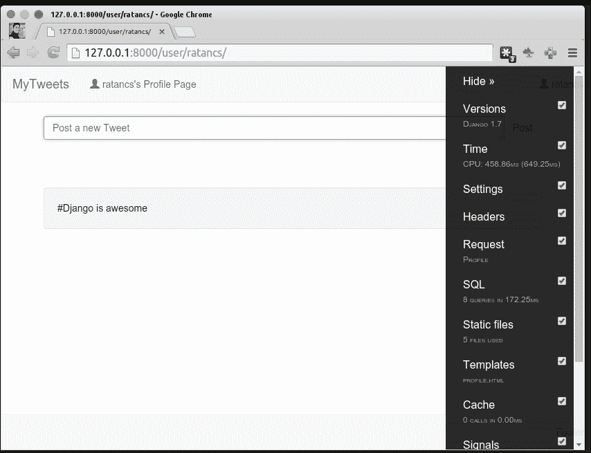
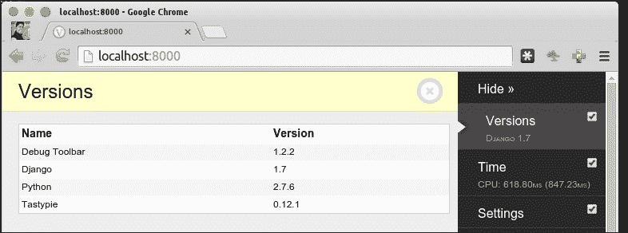
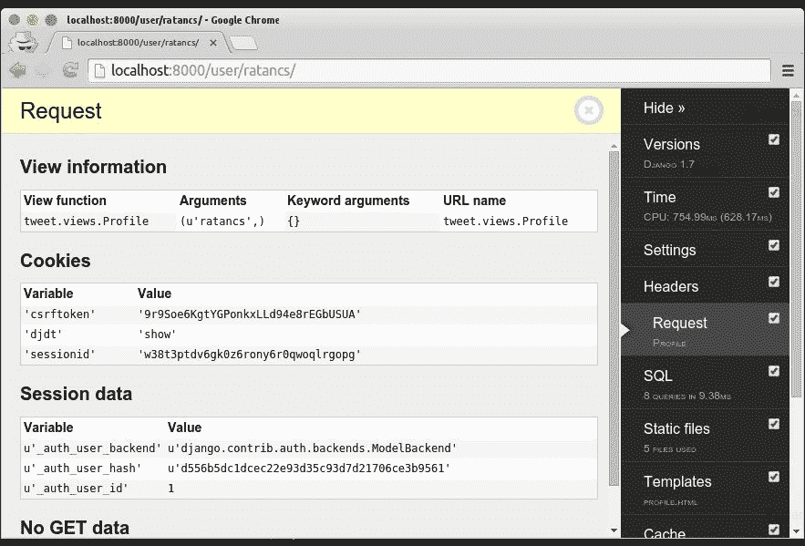
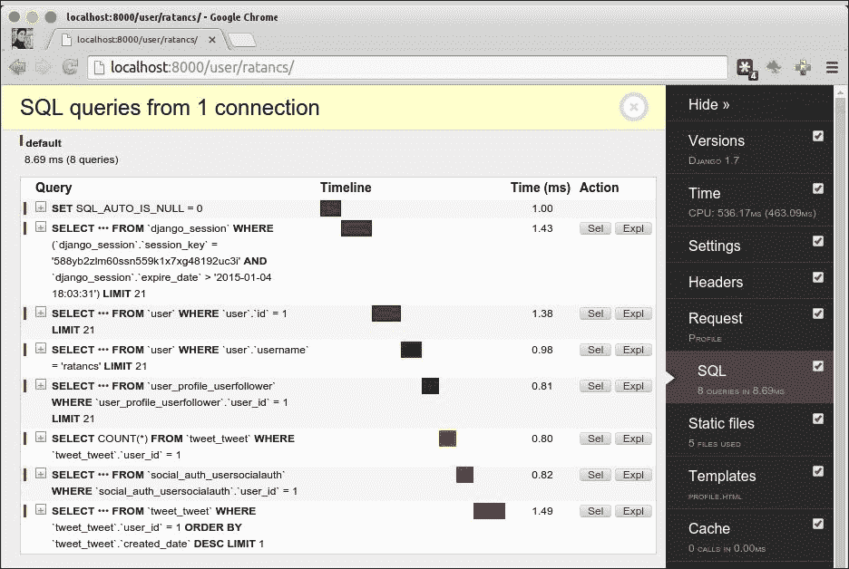
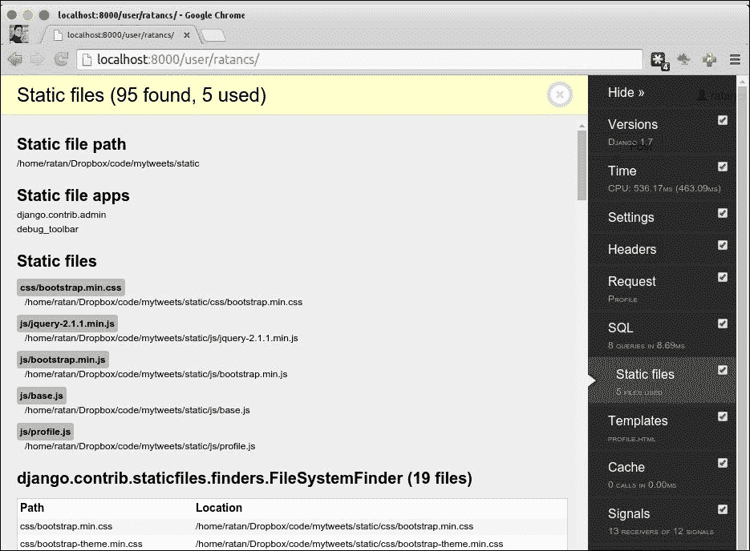
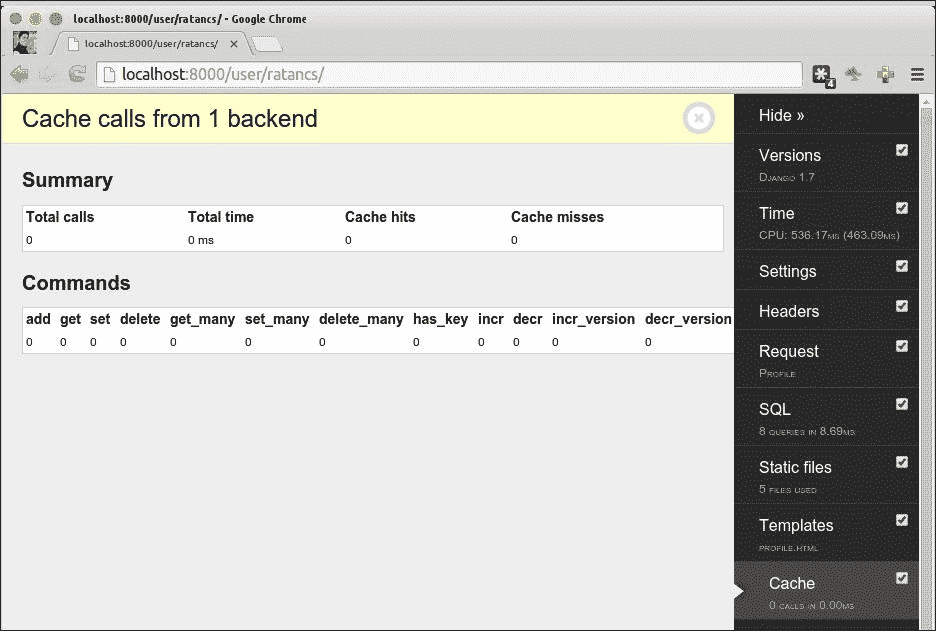
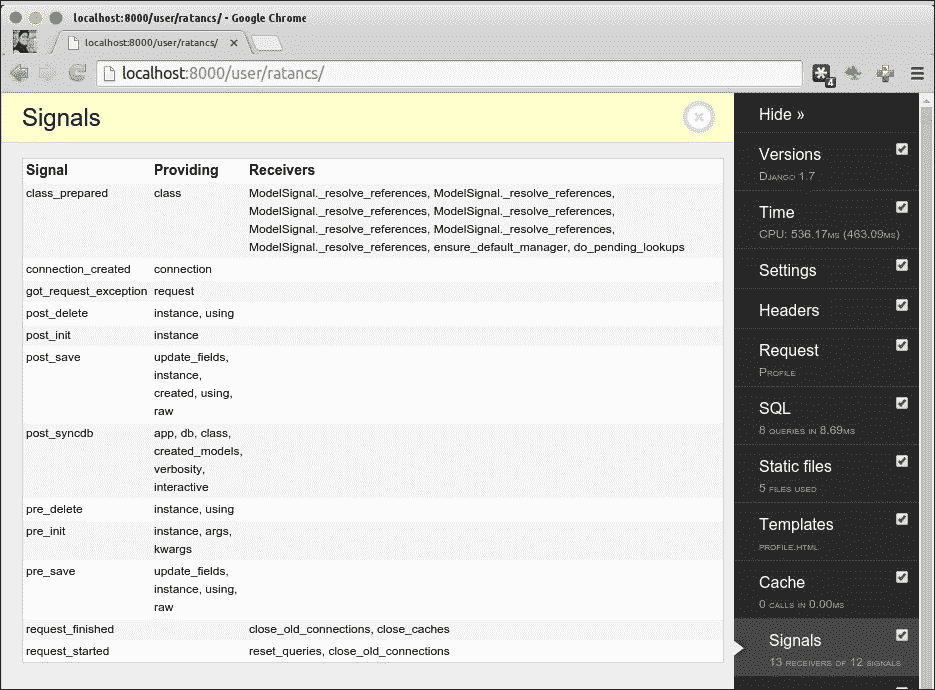
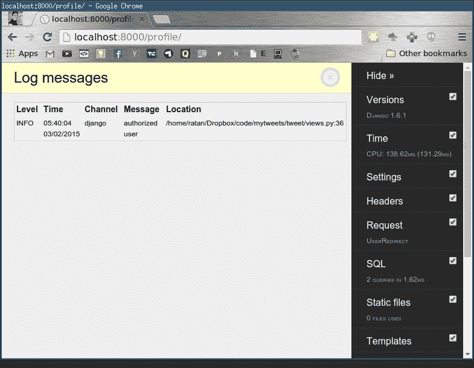
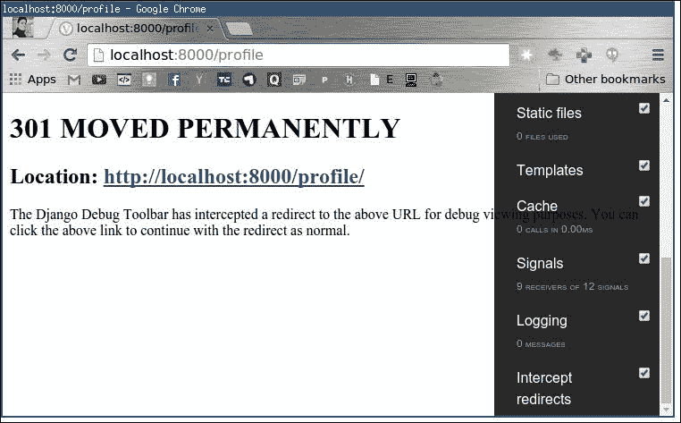

# 十三、调试的艺术

在本章中，您将了解 Django 的 web 开发的三个重要方面，这是每个程序员都应该了解的。以下是代码出错时需要的概念和技术：

*   登录中
*   调试
*   IPDB–消除 bug 的交互式方法

# 测井

在生产环境中运行的每个应用都必须启用一些日志记录；如果没有，那么很难找出什么地方出了问题。

Django 使用 Python 的基本日志记录，因此我们将在下面的部分详细介绍 Python 日志记录，并了解如何使用日志记录服务登录 Django。

日志的正式定义是跟踪软件中的事件。开发人员调用日志服务来声明事件已经发生或即将发生。日志可以由需要跟踪的任何重要变量的某些描述或值组成。

Python 的`logging`模块带有五个日志函数，它们根据事件的严重程度进行分类。它们是`debug()`、`info()`、`warning()`、`error()`和`critical()`。

按照严重程度（从最低严重程度到最高严重程度）以表格形式进行分类：

*   `debug()`：这是在修复 bug 时使用的，通常有详细的数据信息。
*   `info()`：当事情按照的预期运行时，这个会生成一个日志。这基本上说明了执行是否成功。
*   `warning()`：发生意外事件时引发。这实际上不会停止执行，但将来可能会停止执行。例如，“磁盘空间不足”。
*   `error()`：这是下一级警告，表示某些功能的执行可能已经停止。
*   `critical()`：这是任何记录功能的最高级别。当发生非常严重的错误时会引发此问题，这可能会停止整个程序的执行。

`logging`模块分为以下四类：

*   **Loggers**: Logger is the entry point for the log message of a system. Programs write logging information to loggers, which then process whether it has to be given to a console for output or should be written to file.

    每个记录器由前面五个日志功能组成。写入记录器的每条消息称为日志记录。日志记录包含日志的严重性以及重要的日志变量或详细信息，例如错误代码或完整的堆栈跟踪。

    记录器本身有一个日志级别，其工作原理是：如果日志消息的日志级别大于或等于记录器的日志级别，则将进一步处理该消息以进行日志记录；否则，记录器将忽略它。

    当日志记录器对日志求值的预处理完成并且必须处理生成的日志时，消息将传递给处理程序。

*   **Handlers**: Handlers actually decide what to do with the log message. They are responsible for taking actions for the log record, such as writing to the console or to a file, or sending it over the network.

    与记录器一样，处理程序也有日志级别。如果日志记录的日志级别不大于或等于处理程序的级别，则处理程序将忽略日志消息。

    可以将多个处理程序绑定到一个记录器，例如，可以有一个用于通过电子邮件发送错误和关键消息的记录器的处理程序，而另一个处理程序可以将相同的日志写入一个文件，以便稍后进行调试分析。

*   **Filters**: A filter adds an extra evaluation when a log record is passed from a logger to handler. The default behavior is that it will start processing the mails when a log message level has met the level of a handler.

    可通过应用过滤器进一步中断此过程以进行额外评估。

    例如，筛选器只允许一个源将错误消息记录到处理程序。

    过滤器还可用于更改日志记录的优先级，以便相应地触发记录器和处理程序。

*   **Formatters**: The final step before the log message actually gets logged, which will be in a text format, is that the formatter actually formats the log record that consists of the Python formatting string.

    为了在我们的应用中启用日志记录，我们将首先创建一个日志记录程序。我们需要在`settings.py`文件中创建日志字典，它描述记录器、处理程序、过滤器和格式化程序。

    有关日志设置的完整文档可在[中找到 https://docs.python.org/2/library/logging.config.html](https://docs.python.org/2/library/logging.config.html) 。

以下是一个简单日志设置的示例：

```py
# settings.py
LOGGING = {
  'version': 1,
  'disable_existing_loggers': False,
  'formatters': {
    'simple': {
      'format': '%(levelname)s %(message)s'
    },
  },
  'handlers': {
    'file':{
      'level':'DEBUG',
      'class': 'logging.FileHandler',
      'formatter': 'simple',
      'filename': 'debug.log',
    }
  },
  'loggers': {
    'django': {
      'handlers':['file'],
      'propagate': True,
      'level':'INFO',
    },
  }
}
```

此记录器设置定义了一个用于 Django 请求的记录器（Django）和一个使用格式化程序写入日志文件的处理程序（文件）。

我们将使用它来测试我们`mytweet`项目的日志记录。

现在，我们需要让记录器进入视图，在那里我们要跟踪事件。

为了测试该项目，我们将更新我们的用户配置文件重定向类，以便在未经授权的用户尝试访问该类时以及在注册用户尝试打开 URL 时创建日志。

打开`tweet/view.py`文件，将`UserRedirect`类更改为：

```py
class UserRedirect(View):
  def get(self, request):
    if request.user.is_authenticated():
      logger.info('authorized user')
      return HttpResponseRedirect('/user/'+request.user.username)
    else:
      logger.info('unauthorized user')
      return HttpResponseRedirect('/login/')
```

另外，用一个`import`语句初始化记录器，并将以下代码添加到前面的代码中：

```py
import logging
logger = logging.getLogger('django')
```

就是这样。现在，打开浏览器，点击 URL`http://localhost:8000/profile`。

如果您尚未登录，您将被重定向到登录页面。

现在，打开`debug.log`文件。它包含未经授权用户的`INFO`，这意味着我们的记录器工作正常：

```py
INFO unauthorized user
```

# 调试

调试是发现并删除 bug（错误）的过程。当我们使用 Django 开发 web 应用时，我们通常需要一个案例，在这个案例中，我们需要知道 Ajax 请求中提交的变量。

调试工具包括：

*   Django 调试工具栏
*   IPDB（交互式调试器）

## Django 调试工具栏

这是一组面板，用于显示有关当前页面请求/响应的各种信息，并在单击面板时显示更详细的信息。

**Django 调试工具**以更高级的方式显示调试信息，而不是简单的在 HTML 注释中显示调试信息。

### 安装 Django 调试工具栏

要安装Django 调试工具栏，请运行以下命令：

```py
$ pip install django-debug-toolbar

```

安装之后，我们需要进行基本的配置更改，以查看 Django 调试工具栏。

将`debug_toolbar`参数添加到`settings.py`文件中的`INSTALLED_APPS`变量中：

```py
# Application definition
INSTALLED_APPS = (
    'django.contrib.admin',
    'django.contrib.auth',
    'django.contrib.contenttypes',
    'django.contrib.sessions',
    'django.contrib.messages',
    'django.contrib.staticfiles',
    'user_profile',
    'tweet',
    'social.apps.django_app.default',
    'tastypie',
    'debug_toolbar',
)
```

对于一个简单的 Django 项目来说，这已经足够了。当服务器在开发模式下运行时，Django 调试工具栏将自动调整自身。

重新启动服务器以查看 Django 调试工具栏，如以下屏幕截图所示：



您可以看到，配置文件页面的右侧有一个工具栏。Django debug 工具栏有许多面板，其中一些是默认安装的，您可以在前面的屏幕截图中看到，其他第三方面板也可以安装在这里。

现在我们将讨论默认启用的面板：

*   **VersionPath**: `debug_toolbar.panels.versions.VersionsPanel`. This panel shows the basic information, such as the versions of Python, Django, and of other installed applications, if the information is available:

    

*   **TimerPath**: `debug_toolbar.panels.timer.TimerPanel`

    

    这个面板包含 Django 开发的一些非常重要的统计数据。它显示了两个表，如您在前面的屏幕截图中所看到的，**资源使用**和**浏览器定时**。

    *   **资源使用**：显示服务器机器上的 Django 资源消耗。
    *   **浏览器定时**：显示客户端的详细信息。请求和响应时间对于了解一段代码是否可以优化至关重要，如果渲染过多会减慢页面的加载速度，则可以查找 domLoading。
*   **设定值**：`debug_toolbar.panels.settings.SettingsPanel`。`settings.py`文件中定义的设置列表为**头**
*   **Path**: `debug_toolbar.panels.headers.HeadersPanel`

    

    此面板显示来自 WSGI 环境的 HTTP 请求和响应头和变量。

*   **Request Path**: `debug_toolbar.panels.request.RequestPanel`

    

    此面板显示来自框架的变量，从视图变量开始，视图变量也有**ratancs**参数变量；然后，**Cookies**、**Session**和 GET、POST 变量，因为它们对调试表单提交非常有帮助。

*   **SQL Path**: `debug_toolbar.panels.sql.SQLPanel`

    

    此面板也非常重要，因为它显示了针对页面响应对数据库进行的 SQL 查询。这在扩展应用时有很大帮助，因为查询可以被彻底检查并组合在一起，以减少数据库点击并提高页面响应性能。

    这还显示了进行 SQL 调用的代码片段，这在调试应用时非常有用。

*   **Static files Path**: `debug_toolbar.panels.staticfiles.StaticFilesPanel`

    

    此将列出我们在`settings.py`文件中设置的静态文件位置中使用的所有静态文件。

*   **Template Path**: `debug_toolbar.panels.templates.TemplatesPanel`

    

    这将列出用于当前请求的模板和上下文。

*   **Cache Path**: `debug_toolbar.panels.cache.CachePanel`

    

    如果我们启用缓存，那么将显示给定 URL 的缓存命中的详细信息。

*   **Signal Path**: `debug_toolbar.panels.signals.SignalsPanel`

    

    此面板显示信号及其参数和接收器的列表。

*   **Logging Path**: `debug_toolbar.panels.logging.LoggingPanel`

    如果您已启用日志记录，则此面板将显示日志消息，如以下屏幕截图所示：

    

*   **Redirects Path**: `debug_toolbar.panels.redirects.RedirectsPanel`

    当URL 上存在页面重定向时，启用此选项以调试中间页面。通常，您不会调试重定向 URL，因此，默认情况下，这是禁用的。

    

# IPDB——破解漏洞的互动方式

**Ipdb**是一款针对 Python 程序的交互式源代码调试器。

运行以下命令安装 Ipdb：

```py
$pip install ipdb

```

Ipdb 是调试 Python 应用的交互式方式。安装 Ipdb 后，要在任何函数中使用它，只需编写以下代码：

```py
import ipdb;ipdb.set_trace()
```

这条神奇的代码行将在代码出现的地方停止整个 Django 执行，并将为您提供一个活动控制台，您可以在其中发现 bug 或实时检查变量的值。

ipdb 的快捷方式（当您在活动控制台中时）包括：

*   `n`：此表示下一步
*   `ENTER`：重复上一步
*   `q`：指退出
*   `p <variable>`：这是打印值
*   `c`：此表示继续
*   `l`：这是您所在的列表
*   `s`：这是进入一个子程序
*   `r`：这意味着继续，直到子程序结束
*   `! <python command>`：在活动控制台内运行 Python 命令

# 总结

除了本章所述之外，还有更多的工作要做。这些只是调试的基础，我们将在 Django 项目中使用它们。您学习了如何记录和调试我们的代码，以获得更好、更高效的编码实践。我们还了解了如何使用 Ipdb 进行更多调试。

在下一章中，您将学习部署 Django 项目的各种方法。