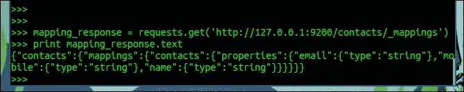
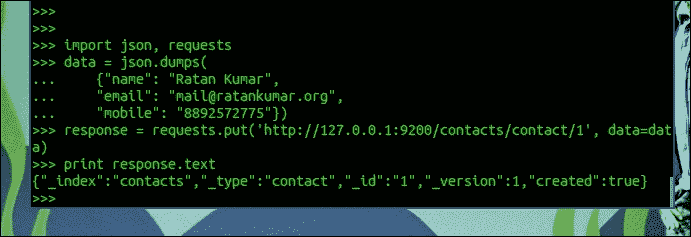
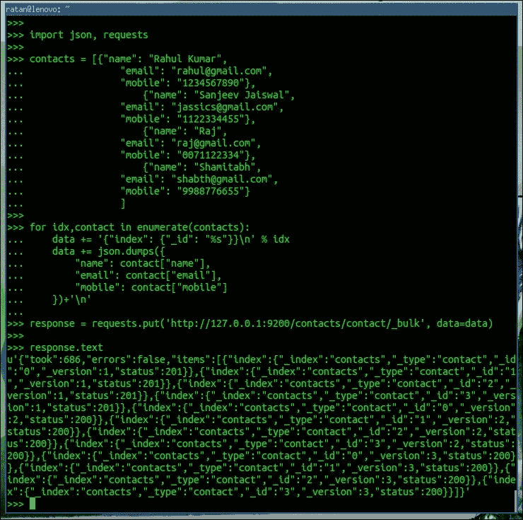

# 第 15 章。下一步是什么？

Web 开发随着时间的推移而发展，用户消费信息的设备也在不断发展。早些时候，网络是为大屏幕设备设计的，但最近的趋势表明，小屏幕设备和手持设备的消费量有所增加。因此，这里需要塑造 Web 以服务于小屏幕设备，但这些设备对电源非常敏感。因此，在 Django 中需要将后端函数与前端函数分开。

其中一个最广泛使用的解决方案是使用 Django 后端，并在前端启用 API，以便将其与 Django 一起使用。在这种情况下使用**AngularJS**是最合适的。

REST 是 web 开发的未来，RESTAPI 是现代 web 不可分割的一部分。随着跨设备的碎片增加，需要单个最小端点，该端点不执行任何表示操作。例如，信息检索或交换可以尽可能快，也可以扩展，而这方面的表示或业务逻辑则由使用前端框架的现代浏览器掌握。

# AngularJS 与 Django 会面

AngularJS 是一个现代 JavaScript 框架，用于在浏览器中创建复杂的 web 应用程序。

自 2009 年 AngularJS诞生以来，其发展非常迅速，并被广泛接受为生产级前端框架。它现在由谷歌维护。

AngularJS 有一个非常有趣的出生故事。angular 的一位创建者在 3 周内通过将代码行数从 17000 行减少到 1000 行，重新创建了一个 web 应用程序，这一过程最初需要 6 个月的时间。

AngularJS 比传统的 web 开发框架有许多特性。其中，一些独特且创新的特性包括双向数据绑定、依赖项注入、易于测试的代码以及使用指令扩展 HTML 方言。

对于服务器端，我们可以使用**Django REST 框架**或**Tastypie**作为 REST 端点。然后，我们可以使用专注于 MVC 模型的 AngularJS 来鼓励创建易于维护的模块。

Web 技术已经从同步发展到异步，也就是说，网站请求现在大量使用异步调用来刷新其内容，而无需重新加载页面，Facebook 墙就是一个例子。

AngularJS 是 Django web 开发更好的异步需求解决方案之一。

在下面的示例中，我们将使用 AngularJS 创建一个页面，该页面使用我们已经创建的 tweet API。

我们将使用 AngularJS 列出所有推文，但在此之前，我们需要熟悉 AngularJS 的关键术语：

*   **指令**：对于这一点，HTML 文件使用自定义属性和元素进行扩展。AngularJS 使用**ng 指令**扩展 HTML。**ng app**指令用于定义 AngularJS 的应用。**ng 模型**指令将 HTML 控件（输入、复选框、单选、选择和文本区域）的值绑定到应用程序。**data.ng-bind**指令将应用程序数据绑定到 HTML 视图。
*   **模型**：此为视图中显示给用户的数据，用户与之交互。
*   **范围**：这个是存储模型的上下文，以便控制器、指令和表达式可以访问它。
*   **控制器**：这是视图背后的主要业务逻辑。

当我们设计一个基于 API 的 web 应用程序时，很有可能两者（API 的后端和 webapp 前端）都位于不同的服务器上。因此，需要为**跨源资源共享**配置 Django。

根据维基百科上解释的定义：

> *跨源资源共享（CORS）是一种机制，允许从资源来源域之外的另一个域请求网页上的许多资源（例如字体、JavaScript 等）。*

我们需要修改 Django API，以允许来自其他服务器的请求。我们现在将更新`tweets`应用程序的`api.py`文件，以允许`the requests`到服务器跨站点请求：

```py
class CORSResource(object):
  """
  Adds CORS headers to resources that subclass this.
  """
  def create_response(self, *args, **kwargs):
    response = super(CORSResource, self).create_response(*args, **kwargs)
    response['Access-Control-Allow-Origin'] = '*'
    response['Access-Control-Allow-Headers'] = 'Content-Type'
    return response

  def method_check(self, request, allowed=None):
    if allowed is None:
      allowed = []

    request_method = request.method.lower()
    allows = ','.join(map(unicode.upper, allowed))
    if request_method == 'options':
      response = HttpResponse(allows)
      response['Access-Control-Allow-Origin'] = '*'
      response['Access-Control-Allow-Headers'] = 'Content-Type'
      response['Allow'] = allows
      raise ImmediateHttpResponse(response=response)

    if not request_method in allowed:
      response = http.HttpMethodNotAllowed(allows)
      response['Allow'] = allows
      raise ImmediateHttpResponse(response=response)
    return request_method
```

在添加这个类之后，我们可以创建任何资源的子类，这些资源是我们想要为跨域请求公开的。我们现在将更改`Tweet`类，使其可用于跨站点访问。

让我们将`Tweet`类更新为以下内容：

```py
class TweetResource(CORSResource, ModelResource):
  class Meta:
    queryset = Tweet.objects.all()
    resource_name = 'tweet'
```

现在，tweet 资源可以从不同的域访问了。

以下是一个基本的 AngularJS 示例：

创建一个名为`app.html`的HTML 文件（由于该文件独立于我们现有的 Django 项目，我们可以在项目文件夹外创建它），并包含以下内容。目前，此页面使用本地磁盘上的 AngularJS，您也可以从 CDN 导入页面：

```py
<html ng-app="tweets">
  <head>
    <title>Tweets App</title>
    <script src="angular.min.js"></script>
  </head>
  <body>
    <div ng-controller="tweetController"> 
      <table>
        <tr ng-repeat="tweet in tweets">
          <td>{{ tweet.country }}</td>
          <td>{{ tweet.text }}</td>
        </tr>
      </table>
    </div>
    <script src="app.js"></script>
  </body>
</html>
```

在下面的代码中，`ng-controller`指令在其呈现时被触发，它处理任何业务逻辑并将计算出的模型注入范围内。

`<div ng-controller="tweetController">`标记是在呈现`tweetController`参数的`div`之前处理`tweetController`参数的一个示例。

我们在`app.js`文件中有完整的 JavaScript 业务逻辑：

```py
var app = angular.module('tweets', []);
app.controller("tweetController", function($scope,$http) {
  $http({ headers: {'Content-Type': 'application/json; charset=utf-8'},
  method: 'GET',
  url: "http://127.0.0.1:8000/api/v1/tweet/?format=json"
  })
    .success(function (data) {
    $scope.tweets = data.objects;
  })
});
```

此`app.js`文件向 tweets 的 API 端点发出请求，并将`tweets`对象注入作用域，该作用域由视图中的 AngularJS（`app.html`使用`ng-repeat`循环指令呈现：

```py
  <tr ng-repeat="tweet in tweets">
    <td>{{ tweet.country }}</td>
    <td>{{ tweet.text }}</td>
  </tr>
```

下图显示了上述代码的输出，其中显示了国家和 tweets：


这只是一个基本的 AngularJS 应用程序，因为高级 web 开发已经完全从后端转移到前端。基于 AngularJS 的应用程序最适合于完整的单页应用程序。

# Django 搜索与 Elasticsearch

搜索已经成为我们现在处理的大多数应用程序中不可或缺的一部分。从 Facebook，到搜索朋友，再到谷歌，在那里你可以搜索整个网站，从博客到日志，一切都需要一个搜索功能来解锁网站上隐藏的信息。

网络正以指数级的速度发展。GB 的数据现在已经过时，每天都会生成数百 TB 的结构化和非结构化数据。

**Elasticsearch**（**ES**）优于其他替代方案，因为除了提供全文搜索外，它还提供有意义的实时数据分析，并且具有高度可扩展性，并对群集数据基础架构提供了强大的支持。

Elasticsearch还为您提供了一个简单的 REST API，可以轻松地与任何自定义应用程序集成，Django（更广泛地说，是 Python）开发环境为实现 Elasticsearch 提供了许多现成的工具。

Elasticsearch网站（[http://www.elasticsearch.org/](http://www.elasticsearch.org/) 包含了详尽的文档，网上有很多很好的例子，可以帮助你建立任何你需要的搜索。通过充分利用 Elasticsearch，您可能可以用它构建自己的“谷歌”。

## 安装 Elasticsearch 服务器

首先，安装 Java。然后，下载并提取 Elasticsearch。您可以将 ES 作为服务运行，也可以使用以下 Shell 命令启动 ES 服务器（根据您的系统更改路径）：

```py
set JAVA_HOME=\absolute\path\to\Java
\absolute\path\to\ES\bin\elasticsearch

```

如果操作正确，您可以在浏览器中调用以下 URL：

`http://127.0.0.1:9200/`

它将以以下方式向您提供响应，但使用不同的`build_hash`参数：

```py
{
  "status" : 200,
  "name" : "MN-E (Ultraverse)",
  "cluster_name" : "elasticsearch",
  "version" : {
    "number" : "1.4.1",
    "build_hash" : "89d3241d670db65f994242c8e8383b169779e2d4",
    "build_timestamp" : "2014-11-26T15:49:29Z",
    "build_snapshot" : false,
    "lucene_version" : "4.10.2"
  },
  "tagline" : "You Know, for Search"
}
```

Elasticsearch 提供了基本部署的基本配置。但是，如果您想调整配置，请参考其在线文档并更改`elasticsearch.yml`文件中的 Elasticsearch 配置。

### Elasticsearch 与 Django 之间的通信

Django可以使用基本 Python 编程与 Elasticsearch 无缝集成。在本例中，我们将使用 Python 请求库从 Django 向 Elasticsearch 发出请求。我们可以通过键入以下代码来安装请求：

```py
$pip install requests

```

搜索功能主要需要执行三个操作：

1.  创建 Elasticsearch 索引。
2.  为索引提供数据。
3.  检索搜索结果。

#### 创建 Elasticsearch 索引

在使用文本加载Elasticsearch 索引并检索搜索结果之前，Elasticsearch 必须了解有关您的内容以及数据应如何处理的一些详细信息。因此，我们创建一个由设置和映射组成的 ES 索引。**映射**是 Django 的内容模型数据字段定义的 ES 等价物。

虽然映射是完全可选的，因为 Elasticsearch 会根据其获取的用于索引的信息动态创建映射，但建议您预定义用于索引的数据映射。

创建 ES 索引的 Python 示例如下：

```py
  data = {
    "settings": {
      "number_of_shards": 4,
      "number_of_replicas": 1
    },
    "mappings": {
      "contacts": {
        "properties": {
          "name": { "type": "string" },
          "email": { "type": "string" },
          "mobile": { "type": "string" }
        },
        "_source": {
          "enabled": "true"
        }
      }
    }
  }
}

import json, requests
response = requests.put('http://127.0.0.1:9200/contacts/', data=json.dumps(data))
print response.text
```

前面代码的输出如下图所示：


对于使用 Elasticsearch 执行的每个操作，它都会给出一条响应消息，如`{"acknowledged":true}`，这意味着我们的索引已由 Elasticsearch 成功创建。

我们可以通过发出如下查询命令来检查映射是否已实际更新：

```py
mapping_response = requests.get('http://127.0.0.1:9200/contacts/_mappings')
print mapping_response.text

```

下图显示已使用新映射更新 Elasticsearch：



在我们创建了第一个 Elasticsearch 索引之后，我们用这些信息创建了 JSON 字典，并通过 Python 请求将这些信息转储到 Elasticsearch 中。**“contacts”**参数是我们选择的索引名称，我们将使用此名称从 Elasticsearch 服务器提供和检索数据。**“映射”**键描述索引将保存哪些数据。我们可以有任意多个不同的映射。每个映射都包含一个存储数据的字段，就像 Django 模型一样。一些基本的核心字段是字符串、数字、数据、布尔值等。完整列表见 Elasticsearch 文档。ES 术语表中解释了“碎片”和“副本”参数。如果没有“设置”键，ES 将只使用默认值，而在大多数情况下，默认值是完全正确的。

#### 向索引提供数据

现在您已经创建了一个索引，让我们将内容存储在其中。我们虚构的 BlogPost 模型的 Python 代码示例包含标题、描述和内容作为文本字段，如下所示：

```py
import json, requests
data = json.dumps(
  {"name": "Ratan Kumar",
  "email": "mail@ratankumar.org",
  "mobile": "8892572775"})
response = requests.put('http://127.0.0.1:9200/contacts/contact/1', data=data)
print response.text
```

您将看到输出，如下所示：



此确认表明我们的联系数据已被索引。当然，索引单个数据并搜索它并没有多大意义，所以在进行检索查询之前，我们将索引更多联系人。

Elasticsearch 还提供批量索引，可按如下方式使用：

```py
import json, requests
contacts = [{"name": "Rahul Kumar",
  "email": "rahul@gmail.com",
  "mobile": "1234567890"},
  {"name": "Sanjeev Jaiswal",
  "email": "jassics@gmail.com",
  "mobile": "1122334455"},
  {"name": "Raj",
  "email": "raj@gmail.com",
  "mobile": "0071122334"},
  {"name": "Shamitabh",
  "email": "shabth@gmail.com",
  "mobile": "9988776655"}
]

for idx, contact in enumerate(contacts):
  data += '{"index": {"_id": "%s"}}\n' % idx
  data += json.dumps({
    "name": contact["name"],
    "email": contact["email"],
    "mobile": contact["mobile"]
  })+'\n'
```

让我们来看看下面的截图：



正如您在前面的屏幕截图中所看到的，**“状态”：201**参数，在 HTTP 状态下表示记录已成功创建。Elasticsearch 逐行读取数据，因此我们在每个数据集的末尾使用了**“\n”**。批量操作比运行多个单个请求快得多。

这个例子是一个简单的 JSON 例子。当我们在 Django 应用程序中使用 Elasticsearch 时，相同的 JSON 对象可以被 Django 模型替换，为了索引模型，您可以从`ModelName.objects.all()`查询中获取所有 Django 模型对象，然后解析并保存它。此外，对于手动 ID，正如我们在前面的示例中使用的，即索引计数，如果您使用主键将其索引为 Elasticsearch ID，将更加方便。如果我们不将对象信息作为有效负载传递，这将帮助我们直接查询结果对象。

#### 从索引中检索搜索结果

搜索索引相当简单。同样，我们使用 Python 请求向 ES 端点发送 JSON 编码的数据字符串：

```py
data = {
  "query": {
    "query_string": { "query": "raj" }
  }
}

response = requests.post('http://127.0.0.1:9200/contacts/contact/_search', data=json.dumps(data))
print response.json()
```

这将给出一个结果，如下图所示：


在本例中，我们正在联系人索引中查找术语**“raj”**。ES 以 JSON 编码格式返回按相关性排序的所有点击。每个点击都包含一个**【id】**字段，该字段为您提供相关博客文章的主键。使用 Django 的 ORM，现在从数据库检索实际对象变得简单了。

### 注

ES 搜索端点提供了一组无限的选项和过滤器；快速检索庞大的数据集、分页以及构建强大搜索引擎所需的一切。

这只是冰山一角。当您使用 Elasticsearch 构建 Django 应用程序时，您将探索许多有趣的特性，例如聚合，可以在前面的示例中使用。它列出了 Ratan 和 autocomplete 的所有联系信息，当用户开始在搜索框中输入联系人时，这些信息将用于建议用户 Elasticsearch 中的全名。

# 总结

在本章中，我们了解了 Django 项目中最常用的两个重要组件，即 AngularJS 和 Elasticsearch。作为前端框架，AngularJS 不仅通过将渲染逻辑推送到浏览器来减少服务器的负载，还为用户提供了使用 AngularJS 驱动的应用程序的丰富体验。

另一方面，Elasticsearch 是最流行的搜索引擎之一，也是开源的。Elasticsearch 易于设置和扩展，这使得它成为任何搜索引擎需求的选择。你也学到了一些关于 Django 的知识。在本章开始时，我们确信您的目标是学习一项技能并成为这方面的专家。那么这仅仅是开始,；在本章讨论的每个主题中，您需要在专家级别探索更多的东西。我们在这本书的末尾已经讲到了。在本书中，我们使用 Django 作为我们的框架，从无到有地构建了一个微博应用程序。我们讨论了许多与 Web2.0 和社交应用程序相关的主题，以及许多 Django 组件。您可以随时参考 Django 的在线文档。如果您想了解有关特定功能或组件的更多信息，请访问[https://docs.djangoproject.com](https://docs.djangoproject.com) 。

感谢您选择本书学习 Django web 开发基础知识。我们祝愿你在职业生涯中一切顺利。