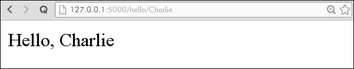
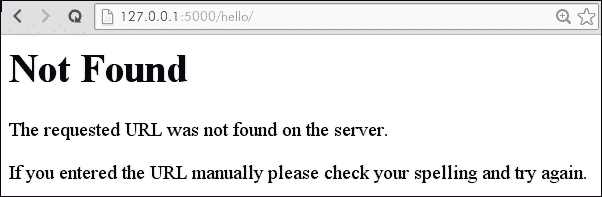

# 第 1 章：创建第一个 Flask 应用程序

*烧瓶很有趣*。当您查看正式的 Flask 文档时，首先会看到这个粗体的声明，在本书的整个过程中，您将理解为什么这么多 Python 开发人员都同意这一点。

在本章中，我们将：

*   简要讨论 Flask 框架的特性
*   设置开发环境并安装 Flask
*   实现一个 minimal Flask 应用程序并分析其工作原理
*   使用常用的 API 和交互式调试器进行实验
*   开始写博客项目，该项目将在本书的学习过程中逐步增强

# 什么是烧瓶？

Flask 是一个用 Python 编写的轻量级 Web 框架。Flask 一开始只是一个愚人节的玩笑，后来成为 Python web 框架世界中非常受欢迎的失败者。它现在是初创企业最广泛使用的 pythonweb 框架之一，并且正在成为大多数企业快速简单解决方案的理想工具。其核心是提供一组功能强大的库，用于处理最常见的 web 开发任务，例如：

*   URL 路由，可以轻松地将 URL 映射到代码
*   使用最强大的 Python 模板引擎之一 Jinja2 进行模板渲染
*   会话管理和保护 cookie
*   HTTP 请求解析和灵活的响应处理
*   基于 web 的交互式调试器
*   易于使用、灵活的应用程序配置管理

这本书将通过实际的例子教你如何使用这些工具。我们还将讨论针对 Flask 中未包含的内容的常用第三方库，例如数据库访问和表单验证。在本书结束时，你将准备好用 Flask 处理你的下一个大项目。

## 伟大的自由带来伟大的责任

正如文档所述，*Flask 很有趣*，但它也可能具有挑战性，尤其是在构建大型应用程序时。与其他流行的 PythonWeb 框架（如 Django）不同，Flask 不强制采用结构化模块或代码的方法。如果您有使用其他 web 框架的经验，您可能会惊讶地发现，在 Flask 中编写应用程序就像编写 Python 而不是框架样板。

本书将教你如何使用 Flask 编写简洁、富有表现力的应用程序。随着本书的阅读，您不仅将成为一名熟练的 Flask 开发人员，而且还将成为一名更强的 Python 开发人员。

# 建立发展环境

Flask 是用 Python 编写的，所以在开始编写 Flask 应用程序之前，我们必须确保安装了 Python。大多数 Linux 发行版和 OSX 的最新版本都预装了 Python。本书中的示例需要 Python 2.6 或 2.7。有关安装 Python 的说明，请参见[http://www.python.org](http://www.python.org) 。

如果这是您第一次使用 Python，那么在 web 上可以免费获得许多优秀的资源。我推荐*Zed Shaw*制作的*苦学 Python*，可在[在线免费获取 http://learnpythonthehardway.org](http://learnpythonthehardway.org) 。想要更多吗？您可以在[找到大量免费 Python 资源 http://resrc.io/list/10/list-of-free-programming-books/#python](http://resrc.io/list/10/list-of-free-programming-books/#python) 。

通过在命令提示符下运行 Python 交互式解释器，可以验证是否安装了 Python 以及版本是否正确：

```py
$ python
Python 2.7.6 (default, Nov 26 2013, 12:52:49)
[GCC 4.8.2] on linux2
Type "help", "copyright", "credits" or "license" for more information.
>>>

```

在提示下（`>>>`输入`exit()`并点击*进入*离开口译员。

## 支持 Python 3

本书将尽可能包含与 Python2 和 Python3 兼容的代码。不幸的是，与 Python2 相比，Python3 仍然相对较新，因此本书中使用的所有第三方软件包都不能保证与 Python3 无缝配合。为了使流行的开源库与这两个版本兼容，人们付出了很多努力，但在撰写本文时，有些库还没有被移植。为了获得最佳效果，请确保系统上安装的 Python 版本为 2.6 或更高版本。

# 安装 Python 软件包

现在，您已经确保正确安装了 Python，我们将安装一些流行的 Python 包，这些包将在本书的整个过程中使用。

我们将在系统范围内安装这些软件包，但一旦安装，我们将只在虚拟环境中工作。

## 安装管道

事实上的 Python 包安装程序是 `pip`。我们将在整本书中使用它来安装 Flask 和其他第三方库。

如果已经安装了`setuptools`，只需运行以下命令即可安装`pip`：

```py
$ sudo easy_install pip

```

安装完成后，确认`pip`安装正确：

```py
$ pip --version
pip 1.2.1 from /usr/lib/python2.7/site-packages/pip-1.2.1-py2.7.egg (python 2.7)

```

版本号可能会更改，因此有关最终指南，请参考官方说明，可在[中找到 http://www.pip-installer.org/en/latest/installing.html](http://www.pip-installer.org/en/latest/installing.html) 。

## 安装 virtualenv

一旦安装了 pip，我们就可以继续安装任何 Python 开发人员工具包中最重要的工具：`virtualenv`。Virtualenv 可以轻松地生成独立的 Python 环境，并提供自己的系统和第三方软件包副本。

### 为什么要使用 virtualenv？

Virtualenv 解决了许多与包管理相关的问题。假设您有一个使用非常早期版本的 Flask 构建的旧应用程序，并且您希望使用最新版本的 Flask 构建一个新项目。如果 Flask 是在系统范围内安装的，您将被迫升级旧项目或根据旧 Flask 编写新项目。如果两个项目都使用 virtualenv，那么每个项目都可以运行自己版本的 Flask，而不会发生冲突或问题。

Virtualenv 可以轻松控制项目使用的第三方软件包的版本。

另一个考虑因素是，在系统范围内安装软件包通常需要提升权限（`sudo pip install foo`。通过使用 virtualenvs，您可以作为普通用户创建 Python 环境并安装软件包。如果您正在部署到共享主机环境，或者您没有管理员权限，这一点尤其有用。

### 使用 pip 安装 virtualenv

我们将使用 pip 安装`virtualenv`；因为它是一个标准的 Python 包，所以可以像其他 Python 包一样安装它。为确保`virtualenv`在系统范围内安装，请运行以下命令（需要提升权限）：

```py
$ sudo pip install virtualenv
$ virtualenv --version
1.10.1

```

版本号可能会更改，因此有关最终指南，请参考[中的官方说明 http://virtualenv.org](http://virtualenv.org) 。

# 创建您的第一个烧瓶应用程序

现在我们已经安装了适当的工具，我们准备创建第一个 Flask 应用程序。首先，在方便的地方创建一个目录，用于存放所有 Python 项目。在命令提示符或终端上，导航到项目目录；我的名字是`/home/charles/projects`，在基于 Unix 的系统上简称为`~/projects`。

```py
$ mkdir ~/projects
$ cd ~/projects

```

现在我们将创建一个`virtualenv`。下面的命令将在项目文件夹中创建一个名为`hello_flask`的新目录，该目录包含一个完整、隔离的 Python 环境。

```py
$ virtualenv hello_flask

New python executable in hello_flask/bin/python2.
Also creating executable in hello_flask/bin/python
Installing setuptools............done.
Installing pip...............done.
$ cd hello_flask

```

如果您列出了`hello_flask`目录的内容，您将看到它创建了几个子目录，包括一个包含 Python 和 pip 副本的`bin`文件夹（Windows 上的`Scripts`。下一步是激活新的 virtualenv。根据您使用的是 Windows 还是 Mac OS/Linux，说明会有所不同。要激活 virtualenv，请参阅以下屏幕截图：


创建 hello_flask virtualenv

当您`activate`a`virtualenv`时，您的 PATH 环境变量将临时修改为，以确保您安装或使用的任何软件包都仅限于您的`virtualenv`。

## 在您的 virtualenv 中安装烧瓶

既然我们已经验证了我们的`virtualenv`设置正确，我们就可以安装烧瓶了。

当您在 virtualenv 中时，您不应该安装具有管理员权限的软件包。如果您在尝试安装 Flask 时收到权限错误，请再次检查您是否正确激活了您的`virtualenv`（您应该在命令提示符中看到（`hello_flask`）。

```py
(hello_flask) $ pip install Flask

```

在将 Flask 软件包安装到 virtualenv 之前，pip 下载 Flask 软件包和相关依赖项时，您会看到一些文本滚动显示。Flask 依赖于另外两个第三方库，pip 将自动为您下载并安装这些库。让我们验证是否所有设备都已正确安装：

```py
(hello_flask) $ python
>>> import flask
>>> flask.__version__
'0.10.1'
>>> flask
<module 'flask' from '/home/charles/projects/hello_flask/lib/python2.7/site-packages/flask/__init__.pyc'>

```

祝贺您已经安装了 Flask，现在我们可以开始编码了。

## 你好，小瓶子！

在名为`app.py`的`hello_flask`虚拟环境中创建一个新文件。使用您喜爱的文本编辑器或 IDE，输入以下代码：

```py
from flask import Flask

app = Flask(__name__)

@app.route('/')
def index():
    return 'Hello, Flask!'

if __name__ == '__main__':
    app.run(debug=True)
```

保存文件，然后通过从命令行运行它来执行`app.py`。您需要确保已激活`hello_flask`虚拟机：

```py
$ cd ~/projects/hello_flask
(hello_flask) $ python app.py
* Running on http://127.0.0.1:5000/

```

打开您的最喜爱的 web 浏览器，导航到显示的 URL（`http://127.0.0.1:5000`。你应该看到信息**你好，Flask！**显示在空白白页上。默认情况下，Flask 开发服务器在`127.0.0.1`上本地运行，绑定到端口`5000`。


你的第一个烧瓶应用程序。

## 理解代码

我们刚刚创建了一个非常基本的烧瓶应用程序。为了理解正在发生的事情，让我们逐行分解这些代码。

`from flask import Flask`

我们的应用程序首先导入`Flask`类。此类表示单个 WSGI 应用程序，是任何 Flask 项目中的中心对象。

WSGI 是在 PEP 333 中定义的 Python 标准 web 服务器接口。您可以将 WSGI 视为一组行为和方法，在实现时，这些行为和方法允许您的 web 应用程序只与大量 web 服务器一起工作。Flask 为您处理所有实现细节，因此您可以专注于编写 web 应用程序。

`app = Flask(__name__)`

在这一行中，我们在变量`app`中创建了一个应用程序实例，并将模块的名称传递给它。变量`app`当然可以是任何东西，但是`app`是大多数 Flask 应用程序的常见约定。应用程序实例是视图、URL 路由、模板配置等的中心注册表。我们提供当前模块的名称，以便应用程序能够通过查看当前文件夹中的内容来查找资源。稍后，当我们想要呈现模板或提供静态文件时，这将非常重要。

```py
@app.route('/')
def index():
 return 'Hello, Flask!'

```

在前面的几行中，我们指示 Flask 应用程序将对`/`（根 URL）的所有请求路由到此视图函数（`index`）。视图只是返回某种响应的函数或方法。每当您打开浏览器并导航到我们应用程序的根 URL 时，Flask 将调用此查看函数并将返回值发送到浏览器。

关于这些代码行，有几点需要注意：

*   `@app.route`是上面定义的`app`变量中的 Python 修饰符。此装饰符（`app.route`包装了以下函数，在本例中为`index`，以便将特定 URL 的请求路由到特定视图。这里选择 Index 作为函数的名称，因为它是 web 服务器使用的第一个页面的通用名称。其他的例子可以是主页或主页。装饰器对于 Python 开发人员来说是一个丰富而有趣的主题，所以如果您不熟悉装饰器，我建议您使用您最喜欢的搜索引擎来查找一个好的教程。
*   `index`函数不带参数。如果您来自其他 web 框架，并且希望得到一个请求对象或类似的东西，那么这可能看起来很奇怪。我们将在下面的示例中看到如何从请求中访问值。
*   `index`函数返回一个纯字符串对象。在后面的示例中，我们将看到如何呈现模板以返回 HTML。
*   以下几行在调试模式下使用内置开发服务器执行我们的应用程序。“if”语句是一种常见的 Python 约定，它确保仅当我们通过 Python`app.py`运行脚本时，应用程序才会运行，如果我们尝试从另一个 Python 文件导入此应用程序，则不会运行。

    ```py
    if __name__ == '__main__':
        app.run(debug=True)
    ```

## 路由和请求

现在，我们的 Flask 应用程序没有太多乐趣，所以让我们看看我们可以通过哪些不同的方式为我们的 web 应用程序添加更多有趣的行为。一种常见的方法是添加响应行为，以便我们的应用程序查看 URL 中的值并处理它们。让我们在 Hello Flask 应用程序中添加一条名为`hello`的新路线。此新路线将向 URL 中显示姓名的人显示问候语：

```py
from flask import Flask

app = Flask(__name__)

@app.route('/')
def index():
    return 'Hello, Flask!'

@app.route('/hello/<name>')
def hello(name):
    return 'Hello, %s' % name

if __name__ == '__main__':
    app.run(debug=True)
```

再次，让我们运行我们的应用程序，并在 web 浏览器中打开它。我们现在可以导航到一个 URL，如`http://127.0.0.1/hello/Charlie`并查看我们的自定义消息：



我们的 Flask 应用程序显示自定义消息

在前面的示例中，我们添加的路由指定了一个参数：`name`。此参数也作为唯一参数出现在函数声明中。Flask 自动将 URL`/hello/Charlie`与`hello`视图匹配；这就是所谓的映射。然后它将字符串`Charlie`作为参数传递到我们的视图函数中。

如果我们导航到`http://127.0.0.1:5000/hello/`而不指定名称，会发生什么？如您所见，Flask 开发服务器将返回一个`404`响应，表明 URL 与任何已知路由都不匹配。



第 404 页

### 从请求中读取值

除了到 URL 之外，还可以在查询字符串中向您的应用程序传递值。查询字符串由添加到 URL 上的任意键和值组成，使用问号：

<colgroup><col style="text-align: left"> <col style="text-align: left"></colgroup> 
| 

统一资源定位地址

 | 

参数值

 |
| --- | --- |
| `/hello/?name=Charlie` | 姓名：查理 |
| `/hello/?name=Charlie&favorite_color=green` | 姓名：查理最喜欢的颜色：绿色 |

为了在视图函数中访问这些值，Flask 提供了一个请求对象，该对象封装了有关当前 HTTP 请求的各种信息。在下面的示例中，我们将修改我们的`hello`视图，以响应通过查询字符串传入的名称。如果查询字符串或 URL 中没有指定名称，我们将返回 404。

```py
from flask import Flask, abort, request

app = Flask(__name__)

@app.route('/')
def index():
    return 'Hello, Flask!'

@app.route('/hello/<name>')
@app.route('/hello/')
def hello(name=None):
    if name is None:
        # If no name is specified in the URL, attempt to retrieve it
        # from the query string.
        name = request.args.get('name')
        if name:
            return 'Hello, %s' % name
    else:
        # No name was specified in the URL or the query string.
        abort(404)

if __name__ == '__main__':
    app.run(debug=True)
```

如您所见，我们在`hello`视图中添加了另一个路由装饰器：Flask 允许您将多个 URL 路由映射到同一视图。因为我们的新路由不包含 name 参数，所以我们需要修改 view 函数的参数签名，使`name`成为可选参数，我们通过提供一个默认值`None`来实现这一点。

我们视图的函数体也被修改，以检查URL 中是否存在名称。如果未指定名称，我们将使用`404`页面未找到状态代码中止。


使用查询字符串问候某人

## 调试烧瓶应用程序

我们迟早会在代码中引入 bug，这是不可避免的。由于 bug 是不可避免的，作为开发人员，我们所能期望的最好的东西就是能够帮助我们快速诊断和修复 bug 的好工具。幸运的是，Flask 附带了一个非常强大的基于 web 的调试器。Flask 调试器使您能够在发生错误时对应用程序的状态进行内省，从而无需插入打印语句或断点。

这可以通过告诉 Flask 应用程序在运行时以`debug`模式运行来启用。我们可以通过几种方式实现这一点，但实际上我们已经通过以下代码实现了这一点：

```py
if __name__ == '__main__':
    app.run(debug=True)
```

为了尝试一下，让我们通过创建一个输入错误来为`hello_flask`应用程序引入一个 bug。在这里，我只是从变量`name`中删除了尾随的 e：

```py
@app.route('/hello/<name>')
@app.route('/hello/')
def hello(name=None):
    if nam is None:
        # No name was specified in the URL or the query string.
        abort(404)
```

当我们启动开发服务器并尝试访问视图时，现在会显示调试页面：


在 web 浏览器中运行的 Flask 交互式调试器

此代码列表称为**回溯**，它由调用堆栈、实际错误之前的函数调用嵌套列表组成。回溯通常为可能发生的事情提供了一个很好的线索。在最底部，我们看到了我们故意输入错误的代码行以及实际的 Python 错误，这是一个**NameError**异常，告诉我们**nam**没有定义。


显示我们的打字错误和错误描述的回溯细节

真正的魔术发生在你用鼠标将鼠标放在突出显示的线上。在右侧，您将看到两个小图标，分别表示终端和源代码文件。单击**源代码**图标将展开包含错误的行周围的源代码。这对于解释错误时建立上下文非常有用。

终端图标是最有趣的。当您点击**终端**图标时，会出现一个带有标准 Python 提示的小控制台。此提示允许您在异常发生时实时检查局部变量的值。尝试键入`name`并点击*输入*——它应该显示 URL 中指定的值（如果有）。我们还可以按如下方式反思当前的请求参数：


使用调试控制台内省变量

当您自己完成章节和实验时，能够快速诊断和纠正任何错误将是一项非常有价值的技能。我们将回到[第 8 章](08.html "Chapter 8. Testing Flask Apps")*测试烧瓶应用程序*中的交互式调试器，但现在，请注意它的存在，并可用于在代码何时何地中断时反思代码。

# 介绍博客项目

在本书的其余部分，我们将构建、增强和部署一个程序员友好的博客网站。本项目将向您介绍最常见的 web 开发任务，例如使用关系数据库、处理和验证表单数据，以及（每个人都喜欢的）测试。在每一章中，您都将通过实践性的编码项目学习一项新技能。在下表中，我列出了核心技能的简要说明以及博客的相应功能：

<colgroup><col style="text-align: left"> <col style="text-align: left"></colgroup> 
| 

技巧

 | 

博客网站功能

 |
| --- | --- |
| 使用 SQLAlchemy 的关系型数据库烧瓶炼金术 | 将条目和标记存储在关系数据库中。执行各种查询，包括分页、日期范围、全文搜索、内部和外部联接等。 |
| 表单处理和验证烧瓶 WTF | 使用表单创建和编辑博客条目。在后面的章节中，我们还将使用表单将用户登录到站点，并允许访问者发表评论。 |
| 使用 Jinja2 进行模板渲染金甲 2 号 | 创建一组干净、可扩展的模板，在适当的地方利用继承和包含。 |
| 用户身份验证和管理仪表盘烧瓶登录 | 将用户帐户存储在数据库中，并将 post 管理页面限制为注册用户。构建一个管理面板，用于管理帖子、用户帐户以及显示页面视图、IP 地理位置等统计信息。 |
| Ajax 和 RESTful API烧瓶 API | 构建一个支持 Ajax 的评论系统，该系统将显示在每个条目上。使用 RESTful API 公开博客条目，并构建一个简单的命令行客户端，用于使用 API 发布条目。 |
| 单元测试单元测试 | 我们将为博客构建一整套测试，并学习如何模拟真实的请求和使用模拟来简化复杂的交互。 |
| 其他一切 | **跨站点请求伪造****CSRF**保护、Atom 提要、垃圾邮件检测、异步任务执行、部署、**安全套接字层****SSL**、托管提供商等。 |

## 规格

在开始一个大型项目时，记住一个功能规范总是一个好主意。对于博客网站，我们的规范只是我们希望博客拥有的功能列表。这些功能基于我构建个人博客的经验：

*   应使用基于 web 的界面输入条目。对于格式，作者可以使用**标记**，这是一种轻量级的、视觉上有吸引力的标记语言。
*   图像可以上传到网站，并很容易嵌入到博客条目中。
*   条目可以使用任意数量的标记进行组织。
*   该网站应支持多个作者。
*   条目可以按发布顺序显示，也可以按月份、标签或作者列出。长长的条目列表将被分页。
*   条目可以保存为*草稿*并由其作者查看，但在*发布*之前，其他人不得查看。
*   该网站的访问者可以在条目上发表评论，这些评论将被检查是否存在垃圾邮件，然后由作者自行决定是否应该保持可见。
*   Atom 提要将可用于所有帖子，包括每个作者和标签的单独提要。
*   可以使用 RESTful API 访问条目。作者将获得一个 API 令牌，允许他们使用 API 修改条目。

虽然这个列表并非详尽无遗，但它涵盖了我们博客网站的核心功能，希望你能发现它既有趣又富有挑战性。在本书的最后，我将介绍一些您可能添加的其他功能的想法，但首先您需要熟悉使用 Flask。我肯定你很想开始，所以让我们开始我们的博客项目吧。

## 创建博客项目

让我们首先在我们的工作目录中创建一个新项目；在我的笔记本电脑上这是`/home/charles/projects`，或者在 Unix 系统上简称`~/projects,`。这正是我们创建`hello_flask`应用程序时所做的：

```py
$ cd ~/projects
$ mkdir blog
$ cd blog

```

然后我们需要设置我们的`virtualenv`环境。这与我们之前所做的不同，因为这是一种更结构化的使用 virtualenv 的方式：

```py
$ virtualenv blog

```

下一步是将 Flask 安装到我们的 virtualenv 中。为此，我们将`activate`安装`virtualenv`并使用`pip`安装烧瓶：

```py
$ source blog/bin/activate
(blog) $ pip install Flask

```

到目前为止，所有这些都应该是您熟悉的。但是，我们可以创建一个名为`app`的新文件夹，使我们的应用程序模块化，更具逻辑性，而不是为我们的应用程序创建一个单独的文件（我们绝对可以这样做，这对于非常小的应用程序来说是有意义的）。在该文件夹中，我们将创建五个名为`__init__.py`、`app.py`、`config.py`、`main.py,`和`views.py`的空文件，如下所示：

```py
mkdir app
touch app/{__init__,app,config,main,views}.py

```

最后一个命令使用 shell 的一个小技巧创建多个名称在括号内的文件。如果使用版本控制，您将希望将`app`目录视为存储库的根目录。应用程序目录将包含博客应用程序的源代码、模板和静态资产。如果您还没有使用版本控制，那么现在是尝试一下的好时机。*Pro Git*是一个很好的资源，在[免费提供http://git-scm.com/book](http://git-scm.com/book) 。

我们刚刚创建的这些文件是什么？正如您将看到的，每个文件都有一个重要的用途。希望他们的名字能为他们的目的提供线索，但以下是每个模块职责的简要概述：

<colgroup><col style="text-align: left"> <col style="text-align: left"></colgroup> 
| `__init__.py` | 告诉 Python 将 app/目录用作 Python 包 |
| `app.py` | 烧瓶应用程序 |
| `config.py` | Flask 应用程序的配置变量 |
| `main.py` | 执行应用程序的入口点 |
| `views.py` | 应用程序的 URL 路由和视图 |

### 赤骨烧瓶应用程序

让我们用创建可运行 Flask 应用程序所需的最低代码量来填充这些文件。这个将使我们的项目在第二章中处于良好状态，在第二章中，我们将开始编写代码，从数据库中存储和检索博客条目。

我们将从`config.py`模块开始。此模块将包含一个`Configuration`类，该类指示 Flask 我们希望在`DEBUG`模式下运行我们的应用程序。将以下两行代码添加到`config.py`模块，如下所示：

```py
class Configuration(object):
    DEBUG = True
```

接下来，我们将创建 Flask 应用程序，并指示它使用`config`模块中指定的配置值。将以下代码添加到`app.py`模块：

```py
from flask import Flask

from config import Configuration  # import our configuration data.

app = Flask(__name__)
app.config.from_object(Configuration)  # use values from our Configuration object.
```

视图模块将包含一个映射到站点根 URL 的视图。将以下代码添加到`views.py`：

```py
from app import app

@app.route('/')
def homepage():
    return 'Home page'
```

正如您可能注意到的，我们仍然没有接到`app.run()`的电话。我们将把代码放在`main.py`中，我们将把它作为我们应用程序的入口点。将以下代码添加到`main.py`模块：

```py
from app import app  # import our Flask app
import views

if __name__ == '__main__':
    app.run()
```

我们没有调用`app.run(debug=True)`，因为我们已经指示 Flask 在`Configuration`对象中以调试模式运行我们的应用程序。

您可以通过以下方式执行`main`模块，从命令行运行应用程序：

```py
$ python main.py
 * Running on http://127.0.0.1:5000/
* Restarting with reloader

```


从卑微的开始。。。

### 缩小

除了`Configuration`类之外，大多数代码对您来说应该很熟悉。我们基本上已经从`hello_flask`示例中提取了代码，并将其分为几个模块。每个文件只写两三行代码似乎很愚蠢，但随着我们项目的发展，您将看到这种对组织的早期承诺是如何获得回报的。

您可能已经注意到，根据导入顺序，这些文件有一个内部优先级，这是为了减少循环导入的可能性。当两个模块相互导入，因此根本无法导入时，就会发生循环导入。使用 Flask 框架时，创建循环导入非常容易，因为有太多不同的东西依赖于中心应用程序对象。为了避免出现问题，有些人只是将所有内容都放在一个模块中。这适用于较小的应用程序，但在超过一定大小或复杂度时不可维护。这就是为什么我们将我们的应用程序分成几个模块，并创建一个单一的入口点来控制导入的顺序。

### 进口流程

从命令行运行 python`main.py`时开始执行。Python 解释器运行到的第一行代码从`app`模块导入`app`对象。现在我们进入了`app.py`，它导入了烧瓶和我们的`Configuration`对象。`app.py`模块的其余部分被读取和解释，我们又回到了`main.py`。`main.py`的第二行导入`views`模块。现在我们进入了`views.py`，这取决于`@app.route`的`app.py`，事实上，已经可以从`main.py`获得。URL 路由和视图在`views`模块被解释时被注册，我们再次回到`main.py`。由于我们直接运行`main.py`，因此“如果”检查将评估为`True`，我们的应用程序将运行。


执行 main.py 时导入流

# 总结

现在，您应该已经熟悉了为 Python 项目设置新 virtualenv 的过程，能够安装 Flask，并且已经创建了一个简单的应用程序。在本章中，我们讨论了如何为您的项目创建 virtualenvs，并使用`pip`安装第三方软件包。我们还学习了如何编写基本的 Flask 应用程序、将请求路由到视图以及读取请求参数。我们熟悉了交互式调试器以及 Python 解释器如何处理导入语句。

如果你已经熟悉了本章的大部分内容，不要担心；事情很快就会变得更具挑战性。

在下一章中，您将了解如何使用关系数据库来存储和检索博客条目。我们将向项目中添加一个新模块，用于存储特定于数据库的代码，并创建一些模型来表示博客条目和标记。一旦我们能够存储条目，我们将学习如何通过过滤、排序和聚合以各种方式读回它们。有关更多信息，请参阅以下链接：

*   [https://www.python.org/dev/peps/pep-0333/](https://www.python.org/dev/peps/pep-0333/)
*   [https://wiki.python.org/moin/PythonDecorators](https://wiki.python.org/moin/PythonDecorators)
*   [http://charlesleifer.com](http://charlesleifer.com)