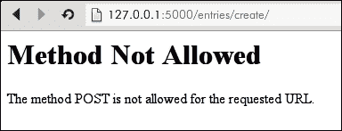
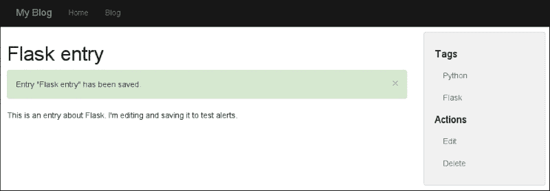
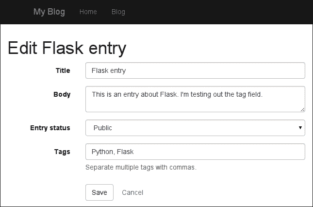

# 四、表单与验证

在本章中，我们将学习如何使用表单直接通过网站修改我们博客上的内容。这将是一个有趣的章节，因为我们将添加各种新的方式与我们的网站互动。我们将创建用于使用条目模型的表单，学习如何接收和验证用户数据，最后更新数据库中的值。表单处理和验证将由流行的**WTForms**库处理。我们将继续构建视图和模板来支持这些新表单，并在此过程中学习一些新的 Jinja2 技巧。

在本章中，我们将：

*   安装 WTForms 并创建用于使用条目模型的表单
*   编写视图以验证和处理表单数据，并保留对数据库的更改
*   创建模板以显示表单和验证错误
*   使用 Jinja2 宏封装复杂的模板逻辑
*   向用户显示 flash 消息
*   创建一个图像上传器，学习如何安全地处理文件上传
*   了解如何存储和服务静态资产，如 JavaScript、样式表和图像上传

# 开始使用 WTForms

**WTForms**是烧瓶社区中进行表单处理和验证的热门选择。它使用声明式方法构建表单（类似于我们定义 SQLAlchemy 模型的方式），并支持各种不同的字段类型和验证器。

### 注

在撰写本书时，WTForms 2.0 仍然是一个开发版本，但不久将成为正式版本。因此，本书中我们将使用 2.0 版。

让我们从将 WTForms 安装到我们的博客项目`virtualenv`开始：

```py
(blog) $ pip install "wtforms>=2.0"
Successfully installed wtforms
Cleaning up...

```

我们可以通过打开 shell 并检查项目版本来验证安装是否成功：

```py
(blog) $ ./manage.py shell
In [1]: import wtforms

In [2]: wtforms.__version__
Out[2]: '2.0dev'

```

我的版本显示自 2.0 以来的开发版本尚未正式发布。

## 定义录入模型的表单

我们的目标是能够通过我们的网站直接创建和编辑博客条目，因此我们需要回答的第一个问题是我们将如何为新条目输入数据？当然，答案是通过使用表单。表单是 HTML 标准的一部分，它允许我们使用自由格式文本输入、大型多行文本框、下拉选择、复选框、单选按钮等。当用户提交表单时，表单会指定一个接收表单数据的 URL。该 URL 然后可以处理数据，然后以它喜欢的任何方式响应。

对于博客条目，让我们通过三个字段保持简单：

*   `Title`，显示为简单文本输入
*   `Body`，显示为一个大的自由格式文本框
*   `Status`，显示为下拉选择

在`entries`目录中，创建一个名为`forms.py`的新 Python 文件。我们将定义一个包含这些字段的简单表单类。打开`forms.py`并添加以下代码：

```py
import wtforms

from models import Entry

class EntryForm(wtforms.Form):
    title = wtforms.StringField('Title')
    body = wtforms.TextAreaField('Body')
    status = wtforms.SelectField(
        'Entry status',
        choices=(
            (Entry.STATUS_PUBLIC, 'Public'),
            (Entry.STATUS_DRAFT, 'Draft')),
        coerce=int)
```

这应该看起来非常类似于我们的模型定义。请注意，我们正在使用模型中列的名称作为表单中字段的名称：这将允许 WTForms 在条目模型字段和表单字段之间自动复制数据。

前两个字段`title`和`body`都指定了一个参数：呈现表单时将显示的标签。`status`字段包含一个标签以及两个附加参数：`choices`和`coerce`。`choices` 参数由两个元组组成，其中第一个值是我们感兴趣存储的实际值，第二个值是用户友好的表示形式。第二个参数`coerce,`将把表单中的值转换为整数（默认情况下，它将被视为字符串，我们不希望这样）。

## 有视图的窗体

为了开始使用此表单，我们需要创建一个视图，在提交表单时显示表单并接受数据。为此，让我们打开条目蓝图模块，并定义一个新的 URL 路由来处理条目创建。在`blueprint.py`文件的顶部，我们需要从`forms`模块导入`EntryForm`类：

```py
from app import db
from helpers import object_list
from models import Entry, Tag
from entries.forms import EntryForm

```

然后，在`detail`视图的定义之上，我们将添加一个名为`create`的新视图，该视图将通过导航到`/entries/create/`来访问。我们必须将其置于`detail`视图上方的原因是 Flask 将按照 URL 路由的定义顺序搜索它们。由于`/entries/create/`看起来非常像一个条目细节 URL（假设条目的标题是`create`），如果首先定义了细节路由，Flask 将停止在那里，永远不会到达创建路由。

在我们的 create 视图中，我们将简单地实例化表单并将其传递到模板上下文中。添加以下视图定义：

```py
@entries.route('/create/')
def create():
    form = EntryForm()
    return render_template('entries/create.html', form=form)
```

在我们添加代码以将新条目保存到数据库之前，让我们构建一个模板，看看我们的表单是什么样子。然后，我们将返回并添加代码以验证表单数据并创建新条目。

## create.html 模板

让我们为新表单构建一个基本的模板。在其他条目模板旁边创建一个名为`create.html`的新模板。相对于应用目录，此文件的路径应为`entries/templates/entries/create.html`。我们将扩展基本模板并覆盖内容块以显示表单。因为我们使用的是 bootstrap，所以我们将使用特殊的 CSS 类来使表单看起来很漂亮。添加以下 HTML 代码：

```py


Create new entry

Create new entry


  <form action="{{ url_for('entries.create') }}" class="form form-horizontal" method="post">
    
      <div class="form-group">
        {{ field.label(class='col-sm-3 control-label') }}
        <div class="col-sm-9">
          {{ field(class='form-control') }}
        </div>
      </div>
    
    <div class="form-group">
      <div class="col-sm-offset-3 col-sm-9">
        <button type="submit" class="btn btn-default">Create</button>
        <a class="btn" href="{{ url_for('entries.index') }}">Cancel</a>
      </div>
    </div>
  </form>

```

通过在表单上迭代，我们将表单传递到上下文中，我们可以呈现每个单独的字段。为了呈现字段，我们首先通过简单地调用`field.label()`并传入所需的 CSS 类来呈现字段的标签。类似地，为了呈现字段，我们调用`field()`，再次传入 CSS 类。还要注意的是，除了一个`submit`按钮外，我们还添加了一个`Cancel`链接，该链接将用户返回条目列表。

启动开发服务器，导航至`http://127.0.0.1:5000/entries/create/`查看以下表单：


尝试提交表单。当您点击**创建**按钮时，您会看到以下错误消息：



您看到此消息的原因是因为默认情况下，Flask 视图将只响应 HTTP`GET`请求。当我们提交表单时，浏览器会发送一个`POST`请求，我们的视图目前不接受该请求。让我们回到`create`视图，添加代码以正确处理`POST`请求。

### 提示

每当表单对数据进行更改（创建、编辑或删除某些内容）时，该表单应指定`POST`方法。其他表单，例如我们的搜索表单，不做任何更改，应该使用`GET`方法。此外，当使用`GET`方法提交表单时，表单数据作为查询字符串的一部分提交。

## 处理表格提交

在修改视图之前，让我们在`EntryForm`中添加一个帮助方法，用于将表单中的数据复制到`Entry`对象中。打开`forms.py`并添加以下内容：

```py
class EntryForm(wtforms.Form):
    ...
    def save_entry(self, entry):
 self.populate_obj(entry)
 entry.generate_slug()
 return entry

```

这个助手方法将用表单数据填充我们传入的`entry`，根据标题重新生成条目的 slug，然后返回`entry`对象。

现在表单配置为填充`Entry`模型，我们可以修改视图以接受和处理`POST`请求。我们将使用两个新的烧瓶助手，因此修改`blueprint.py`顶部的导入，添加`redirect`和`url_for`：

```py
from flask import Blueprint, redirect, render_template, request, url_for

```

添加导入后，更新对`blueprint.py`中`create`视图的以下更改：

```py
from app import db
@entries.route('/create/', methods=['GET', 'POST'])
def create():
    if request.method == 'POST':
        form = EntryForm(request.form)
        if form.validate():
            entry = form.save_entry(Entry())
            db.session.add(entry)
            db.session.commit()
            return redirect(url_for('entries.detail', slug=entry.slug))
    else:
        form = EntryForm()

    return render_template('entries/create.html', form=form)
```

这是一个新的代码，所以让我们更仔细地看看发生了什么。首先，我们向 route decorator 添加了一个参数，指示此视图同时接受`GET`和`POST`请求。这将消除我们提交表单时的**方法不允许**错误。

在视图主体中，我们现在正在检查`request`方法，并在此基础上执行两件事情之一。让我们先看一下“else”子句。当我们收到`GET`请求时，例如当有人打开浏览器并导航到`/entries/create/`页面时，将执行此代码分支。发生这种情况时，我们只想显示一个包含表单的 HTML 页面，因此我们将实例化一个表单并将其传递到模板上下文中。

如果这是一个`POST`请求，当有人提交表单时会发生，我们希望实例化`EntryForm`并传递原始表单数据。Flask 将原始 POST 数据存储在特殊属性`request.form`中，这是一个类似字典的对象。WTForms 知道如何解释原始表单数据并将其映射到我们定义的字段。

在使用原始表单数据实例化表单之后，我们需要通过调用`form.validate()`来检查并确保表单有效。如果表单由于某种原因无法验证，我们只需将无效表单传递到上下文中并呈现模板。稍后，您将看到我们如何在用户提交表单时向用户显示错误消息。

如果表单有效，我们最终可以继续保存条目。为此，我们将调用`save_entry`helper 方法，传入一个新的`entry`实例。WTForms 将用表单数据填充`Entry`对象，然后将其返回给我们，我们将其添加到数据库会话、提交和重定向中。重定向助手将发出 HTTP 302 重定向，将用户浏览器从`/entries/create/`发送到新创建博客文章的详细页面。

打开你的浏览器，试试看。


## 验证输入并显示错误消息

我们的表单有一个明显的问题：对现在没有什么可以阻止我们意外提交一个空的博客条目。为了确保在保存时有标题和内容，我们需要使用一个名为 validator 的WTForm 对象。验证器是应用于表单数据的规则，WTForms 附带了许多有用的验证器。下面列出了一些更常用的验证器：

*   `DataRequired`：此字段不能为空
*   `Length(min=?, max=?)`：验证输入的数据长度是否超过最小值或不超过最大值
*   `NumberRange(min=?, max=?)`：验证输入的号码是否在给定范围内
*   `Email`：验证数据是否为有效的电子邮件地址
*   `URL`：验证输入的数据是否为有效的 URL
*   `AnyOf(values=?)`：验证输入的数据是否等于提供的值之一
*   `NoneOf(values=?)`：确认输入的数据不等于提供的任何值

对于博客条目表单，我们将使用`DataRequired`验证器来确保在没有标题或正文内容的情况下无法创建条目。让我们打开`forms.py`并将验证器添加到表单定义中。总之，我们的表单模块应该如下所示：

```py
import wtforms
from wtforms.validators import DataRequired

from models import Entry

class EntryForm(wtforms.Form):
    title = wtforms.StringField(
        'Title',
        validators=[DataRequired()])
    body = wtforms.TextAreaField(
        'Body',
        validators=[DataRequired()])
    status = wtforms.SelectField(
        'Entry status',
        choices=(
            (Entry.STATUS_PUBLIC, 'Public'),
            (Entry.STATUS_DRAFT, 'Draft')),
        coerce=int)

    def save_entry(self, entry):
        self.populate_obj(entry)
        entry.generate_slug()
        return entry
```

启动开发服务器，现在尝试提交一个空表单。正如您所料，它将无法保存，因为对`form.validate()`的调用返回`False`。不幸的是，前端没有显示为什么我们的表单没有保存。幸运的是，WTForms 将在模板中为我们提供验证错误，我们需要做的就是修改模板以显示它们。

为了显示验证错误，我们将使用几个引导 CSS 类和结构，但最终结果看起来非常好，如下面的屏幕截图所示：


对`create.html`模板中的字段显示代码进行以下更改：

```py

  <div class="form-group has-error has-feedback">
    {{ field.label(class='col-sm-3 control-label') }}
    <div class="col-sm-9">
      {{ field(class='form-control') }}
      
        <span class="glyphicon glyphicon-warning-sign form-control-feedback"></span>
      
      <span class="help-block">{{ error }}</span>
    </div>
  </div>

```

我们通过查看`field.errors`属性来检查字段是否有任何错误。如果有任何错误，我们将执行以下操作：

*   将 CSS 类添加到`form-group`div
*   添加一个指示有错误的特殊图标
*   在表单字段下方的`<span>`中显示每个错误。由于`field.errors`是一个列表，可能包含多个验证错误，我们将使用 for 循环迭代这些错误

您现在可以使用表单创建有效的博客条目，表单还会执行一点验证，以确保您不会提交空白表单。在下一节中，我们将描述如何重新使用此表单编辑现有条目。

## 编辑现有条目

信不信由你，我们实际上可以使用与创建条目相同的表单来编辑现有条目。我们只需要对视图和模板逻辑做一些细微的更改，所以让我们开始吧。

为了编辑条目，我们需要一个视图，所以我们需要一个 URL。因为视图需要知道我们正在编辑哪个条目，所以作为 URL 结构的一部分传达这一点很重要，因此我们将在`/entries/<slug>/edit/`处设置`edit`视图。打开`entries/blueprint.py`并在详图视图下方为`edit`视图添加以下代码。注意与`create`视图的相似之处：

```py
@entries.route('/<slug>/edit/', methods=['GET', 'POST'])
def edit(slug):
    entry = Entry.query.filter(Entry.slug == slug).first_or_404()
    if request.method == 'POST':
        form = EntryForm(request.form, obj=entry)
        if form.validate():
            entry = form.save_entry(entry)
            db.session.add(entry)
            db.session.commit()
            return redirect(url_for('entries.detail', slug=entry.slug))
    else:
        form = EntryForm(obj=entry)

    return render_template('entries/edit.html', entry=entry, form=form)
```

正如我们对`create`视图所做的那样，我们检查`request`方法，并在此基础上验证和处理表单，或者简单地实例化表单并将其传递给模板。

最大的区别在于我们如何实例化`EntryForm`。我们给它传递一个额外的参数，`obj=entry`。当 WTForms 接收到一个`obj`参数时，它将尝试使用取自`obj`的值（在本例中为我们的博客条目）预填充表单字段。

我们还在模板上下文中传递一个附加值，即我们正在编辑的条目。我们将这样做，以便向用户显示条目的标题；这样，我们可以将表单链接的**取消**按钮返回到条目详细视图。

### edit.html 模板

正如您可能猜到的，`edit.html`模板将与`create.html`几乎相同。由于字段渲染逻辑的复杂性，复制并粘贴所有代码似乎不是一个好主意。如果我们决定改变表单字段的显示，我们会发现自己接触了多个文件，这应该是一个很大的危险信号。

为了避免这种情况，我们将使用一种强大的 Jinja2 功能，称为宏来渲染字段。字段渲染代码将在宏中定义，然后，无论我们在哪里渲染字段，我们都将调用我们的宏。这使得更改字段的样式非常容易。

### 提示

宏是 Jinja2 的一项功能，它允许您将模板的一部分视为一个函数，这样就可以使用不同的参数多次调用它，并生成大致相似的 HTML。您可以在 Jinja文档网站[上查看更多信息 http://jinja.pocoo.org/docs/dev/templates/](http://jinja.pocoo.org/docs/dev/templates/)

由于这个宏对于我们希望显示的任何表单字段都很有用，所以我们将把它放在应用的模板目录中。在应用的模板目录中，创建一个名为`macros`的新目录，并添加一个字段`form_field.html`。相对于 app 目录，该文件的路径为`templates/macros/form_field.html`。添加以下代码：

```py

  <div class="form-group has-error has-feedback">
    {{ field.label(class='col-sm-3 control-label') }}
    <div class="col-sm-9">
      {{ field(class='form-control', **kwargs) }}
      <span class="glyphicon glyphicon-warning-sign form-control-feedback"></span>
      <span class="help-block">{{ error }}</span>
    </div>
  </div>

```

在大多数情况下，我们只是从`create`模板复制并粘贴了字段渲染代码，但我想指出两个不同点：

*   模板以一个`macro`模板标记开始，该标记定义`macro`的名称及其接受的任何参数。
*   当我们渲染场时，我们正在传入`**kwargs`。WTForms 字段可以接受任意关键字参数，然后将这些参数转换为 HTML 标记上的属性。虽然我们目前不打算使用它，但我们将在后面的章节中使用它。
*   我们用`endmacro`标记指示宏的结束。

现在让我们更新`create.html`以使用新的宏。为了使用宏，我们必须先`import`它。然后，我们可以用对宏的简单调用替换所有字段标记。随着更改，`create.html`模板应如下所示：

```py



Create new entry

Create new entry


  <form action="{{ url_for('entries.create') }}" class="form form-horizontal" method="post">
    
      {{ form_field(field) }}
    
    <div class="form-group">
      <div class="col-sm-offset-3 col-sm-9">
        <button type="submit" class="btn btn-default">Create</button>
        <a class="btn" href="{{ url_for('entries.index') }}">Cancel</a>
      </div>
    </div>
  </form>

```

这样，我们就可以继续创建`edit.html`模板了。它看起来与`create`模板几乎相同，只是我们将在`app/entries/templates/entries`目录中显示文本，以向用户表明他们正在编辑现有条目：

```py



Edit {{ entry.title }}

Edit {{ entry.title }}


  <form action="{{ url_for('entries.edit', slug=entry.slug) }}" class="form form-horizontal" method="post">
    
      {{ form_field(field) }}
    
    <div class="form-group">
      <div class="col-sm-offset-3 col-sm-9">
        <button type="submit" class="btn btn-default">Save</button>
        <a class="btn" href="{{ url_for('entries.detail', slug=entry.slug) }}">Cancel</a>
      </div>
    </div>
  </form>

```

总结一下，在条目详细信息页面，让我们在侧边栏中添加一个链接，将我们带到`Edit`页面。将以下链接添加到`detail.html`中的侧栏：

```py
<a href="{{ url_for('entries.edit', slug=entry.slug) }}">Edit</a>
```

## 删除条目

为了完善这一部分，我们将添加一个用于删除条目的视图。我们将设计此视图，以便当用户删除条目时，会被带到确认页面。只有通过提交确认表（一个`POST`请求），他们才能真正删除条目。因为此表单不需要任何字段，所以我们不需要特殊的 WTForms 类，只需使用 HTML 创建它即可。

在`create.html`和`edit.html`模板旁边创建一个名为`delete.html`的模板，并添加以下 HTML：

```py


{{ entry.title }}

{{ entry.title }}


  <form action="{{ url_for('entries.delete', slug=entry.slug) }}" method="post">
    <fieldset>
      <legend>Delete this entry?</legend>
      <button class="btn btn-danger" type="submit">Delete</button>
      <a class="btn" href="{{ url_for('entries.detail', slug=entry.slug) }}">Cancel</a>
    </fieldset>
  </form>

```

现在我们需要定义`entries.delete`视图。与`edit`视图类似，用于删除条目的 URL 需要条目 slug 作为 URL 结构的一部分。因此，我们将使用`/entries/<slug>/delete/`。

提交表单时，我们可以简单地从数据库中删除条目，但根据我的经验，我通常会后悔永久删除内容。我们将给它一个`_DELETED`状态，而不是从数据库中实际删除条目；我们将其状态更改为`STATUS_DELETED`。然后，我们将修改视图，使具有此状态的条目永远不会出现在网站的任何部分。出于所有目的，条目都不存在了，但是，如果我们再次需要它，我们可以从数据库中检索它。在`edit`视图下方添加以下视图代码：

```py
@entries.route('/<slug>/delete/', methods=['GET', 'POST'])
def delete(slug):
    entry = Entry.query.filter(Entry.slug == slug).first_or_404()
    if request.method == 'POST':
        entry.status = Entry.STATUS_DELETED
        db.session.add(entry)
        db.session.commit()
        return redirect(url_for('entries.index'))

    return render_template('entries/delete.html', entry=entry)
```

我们还需要将状态 _DELETED 添加到 model.py 中的条目模型中：

```py
class Entry(db.Model):
    STATUS_PUBLIC = 0
    STATUS_DRAFT = 1
    STATUS_DELETED = 2
```

正如我们对编辑链接所做的那样，花点时间将`delete`链接添加到详细视图侧栏。

## 清理

让我们花一段时间来重构我们的蓝图。由于我们不想在网站上显示已删除的条目，我们需要确保按状态筛选条目。此外，查看`detail`、`edit`和`delete`视图，我看到了三个实例，其中我们复制并粘贴了代码，以通过 slug 查询条目。让我们把它也移到一个 helper 函数中。

首先，让我们更新`entry_list`助手，以筛选公共或草稿条目。

### 提示

在下一章中，我们将向站点添加登录功能。一旦有了这些，我们将添加逻辑，以便仅向创建草稿条目的用户显示草稿条目。

```py
def entry_list(template, query, **context):
    valid_statuses = (Entry.STATUS_PUBLIC, Entry.STATUS_DRAFT)
    query = query.filter(Entry.status.in_(valid_statuses))
    if request.args.get('q'):
        search = request.args['q']
        query = query.filter(
            (Entry.body.contains(search)) |
            (Entry.title.contains(search)))

    return object_list(template, query, **context)
```

我们现在可以确信，无论在哪里显示条目列表，都不会显示已删除的条目。

现在，让我们添加一个新的助手来通过其 slug 检索`Entry`。如果找不到条目，我们将返回 404。在`entry_list`下方添加以下代码：

```py
def get_entry_or_404(slug):
  valid_statuses = (Entry.STATUS_PUBLIC, Entry.STATUS_DRAFT) (Entry.query
          .filter(
              (Entry.slug == slug) &
              (Entry.status.in_(valid_statuses)))
          .first_or_404())
```

将`detail`、`edit`和`delete`视图中对`Entry.query.filter()`的调用替换为对`get_entry_or_404`的调用。以下是更新的详图视图：

```py
@entries.route('/<slug>/')
def detail(slug):
    entry = get_entry_or_404(slug)
    return render_template('entries/detail.html', entry=entry)
```

# 使用 flash 消息

当用户在站点上执行操作时，通常会在后续页面加载中显示一条一次性消息，指示其操作已成功。这些被称为闪光信息，Flask 附带了一个显示它们的助手。为了开始使用 flash 消息，我们需要绕一小段路到`config`模块，在那里我们将添加一个密钥。密钥是必需的，因为闪存消息存储在会话中，而会话又存储为加密 cookie。要安全地加密此数据，Flask 需要密钥。

打开`config.py`并添加密钥。它可以是一个短语，随机字符，任何你喜欢的：

```py
class Configuration(object):
    APPLICATION_DIR = current_directory
    DEBUG = True
    SECRET_KEY = 'flask is fun!'  # Create a unique key for your app.
    SQLALCHEMY_DATABASE_URI = 'sqlite:///%s/blog.db' % APPLICATION_DIR
```

现在，无论用户在哪里执行操作，我们都希望向他们闪现一条消息，指示他们的操作成功。这意味着我们将在`create`、`edit,`和`delete`视图中添加一条消息。打开条目蓝图并将 flash 功能添加到模块顶部的烧瓶导入列表中：

```py
from flask import Blueprint, flash, redirect, render_template, request, url_for
```

然后，在每个适当的视图中，让我们通过一条有用的消息来调用`flash`。呼叫应在我们重定向之前发生：

```py
def create():
        ...
            db.session.commit()
            flash('Entry "%s" created successfully.' % entry.title, 'success')
            return redirect(url_for('entries.detail', slug=entry.slug))
        ...

def edit(slug):
        ...
        db.session.commit()
        flash('Entry "%s" has been saved.' % entry.title, 'success')
        return redirect(url_for('entries.detail', slug=entry.slug))
        ...

def delete(slug):
        ...
        db.session.commit()
        flash('Entry "%s" has been deleted.' % entry.title, 'success')
        return redirect(url_for('entries.index'))
        ...
```

## 在模板中显示 flash 消息

因为我们并不总是知道当我们需要显示 flash 消息时，我们将在哪个页面上，所以将显示逻辑添加到基本模板是一种标准做法。Flask 提供了一个 Jinja2 函数`get_flashed_messages`，该函数将向我们返回任何待显示消息的列表。

打开`base.html`并添加以下代码。我把我的放在了`content_title`块和`content`块之间：

```py
<h1></h1>

 <div class="alert alert-dismissable alert-{{ category }}">
 <button type="button" class="close" data-dismiss="alert">&times;</button>
 {{ message }}
 </div>


```

让我们试一试吧！启动开发服务器并尝试添加新条目。保存后，您将被重定向到新条目，并看到一条有用的消息，如以下屏幕截图所示：



# 保存和修改帖子上的标签

我们已经介绍了如何保存和修改条目上的标记。管理标记最常见的方法之一是使用逗号分隔的文本输入，因此我们可以将标记列为*Python*、*Flask*、*Web development*。对于 WTForms，这似乎非常简单，因为我们只需要使用一个`StringField`。然而，事实上，我们正在处理一个数据库关系，这意味着在某个时刻，我们需要进行一些处理，以便在`Tag`模型和逗号分隔的字符串之间进行转换。

虽然有很多方法可以实现这一点，但我们将实现一个自定义字段类`TagField`，它将封装用于在逗号分隔的标记名和`Tag`模型实例之间进行转换的所有逻辑。

### 提示

另一种选择是在`Entry`模型上创建*属性*。属性看起来像普通的对象属性，但实际上它是 getter 和（有时）setter 方法的组合。由于 WTForms 可以自动处理我们的模型属性，这意味着，如果我们在 getter 和 setter 中实现我们的转换逻辑，WTForms 就可以正常工作。

让我们从定义标记字段类开始。我们需要覆盖两种重要的方法：

*   `_value()`：将`Tag`实例列表转换为以逗号分隔的标记名列表
*   `process_formdata(valuelist)`：接受逗号分隔的标记列表，并将其转换为`Tag`实例列表

以下是`TagField`的实现。请注意，我们在处理用户输入时如何特别小心，以免在`Tag`表中创建重复的行。我们还使用 Python 的`set()`数据类型来消除用户输入中可能存在的重复项。将以下类别添加到`EntryForm`上方的`forms.py`：

```py
from models import Tag
class TagField(wtforms.StringField):
    def _value(self):
        if self.data:
            # Display tags as a comma-separated list.
            return ', '.join([tag.name for tag in self.data])
        return ''

    def get_tags_from_string(self, tag_string):
        raw_tags = tag_string.split(',')

        # Filter out any empty tag names.
        tag_names = [name.strip() for name in raw_tags if name.strip()]

        # Query the database and retrieve any tags we have already saved.
        existing_tags = Tag.query.filter(Tag.name.in_(tag_names))

        # Determine which tag names are new.
        new_names = set(tag_names) - set([tag.name for tag in existing_tags])

        # Create a list of unsaved Tag instances for the new tags.
        new_tags = [Tag(name=name) for name in new_names]

        # Return all the existing tags + all the new, unsaved tags.
        return list(existing_tags) + new_tags

    def process_formdata(self, valuelist):
        if valuelist:
            self.data = self.get_tags_from_string(valuelist[0])
        else:
            self.data = []
```

现在，只剩下将字段添加到`EntryForm`中。在`status`字段下方添加字段。注意`description` 关键字参数的用法：

```py
class EntryForm(wtforms.Form):
    ...
    tags = TagField(
        'Tags',
        description='Separate multiple tags with commas.')
```

为了显示这个有用的`description`文本，让我们快速修改`form_field`宏：

```py

  <div class="form-group has-error has-feedback">
    {{ field.label(class='col-sm-3 control-label') }}
    <div class="col-sm-9">
      {{ field(class='form-control', **kwargs) }}
      <span class="glyphicon glyphicon-warning-sign form-control-feedback"></span>
      <span class="help-block">{{ field.description|safe }}</span>
      <span class="help-block">{{ error }}</span>
    </div>
  </div>

```

启动开发服务器，保存几个标签进行实验。您的表单应类似于以下屏幕截图：



## 图像上传

我们将通过在网站上添加一个图像上传功能来完善关于表单处理的章节。此功能将是一个简单的视图，它接受图像文件并将其存储在服务器上的上载目录中。这将使在我们的博客条目上显示图像变得容易。

第一步是创建一个表单来处理图像上传。在`EntryForm`旁边，我们添加一个名为`ImageForm`的新表单。此表单非常简单，只包含一个文件输入。我们将使用自定义验证器来确保上传的文件是有效的图像。将以下代码添加到`forms.py`：

```py
class ImageForm(wtforms.Form):
    file = wtforms.FileField('Image file')
```

在添加视图以保存表单之前，我们需要知道要保存文件的位置。通常，应用的资源（如图像、JavaScript 和样式表）由名为`static`的单一目录提供。通常的做法是在 web 服务器中遍历该目录的路径，这样它就可以传输该文件，而无需通过 Python 中介，从而使访问速度大大加快。我们利用`static`目录的这种用法来存储我们上传的图像。在博客项目的`app`目录中，我们创建一个名为`static`的新目录和一个子目录`images`：

```py
(blog) $ cd ~/projects/blog/blog/app
(blog) $ mkdir -p static/images

```

现在，让我们为配置文件添加一个新值，以便可以轻松地引用磁盘上映像的路径。从长远来看，如果我们选择更改此位置，这将简化我们的代码。打开`config.py`并添加以下值：

```py
class Configuration(object):
    ...
    STATIC_DIR = os.path.join(APPLICATION_DIR, 'static')
    IMAGES_DIR = os.path.join(STATIC_DIR, 'images')
```

## 处理文件上传

我们现在已经准备好创建一个视图来处理图像上传。该逻辑与我们的其他表单处理视图非常相似，只是在验证表单后，我们会将上传的文件保存到磁盘。由于这些图片是为了在我们的博客条目中使用，我将视图添加到条目蓝图中，可在`/entries/image-upload/`访问。

我们需要与其他助手一起导入新表单。打开`blueprint.py`并将以下导入添加到模块顶部：

```py
import os

from flask import Blueprint, flash, redirect, render_template, request, url_for
from werkzeug import secure_filename

from app import app, db
from helpers import object_list
from models import Entry, Tag
from entries.forms import EntryForm, ImageForm

```

在视图列表的顶部，我们添加新的`image-upload`视图。重要的是它出现在`detail`视图之前，否则 Flask 会错误地将`/image-upload/`视为博客条目的鼻涕虫。添加以下视图定义：

```py
@entries.route('/image-upload/', methods=['GET', 'POST'])
def image_upload():
    if request.method == 'POST':
        form = ImageForm(request.form)
        if form.validate():
            image_file = request.files['file']
            filename = os.path.join(app.config['IMAGES_DIR'],
                                    secure_filename(image_file.filename))
            image_file.save(filename)
            flash('Saved %s' % os.path.basename(filename), 'success')
            return redirect(url_for('entries.index'))
    else:
        form = ImageForm()

    return render_template('entries/image_upload.html', form=form)
```

这里的大多数代码对来说可能很熟悉，值得注意的例外是`request.files`和`secure_filename`的使用。上传文件时，Flask 会将其存储在`request.files`中，这是一个由表单字段名称键入的特殊字典。我们使用`secure_filename`进行路径连接，以防止恶意文件名，并生成到`static/images`目录的正确路径，然后将上传的文件保存到磁盘。就这么简单。

### 图像上传模板

让我们为图片上传表单创建一个简单模板。在条目模板目录中创建一个名为`image_upload.html`的文件，并添加以下代码：

```py



Upload an image

Upload an image


  <form action="{{ url_for('entries.image_upload') }}" enctype="multipart/form-data" method="post">
    
      {{ form_field(field) }}
    
    <div class="form-group">
      <div class="col-sm-offset-3 col-sm-9">
        <button type="submit" class="btn btn-default">Upload</button>
        <a class="btn" href="{{ url_for('entries.index') }}">Cancel</a>
      </div>
    </div>
  </form>

```

为了让Flask 处理我们上传的文件，我们必须在定义`<form>`元素时指定`enctype="multipart/form-data"`。这是一个非常常见的错误，所以我将再次重复：无论何时接受文件上传，表单元素都必须指定`enctype="multipart/form-data"`。

继续尝试图像上传器。您应该会在应用的`static/img/directory`中看到您上传的文件。您还可以通过导航到`http://127.0.0.1:5000/static/img/the-file-name.jpg`在浏览器中查看图像。

# 服务静态文件

Flask 将自动提供我们`/static/`目录中的文件。当我们在[第 10 章](10.html "Chapter 10. Deploying Your Application")中部署我们的站点*部署您的应用*时，我们将使用**Nginx**web 服务器来服务静态资产，但对于本地开发，Flask 让事情变得非常简单。

除了我们的图片上传，我们还将为我们的网站提供来自`/static/`的 JavaScript 和样式表。下载 jQuery 和 Bootstrap，并将 JavaScript 文件（`jquery-<version>.min.js`和`boostrap.min.js`放在`static/js`中。将缩小的引导 CSS 文件（`bootstrap.min.css`放在`static/css`中。Bootstrap 还附带一些用于图标的特殊字体。将引导字体目录也复制到静态目录中。您现在应该在应用的静态目录中有四个目录：`css`、`fonts`、`images`和`js`，每个目录都包含相关文件：

```py
(blog) $ cd static/ && find . -type f
./fonts/glyphicons-halflings-regular.woff
./fonts/glyphicons-halflings-regular.ttf
./fonts/glyphicons-halflings-regular.eot
./fonts/glyphicons-halflings-regular.svg
./img/2012-07-17_16.18.18.jpg
./js/jquery-1.10.2.min.js
./js/bootstrap.min.js
./css/bootstrap.min.css

```

为了将基础模板指向这些文件的本地版本，我们将使用`url_for`帮助程序生成正确的 URL。打开`base.html`并移除旧样式表和 JavaScript 标记，将其替换为本地版本：

```py
<head>
  <meta charset="utf-8">
  <title> | My Blog</title>

  <link rel="stylesheet" href="{{="{{ url_for('static', filename='css/bootstrap.min.css') }}">
  <style type="text/css">
    body { padding-top: 60px; }
  </style>
  

  <script src="{{ url_for('static', filename='js/jquery-1.10.2.min.js') }}"></script>
  <script src="{{ url_for('static', filename='js/bootstrap.min.js') }}"></script>
  
</head>
```

如果愿意，您可以在`static/css`目录中创建一个`site.css`文件，并用指向`site.css`的链接替换`<style>`标记。

# 总结

在本章中，我们添加了各种与站点交互的新方法。现在可以直接通过网站创建和修改内容。我们讨论了如何使用 WTForms 创建面向对象的表单，包括从视图处理和验证表单数据，以及将表单数据写入数据库。我们还创建了显示表单和验证错误的模板，并使用 Jinja2 宏删除重复代码，使代码更加模块化。然后，当用户执行某个操作时，我们可以向用户显示一次性闪存消息。最后，我们还解释了如何使用 WTForms 和 Flask 处理文件上传，以及如何为静态资产（如 JavaScript、样式表和图像上传）提供服务。

在进入下一章之前，请花些时间尝试一下我们添加到站点的新功能。以下是一些改进本章内容的方法：

*   向图像上载表单添加标题链接。
*   在图像上载视图中，验证文件的扩展名是否为可识别的图像扩展名（.png、.jpg、.gif）。
*   添加只读 StringField 以显示条目的 slug。
*   我们的标签索引视图将显示零个相关条目的标签（如果我们添加了标签，然后将其从条目中删除，可能会出现这种情况）。改进查询以仅列出具有一个或多个关联项的标记。提示：`Tag.query.join(entry_tags).distinct()`。
*   在标记索引中显示与标记关联的条目数。高级：在单个查询中完成。
*   高级：创建用于创建、编辑和删除图像的图像模型和视图。

在下一章中，我们将向我们的站点添加身份验证，以便只有受信任的用户才能创建和修改内容。我们将建立一个模型来表示博客作者，添加登录/注销表单，并防止未经验证的用户访问网站的某些区域。