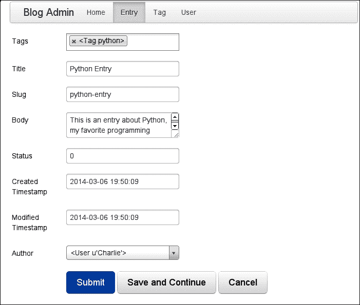
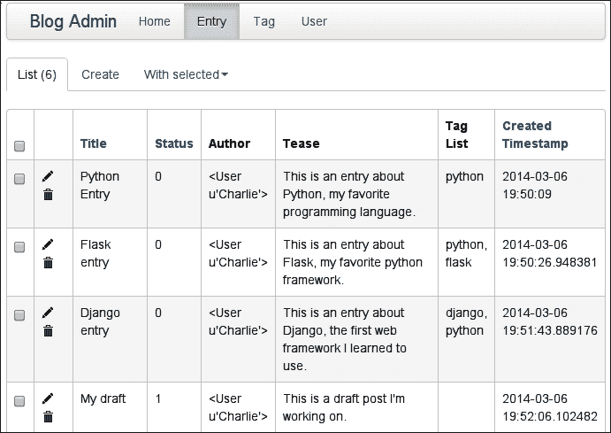
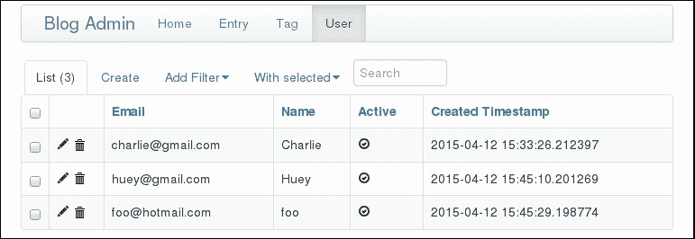
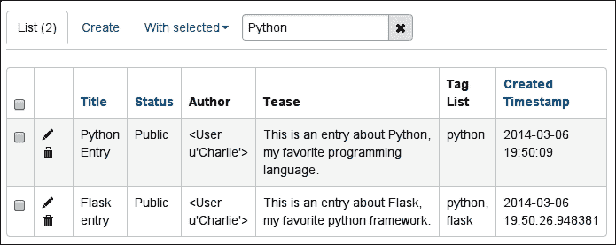
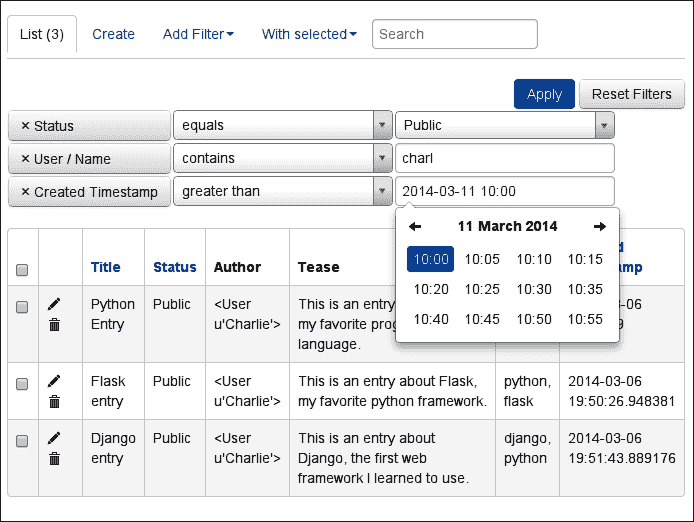
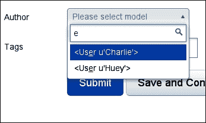
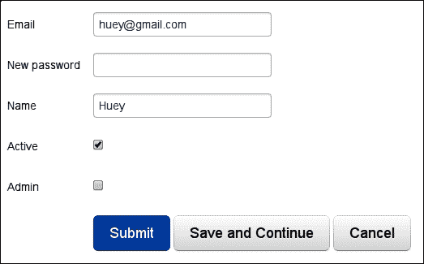

# 第 6 章：构建管理仪表板

在本章中，我们将为我们的网站构建一个管理仪表板。我们的管理仪表板将为特定的选定用户提供管理整个网站所有内容的能力。本质上，管理站点将是数据库的图形前端，支持在应用程序表中创建、编辑和删除行的操作。优秀的 Flask 管理扩展提供了几乎所有这些开箱即用的功能，但我们将超越默认值来扩展和定制管理页面。

在本章中，我们将：

*   安装 Flask Admin 并将其添加到我们的网站
*   添加用于使用`Entry`、`Tag,`和`User`模型的视图
*   添加用于管理网站静态资产的视图
*   将管理员与 Flask 登录框架集成
*   创建列以将用户标识为管理员
*   为管理仪表板创建自定义索引页

# 安装烧瓶管理器

Flask Admin 为 Flask 应用程序提供一个现成的管理界面。Flask Admin 还与 SQLAlchemy 很好地集成，以提供用于管理应用程序模型的视图。

下图是本章结束时**条目**管理员的预览：


虽然这数量的功能需要相对较少的代码，但我们仍有很多内容需要涵盖，所以让我们开始吧。首先使用`pip`将`Flask-Admin`安装到`virtualenv`中。在撰写本文时，Flask Admin 的当前版本是 1.0.7。

```py
(blog) $ pip install Flask-Admin
Downloading/unpacking Flask-Admin
...
Successfully installed Flask-Admin
Cleaning up...

```

如果需要，您可以通过输入以下代码来测试它是否正确安装：

```py
(blog) $ python manage.py shell
In [1]: from flask.ext import admin
In [2]: print admin.__version__
1.0.7

```

## 将 Flask Admin 添加到我们的应用程序

与我们在`app`模块中实例化的应用程序中的其他扩展不同，我们将在其自己的模块中设置管理扩展。我们将编写几个特定于管理员的类，因此将它们放在自己的模块中是有意义的。在`app`目录中新建一个名为`admin.py`的模块，并添加以下代码：

```py
from flask.ext.admin import Admin
from app import app

admin = Admin(app, 'Blog Admin')
```

因为我们的`admin`模块依赖于`app`模块，为了避免循环导入，我们需要确保`admin`在`app`之后加载*。打开`main.py`模块，添加以下内容：*

```py
from flask import request, session

from app import app, db
import admin  # This line is new, placed after the app import.
import models
import views
```

现在，您应该能够启动开发服务器并导航到`/admin/`以查看 barebones 管理员–默认仪表板，如下图所示：


随着您阅读本章，我们将把这个枯燥而简单的管理界面变成一个丰富而强大的控制面板，用于管理您的博客。

# 通过管理员公开模型

Flask Admin附带一个`contrib`包，其中包含特殊视图类，设计用于处理 SQLAlchemy 模型。这些类提供了开箱即用的创建、读取、更新和删除功能。

打开`admin.py`并更新以下代码：

```py
from flask.ext.admin import Admin
from flask.ext.admin.contrib.sqla import ModelView

from app import app, db
from models import Entry, Tag, User

admin = Admin(app, 'Blog Admin')
admin.add_view(ModelView(Entry, db.session))
admin.add_view(ModelView(Tag, db.session))
admin.add_view(ModelView(User, db.session))
```

注意我们如何调用`admin.add_view()`并传递`ModelView`类的实例，以及`db`会话，以便它访问数据库。Flask Admin 的工作原理是提供一个中心端点，开发人员可以向该端点添加自己的视图。

启动开发服务器，然后再次尝试启动管理站点。它应该类似于以下屏幕截图：


通过在导航栏中选择模型的链接，尝试单击模型的一个视图。点击**条目**链接，以干净的表格格式显示数据库中的所有条目。甚至还有创建、编辑或删除条目的链接，如下一个屏幕截图所示：


Flask Admin 提供的默认设置非常好，但是如果您开始探索界面，您将开始注意到一些微妙的事情，这些事情可以改进或清理。例如，可能不需要将条目的正文文本作为列包含。类似地，**状态**列将状态显示为整数，但我们更希望看到与该整数关联的名称。我们也可以点击`Entry`行中的*铅笔*图标。这将带您进入默认的“编辑表单”视图，您可以使用该视图修改该条目。

这一切看起来都像下面的屏幕截图：



正如您在前面的屏幕截图中所看到的，Flask Admin在处理外键对键和多对多字段（作者和标签）方面做得非常出色。它还可以很好地为给定字段选择要使用的 HTML 小部件，如下所示：

*   可以使用一个漂亮的多选小部件添加和删除标记
*   可以使用下拉菜单选择作者
*   条目正文可以方便地显示为文本区域

不幸的是，此表单存在一些明显的问题，如下所示：

*   字段的顺序似乎是任意的。
*   **Slug**字段显示为可编辑文本输入，因为这是由数据库模型管理的。相反，此字段应根据条目的标题自动生成。
*   **状态**字段是一个自由格式的文本输入字段，但应该是一个下拉菜单，带有人类可读的状态标签，而不是数字。
*   **创建的时间戳**和**修改的时间戳**字段显示为可编辑，但应自动生成。

在下面的部分中，我们将了解如何定制`Admin`类和类`ModelView`类，以便管理员真正为我们的应用程序工作。

## 自定义列表视图

让我们暂时搁置表单，集中精力清理列表。为此，我们将创建 Flask Admin 的子类`ModelView`。`ModelView`类提供了许多扩展点和属性，用于控制列表显示的外观。

首先，我们将通过手动指定要显示的属性来清理列表列。此外，由于我们将在其自己的列中显示作者，因此我们将要求 Flask Admin 从数据库中高效地获取它。打开`admin.py`并更新以下代码：

```py
from flask.ext.admin import Admin
from flask.ext.admin.contrib.sqla import ModelView

from app import app, db
from models import Entry, Tag, User

class EntryModelView(ModelView):
    column_list = [
        'title', 'status', 'author', 'tease', 'tag_list', 'created_timestamp',
    ]
    column_select_related_list = ['author']  # Efficiently SELECT the author.

admin = Admin(app, 'Blog Admin')
admin.add_view(EntryModelView(Entry, db.session))
admin.add_view(ModelView(Tag, db.session))
admin.add_view(ModelView(User, db.session))
```

您可能会注意到，`tease`和`tag_list`实际上并不是我们的`Entry`模型中的列名称。Flask Admin 使您能够将任何属性用作列值。我们还指定用于创建对其他模型的引用的列。打开`models.py`模块，将以下属性添加到`Entry`模型中：

```py
@property
def tag_list(self):
    return ', '.join(tag.name for tag in self.tags)

@property
def tease(self):
    return self.body[:100]
```

现在，当您访问**条目**管理员时，应该会看到一个干净、可读的表格，如下图所示：



我们还要修复**状态**列的显示。这些数字很难记住——最好显示一个人类可读的值。Flask Admin 为*枚举的*字段（例如**状态**）提供了一个助手。我们只需要提供一个状态值的映射来显示该值，其余的由 Flask Admin 完成。在`EntryModelView`中添加以下内容：

```py
class EntryModelView(ModelView):
    _status_choices = [(choice, label) for choice, label in [
 (Entry.STATUS_PUBLIC, 'Public'),
 (Entry.STATUS_DRAFT, 'Draft'),
 (Entry.STATUS_DELETED, 'Deleted'),
 ]]

 column_choices = {
 'status': _status_choices,
 }
    column_list = [
        'title', 'status', 'author', 'tease', 'tag_list', 'created_timestamp',
    ]
    column_select_related_list = ['author']
```

我们的`Entry`列表视图看起来好多了。现在让我们对`User`列表视图进行一些改进。同样，我们将子类化`ModelView`并指定我们希望覆盖的属性。将以下类别添加到`EntryModelView`下方的`admin.py`：

```py
class UserModelView(ModelView):
    column_list = ['email', 'name', 'active', 'created_timestamp']

# Be sure to use the UserModelView class when registering the User:
admin.add_view(UserModelView(User, db.session))
```

下面的屏幕截图显示了`User`列表视图在我们进行更改后的外观：



## 在列表视图中添加搜索和过滤

除了显示我们模型实例的列表外，Flask Admin 还具有强大的搜索和过滤功能。让我们假设我们有大量的条目，并希望找到包含某个关键字的条目，例如 Python。如果从列表视图中，我们可以输入搜索并让 Flask Admin 只列出那些在标题或正文中包含“Python”一词的条目，这将是有益的。

正如您所料，这是非常容易实现的。打开`admin.py`并添加以下行：

```py
class EntryModelView(ModelView):
    _status_choices = [(choice, label) for choice, label in [
        (Entry.STATUS_PUBLIC, 'Public'),
        (Entry.STATUS_DRAFT, 'Draft'),
        (Entry.STATUS_DELETED, 'Deleted'),
    ]]

    column_choices = {
        'status': _status_choices,
    }
    column_list = [
        'title', 'status', 'author', 'tease', 'tag_list', 'created_timestamp',
    ]
    column_searchable_list = ['title', 'body']
    column_select_related_list = ['author']
```

当您重新加载`Entry`列表视图时，您将看到一个新文本框，允许您搜索`title`和`body`字段，如以下屏幕截图所示：



与全文搜索一样有用，对于非文本字段，如**状态**或**创建的时间戳**，最好具有更强大的过滤功能。Flask Admin 再次出手相救，提供了易于使用、易于配置的过滤选项。

让我们通过在`Entry`列表中添加几个过滤器来了解过滤器是如何工作的。我们将再次修改`EntryModelView as follows`：

```py
class EntryModelView(ModelView):
    _status_choices = [(choice, label) for choice, label in [
        (Entry.STATUS_PUBLIC, 'Public'),
        (Entry.STATUS_DRAFT, 'Draft'),
        (Entry.STATUS_DELETED, 'Deleted'),
    ]]

    column_choices = {
        'status': _status_choices,
    }
    column_filters = [
 'status', User.name, User.email, 'created_timestamp'
 ]
    column_list = [
        'title', 'status', 'author', 'tease', 'tag_list', 'created_timestamp',
    ]
    column_searchable_list = ['title', 'body']
    column_select_related_list = ['author']
```

`column_filters`属性混合了`Entry`模型上的列名称和以及*相关*模型上的字段，如`User`中的字段：

```py
column_filters = [
    'status', User.name, User.email, 'created_timestamp'
]
```

当您访问`Entry`列表视图时，您将看到一个新的下拉菜单，标签为**添加过滤器**。使用各种数据类型进行实验。请注意，当您尝试在**状态**列上进行筛选时，Flask Admin 会自动使用`Public`、`Draft`和`Deleted`标签。还要注意的是，当您在**创建的时间戳**上进行筛选时，Flask Admin 提供了一个很好的日期/时间选择器小部件。在下面的屏幕截图中，我设置了各种过滤器：



此时，列表视图功能非常强大。作为练习，为`User``ModelView`设置`column_filters`和`column_searchable_list`属性。

## 定制管理模型表单

我们将通过展示如何定制表单类来结束对模型视图的讨论。正如您所记得的，Flask Admin 提供的默认表单有几个限制。本节将介绍如何自定义用于创建和编辑模型实例的表单字段的显示。

我们的目标是删除多余的字段，并为**状态**字段使用更合适的小部件，实现以下屏幕截图所示：


为了实现这一点，我们将首先手动指定我们希望在表单上显示的字段列表。这是通过在`EntryModelView class`上指定`form_columns`属性来实现的：

```py
class EntryModelView(ModelView):
    ...
    form_columns = ['title', 'body', 'status', 'author', 'tags']
```

此外，我们希望`status`字段是一个下拉小部件，使用各种状态的人类可读标签。由于我们已经定义了状态选项，我们将指示 Flask Admin 使用 WTForms`SelectField`覆盖`status`字段，并传入有效选项列表：

```py
from wtforms.fields import SelectField  # At top of module.

class EntryModelView(ModelView):
    ...
    form_args = {
        'status': {'choices': _status_choices, 'coerce': int},
    }
    form_columns = ['title', 'body', 'status', 'author', 'tags']
    form_overrides = {'status': SelectField}
```

默认情况下，用户字段将显示为一个下拉列表，前面有简单的输入。但是，想象一下，如果这个列表包含数千个用户！由于需要创建所有的`<option>`元素，这将导致非常大的查询和缓慢的渲染时间。

当一个包含外键的表单被呈现到一个非常大的表中时，Flask Admin 允许我们使用 Ajax 获取所需的行。将以下属性添加到`EntryModelView`中，现在您的用户将使用 Ajax 高效加载：

```py
form_ajax_refs = {
    'author': {
        'fields': (User.name, User.email),
    },
}
```

该指令告诉 Flask Admin，当我们查找**作者**时，它应该允许我们搜索作者的姓名或电子邮件。以下屏幕截图显示了它的外观：



我们现在有了一张非常好看的表格。

## 强化用户表单

由于密码以散列形式存储在数据库中，因此直接显示或编辑它们的价值不大。然而，在`User`表单上，我们可以输入新密码，替换旧密码。就像我们在`Entry`表单上处理`status`字段一样，我们将指定一个表单字段覆盖。然后，在模型更改处理程序中，我们将在保存时更新用户的密码。

在`UserModelView module`中添加以下内容：

```py
from wtforms.fields import PasswordField  # At top of module.

class UserModelView(ModelView):
    column_filters = ('email', 'name', 'active')
    column_list = ['email', 'name', 'active', 'created_timestamp']
    column_searchable_list = ['email', 'name']

    form_columns = ['email', 'password', 'name', 'active']
    form_extra_fields = {
 'password': PasswordField('New password'),
 }

    def on_model_change(self, form, model, is_created):
 if form.password.data:
 model.password_hash = User.make_password(form.password.data)
 return super(UserModelView, self).on_model_change(
 form, model, is_created)

```

下面的截图显示了新的`User`表单现在的样子。如果您希望更改用户密码，只需在**新密码**字段中输入新密码即可。



## 产生段塞

还有一个方面我们需要解决。创建新的`Entry`、`User`或`Tag`对象时，Flask Admin 不会正确为它们生成`slug`。这是由于 Flask Admin 在保存时实例化新模型实例的方式。为了解决这个问题，我们将创建一些`ModelView`的子类，以确保为`Entry`、`User,`和`Tag`对象正确生成`slug`

打开`admin.py`并在模块顶部添加以下类：

```py
class BaseModelView(ModelView):
    pass

class SlugModelView(BaseModelView):
    def on_model_change(self, form, model, is_created):
        model.generate_slug()
        return super(SlugModelView, self).on_model_change(
            form, model, is_created)
```

这些更改指示 Flask 管理员，无论何时更改模型，都应该重新生成 slug。

要开始使用此功能，请更新`EntryModelView`和`UserModelView`模块以扩展`SlugModelView class`。对于`Tag`模型，只需直接向`SlugModelView`类注册即可。

总之，您的代码应该如下所示：

```py
from flask.ext.admin import Admin
from flask.ext.admin.contrib.sqla import ModelView
from wtforms.fields import SelectField

from app import app, db
from models import Entry, Tag, User, entry_tags

class BaseModelView(ModelView):
    pass

class SlugModelView(BaseModelView):
    def on_model_change(self, form, model, is_created):
        model.generate_slug()
        return super(SlugModelView, self).on_model_change(
            form, model, is_created)

class EntryModelView(SlugModelView):
    _status_choices = [(choice, label) for choice, label in [
        (Entry.STATUS_PUBLIC, 'Public'),
        (Entry.STATUS_DRAFT, 'Draft'),
        (Entry.STATUS_DELETED, 'Deleted'),
    ]]

    column_choices = {
        'status': _status_choices,
    }
    column_filters = ['status', User.name, User.email, 'created_timestamp']
    column_list = [
        'title', 'status', 'author', 'tease', 'tag_list', 'created_timestamp',
    ]
    column_searchable_list = ['title', 'body']
    column_select_related_list = ['author']

    form_ajax_refs = {
        'author': {
            'fields': (User.name, User.email),
        },
    }
    form_args = {
        'status': {'choices': _status_choices, 'coerce': int},
    }
    form_columns = ['title', 'body', 'status', 'author', 'tags']
    form_overrides = {'status': SelectField}

class UserModelView(SlugModelView):
    column_filters = ('email', 'name', 'active')
    column_list = ['email', 'name', 'active', 'created_timestamp']
    column_searchable_list = ['email', 'name']

    form_columns = ['email', 'password', 'name', 'active']
    form_extra_fields = {
        'password': PasswordField('New password'),
    }

    def on_model_change(self, form, model, is_created):
        if form.password.data:
            model.password_hash = User.make_password(form.password.data)
        return super(UserModelView, self).on_model_change(
            form, model, is_created)

admin = Admin(app, 'Blog Admin')
admin.add_view(EntryModelView(Entry, db.session))
admin.add_view(SlugModelView(Tag, db.session))
admin.add_view(UserModelView(User, db.session))
```

无论是保存现有对象还是创建新对象，这些更改都确保正确生成 slug。

# 通过管理员管理静态资产

Flask Admin 为管理静态资产（或磁盘上的其他文件）提供了一个方便的界面，作为管理仪表板的扩展。让我们在我们的网站上添加一个`FileAdmin`，允许我们上传或修改应用程序`static`目录中的文件。

打开`admin.py`并在文件顶部导入以下模块：

```py
from flask.ext.admin.contrib.fileadmin import FileAdmin
```

然后，在各种`ModelView`实现下面，添加以下突出显示的代码行：

```py
class BlogFileAdmin(FileAdmin):
 pass

admin = Admin(app, 'Blog Admin')
admin.add_view(EntryModelView(Entry, db.session))
admin.add_view(SlugModelView(Tag, db.session))
admin.add_view(UserModelView(User, db.session))
admin.add_view(
 BlogFileAdmin(app.config['STATIC_DIR'], '/static/', name='Static Files'))

```

打开浏览器中的管理员，你会看到一个新标签，标签为**静态文件**。单击此链接将带您进入熟悉的文件浏览器，如以下屏幕截图所示：


### 提示

如果您在管理文件时遇到问题，请确保为`static`目录及其子目录设置了正确的权限。

# 保护管理员网站的安全

正如您在测试新的管理员网站时所注意到的，它不进行任何形式的身份验证。为了保护我们的管理员网站不受匿名用户（甚至某些登录用户）的攻击，我们将在`User`模型中添加一个新列，表明用户可以访问管理员网站。然后，我们将使用 Flask Admin 提供的钩子来确保请求用户具有权限。

第一步是在`User`模型中添加一个新列。将`admin`列添加到`User`模型中，如下所示：

```py
class User(db.Model):
    id = db.Column(db.Integer, primary_key=True)
    email = db.Column(db.String(64), unique=True)
    password_hash = db.Column(db.String(255))
    name = db.Column(db.String(64))
    slug = db.Column(db.String(64), unique=True)
    active = db.Column(db.Boolean, default=True)
 admin = db.Column(db.Boolean, default=False)
    created_timestamp = db.Column(db.DateTime, default=datetime.datetime.now)
```

现在，我们将使用 Flask Migrate 扩展生成架构迁移：

```py
(blog) $ python manage.py db migrate
INFO  [alembic.migration] Context impl SQLiteImpl.
INFO  [alembic.migration] Will assume non-transactional DDL.
INFO  [alembic.autogenerate.compare] Detected added column 'user.admin'
 Generating /home/charles/projects/blog/app/migrations/versions/33011181124e_.py ... done

(blog) $ python manage.py db upgrade
INFO  [alembic.migration] Context impl SQLiteImpl.
INFO  [alembic.migration] Will assume non-transactional DDL.
INFO  [alembic.migration] Running upgrade 40ce2670e7e2 -> 33011181124e, empty message

```

我们还要向`User`模型添加一个方法，该方法将告诉我们给定的用户是否是管理员。将以下方法添加到`User`模型中：

```py
class User(db.Model):
    # ...

    def is_admin(self):
        return self.admin
```

这可能看起来很愚蠢，但如果您希望更改应用程序如何确定用户是否为管理员的语义，那么这是很好的代码卫生。

在继续下一节之前，您可能需要修改`UserModelView`类，将`admin`列包含在`column_list`、`column_filters`和`form_columns`中。

## 创建身份验证和授权混入

由于我们在的管理视图中创建了几个视图，因此我们需要一种可重用的方式来表达我们的身份验证逻辑。我们将通过组合实现这种重用。您已经看到了视图装饰器（`@login_required`）形式的组合——装饰器只是组合多个函数的一种方式。Flask Admin 有点不同，它使用 Python 类来表示单个视图。我们将使用名为**mixins**的类友好组合方法，而不是函数装饰器。

mixin 是一个提供方法重写的类。对于 Flask Admin，我们希望覆盖的方法是`is_accessible`方法。在这个方法中，我们将检查当前用户是否经过身份验证。

为了访问当前用户，我们必须导入`admin`模块顶部的特殊`g`对象：

```py
from flask import g, url_for
```

在导入语句下面，添加以下类：

```py
class AdminAuthentication(object):
    def is_accessible(self):
        return g.user.is_authenticated and g.user.is_admin()
```

最后，我们将通过 Python 的多重继承将它与其他几个类混合在一起。对`BaseModelView class`进行以下更改：

```py
class BaseModelView(AdminAuthentication, ModelView):
    pass
```

以及`BlogFileAdmin class`：

```py
class BlogFileAdmin(AdminAuthentication, FileAdmin):
    pass
```

如果您试图访问管理员视图 URL，如/admin/entry/而不符合`is_accessible`标准，Flask admin 将返回 HTTP 403 禁止响应，如以下屏幕截图所示：


### 注

由于我们尚未对`Tag`管理模型进行更改，因此仍然可以访问。我们将让你来决定如何保护它。

## 设置自定义索引页

我们管理员（`/admin/`的登陆页面非常无聊。事实上，除了导航栏之外，它根本没有任何内容。Flask Admin 允许我们指定一个自定义索引视图，我们将使用它来显示一个简单的问候语。

为了添加自定义索引视图，我们需要导入几个新的帮助程序。将以下突出显示的导入添加到`admin`模块的顶部：

```py
from flask.ext.admin import Admin, AdminIndexView, expose

```

`from flask import redirect`请求提供的`@expose`装饰器与烧瓶本身使用的`@route`非常相似。因为这个视图是索引，所以我们将公开的 URL 是`/`。下面的代码将创建一个呈现模板的简单索引视图。请注意，在初始化`Admin`对象时，我们将索引视图指定为一个参数：

```py
class IndexView(AdminIndexView):
    @expose('/')
    def index(self):
        return self.render('admin/index.html')

admin = Admin(app, 'Blog Admin', index_view=IndexView())
```

缺少最后一个部分：身份验证。由于用户通常通过直接进入`/admin/`来访问管理员，因此将未经验证的用户重定向到登录页面将非常方便。我们可以通过在“索引”视图中检查当前用户是否已通过如下身份验证来完成此操作：

```py
class IndexView(AdminIndexView):
    @expose('/')
    def index(self):
        if not (g.user.is_authenticated and g.user.is_admin()):
 return redirect(url_for('login', next=request.path))
        return self.render('admin/index.html')
```

## 烧瓶管理模板

Flask Admin提供了一个简单的主模板，您可以对其进行扩展，以创建统一的管理站点外观。Flask Admin 主模板包括以下模块：

<colgroup><col style="text-align: left"> <col style="text-align: left"></colgroup> 
| 

块名

 | 

描述

 |
| --- | --- |
| `head_meta` | 页眉中的第页元数据 |
| `title` | 页面标题 |
| `head_css` | 标题中的 CSS 链接 |
| `head` | 文档头中的任意内容 |
| `page_body` | 第页布局图 |
| `brand` | 菜单栏中的徽标 |
| `main_menu` | 主菜单 |
| `menu_links` | 导航栏 |
| `access_control` | 菜单右侧的部分，可用于添加登录/注销按钮 |
| `messages` | 警报和各种消息 |
| `body` | 主要内容区 |
| `tail` | 内容下方的空白区域 |

对于这个例子，`body`块将是我们最感兴趣的。在应用程序的`templates`目录中，创建一个名为`admin`的新子目录，其中包含一个名为`index.html`的空白文件。

让我们自定义管理员登录页以显示服务器上的当前日期和时间。我们将扩展 Flask Admin 提供的`master`模板，只覆盖主体块。在模板中创建`admin`目录，并将以下代码添加到`templates/admin/index.html`：

```py



  <h3>Hello, {{ g.user.name }}</h3>

```

以下是我们新登录页的屏幕截图：


这只是一个示例，说明扩展和自定义管理仪表板是多么简单。使用各种模板块进行实验，并查看是否可以在导航栏中添加注销按钮。

# 阅读更多

Flask Admin 是一个多功能、高度可配置的 Flask 扩展。虽然我们讨论了 Flask Admin 的一些更常用的功能，但在一章中讨论的功能实在太多了。因此，如果您想继续学习，我强烈建议您访问项目文档。文件可在线在[上找到 https://flask-admin.readthedocs.org/](https://flask-admin.readthedocs.org/) 。

# 总结

在本章中，我们学习了如何使用 Flask Admin 扩展为我们的应用程序创建管理仪表板。我们学习了如何将 SQLAlchemy 模型公开为可编辑对象的列表，以及如何自定义表和表单的外观。我们添加了一个文件浏览器来帮助管理应用程序的静态资产。我们还将管理员与我们的身份验证系统集成在一起。

在下一章中，我们将学习如何向应用程序添加 API，以便以编程方式访问它。