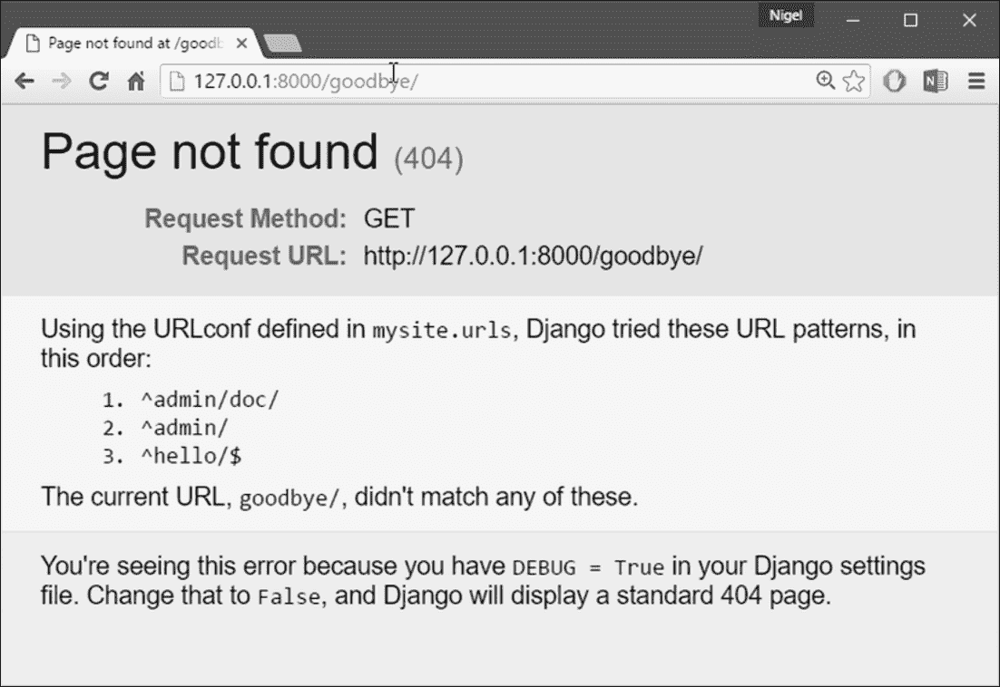

# 第 2 章：视图和 URLConf

在上一章中，我解释了如何设置 Django 项目和运行 Django 开发服务器。在本章中，您将学习使用 Django 创建动态网页的基础知识。

# 您的第一个 Django 动力页面：Hello World

作为我们的第一个目标，让我们创建一个输出著名示例消息的网页：**Hello World**。如果您发布的是一个没有 web 框架的简单的**Hello World**网页，您只需在文本文件中键入`Hello world`，将其命名为`hello.html`，然后将其上传到 web 服务器上某个地方的目录中。请注意，在这个过程中，您指定了关于该网页的两条关键信息：其内容（字符串`Hello world`）和其 URL（例如，`http://www.example.com/hello.html`）。使用 Django，您可以指定相同的两件事，但方式不同。页面内容由**查看功能**生成，URL 在**URLconf**中指定。首先，让我们编写 Hello World view 函数。

## 你的第一眼

在上一章中创建的`mysite`目录中，创建一个名为`views.py`的空文件。本 Python 模块将包含本章的视图。我们的世界观很简单。以下是整个函数，以及导入语句，您应该将其输入到`views.py`文件中：

```py
from django.http import HttpResponse 

def hello(request): 
    return HttpResponse("Hello world") 

```

让我们一次一行地逐步完成此代码：

*   首先，我们导入类`HttpResponse`，它位于`django.http`模块中。我们需要导入这个类，因为它稍后会在我们的代码中使用。
*   接下来，我们定义一个名为`hello`的函数——视图函数。

每个视图函数至少接受一个参数，按惯例称为`request`。这是一个对象，包含有关触发此视图的当前 web 请求的信息，并且是类`django.http.HttpRequest`的实例。

在本例中，我们不使用`request`进行任何操作，但它必须是视图的第一个参数。请注意，视图函数的名称并不重要；为了让 Django 识别它，它不必以某种方式命名。我们在这里称它为`hello`，因为这个名字清楚地表明了观点的要点，但它也可以被命名为`hello_wonderful_beautiful_world`，或者其他同样令人反感的名字。下一节，*您的第一个 URLconf*，将阐明 Django 是如何找到这个函数的。

该函数是一个简单的单行程序：它只返回一个用文本`Hello world`实例化的`HttpResponse`对象。

这里的主要教训是：视图只是一个 Python 函数，它将`HttpRequest`作为第一个参数，并返回一个`HttpResponse`的实例。为了使 Python 函数成为 Django 视图，它必须做以下两件事。（也有例外，但我们将在稍后讨论。）

## 你的第一次

如果此时您再次运行`python manage.py runserver`，您仍然会看到**欢迎来到 Django**消息，没有任何我们的 Hello World view 的痕迹。那是因为我们的`mysite`项目还不知道`hello`视图；我们需要明确地告诉 Django，我们正在一个特定的 URL 上激活这个视图。继续我们之前发布静态 HTML 文件的类比，现在我们已经创建了 HTML 文件，但还没有将其上传到服务器上的目录。

为了使用 Django 将视图函数挂接到特定的 URL，我们使用 URLconf。URLconf 类似于 Django 支持的 web 站点的目录。基本上，它是 URL 和应该为这些 URL 调用的视图函数之间的映射。这就是你告诉 Django，*对于这个 URL，调用这个代码，对于那个 URL，调用那个代码*。

例如，当有人访问 URL`/foo/`时，调用查看函数`foo_view()`，该函数位于 Python 模块`views.py`中。当您在上一章中执行`django-admin startproject`时，脚本会自动为您创建一个 URLconf：文件`urls.py`。

默认情况下，它看起来如下所示：

```py
"""mysite URL Configuration 
 The urlpatterns list routes URLs to views. For more information please 
 see:
     https://docs.djangoproject.com/en/1.8/topics/http/urls/ 
Examples:
Function views
     1\. Add an import:  from my_app import views
     2\. Add a URL to urlpatterns:  url(r'^$', views.home, name='home') Class-based views
     1\. Add an import:  from other_app.views import Home
     2\. Add a URL to urlpatterns:  url(r'^$', Home.as_view(), name='home')
Including another URLconf
     1\. Add an import:  from blog import urls as blog_urls
     2\. Add a URL to urlpatterns:  url(r'^blog/', include(blog_urls)) 
""" 
from django.conf.urls import include, url
from django.contrib import admin

 urlpatterns = [
     url(r'^admin/', include(admin.site.urls)),
 ] 

```

如果我们忽略文件顶部的文档注释，以下是 URLconf 的本质：

```py
from django.conf.urls import include, url
from django.contrib import admin 

urlpatterns = [
     url(r'^admin/', include(admin.site.urls)),
 ] 

```

让我们一次一行地逐步完成此代码：

*   第一行从`django.conf.urls`模块导入两个函数：`include`允许您包含到另一个 URLconf 模块的完整 Python 导入路径；`url`使用正则表达式将浏览器中的 URL 模式匹配到 Django 项目中的模块。
*   第二行从`django.contrib`模块调用函数`admin`。`include`函数调用此函数来加载 Django 管理站点的 URL。
*   第三行是`urlpatterns`——一个简单的`url()`实例列表。

这里需要注意的主要内容是变量`urlpatterns`，Django 希望在 URLconf 模块中找到该变量。此变量定义 URL 和处理这些 URL 的代码之间的映射。要向 URLconf 添加 URL 和视图，只需在 URL 模式和 view 函数之间添加映射。下面是如何在我们的`hello`视图中挂钩：

```py
from django.conf.urls import include, url 
from django.contrib import admin 
from mysite.views import hello 

urlpatterns = [
     url(r'^admin/', include(admin.site.urls)),
     url(r'^hello/$', hello), 
] 

```

我们在这里做了两个改变：

*   首先，我们从其模块`mysite/views.py`导入了`hello`视图，该模块在 Python 导入语法中翻译为`mysite.views`。（这假设`mysite/views.py`在您的 Python 路径上。）
*   接下来，我们将行`url(r'^hello/$', hello),`添加到`urlpatterns`。这一行被称为 URLpattern。`url()`函数告诉 Django 如何处理您正在配置的 URL。第一个参数是模式匹配字符串（一个正则表达式；稍后将详细介绍），第二个参数是用于该模式的视图函数。`url()`还可以接受其他可选参数，我们将在[第 7 章](07.html "Chapter 7. Advanced Views and URLconfs")、*高级视图和 URLConf*中更深入地介绍这些参数。

我们在这里介绍的另一个重要细节是正则表达式字符串前面的`r`字符。这告诉 Python 该字符串是一个**原始字符串**——其内容不应解释反斜杠。

在普通 Python 字符串中，反斜杠用于转义特殊字符，例如字符串`\n`，它是一个包含换行符的单字符字符串。当您添加`r`使其成为原始字符串时，Python 不会应用其反斜杠转义，因此`r'\n'`是一个包含文字反斜杠和小写字母`n`的两个字符的字符串。

Python 对反斜杠的使用与正则表达式中的反斜杠之间存在着自然的冲突，因此在 Django 中定义正则表达式时，最好使用原始字符串。

简而言之，我们刚刚告诉 Django，对 URL`/hello/`的任何请求都应该由`hello`视图函数处理。

这个 URLpattern 的语法值得讨论，因为它可能不是很明显。虽然我们希望匹配 URL`/hello/`，但模式看起来有点不同。原因如下：

*   Django 在检查 URL 模式之前从每个传入 URL 的前面删除斜杠。这意味着我们的 URLpattern 不包括`/hello/`中的前导斜杠。起初，这似乎不直观，但这一要求简化了一些事情，例如在其他 URLConf 中包含 URLConf，我们将在[第 7 章](07.html "Chapter 7. Advanced Views and URLconfs")、*高级视图和 URLConf*中介绍。
*   该模式包括插入符号（^）和美元符号（$）。这些是具有特殊含义的正则表达式字符：插入符号表示*要求模式匹配字符串*的开头，美元符号表示*要求模式匹配字符串*的结尾。

这个概念最好用例子来解释。如果我们改为使用模式`^hello/`（末尾没有美元符号），那么任何以`/hello/`开头的 URL 都会匹配，比如`/hello/foo`和`/hello/bar`，而不仅仅是`/hello/`。

类似地，如果我们省略了初始插入符号字符（即`hello/$`），Django 将匹配任何以`hello/`结尾的 URL，例如`/foo/bar/hello/`。

如果我们只使用了`hello/`，没有插入符号或美元符号，那么任何包含`hello/`的 URL 都会匹配，比如`/foo/hello/bar`。

因此，我们使用插入符号和美元符号来确保只有 URL`/hello/`匹配更多，更少。大多数 URLpatterns 将以插入符号开始，以美元符号结束，但拥有执行更复杂匹配的灵活性是很好的。

您可能想知道，如果有人请求 URL`/hello`（即没有尾随斜杠），会发生什么情况。因为我们的 URLpattern 需要一个尾随斜杠，所以该 URL 将不匹配。但是，默认情况下，对 URL 的任何请求如果与 URL 模式不匹配，并且没有以斜杠结尾，则将被重定向到带有尾随斜杠的同一 URL（这由[附录 D](25.html "Appendix D. Settings")、*设置*中所述的`APPEND_SLASH`Django 设置进行调节）。

关于这个 URLconf 需要注意的另一点是，我们将`hello`视图函数作为对象传递，而没有调用该函数。这是 Python（和其他动态语言）的一个关键特性：函数是一级对象，这意味着您可以像传递任何其他变量一样传递它们。很酷的东西，嗯？

要测试我们对 URLconf 的更改，请启动 Django 开发服务器，就像您在[第 1 章](01.html "Chapter 1. Introduction to Django and Getting Started")、*Django 简介和入门*中所做的那样，运行命令`python manage.py runserver`。（如果您让它保持运行，也可以。开发服务器会自动检测对 Python 代码的更改，并根据需要重新加载，因此您不必在更改之间重新启动服务器。）服务器在地址`http://127.0.0.1:8000/`处运行，因此打开 web 浏览器并转到`http://127.0.0.1:8000/hello/`。您应该看到文本**Hello World**——Django 视图的输出（*图 2.1*。


图 2.1：万岁！您的第一次 Django 视图

## 正则表达式

正则表达式（或正则表达式）是在文本中指定模式的一种紧凑方式。虽然 Django URLConf 允许使用任意正则表达式进行强大的 URL 匹配，但实际上您可能只使用少数正则表达式符号。*表 2.1*列出了常用符号的选择。

表 2.1：通用正则表达式符号

<colgroup><col> <col></colgroup> 
| **符号** | **匹配** |
| `.` （dot） | 任何单个字符 |
| `\d` | 任何一位数字 |
| `[A-Z]` | `A`和`Z`之间的任何字符（大写） |
| `[a-z]` | `a`和`z`之间的任何字符（小写） |
| `[A-Za-z]` | 介于`a`和`z`之间的任何字符（不区分大小写） |
| `+` | 前面的一个或多个表达式（例如，`\d+`匹配一个或多个数字） |
| `[^/]+` | 一个或多个字符，直到（不包括）正斜杠 |
| `?` | 上一个表达式中的零或一个（例如，`\d?`匹配零或一位数字） |
| `*` | 上一个表达式的零个或多个（例如，`\d*`匹配零、一个或多个数字） |
| `{1,3}` | 在前一个表达式的一到三（包括）之间（例如，`\d{1,3}`匹配一位、两位或三位数字） |

有关正则表达式的更多信息，请参阅 Python 正则表达式文档，请访问[https://docs.python.org/3.4/library/re.html](https://docs.python.org/3.4/library/re.html) 。

## 关于 404 错误的简要说明

此时，我们的 URLconf 只定义了一个 URLpattern：处理对 URL`/hello/`的请求的 URLpattern。当您请求不同的 URL 时会发生什么？要找到答案，请尝试运行 Django 开发服务器并访问一个页面，如`http://127.0.0.1:8000/goodbye/`。

您应该会看到一条**页面未找到**消息（*图 2.2*。Django 显示此消息，因为您请求的 URL 未在 URLconf 中定义。



图 2.2:Django 的 404 页

此页面的实用程序超出了基本 404 错误消息的范围。它还准确地告诉您使用了哪个 URLconf Django 以及该 URLconf 中的每个模式。从这些信息中，您应该能够知道为什么请求的 URL 抛出了 404。

当然，这是只为您（web 开发人员）准备的敏感信息。如果这是一个在 Internet 上实时部署的生产站点，那么您不会希望将该信息公开给公众。因此，仅当 Django 项目处于**调试模式**时，才会显示此**页面未找到**页面。

稍后我将解释如何停用调试模式。现在，只要知道在您第一次创建 Django 项目时，每个项目都处于调试模式，如果项目不处于调试模式，Django 将输出不同的 404 响应。

## 关于站点根目录的简要说明

如上一节所述，如果查看站点根目录-`http://127.0.0.1:8000/`，您将看到 404 错误消息。Django 不会神奇地向站点根添加任何内容；该 URL 在任何方面都不是特例。

您可以将其分配给 URLpattern，就像您的 URLconf 中的其他条目一样。不过，与站点根匹配的 URLpattern 有点不直观，因此值得一提。

当您准备实现站点根目录的视图时，请使用 URLpattern`^$`，它匹配一个空字符串。例如：

```py
from mysite.views import hello, my_homepage_view

 urlpatterns = [
     url(r'^$', my_homepage_view),
     # ... 

```

## Django 如何处理请求

在继续第二个视图函数之前，让我们停下来进一步了解 Django 的工作原理。具体来说，当您通过在 web 浏览器中访问`http://127.0.0.1:8000/hello/`来查看您的**Hello World**消息时，Django 在幕后做什么？这一切都从**设置文件**开始。

当您运行`python manage.py runserver`时，脚本将在内部`mysite`目录中查找名为`settings.py`的文件。这个文件包含这个特定 Django 项目的各种配置，都是大写的：`TEMPLATE_DIRS`、`DATABASES`等等。最重要的设置称为`ROOT_URLCONF`。`ROOT_URLCONF`告诉 Django 应该使用哪个 Python 模块作为该网站的 URLconf。

还记得`django-admin startproject`创建文件`settings.py`和`urls.py`的时间吗？自动生成的`settings.py`包含指向自动生成的`urls.py`的`ROOT_URLCONF`设置。打开`settings.py`文件，亲自查看；应该是这样的：

```py
ROOT_URLCONF = 'mysite.urls'
```

这对应于文件`mysite/urls.py`。当一个特定 URL 的请求进来时，比如说，`/hello/`-Django 的请求加载`ROOT_URLCONF`设置所指向的 URLconf。然后，它依次检查该 URLconf 中的每个 URLpatterns，将请求的 URL 与模式逐一进行比较，直到找到一个匹配的 URL。

当它找到一个匹配的时，它调用与该模式相关联的视图函数，将一个`HttpRequest`对象作为第一个参数传递给它。（稍后我们将介绍`HttpRequest`的细节。）正如我们在第一个视图示例中看到的，视图函数必须返回`HttpResponse`。

完成此操作后，Django 将完成其余工作，将 Python 对象转换为具有适当 HTTP 头和正文（即网页内容）的适当 web 响应。总之：

*   `/hello/`收到一个请求。
*   Django 通过查看`ROOT_URLCONF`设置来确定根 URLconf。
*   Django 查看 URLconf 中的所有 URLpatterns，寻找第一个匹配`/hello/`的 URLPerns。
*   如果找到匹配项，则调用关联的视图函数。
*   view 函数返回一个`HttpResponse`。
*   Django 将`HttpResponse`转换为正确的 HTTP 响应，从而生成一个网页。

现在，您已经了解了如何制作 Django 支持的页面的基本知识。这很简单，只需编写视图函数并通过 URLConf 将它们映射到 URL。

# 你的第二个观点：动态内容

我们的 Hello World 视图在演示 Django 如何工作的基础知识方面很有启发性，但它不是动态网页的示例，因为页面的内容总是相同的。每次你看`/hello/`，你都会看到同样的东西；它也可以是一个静态 HTML 文件。

对于第二个视图，让我们创建一个更具动态性的 web 页面，显示当前日期和时间。这是一个好的、简单的下一步，因为它不涉及数据库或任何用户输入，只涉及服务器内部时钟的输出。它只比 Hello World 稍微激动人心，但它将展示一些新概念。此视图需要做两件事：计算当前日期和时间，并返回包含该值的`HttpResponse`。如果您有使用 Python 的经验，您就会知道 Python 包含一个用于计算日期的`datetime`模块。以下是如何使用它：

```py
>>> import datetime 
>>> now = datetime.datetime.now() 
>>> now 
datetime.datetime(2015, 7, 15, 18, 12, 39, 2731) 
>>> print (now) 
2015-07-15 18:12:39.002731 

```

这很简单，与 Django 无关。这只是 Python 代码。（我们想强调的是，你应该知道什么代码只是 Python 而不是 Django 特定的代码。当你学习 Django 时，我们希望你能够将你的知识应用到其他不一定使用 Django 的 Python 项目中。）要创建一个显示当前日期和时间的 Django 视图，我们只需要钩住这个`datetime.datetime.now()`语句转换为视图并返回一个`HttpResponse`。更新后的`views.py`如下所示：

```py
from django.http import HttpResponse 
import datetime 

def hello(request):
     return HttpResponse("Hello world") 

def current_datetime(request):
     now = datetime.datetime.now()
     html = "<html><body>It is now %s.</body></html>" % now
     return HttpResponse(html) 

```

让我们逐步了解我们对`views.py`所做的更改，以适应`current_datetime`视图。

*   我们在模块顶部添加了一个`import datetime`，以便计算日期。
*   新的`current_datetime`函数将当前日期和时间计算为`datetime.datetime`对象，并将其存储为局部变量`now`。
*   视图中的第二行代码使用 Python 的**格式字符串**功能构造 HTML 响应。字符串中的`%s`是占位符，字符串后的百分号表示用变量`now`的值替换后面字符串中的`%s`。从技术上讲，`now`变量是`datetime.datetime`对象，而不是字符串，但`%s`格式字符将其转换为字符串表示形式，类似于`"2015-07-15 18:12:39.002731"`。这将产生一个 HTML 字符串，如`"<html><body>It is now 2015-07-15 18:12:39.002731.</body></html>"`。
*   最后，视图返回一个包含生成响应的`HttpResponse`对象，就像我们在`hello`中所做的一样。

在将其添加到`views.py`之后，将 URLpattern 添加到`urls.py`以告知 Django 哪个 URL 应该处理此视图。类似于`/time/`的东西会有意义：

```py
from django.conf.urls import include, url 
from django.contrib import admin 
from mysite.views import hello, current_datetime

     urlpatterns = [
         url(r'^admin/', include(admin.site.urls)),
         url(r'^hello/$', hello),
         url(r'^time/$', current_datetime),
     ] 

```

我们在这里做了两个改变。首先，我们在顶部导入了`current_datetime`函数。第二，也是更重要的一点，我们添加了一个 URLpattern，将 URL`/time/`映射到新视图。掌握这个窍门了吗？写下视图并更新 URLconf 后，启动`runserver`并在浏览器中访问`http://127.0.0.1:8000/time/`。您应该可以看到当前的日期和时间。如果您看不到当地时间，可能是因为您的`settings.py`中的默认时区设置为`UTC`。

# URLconfs 和松耦合

现在是强调 URLconfs 和 Django 背后的一个关键哲学的好时机：松耦合原则。简单地说，松耦合是一种软件开发方法，它重视使部件可互换的重要性。如果两段代码是松散耦合的，那么对其中一段所做的更改对另一段几乎没有影响。

Django 的 URLconfs 是实践中这一原则的一个很好的例子。在 Django web 应用程序中，URL 定义和它们调用的视图函数是松散耦合的；也就是说，对给定函数的 URL 应该是什么的决定，以及函数本身的实现，位于两个不同的位置。

例如，考虑一下我们的观点。如果我们想更改应用程序的 URL，比如说，将其从`/time/`移动到`/current-time/`——我们可以快速更改 URLconf，而不必担心视图本身。类似地，如果我们想改变 view 函数，以某种方式改变它的逻辑，我们可以在不影响函数绑定到的 URL 的情况下这样做。此外，如果我们想在几个 URL 上公开当前的日期功能，我们可以通过编辑 URLconf 轻松地完成这项工作，而不必接触视图代码。

在本例中，我们的`current_datetime`有两个 URL。这是一个人为的例子，但这种技术可以派上用场：

```py
urlpatterns = [
       url(r'^admin/', include(admin.site.urls)),
       url(r'^hello/$', hello),
       url(r'^time/$', current_datetime),
       url(r'^another-time-page/$', current_datetime),
 ] 

```

URLConf 和视图是松散耦合的。我将在整本书中继续指出这一重要哲学的例子。

# 您的第三个视图：动态 URL

在我们的`current_datetime`视图中，当前日期/时间的页面内容是动态的，但 URL（`/time/`是静态的。但在大多数动态 web 应用程序中，URL 包含影响页面输出的参数。例如，在线书店可能会为每本书提供自己的 URL，如`/books/243/`和`/books/81196/`。让我们创建第三个视图，该视图显示当前日期和时间偏移一定的小时数。目标是打造一个网站，页面`/time/plus/1/`显示未来一小时的日期/时间，页面`/time/plus/2/`显示未来两小时的日期/时间，页面`/time/plus/3/`显示未来三小时的日期/时间，以此类推。新手可能会考虑为每个小时偏移量编写一个单独的视图函数，这可能会导致如下 URL 配置：

```py
urlpatterns = [
     url(r'^time/$', current_datetime),
     url(r'^time/plus/1/$', one_hour_ahead),
     url(r'^time/plus/2/$', two_hours_ahead),
     url(r'^time/plus/3/$', three_hours_ahead),
] 

```

显然，这种思路是有缺陷的。这不仅会导致冗余的视图功能，而且应用程序基本上仅限于支持预定义的 1 小时、2 小时或 3 小时范围。

如果我们决定创建一个页面来显示未来四个小时的时间，那么我们必须为该页面创建一个单独的视图和 URLconf 行，以进一步复制。

那么，我们如何设计应用程序来处理任意的小时偏移量呢？关键是使用通配符模式。正如我前面提到的，URLpattern 是一个正则表达式；因此，我们可以使用正则表达式模式`\d+`来匹配一个或多个数字：

```py
urlpatterns = [
     # ...
     url(r'^time/plus/\d+/$', hours_ahead),
     # ... 
] 

```

（我使用`# ...`表示可能有其他 URL 模式已经从这个示例中删除。）这个新的 URL 模式将匹配任何 URL，例如`/time/plus/2/`、`/time/plus/25/`甚至`/time/plus/100000000000/`。想一想，让我们限制它，使最大允许偏移量是合理的。

在本例中，我们将通过只允许一位或两位数字以及正则表达式语法来设置最长 99 小时，这将转换为`\d{1,2}`：

```py
url(r'^time/plus/\d{1,2}/$', hours_ahead), 

```

现在我们已经为 URL 指定了一个通配符，我们需要一种将通配符数据传递给 view 函数的方法，这样我们就可以对任意小时偏移使用单个 view 函数。我们通过在要保存的 URLpattern 中的数据周围放置括号来实现这一点。在我们的示例中，我们希望保存 URL 中输入的任何数字，因此让我们在`\d{1,2}`周围加上括号，如下所示：

```py
url(r'^time/plus/(\d{1,2})/$', hours_ahead), 

```

如果你熟悉正则表达式，你就可以在这里轻松自如；我们使用括号从匹配的文本中捕获数据。最后的 URLconf，包括我们前面的两个视图，如下所示：

```py
from django.conf.urls import include, url from django.contrib import admin from mysite.views import hello, current_datetime, hours_ahead 

urlpatterns = [
     url(r'^admin/', include(admin.site.urls)),
     url(r'^hello/$', hello),
     url(r'^time/$', current_datetime),
     url(r'^time/plus/(\d{1,2})/$', hours_ahead),
 ] 

```

### 注

如果您在另一个 web 开发平台有经验，您可能会想，“嘿，让我们使用一个查询字符串参数！”——类似于`/time/plus?hours=3`的东西，其中时间将由 URL 查询字符串中的`hours`参数指定（在“？”后面的部分）。Django 可以做到这一点（我会在[第 7 章](07.html "Chapter 7. Advanced Views and URLconfs")、*高级视图和 URLConf*中告诉你），但 Django 的核心理念之一是 URL 应该是美丽的。URL`/time/plus/3/`比它的查询字符串对应项更干净、更简单、更可读、更容易大声背诵，而且更漂亮。漂亮的 URL 是高质量 web 应用程序的一个特征。

Django 的 URLconf 系统通过使使用漂亮 URL 比不使用更容易来鼓励漂亮 URL。

考虑到这一点，让我们编写`hours_ahead`视图。`hours_ahead`与我们前面写的`current_datetime`视图非常相似，但有一个关键区别：它需要一个额外的参数，即偏移的小时数。以下是查看代码：

```py
from django.http import Http404, HttpResponse 
import datetime 

def hours_ahead(request, offset):
     try:
         offset = int(offset)
     except ValueError:
         raise Http404()
     dt = datetime.datetime.now() + datetime.timedelta(hours=offset)
     html = "<html><body>In %s hour(s), it will be  %s.
             </body></html>" % (offset, dt)
     return HttpResponse(html) 

```

让我们仔细看看这个代码。

查看功能`hours_ahead`采用两个参数：`request`和`offset`：

*   `request`是`HttpRequest`对象，就像`hello`和`current_datetime`中一样。我再说一遍：每个视图都将一个`HttpRequest`对象作为其第一个参数。
*   `offset`是 URL 模式中括号捕获的字符串。例如，如果请求的 URL 是`/time/plus/3/`，那么偏移量将是字符串“3”。如果请求的 URL 是`/time/plus/21/`，那么偏移量将是字符串“21”。请注意，捕获的值将始终是 Unicode 对象，而不是整数，即使字符串仅由数字组成，例如“21”。

我决定调用变量`offset`，但您可以随意调用它，只要它是一个有效的 Python 标识符。变量名并不重要；重要的是它是函数的第二个参数，在`request`之后。（也可以在 URLconf 中使用关键字而不是位置参数。我在[第 7 章](07.html "Chapter 7. Advanced Views and URLconfs")、*高级视图和 URLconf*中介绍了这一点。）

我们在函数中所做的第一件事是调用`offset`上的`int()`。这将 Unicode 字符串值转换为整数。

请注意，如果对无法转换为整数的值（如字符串`foo`）调用`int()`，Python 将引发`ValueError`异常。在本例中，如果我们遇到了`ValueError`，我们将引发异常`django.http.Http404`，正如您可以想象的，这将导致**404**P******age not found**错误。

精明的读者会想：既然我们的 URLpattern 中的正则表达式--`(\d{1,2})`只捕获数字，因此`offset`永远只能是由数字组成的字符串，我们怎么可能达到`ValueError`的情况呢？答案是，我们不会，因为 URLpattern 提供了一个适度但有用的输入验证级别，但我们仍然会检查`ValueError`，以防以其他方式调用此视图函数。

最好实现视图函数，这样它们就不会对参数进行任何假设。松耦合，记得吗？

在函数的下一行中，我们计算当前日期/时间并添加适当的小时数。我们已经从`current_datetime`视图中看到了`datetime.datetime.now()`；这里的新概念是，您可以通过创建一个`datetime.timedelta`对象并添加到`datetime.datetime`对象来执行日期/时间算法。我们的结果存储在变量`dt`中。

这一行还显示了为什么我们在`offset`上调用`int()`-`datetime.timedelta`函数要求`hours`参数为整数。

接下来，我们构建这个视图函数的 HTML 输出，就像我们在`current_datetime`中所做的那样。这一行与前一行的一个小区别是，它使用 Python 的格式化字符串功能，具有两个值，而不仅仅是一个值。因此，字符串中有两个`%s`符号和一个要插入的值元组：`(offset, dt)`。

最后，我们返回 HTML 的`HttpResponse`。

编写好视图函数和 URLconf 后，启动 Django 开发服务器（如果它还没有运行），然后访问`http://127.0.0.1:8000/time/plus/3/`验证它是否工作。

然后试试`http://127.0.0.1:8000/time/plus/5/`。

然后`http://127.0.0.1:8000/time/plus/24/`。

最后，访问`http://127.0.0.1:8000/time/plus/100/`验证 URLconf 中的模式只接受一个或两个数字；在这种情况下，Django 应该显示一个**页面未找到**错误，正如我们在前面的*部分中看到的关于 404 错误*的快速注释。

URL`http://127.0.0.1:8000/time/plus/`（没有小时名称）也应该抛出 404。

# Django 的漂亮错误页面

花点时间欣赏一下我们迄今为止制作的优秀 web 应用程序，现在让我们来打破它吧！让我们通过注释掉`hours_ahead`视图中的`offset = int(offset)`行，故意在`views.py`文件中引入 Python 错误：

```py
def hours_ahead(request, offset):
     # try:
 #     offset = int(offset)
 # except ValueError:
 #     raise Http404()
     dt = datetime.datetime.now() + datetime.timedelta(hours=offset)
     html = "<html><body>In %s hour(s), it will be %s.
               </body></html>" % (offset, dt)
     return HttpResponse(html) 

```

加载开发服务器并导航到`/time/plus/3/`。您将看到一个包含大量信息的错误页面，包括顶部显示的**TypeError**消息：**不支持 timedelta 小时组件的类型：str（***图 2.3*）。


图 2.3:Django 的错误页面

怎么搞的？嗯，`datetime.timedelta`函数期望`hours`参数为整数，我们注释掉了将`offset`转换为整数的代码位。这导致`datetime.timedelta`提高了**类型错误**。这是每一个程序员在某个时候遇到的典型的小错误。这个例子的重点是演示 Django 的错误页面。花些时间浏览错误页面，了解它提供给您的各种信息。以下是一些需要注意的事项：

*   在页面顶部，您可以获得有关异常的关键信息：异常的类型、异常的任何参数（在本例中为**不支持的类型**消息）、引发异常的文件以及违规行号。
*   在键异常信息下，页面显示此异常的完整 Python 回溯。这类似于 Python 命令行解释器中的标准回溯，只是更具交互性。对于堆栈中的每个级别（帧），Django 显示文件名、函数/方法名、行号以及该行的源代码。
*   单击源代码行（深灰色），您将看到错误行前后的几行代码，以提供上下文。单击堆栈中任何帧下的**局部变量**以查看该帧中所有局部变量及其值的表，该表位于引发异常的代码中的确切位置。这些调试信息会有很大帮助。
*   注意**回溯**标题下的**开关复制粘贴视图**文本。单击这些单词，回溯将切换到可以轻松复制和粘贴的备用版本。当您希望与其他人共享您的异常回溯以获得技术支持（如 Django IRC 聊天室或 Django 用户邮件列表中的善良人士）时，请使用此选项。
*   下面，**在公共网站**上共享此回溯按钮只需单击一下即可完成此项工作。单击它将回溯发布到 dpaste（有关更多信息，请访问[http://www.dpaste.com/](http://www.dpaste.com/) ），您将获得一个独特的 URL，可以与其他人共享。
*   接下来，**请求信息**部分包含大量关于产生错误的传入 web 请求的信息：`GET`和`POST`信息、cookie 值和元信息，例如 CGI 头。[附录 F](27.html "Appendix F. Request and Response Objects")*请求和响应对象*包含请求对象包含的所有信息的完整参考。
*   在**请求信息**部分之后，**设置**部分列出了此特定 Django 安装的所有设置。所有可用设置详见[附录 D](25.html "Appendix D. Settings")、*设置*。

Django 错误页面能够在某些特殊情况下显示更多信息，例如模板语法错误。我们将在稍后讨论 Django 模板系统时讨论这些问题。现在，取消注释`offset = int(offset)`行以使视图函数再次正常工作。

Django 错误页面也非常有用，如果你是那种喜欢借助小心放置的`print`语句进行调试的程序员。

在您的视图中的任何位置，临时插入一个`assert False`来触发错误页面。然后，您可以查看程序的局部变量和状态。下面是一个使用`hours_ahead`视图的示例：

```py
def hours_ahead(request, offset):
     try:
         offset = int(offset)
     except ValueError:
         raise Http404()
     dt = datetime.datetime.now() + datetime.timedelta(hours=offset)
     assert False
     html = "<html><body>In %s hour(s), it will be %s.
              </body></html>" % (offset, dt)
     return HttpResponse(html) 

```

最后，很明显，这些信息中有很多是敏感的，因为它们暴露了 Python 代码和 Django 配置的内部，在公共 Internet 上显示这些信息是愚蠢的。恶意的人可能会利用它试图对您的 web 应用程序进行反向工程，并做一些令人讨厌的事情。因此，Django 错误页面仅在 Django 项目处于调试模式时显示。我将在[第 13 章](13.html "Chapter 13. Deploying Django")、*部署 Django*中解释如何停用调试模式。现在，只要知道每个 Django 项目在启动时都会自动处于调试模式。（听起来很熟悉？**页面未找到**错误，本章前面描述过，工作方式相同。）

# 下一步是什么？

到目前为止，我们一直在用直接在 Python 代码中硬编码的 HTML 编写视图函数。我这样做是为了在演示核心概念时保持简单，但在现实世界中，这几乎总是一个坏主意。Django 附带了一个简单但功能强大的模板引擎，允许您将页面设计与底层代码分离。在下一章中，我们将深入研究 Django 的模板引擎。