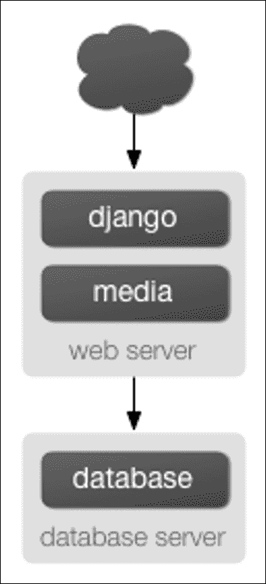

# 第 13 章部署 Django

本章介绍构建 Django 应用程序的最后一个基本步骤：将其部署到生产服务器。

如果您一直在关注我们正在进行的示例，那么您很可能一直在使用`runserver`，这使`runserver`变得非常简单，您不必担心 web 服务器的设置。但是`runserver`仅用于在本地机器上进行开发，不用于在公共 web 上公开。

要部署 Django 应用程序，需要将其挂接到工业级 web 服务器（如 Apache）中。在本章中，我们将向您展示如何做到这一点，但是，首先，我们将在您投入使用之前，为您提供代码库中要做的事情的清单。

# 为生产准备代码库

## 部署检查表

互联网是一个充满敌意的环境。在部署 Django 项目之前，您应该花一些时间检查设置，并考虑安全性、性能和操作。

Django 包含许多安全特性。有些是内置的，并且始终处于启用状态。另一些是可选的，因为它们并不总是合适的，或者因为它们不便于开发。例如，强制使用 HTTPS 可能并不适用于所有网站，而且对本地开发也不切实际。

性能优化是另一种方便性权衡。例如，缓存在生产中很有用，而在本地开发中就不那么有用了。错误报告需求也大不相同。以下检查表包括以下设置：

*   必须正确设置 Django 以提供预期的安全级别，
*   在每个环境中都会有所不同，
*   启用可选的安全功能，
*   实现性能优化；和
*   提供错误报告。

其中许多设置是敏感的，应视为机密。如果要发布项目的源代码，通常的做法是发布适合开发的设置，并使用专用设置模块进行生产。以下描述的检查可以使用

`check`命令的`-deploy`选项。确保按照选项文档中的说明，在生产设置文件中运行它。

# 关键设置

## 秘钥

**密钥必须是一个大的随机值，并且必须保密。**

确保生产中使用的密钥不在其他任何地方使用，并避免将其提交到源代码管理。这减少了攻击者获取密钥的向量数量。不要在设置模块中对密钥进行硬编码，而是考虑将其从环境变量加载：

```py
import os
SECRET_KEY = os.environ['SECRET_KEY']
```

或从文件：

```py
with open('/etc/secret_key.txt') as f:
SECRET_KEY = f.read().strip()
```

## 调试

**绝不能在生产中启用调试。**

当我们在[第一章](01.html "Chapter 1. Introduction to Django and Getting Started")、*Django 简介**和*中创建一个项目时，`django-admin startproject`命令创建了一个`settings.py`文件，其中`DEBUG`设置为`True`。Django 的许多内部部件会检查此设置，并在`DEBUG`模式打开时更改其行为。

例如，如果`DEBUG`设置为`True`，则：

*   所有数据库查询将作为对象`django.db.connection.queries`保存在内存中。你可以想象，这会消耗掉你的记忆！
*   任何 404 错误将由 Django 的特殊 404 错误页面（包含在 C[第 3 章](03.html "Chapter 3. Templates")、*模板*中）呈现，而不是返回正确的 404 响应。此页面包含潜在的敏感信息，不应向公共 Internet 公开。
*   Django 应用程序中任何未捕获的异常，从基本 Python 语法错误到数据库错误再到模板语法错误，都将由 Django pretty error 页面呈现，您可能已经了解并喜欢该页面。此页面包含比 404 页面更敏感的信息，不应向公众公开。

简而言之，将`DEBUG`设置为`True`会让 Django 假设只有可信的开发人员在使用您的站点。互联网上到处都是不值得信任的流氓，当你准备部署应用程序时，首先要做的就是将`DEBUG`设置为`False`。

# 特定于环境的设置

## 允许的\u 主机

当`DEBUG = False`时，如果没有合适的`ALLOWED_HOSTS`值，Django 根本不工作。此设置是保护您的站点免受某些 CSRF 攻击所必需的。如果使用通配符，则必须对`Host`HTTP 头执行自己的验证，否则必须确保不易受到此类攻击。

## 缓存

如果您使用的是缓存，则连接参数在开发和生产中可能会有所不同。缓存服务器通常具有弱身份验证。确保它们只接受来自应用程序服务器的连接。如果您使用的是 MycCurryTy1 T1，请考虑使用缓存会话来提高性能。

## 数据库

数据库连接参数在开发和生产中可能不同。数据库密码非常敏感。你应该像`SECRET_KEY`一样保护它们。为了获得最大的安全性，请确保数据库服务器只接受来自应用程序服务器的连接。如果尚未为数据库设置备份，请立即执行！

## 邮件 _ 后端及相关设置

如果您的站点发送电子邮件，则需要正确设置这些值。

## 静态\u 根和静态\u URL

静态文件由开发服务器自动提供。在生产中，您必须定义一个`STATIC_ROOT`目录，其中`collectstatic`将复制它们。

## 媒体根目录和媒体 URL

媒体文件由用户上传。他们不可信！确保您的 web 服务器从未尝试解释它们。例如，如果用户上传一个`.php`文件，web 服务器不应该执行它。现在是检查这些文件的备份策略的好时机。

# HTTPS

任何允许用户登录的网站都应强制执行站点范围的 HTTPS，以避免以明文形式传输访问令牌。在 Django 中，访问令牌包括登录/密码、会话 cookie 和密码重置令牌。（如果您通过电子邮件发送密码重置令牌，则无法保护它们。）

保护敏感区域（如用户帐户或管理员）是不够的，因为相同的会话 cookie 用于 HTTP 和 HTTPS。您的 web 服务器必须将所有 HTTP 通信重定向到 HTTPS，并且只将 HTTPS 请求传输到 Django。设置 HTTPS 后，请启用以下设置。

## CSRF_COOKIE_ 安全

将其设置为`True`以避免意外通过 HTTP 传输 CSRF cookie。

## 会话\u COOKIE \u 安全

将其设置为`True`以避免意外通过 HTTP 传输会话 cookie。

# 性能优化

设置`DEBUG = False`将禁用几个仅在开发中有用的功能。此外，您还可以调整以下设置。

## 连接最大年龄

当连接到数据库占请求处理时间的很大一部分时，启用持久数据库连接可以带来很好的加速。这对网络性能有限的虚拟主机有很大帮助。

## 模板

启用缓存的模板加载器通常会大大提高性能，因为它可以避免每次需要呈现模板时编译每个模板。有关更多信息，请参阅模板加载程序文档。

# 错误报告

当您将代码推向生产环境时，它有望变得健壮，但您不能排除意外错误。谢天谢地，Django 可以捕获错误并相应地通知您。

## 测井

在将您的网站投入生产之前，请检查日志配置，并在收到一些流量后检查它是否按预期工作。

## 管理人员和经理

将通过电子邮件通知`ADMINS`500 个错误。`MANAGERS`将收到 404 个错误的通知。`IGNORABLE_404_URLS`可以帮助过滤虚假报告。

电子邮件错误报告的扩展性不太好。考虑使用诸如哨兵之类的错误监视系统（用于更多信息访问）http://sentry.readthedocs.org/en/latest/ 在你的收件箱被报告淹没之前。哨兵也可以聚合日志。

## 自定义默认错误视图

Django 包括一些 HTTP 错误代码的默认视图和模板。您可能希望通过在根模板目录中创建以下模板来覆盖默认模板：`404.html`、`500.html`、`403.html`和`400.html`。默认视图应足以满足 99%的 web 应用程序，但如果您希望自定义它们，请参见这些（[https://docs.djangoproject.com/en/1.8/topics/http/views/#customizing-错误视图](https://docs.djangoproject.com/en/1.8/topics/http/views/#customizing-error-views)）说明，其中还包含有关默认模板的详细信息：

*   `http_not_found_view`
*   `http_internal_server_error_view`
*   `http_forbidden_view`
*   `http_bad_request_view`

# 使用虚拟电视

如果在 virtualenv 中安装项目的 Python 依赖项（有关更多信息，请访问[http://www.virtualenv.org/](http://www.virtualenv.org/) ），您还需要将此 virtualenv 的`site-packages`目录的路径添加到 Python 路径中。为此，请在`WSGIPythonPath`指令中添加一个附加路径，如果使用类似 UNIX 的系统，则多个路径之间用冒号（`:`）分隔，如果使用 Windows，则多个路径之间用分号（`;`）分隔。如果目录路径的任何部分包含空格字符，则必须引用`WSGIPythonPath`的完整参数字符串：

```py
WSGIPythonPath /path/to/mysite.com:/path/to/your/venv/lib/python3.X/site-packages 

```

确保为 virtualenv 提供了正确的路径，并用正确的 Python 版本（例如`python3.4`）替换`python3.X`。

# 使用不同的设置进行生产

到目前为止，在本书中，我们只处理了一个设置文件：由`django-admin startproject`生成的`settings.py`。但是，当您准备部署时，您可能会发现自己需要多个设置文件来保持开发环境与生产环境的隔离。（例如，当您想在本地机器上测试代码更改时，您可能不想将`DEBUG`从`False`更改为`True`。）Django 允许您使用多个设置文件，从而使这一过程变得非常简单。如果要将设置文件组织到生产和开发设置中，可以通过以下三种方式之一完成：

*   设置两个完整、独立的设置文件。
*   设置一个基本设置文件（例如，用于开发）和第二个（例如，生产）设置文件，该文件仅从第一个文件导入，并定义需要定义的任何覆盖。
*   仅使用具有 Python 逻辑的单个设置文件根据上下文更改设置。

我们一次拿一个。首先，最基本的方法是定义两个单独的设置文件。如果你跟随，你已经有了`settings.py`。现在，只需复制一份名为`settings_production.py`的文件。（这个名字是我们编造的；你可以随意称呼它。）在这个新文件中，更改`DEBUG`等等。第二种方法类似，但减少了冗余。您可以将一个设置文件视为基础文件，并创建另一个从中导入的文件，而不是有两个内容基本相似的设置文件。例如：

```py
# settings.py 

DEBUG = True 
TEMPLATE_DEBUG = DEBUG 

DATABASE_ENGINE = 'postgresql_psycopg2' 
DATABASE_NAME = 'devdb' 
DATABASE_USER = '' 
DATABASE_PASSWORD = '' 
DATABASE_PORT = '' 

# ... 

# settings_production.py 

from settings import * 

DEBUG = TEMPLATE_DEBUG = False 
DATABASE_NAME = 'production' 
DATABASE_USER = 'app' 
DATABASE_PASSWORD = 'letmein' 

```

在这里，`settings_production.py`从`settings.py`导入所有内容，并重新定义特定于生产的设置。在本例中，`DEBUG`被设置为`False`，但我们也为生产设置设置了不同的数据库访问参数。（后者表明您可以重新定义任何设置，而不仅仅是像`DEBUG`这样的基本设置。）最后，完成两个设置环境的最简洁方法是使用一个基于环境分支的设置文件。一种方法是检查当前主机名。例如：

```py
# settings.py 

import socket 

if socket.gethostname() == 'my-laptop': 
    DEBUG = TEMPLATE_DEBUG = True 
else: 
    DEBUG = TEMPLATE_DEBUG = False 

# ... 

```

这里，我们从 Python 的标准库导入`socket`模块，并使用它检查当前系统的主机名。我们可以检查主机名以确定代码是否正在生产服务器上运行。这里的一个核心教训是，设置文件只是*Python 代码*。它们可以从其他文件导入，可以执行任意逻辑，等等。只要确保，如果沿着这条路走下去，设置文件中的 Python 代码是防弹的。如果它引发任何异常，Django 可能会严重崩溃。

请随意将您的`settings.py`重命名为`settings_dev.py`或`settings/dev.py`或`foobar.py`——Django 不在乎，只要您告诉它您使用的是什么设置文件。

但是如果您确实重命名了由`django-admin startproject`生成的`settings.py`文件，您会发现`manage.py`会给您一条错误消息，说明它找不到设置。这是因为它试图导入一个名为`settings`的模块。您可以通过编辑`manage.py`将`settings`更改为您模块的名称，或者使用`django-admin`而不是`manage.py`来解决此问题。在后一种情况下，需要将`DJANGO_SETTINGS_MODULE`环境变量设置为设置文件的 Python 路径（例如，`'mysite.settings'`）。

# 将 Django 部署到生产服务器

### 注

**无头痛部署**

如果您真的想部署一个实时网站，那么实际上只有一个明智的选择：找到一个明确支持 Django 的主机。

您不仅可以获得一个现成的独立媒体服务器（通常是 Nginx），还可以处理一些小事情，例如正确设置 Apache 和设置 cron 作业，定期重新启动 Python 进程（以防止站点挂起）。有了更好的主机，您还可能得到某种形式的*一键*部署。

省去你的头疼，每月花几块钱给一个认识 Django 的主人。

# 使用 Apache 和 mod_wsgi 部署 Django

使用 Apache 部署 Django（[http://httpd.apache.org/](http://httpd.apache.org/) 和`mod_wsgi`[http://code.google.com/p/modwsgi](http://code.google.com/p/modwsgi) 是让 Django 投入生产的一种经过尝试和测试的方法。`mod_wsgi`是一个 Apache 模块，可以承载任何 Python WSGI 应用程序，包括 Django。Django 将与任何支持`mod_wsgi`的 Apache 版本合作。官方的`mod_wsgi`文件非常棒；这是关于如何使用`mod_wsgi`的所有详细信息的来源。您可能需要从安装和配置文档开始。

## 基本配置

安装并激活`mod_wsgi`后，编辑 Apache 服务器的`httpd.conf`文件并添加以下内容。注意，如果您使用的 Apache 版本早于 2.4，请将`Require all granted`替换为`Allow from all`，并在前面添加一行`Order deny,allow`。

```py
WSGIScriptAlias / /path/to/mysite.com/mysite/wsgi.py 
WSGIPythonPath /path/to/mysite.com 

<Directory /path/to/mysite.com/mysite> 
<Files wsgi.py> 
Require all granted 
</Files> 
</Directory> 

```

`WSGIScriptAlias`行中的第一位是您希望为应用程序提供服务的基本 URL 路径（`/`表示根 URL），第二位是 WSGI 文件的位置。请参阅系统上的以下文件，通常在您的项目包中（`mysite`在本例中）。这告诉 Apache 使用该文件中定义的 WSGI 应用程序来处理给定 URL 之后的任何请求。

`WSGIPythonPath`行确保您的项目包可以在 Python 路径上导入；换句话说，`import mysite`是有效的。`<Directory>`部分只是确保 Apache 可以访问您的`wsgi.py`文件。

接下来，我们需要确保 WSGI 应用程序对象的`wsgi.py`存在。从 Django 版本 1.4 开始，`startproject`将为您创建一个；否则，您需要创建它。

请参阅 WSGI 概述，了解您应该放在该文件中的默认内容，以及您还可以添加哪些内容。

### 注

如果多个 Django 站点在一个`mod_wsgi`进程中运行，所有这些站点都将使用最先运行的任何一个站点的设置。这可以通过将`wsgi.py`中的`os.environ.setdefault("DJANGO_SETTINGS_MODULE",                       "{{ project_name }}.settings")` 更改为`os.environ["DJANGO_SETTINGS_MODULE"] =``"{{ project_name }}.settings"`或使用`mod_wsgi`守护进程模式并确保每个站点在其自己的守护进程中运行来解决。

## 使用 mod_wsgi 守护程序模式

守护程序模式是运行`mod_wsgi`的推荐模式（在非 Windows 平台上）。要创建所需的守护进程进程组并委托 Django 实例在其中运行，您需要添加适当的`WSGIDaemonProcess`和`WSGIProcessGroup`指令。

如果您使用守护程序模式，则需要对前面的配置进行进一步更改，即您不能使用`WSGIPythonPath`；相反，您应该使用`python-path`选项来`WSGIDaemonProcess`，例如：

```py
WSGIDaemonProcess example.com python-path=/path/to/mysite.com:/path/to/venv/lib/python2.7/site-packages 
WSGIProcessGroup example.com 

```

有关设置守护程序模式的详细信息，请参阅官方`mod_wsgi`文档。

## 提供文件

Django 本身不提供文件服务；它将该任务留给您选择的任何 web 服务器。我们建议使用一个单独的 web 服务器，即一个不运行 Django 的服务器来提供媒体服务。以下是一些不错的选择：

*   Nginx（欲了解更多信息，请访问[http://code.google.com/p/modwsgi](http://code.google.com/p/modwsgi) ）
*   Apache 的精简版

但是，如果您别无选择，只能在与 Django 相同的 Apache`VirtualHost`上提供媒体文件，则可以将 Apache 设置为将某些 URL 作为静态媒体提供服务，而将其他 URL 设置为使用 Django 的`mod_wsgi`接口提供服务。

本例在站点根目录下设置 Django，但显式地将`robots.txt`、`favicon.ico`、任何 CSS 文件以及`/static/`和`/media/`URL 空间中的任何内容作为静态文件提供。所有其他 URL 将使用`mod_wsgi`提供：

```py
Alias /robots.txt /path/to/mysite.com/static/robots.txt 
Alias /favicon.ico /path/to/mysite.com/static/favicon.ico 

Alias /media/ /path/to/mysite.com/media/ 
Alias /static/ /path/to/mysite.com/static/ 

<Directory /path/to/mysite.com/static> 
Require all granted 
</Directory> 

<Directory /path/to/mysite.com/media> 
Require all granted 
</Directory> 

WSGIScriptAlias / /path/to/mysite.com/mysite/wsgi.py 

<Directory /path/to/mysite.com/mysite> 
<Files wsgi.py> 
Require all granted 
</Files> 
</Directory> 

```

如果您使用的 Apache 版本早于 2.4，请将`Require all granted`替换为`Allow from all`，并在其前面添加一行`Order deny,allow`。

## 为管理员文件提供服务

当`django.contrib.staticfiles`在`INSTALLED_APPS`中时，Django 开发服务器自动为管理员应用程序（以及任何其他已安装应用程序）的静态文件提供服务。但是，当您使用任何其他服务器安排时，情况并非如此。您负责设置 Apache 或您正在使用的任何 web 服务器来提供管理文件。

管理文件位于 Django 发行版的（`django/contrib/admin/static/admin`）。我们建议使用`django.contrib.staticfiles`来处理管理文件（与上一节中概述的 web 服务器一起使用；这意味着使用`collectstatic`管理命令来收集`STATIC_ROOT`中的静态文件，然后将您的 web 服务器配置为在`STATIC_URL`处为`STATIC_ROOT`服务），但以下是三种其他方法：

1.  从文档根目录中创建指向管理静态文件的符号链接（这可能需要在 Apache 配置中使用`+FollowSymLinks`）。
2.  如前一段所示，使用`Alias`指令将适当的 URL（可能是`STATIC_URL`+`admin/`）别名到管理文件的实际位置。
3.  复制管理静态文件，使其位于 Apache 文档根目录中。

## 如果你发现一个 UnicodeCorror

如果您正在利用 Django 的国际化功能，并且希望允许用户上载文件，则必须确保用于启动 Apache 的环境配置为接受非 ASCII 文件名。如果您的环境配置不正确，则在对包含非 ASCII 字符的文件名调用`os.path`中的函数时，将触发`UnicodeEncodeError`异常。

为避免这些问题，用于启动 Apache 的环境应包含类似于以下内容的设置：

```py
export LANG='en_US.UTF-8' 
export LC_ALL='en_US.UTF-8' 

```

有关放置这些配置项的适当语法和位置，请参阅操作系统的文档；`/etc/apache2/envvars`是 Unix 平台上的常见位置。将这些语句添加到环境中后，重新启动 Apache。

# 在生产中提供静态文件服务

将静态文件投入生产的基本概述很简单：当静态文件发生变化时，运行`collectstatic`命令，然后安排将收集的静态文件目录（`STATIC_ROOT`移动到静态文件服务器并提供服务。

根据`STATICFILES_STORAGE`，可能需要手动将文件移动到新位置，或者`Storage`类的`post_process`方法可能会处理该问题。

当然，与所有部署任务一样，细节是关键。每个生产设置都会有所不同，因此您需要调整基本大纲以满足您的需要。

以下是一些可能会有所帮助的常见模式。

## 从同一台服务器为站点和静态文件提供服务

如果您希望从已经为您的站点提供服务的同一台服务器上提供静态文件，该过程可能类似于：

*   将代码推送到部署服务器。
*   在服务器上运行`collectstatic`将所有静态文件复制到`STATIC_ROOT`中。
*   将您的 web 服务器配置为服务 URL`STATIC_URL`下`STATIC_ROOT`中的文件。

您可能希望自动化此过程，特别是如果您有多个 web 服务器。有很多方法可以实现自动化，但许多 Django 开发人员喜欢的一个选项是 Fabric（[http://fabfile.org/](http://fabfile.org/) ）。

接下来，以及在接下来的部分中，我们将展示几个示例**fabfiles**（即结构脚本），它们可以自动执行这些文件部署选项。fabfile 的语法相当简单，但这里不介绍；有关语法的完整解释，请参阅 Fabric 的文档。因此，将静态文件部署到两个 web 服务器的 fabfile 可能类似于：

```py
from fabric.api import * 

# Hosts to deploy onto 
env.hosts = ['www1.example.com', 'www2.example.com'] 

# Where your project code lives on the server 
env.project_root = '/home/www/myproject' 

def deploy_static(): 
    with cd(env.project_root): 
        run('./manage.py collectstatic -v0 -noinput') 

```

## 从专用服务器提供静态文件服务

大多数较大的 Django 站点使用一个单独的 web 服务器，该服务器不运行 Django 来提供静态文件。此服务器通常运行不同类型的 web 服务器，速度更快，但功能不全。一些常见的选择是：

*   Nginx
*   Apache 的精简版

配置这些服务器超出了本文档的范围；查看每台服务器各自的文档以了解说明。由于静态文件服务器不会运行 Django，因此需要修改部署策略，使其看起来像：

1.  当您的静态文件更改时，在本地运行`collectstatic`。
2.  将您的本地`STATIC_ROOT`向上推至静态文件服务器，进入正在服务的目录。`rsync`（[https://rsync.samba.org/](https://rsync.samba.org/) 是此步骤的常见选择，因为它只需要传输已更改的静态文件位。

以下是该文件中的显示方式：

```py
from fabric.api import * 
from fabric.contrib import project 

# Where the static files get collected locally. Your STATIC_ROOT setting. 
env.local_static_root = '/tmp/static' 

# Where the static files should go remotely 
env.remote_static_root = '/home/www/static.example.com' 

@roles('static') 
def deploy_static(): 
    local('./manage.py collectstatic') 
    project.rsync_project( 
        remote_dir = env.remote_static_root, 
        local_dir = env.local_static_root, 
        delete = True 
    ) 

```

## 从云服务或 CDN 服务静态文件

另一个常见的策略是从云存储提供商（如 Amazon 的 S3 和/或 CDN（内容交付网络））提供静态文件。这使您可以忽略提供静态文件的问题，并且通常可以加快网页的加载速度（尤其是在使用 CDN 时）。

当使用这些服务时，基本的工作流程看起来有点像上一段，除了不使用`rsync`将静态文件传输到服务器，而是需要将静态文件传输到存储提供商或 CDN。有很多种方法可以做到这一点，但是如果提供者有一个 API，那么定制的文件存储后端将使这个过程非常简单。

如果您已经编写或正在使用第三方自定义存储后端，您可以通过将`STATICFILES_STORAGE`设置到存储引擎来告诉`collectstatic`使用它。例如，如果您在`myproject.storage.S3Storage`中编写了 S3 存储后端，则可以将其用于：

```py
STATICFILES_STORAGE = 'myproject.storage.S3Storage'
```

完成后，您所要做的就是运行`collectstatic`，静态文件将通过存储包推送到 S3。如果以后需要切换到其他存储提供商，只需更改`STATICFILES_STORAGE`设置即可。有一些第三方应用程序为许多常见的文件存储 API 提供存储后端。一个好的起点是`djangopackages.com.`的概述

# 结垢

既然您已经知道如何在单个服务器上运行 Django，那么让我们看看如何扩展 Django 安装。本节将介绍一个站点如何从一台服务器扩展到一个大规模集群，该集群每小时可以提供数百万次点击。然而，需要注意的是，几乎每个大型站点都以不同的方式变大，因此扩展绝不是一刀切的操作。

以下内容应足以说明一般原则，只要可能，我们将尝试指出在哪些地方可以做出不同的选择。首先，我们将做一个很大的假设，专门讨论 Apache 和`mod_python`下的扩展。虽然我们知道许多成功的中大规模 FastCGI 部署，但我们对 Apache 更为熟悉。

## 在单台服务器上运行

大多数站点一开始运行在一台服务器上，其架构类似于图 13.1。然而，随着流量的增加，您将很快遇到不同软件之间的*资源争用*。

数据库服务器和 web 服务器喜欢让整个服务器独立运行，因此当在同一台服务器上运行时，它们往往会争夺它们更愿意垄断的相同资源（RAM 和 CPU）。通过将数据库服务器移动到另一台机器上，可以很容易地解决这个问题。


图 13.1：单服务器 Django 设置。

## 分离数据库服务器

就 Django 而言，分离数据库服务器的过程非常简单：只需将`DATABASE_HOST`设置更改为数据库服务器的 IP 或 DNS 名称即可。如果可能的话，最好使用 IP，因为不建议在 web 服务器和数据库服务器之间依赖 DNS 进行连接。有了一个单独的数据库服务器，我们的体系结构现在看起来像*图 13.2*。

在这里，我们开始进入通常称为**n 层**架构。不要被这个流行词吓坏了，它只是指 web 堆栈的不同层被分离到不同的物理机器上。

在这一点上，如果您预计需要超越单个数据库服务器，那么开始考虑连接池和/或数据库复制可能是一个好主意。不幸的是，本书中没有足够的篇幅来处理这些主题，因此您需要查阅数据库文档和/或社区以获取更多信息。



图 13.2：将数据库移动到专用服务器上。

## 运行单独的媒体服务器

单服务器设置仍然存在一个大问题：从处理动态内容的同一个盒子中提供媒体。这两种活动在不同的情况下表现最好，如果将它们放在同一个盒子上，最终两种活动都不会表现得特别好。

因此，下一步是将媒体（即不是由 Django 视图生成的任何内容）分离到专用服务器上（参见*图 13.3*。

理想情况下，此媒体服务器应该运行一个精简的 web 服务器，该服务器针对静态媒体交付进行了优化。Nginx 是这里的首选选项，尽管**lighttpd**是另一个选项，或者一个高度精简的 Apache 也可以工作。对于静态内容（照片、视频等）较多的网站来说，转移到单独的媒体服务器是非常重要的，这可能是扩展的第一步。

然而，这一步可能有点棘手。如果应用程序涉及文件上载，Django 需要能够将上载的媒体写入媒体服务器。如果介质位于另一台服务器上，则需要安排一种方式，以便在网络上进行写入。


图 13.3：分离媒体服务器。

## 实现负载均衡和冗余

在这一点上，我们已经尽可能地把事情分解了。这三台服务器的设置应该能够处理大量的流量，我们每天从这种体系结构中提供大约 1000 万次点击，因此如果您进一步发展，您需要开始添加冗余。

事实上，这是件好事。只要看一眼*图 13.3*就会发现，即使三台服务器中的一台出现故障，也会导致整个站点瘫痪。因此，在添加冗余服务器时，不仅可以增加容量，还可以提高可靠性。在本例中，假设 web 服务器首先达到容量。

获得在不同硬件上运行的 Django 站点的多个副本相对容易，只需将所有代码复制到多台机器上，然后在所有机器上启动 Apache 即可。但是，您需要另一个软件在多台服务器上分配流量：一个*负载平衡器*。

您可以购买昂贵且专有的硬件负载平衡器，但也有一些高质量的开源软件负载平衡器。Apache 的`mod_proxy`是一种选择，但我们已经找到了 Perlbal（[http://www.djangoproject.com/r/perlbal/](http://www.djangoproject.com/r/perlbal/) ）太棒了。这是一个负载平衡器和反向代理，由编写`memcached`的人编写（参见[第 16 章](16.html "Chapter 16. Djangos Cache Framework")、*Django 的缓存框架*）。

随着 web 服务器的集群化，我们不断发展的体系结构开始变得更加复杂，如图 13.4 所示。


图 13.4：负载平衡的冗余服务器设置。

请注意，在图中，web 服务器被称为集群，以表明服务器的数量基本上是可变的。一旦有了负载平衡器，您就可以轻松地添加和删除后端 web 服务器，而无需第二次停机。

## 做大

在这一点上，接下来的几个步骤几乎是上一个步骤的衍生物：

*   由于需要更高的数据库性能，可能需要添加复制的数据库服务器。MySQL 包括内置复制；PostgreSQL 用户应该关注 Slony（[http://www.djangoproject.com/r/slony/](http://www.djangoproject.com/r/slony/) 和 pgpool（[http://www.djangoproject.com/r/pgpool/](http://www.djangoproject.com/r/pgpool/) ）分别用于复制和连接池。
*   如果单个负载平衡器还不够，您可以在前端添加更多负载平衡器机器，并使用循环 DNS 在它们之间进行分发。
*   如果单个媒体服务器不够，您可以添加更多媒体服务器，并使用负载平衡群集分配负载。
*   如果需要更多缓存存储，可以添加专用缓存服务器。
*   在任何阶段，如果集群表现不佳，您都可以向集群添加更多服务器。

经过几次迭代后，一个大型架构可能看起来像*图 13.5*。


图 13.5：大型 Django 设置示例。

虽然我们在每个级别只显示了两个或三个服务器，但您可以添加的服务器数量没有基本限制。

# 性能调整

如果你有大量的钱，你可以继续用硬件解决扩展问题。不过，对于我们其他人来说，性能调优是必须的。

### 注

顺便说一句，如果有一大群现金真的在读这本书，请考虑对 Django 基金会进行大量捐赠。他们也接受未切割的钻石和金锭。

不幸的是，性能调整与其说是一门科学，不如说是一门艺术，而且它甚至比缩放更难写。如果您真的想部署一个大规模的 Django 应用程序，那么您应该花大量时间学习如何调整堆栈的每一部分。

不过，下面几节介绍了我们多年来发现的一些 Django 特有的调优技巧。

## 没有太多的内存

如今，即使是真正昂贵的 RAM 也相对便宜。尽可能多地购买 RAM，然后再多买一点。更快的处理器并不能显著提高性能；大多数 web 服务器 90%的时间都在等待磁盘 I/O。一旦开始交换，性能就会下降。更快的磁盘可能会有所帮助，但它们比 RAM 贵得多，所以这并不重要。

如果您有多个服务器，那么首先将 RAM 放在数据库服务器中。如果你能负担得起，就要有足够的 RAM 将整个数据库放入内存中。这不应该太难；我们开发了一个包含 50 多万篇报纸文章的网站，占用的空间不到 2GB。

接下来，最大化 web 服务器上的 RAM。理想的情况是两台服务器都不交换。如果你达到了这一点，你应该能够承受大多数正常的交通。

## 关闭“保持活力”

`Keep-Alive`是 HTTP 的一项功能，允许通过单个 TCP 连接服务多个 HTTP 请求，从而避免 TCP 设置/拆卸开销。乍一看，这看起来不错，但它可能会破坏 Django 站点的性能。如果您正确地从一个单独的服务器提供介质，那么浏览您站点的每个用户只会每隔 10 秒左右从 Django 服务器请求一个页面。这使得 HTTP 服务器等待下一个保持活动状态的请求，而空闲 HTTP 服务器只消耗活动 HTTP 服务器应该使用的 RAM。

## 使用 Memcached

尽管 Django 支持许多不同的缓存后端，但它们都没有 Memcached 那么快。如果你有一个高流量的网站，甚至不用担心其他后端，直接转到 Memcached。

## 经常使用 Memcached

当然，如果您不实际使用 Memcached，那么选择 Memcached 对您没有好处。[第 16 章](16.html "Chapter 16. Djangos Cache Framework")*Django 的缓存框架*是您在这里最好的朋友：学习如何使用 Django 的缓存框架，并在任何可能的地方使用它。主动、先发制人的缓存通常是唯一能让站点保持高流量的东西。

## 加入对话

从 Linux 到 Apache 再到 PostgreSQL 或 MySQL，Django 堆栈的每一部分背后都有一个很棒的社区。如果你真的想从你的服务器中得到最后的 1%，加入你软件背后的开源社区并寻求帮助。大多数自由软件社区成员都乐于提供帮助。而且一定要加入 Django 社区，这是一个非常活跃、不断增长的 Django 开发人员群体。我们的社区可以提供大量的集体经验。

# 下一步是什么？

其余章节将重点介绍 Django 的其他功能，这些功能可能需要，也可能不需要，具体取决于您的应用程序。请随意按您选择的顺序阅读。