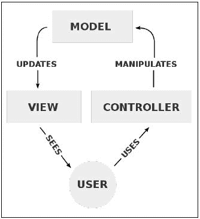

# 序言

Flask 是 Python 的 web 框架，专门设计用于提供创建 web 应用程序所需的最少功能。与其他 web 框架不同，特别是与其他语言的 web 框架不同，Flask 没有一个完整的库生态系统捆绑在一起，用于数据库查询或表单处理。相反，Flask 更倾向于成为一个实现不可知论者。

这个设置的主要特点是，它允许程序员以任何他们想要的方式设计他们的应用程序和工具。不提供自己的通用抽象版本也意味着标准库可以比其他框架更频繁地使用，这保证了其他 Python 程序员对它们的稳定性和可读性。因为 Flask 社区相当大，所以也有许多不同的社区提供的方法来添加公共功能。本书的重点之一是介绍这些扩展，并找出它们如何帮助避免重新发明轮子。这些扩展最棒的一点是，如果你不需要它们的额外功能，你就不需要包含它们，你的应用程序也会很小。

这种设置的主要缺点是，绝大多数 Flask 新用户不知道如何正确构造大型应用程序，最终会创建一堆无法理解和维护的代码。这就是为什么本书的另一个重点是如何使用 Flask 应用程序创建模型-视图-控制器（MVC）体系结构。

最初是为了设计桌面用户界面而发明的，MVC 设置允许将数据处理（模型）、用户交互（控制器）和用户界面（视图）分为三个不同的组件。



分离这三个不同的组件可以让程序员重用代码，而不是为每个网页重新实现相同的功能。例如，如果数据处理代码没有拆分为它自己的单独函数，那么我们必须在呈现网页的每个函数中编写相同的数据库连接代码和 SQL 查询。

开发 web 应用程序时可能出现的问题的大量研究和大量痛苦的第一手经验使本书成为 Flask 上最全面的资源，因此我真诚地希望您会喜欢阅读本书。

# 这本书涵盖的内容

[第 1 章](01.html "Chapter 1. Getting Started")*入门*帮助读者使用 Python 项目的最佳实践为开发建立一个烧瓶环境。读者会得到一个非常基本的框架烧瓶应用程序，该应用程序贯穿全书。

[第 2 章](02.html "Chapter 2. Creating Models with SQLAlchemy")*使用 SQLAlchemy*创建模型，展示了如何将 Python 数据库库 SQLAlchemy 与 Flask 结合使用，为您的数据库创建面向对象的 API。

[第 3 章](03.html "Chapter 3. Creating Views with Templates")*使用模板创建视图*展示了如何使用 Flask 的模板系统 Jinja，通过利用 SQLAlchemy 模型动态创建 HTML。

[第 4 章](04.html "Chapter 4. Creating Controllers with Blueprints")*使用蓝图创建控制器*介绍了如何使用 Flask 的蓝图功能来组织视图代码，同时避免重复自己。

[第 5 章](05.html "Chapter 5. Advanced Application Structure")、*高级应用程序结构*使用在最后四章中获得的知识，说明如何重新组织代码文件，以创建更易于维护和测试的应用程序结构。

[第 6 章](06.html "Chapter 6. Securing Your App")*保护您的应用程序*的安全，解释了如何使用各种 Flask 扩展来添加一个登录系统，该系统对每个视图具有基于权限的访问权限。

[第 7 章](07.html "Chapter 7. Using NoSQL with Flask")*将 NoSQL 与 Flask*结合使用，展示了什么是 NoSQL 数据库，以及当它允许更强大的功能时如何将其集成到应用程序中。

[第 8 章](08.html "Chapter 8. Building RESTful APIs")*构建 RESTful API*展示了如何以安全易用的方式将存储在应用程序数据库中的数据提供给第三方。

[第 9 章](09.html "Chapter 9. Creating Asynchronous Tasks with Celery")*使用芹菜*创建异步任务，说明如何将昂贵或耗时的程序移到后台，以使应用程序不会减速。

[第 10 章](10.html "Chapter 10. Useful Flask Extensions")*有用的 Flask 扩展*解释了如何利用流行的 Flask 扩展，使您的应用程序更快，添加更多功能，并使调试更容易。

[第 11 章](11.html "Chapter 11. Building Your Own Extension")*构建您自己的扩展*，教您如何使用烧瓶扩展以及如何创建您自己的扩展。

[第 12 章](12.html "Chapter 12. Testing Flask Apps")*测试烧瓶应用程序*解释了如何在应用程序中添加单元测试和用户界面测试，以保证质量并减少错误代码的数量。

[第 13 章](13.html "Chapter 13. Deploying Flask Apps")*部署 Flask 应用程序*解释了如何将已完成的应用程序从开发转移到托管在实时服务器上。

# 这本书你需要什么

要开始阅读本书，您只需要选择一个文本编辑器、一个 web 浏览器和安装在机器上的 Python。

Windows、Mac OS X 和 Linux 用户都应该能够轻松地了解本书的内容。

# 这本书是给谁的

这本书是为 web 开发人员编写的，他们已经有点熟悉 Flask，并且希望将他们对 Flask 的理解从入门级提升到硕士级。

# 公约

在本书中，您将发现许多文本样式可以区分不同类型的信息。下面是这些风格的一些例子，并解释了它们的含义。

文本中的代码字、数据库表名、文件夹名、文件名、文件扩展名、路径名、虚拟 URL、用户输入和 Twitter 句柄如下所示：“`first()`和`all()`方法返回一个值，因此结束链。”

代码块设置如下：

```py
class User(db.Model):
    id = db.Column(db.Integer(), primary_key=True)
    username = db.Column(db.String(255))
    password = db.Column(db.String(255))
    posts = db.relationship(
        'Post',
        backref='user',
        lazy='dynamic'
    )
```

当我们希望提请您注意代码块的特定部分时，相关行或项目以粗体显示：

```py
from flask.ext.sqlalchemy import SQLAlchemy

app = Flask(__name__)
app.config.from_object(DevConfig)
db = SQLAlchemy(app)

```

任何命令行输入或输出的编写方式如下：

```py
$ python manage.py db init

```

**新术语**和**重要词语**以粗体显示。您在屏幕上看到的文字（例如，在菜单或对话框中）显示在文本中，如下所示：“点击另一个写有**下载引导程序**的按钮，您将开始下载 Zip 文件。”

### 注

警告或重要注释显示在这样的框中。

### 提示

提示和技巧如下所示。

# 读者反馈

我们欢迎读者的反馈。让我们知道你对这本书的看法你喜欢还是不喜欢。读者反馈对我们来说很重要，因为它可以帮助我们开发出您将真正从中获得最大收益的标题。

要向我们发送总体反馈，只需发送电子邮件`<[feedback@packtpub.com](mailto:feedback@packtpub.com)>`，并在邮件主题中提及该书的标题。

如果您对某个主题有专业知识，并且您有兴趣撰写或贡献一本书，请参阅我们的作者指南[www.packtpub.com/authors](http://www.packtpub.com/authors)。

# 客户支持

既然您是一本 Packt 图书的骄傲拥有者，我们有很多东西可以帮助您从购买中获得最大收益。

## 下载示例代码

您可以从您的账户[下载示例代码文件 http://www.packtpub.com](http://www.packtpub.com) 对于您购买的所有 Packt 出版书籍。如果您在其他地方购买了本书，您可以访问[http://www.packtpub.com/support](http://www.packtpub.com/support) 并注册，将文件直接通过电子邮件发送给您。

## 勘误表

虽然我们已尽一切努力确保内容的准确性，但错误确实会发生。如果您在我们的一本书中发现错误，可能是文本或代码中的错误，如果您能向我们报告，我们将不胜感激。通过这样做，您可以使其他读者免于沮丧，并帮助我们改进本书的后续版本。如果您发现任何错误，请访问[进行报告 http://www.packtpub.com/submit-errata](http://www.packtpub.com/submit-errata) ，选择您的书籍，点击**勘误表提交表**链接，输入您勘误表的详细信息。一旦您的勘误表得到验证，您的提交将被接受，勘误表将上载到我们的网站或添加到该标题勘误表部分下的任何现有勘误表列表中。

要查看之前提交的勘误表，请转至[https://www.packtpub.com/books/content/support](https://www.packtpub.com/books/content/support) 并在搜索字段中输入图书名称。所需信息将出现在**勘误表**部分下。

## 盗版

在互联网上盗版版权材料是所有媒体都面临的一个持续问题。在 Packt，我们非常重视版权和许可证的保护。如果您在互联网上发现任何形式的非法复制品，请立即向我们提供地址或网站名称，以便我们采取补救措施。

请致电`<[copyright@packtpub.com](mailto:copyright@packtpub.com)>`与我们联系，并提供可疑盗版材料的链接。

我们感谢您在保护我们的作者方面提供的帮助以及我们为您带来有价值内容的能力。

## 问题

如果您对本书的任何方面有任何问题，可以通过`<[questions@packtpub.com](mailto:questions@packtpub.com)>`与我们联系，我们将尽力解决该问题。