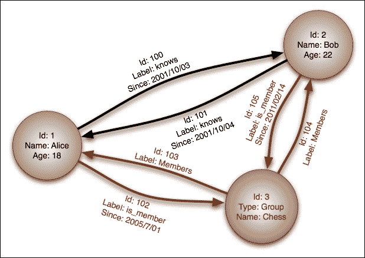

# 第 7 章 NoSQL 与烧瓶的配合使用

一个**NoSQL**（不仅仅是 SQL 的缩写）数据库是任何非关系数据存储。它通常关注速度和可扩展性。在过去的 7 年里，NoSQL 在 web 开发领域掀起了一场风暴。大型公司，如 Netflix 和 Google，宣布将其许多服务转移到 NoSQL 数据库，许多小型公司也纷纷效仿。

本章将偏离本书的其余部分，其中烧瓶将不是主要焦点。在一本关于 Flask 的书中，对数据库设计的关注可能显得有些奇怪，但在设计技术堆栈时，为应用程序选择正确的数据库无疑是最重要的决定。在绝大多数 web 应用程序中，数据库是瓶颈，因此您选择的数据库将决定应用程序的总体速度。亚马逊进行的一项研究表明，即使是 100 毫秒的延迟也会导致销售额下降 1%，因此速度应该始终是 web 开发人员关注的主要问题之一。此外，在 web 开发人员的程序员社区中，有大量关于选择流行的 NoSQL 数据库，然后却不真正了解数据库在管理方面需要什么的恐怖故事。这会导致大量数据丢失和崩溃，这反过来又意味着失去客户。总而言之，毫不夸张地说，您为应用程序选择的数据库可能是应用程序成功与失败的区别。

为了说明 NoSQL 数据库的优点和缺点，将检查每种类型的 NoSQL 数据库，并列出 NoSQL 与传统数据库之间的差异。

# NoSQL 数据库的类型

NoSQL 是一个笼统的术语，用来描述在数据库中存储数据的非传统方法。更让人困惑的是，NoSQL也可能指关系数据库，但不使用 SQL 作为查询语言，例如**DB**。与 RDBMS 不同，绝大多数 NoSQL 数据库都不是关系数据库，这意味着它们无法执行诸如`JOIN`之类的操作。缺少`JOIN`操作是一个折衷方案，因为它可以通过将数据分散到多个服务器甚至单独的数据中心来实现更快的读取和更容易的分散。

现代NoSQL 数据库包括键值存储、文档存储、列族存储和图形数据库。

## 键值存储

一个**键值**NoSQL 数据库的行为很像 Python 中的字典。单个值与一个键关联，并通过该键访问。此外，就像Python 字典一样，不管有多少条条目，大多数键值数据库的读取速度都是相同的。高级程序员会知道这一点，因为**O（1）读取**。在某些键值存储中，一次只能检索一个键，而不是传统 SQL 数据库中的多行。在大多数键值存储中，值的内容不是*可查询*，而是键。值只是二进制 blob；它们可以是从字符串到电影文件的任何内容。但是，一些键值存储提供默认类型，例如字符串、列表、集合和字典，同时仍然提供添加二进制数据的选项。

由于其简单性，键值存储通常非常快。然而，它们的简单性使得它们不适合作为大多数应用程序的主数据库。因此，大多数键值存储用例都存储在给定时间后需要过期的简单对象中。此模式的两个常见示例是存储用户的会话数据和购物车数据。此外，键值存储通常用作应用程序或其他数据库的缓存。例如，来自通常运行的或 CPU 密集型查询或函数的结果以查询或函数名作为键存储。在数据库上运行查询之前，应用程序将检查键值存储中的缓存，从而减少页面加载时间和数据库压力。此功能的示例将在[第 10 章](10.html "Chapter 10. Useful Flask Extensions")、*实用烧瓶扩展*中显示。

最受欢迎的键值存储是**Redis**、**Riak**和**亚马逊 DynamoDB**。

## 文件存储

**文档存储**是最流行的 NoSQL数据库类型之一，通常取代 RDBMS。数据库将数据存储在称为文档的键值对集合中。这些文档是无模式的，这意味着没有文档必须遵循另一个文档的结构。另外，在文档创建之后，可以向文档附加额外的键。大多数文档存储以**JSON**（**JavaScript 对象表示法**）存储数据，这是 JSON 的超集或 XML。对于示例，以下是存储在 JSON 中的两个不同的 post 对象：

```py
{
    "title": "First Post",
    "text": "Lorem ipsum...",
    "date": "2015-01-20",
    "user_id": 45
}
{
    "title": "Second Post",
    "text": "Lorem ipsum...",
    "date": "2015-01-20",
    "user_id": 45,
    "comments": [
        {
            "name": "Anonymous",
            "text": "I love this post."
        }
    ]
}
```

注意第一个文档没有注释数组。如前所述，文档是无模式的，因此这种格式是完全有效的。缺少模式也意味着在数据库级别没有类型检查。数据库中没有任何内容可以阻止将整数输入帖子的标题字段。无模式数据是文档存储最强大的功能，吸引了许多人在应用程序中采用这种功能。但是，这也可能被认为是非常危险的，因为少了一次检查就可以阻止错误或格式错误的数据进入数据库。

一些文档存储在文档集合中收集相似的对象，以使查询对象更容易。但是，在某些文档存储中，一次查询所有对象。文档存储存储每个对象的元数据，允许查询每个文档中的所有值并返回匹配的文档。

最受欢迎的文档库是**MongoDB**、**CouchDB**和**Couchbase**。

## 栏目家族店

**栏目系列店**又称广栏目店，与键值店和文档店有很多共同点。列族存储是最快的 NoSQL 数据库类型，因为它们是为大型应用程序设计的。它们的主要优势是能够处理 TB 级的数据，并且通过智能方式将数据分布到多个服务器上，仍然具有非常快的读写速度。

Column family stores 也是最难理解的，部分原因是 Column family stores 的方言，因为它们使用了许多与 RDBMS 相同的术语，但含义却大相径庭。为了清楚地理解 column 家族商店是什么，让我们直接跳到一个示例。让我们创建一个简单的*用户，在典型的 column family store 中发布*关联。

首先，我们需要一个用户表。在列族存储中，数据通过唯一键（如键值存储）存储和访问，但内容是非结构化列（如文档存储）。考虑下面的用户表：

<colgroup><col style="text-align: left"> <col style="text-align: left"> <col style="text-align: left"> <col style="text-align: left"> <col style="text-align: left"> <col style="text-align: left"></colgroup> 
| 

钥匙

 | 

杰克

 | 

约翰

 |
| --- | --- | --- |
| **栏** | **全名** | **生物** | **位置** | **全名** | **生物** |
| **值** | 杰克·斯托弗 | 这是我对我的看法 | 美国密歇根州 | 无名氏 | 这是我对我的看法 |

请注意，每个键都包含列，这些列也是键值对。此外，不要求每个键具有相同数量或类型的列。每个键可以存储数百个唯一的列，或者它们都可以具有相同的列数，以使应用程序开发更容易。这与键值存储相反，键值存储可以用每个键保存任何类型的数据。这与文档存储也略有不同，文档存储可以存储类型，例如每个文档中的数组和字典。现在，让我们创建 posts 表：

<colgroup><col style="text-align: left"> <col style="text-align: left"> <col style="text-align: left"> <col style="text-align: left"> <col style="text-align: left"> <col style="text-align: left"> <col style="text-align: left"></colgroup> 
| 

钥匙

 | 

员额/1

 | 

员额/2

 |
| --- | --- | --- |
| **栏** | **标题** | **日期** | **文本** | **标题** | **日期** | **文本** |
| **值** | 你好，世界 | 2015-01-01 | 发布文本… | 还在这儿吗 | 2015-02-01 | 发布文本… |

在我们继续之前，有几件关于 column 家族商店的事情需要了解。首先，在列族存储中，只能通过单个键或键范围选择数据；无法查询列的内容。为了避免这种情况，许多程序员在数据库中使用外部搜索工具，如**Elasticsearch**，它以可搜索的格式存储列的内容，并返回要在数据库上查询的匹配键。这就是为什么正确的*模式*设计在列族存储中如此重要的原因，在存储任何数据之前必须仔细考虑。

第二，数据不能按列的内容排序。数据只能按键排序，这就是 POST 的键是整数的原因。这允许按输入顺序返回帖子。这不是用户表的要求，因为不需要对用户进行顺序排序。

第三，没有`JOIN`操作符，我们无法查询包含用户密钥的列。在我们当前的模式下，无法将帖子与用户关联。要创建此功能，我们需要第三个表来保存用户发布关联：

<colgroup><col style="text-align: left"> <col style="text-align: left"> <col style="text-align: left"> <col style="text-align: left"></colgroup> 
| 

钥匙

 | 

杰克

 |
| --- | --- |
| **栏** | 帖子 | 员额/1 | 员额/1 |
| **值** |   | 员额/2 | 员额/2 |

这与我们目前看到的其他表格略有不同。`Posts`列被命名为超级列，它是一个包含其他列的列。在这个表中，一个超级列与我们的用户键相关联，用户键持有一篇文章的位置与一篇文章的关联。聪明的读者可能会问，为什么我们不将这个关联存储在我们的用户表中，就像在文档存储中如何解决这个问题一样。这是因为常规列和超级列不能保存在同一个表中。必须在创建每个表时选择一个。

要通过用户获取所有帖子的列表，我们首先必须使用用户键查询帖子关联表，使用返回的关联列表获取帖子表中的所有键，然后使用键查询帖子表。

如果这个查询在你看来像是一个迂回的过程，那是因为它是这样的，而且设计也是这样的。column 系列存储的局限性使其能够如此快速地处理如此多的数据。删除“按值搜索”和“列名搜索”等功能后，列族存储了处理数百 TB 数据的能力。可以毫不夸张地说，对于程序员来说，SQLite 是一个比典型的列族存储更复杂的数据库。

出于这个原因，大多数 Flask 开发人员应该避开列族存储，因为它增加了不必要的应用程序的复杂性。除非您的应用程序每秒要处理数百万次读写操作，否则使用 column 家族存储就像用原子弹敲钉子一样。

最受欢迎的专栏家族店有**BigTable**、**Cassandra**和**HBase**。

## 图形数据库

图形数据库旨在描述和查询关系，类似于文档存储，但有机制创建和描述两个**节点**之间的链接。

图形存储中的节点是一段数据，通常是键值对的集合或 JSON 文档。可以为节点指定标签，以将其标记为类别的一部分，例如，用户或组。定义节点后，可以使用节点自身的属性在节点之间创建任意数量的单向关系，称为**链接**。例如，如果我们的数据有两个用户节点，并且两个用户中的每一个都知道对方，那么我们将在他们之间定义两个“知道”链接来描述这种关系。这将允许您查询认识一个用户的所有人或一个用户认识的所有人。



图形存储还允许您按链接的属性进行查询。这允许您轻松创建其他复杂的查询，例如一个用户在 2001 年 10 月标记为已知的所有用户。图形存储可以跟踪节点之间的链接，以创建更复杂的查询。如果这个示例数据集有更多的组，我们可以查询我们认识的人已经加入但我们还没有加入的组。否则，我们可以查询与用户属于同一组但用户不认识的人。graph store 中的查询也可以通过大量链接来回答复杂的问题，例如“在纽约，哪些餐厅提供汉堡包，我的朋友喜欢这些餐厅？”

图形数据库最常见的用例是构建推荐引擎。例如，假设我们有一个图形商店，里面装满了来自社交网站的朋友数据。利用这些数据，我们可以通过查询两个以上的朋友将他们标记为朋友的用户来构建一个共同的朋友查找器。

图形数据库很少用作应用程序的主数据存储。大多数使用图形存储的情况下，每个节点通过存储其唯一标识符和少量其他标识信息，在其主数据库中充当一段数据的表示。

最受欢迎的图形存储是**Neo4j**和**InfoGrid**。

# RDBMS 与 NoSQL

NoSQL 是一种工具，与任何工具一样，它也有自己擅长的特定用例，以及更适合其他工具的用例。没有人会用螺丝刀钉钉子。这是可能的，但使用锤子会使工作更容易。NoSQL 数据库的一个大问题是，当 RDBMS 能够同样或更好地解决问题时，人们就会采用它们。

要了解何时使用哪种工具，我们必须了解这两种系统的优缺点。

## RDBMS 数据库的优势

RDBMS 最大的优点之一是它的成熟度。RDBMS 背后的技术已经存在了 40 多年，它基于关系代数和关系演算的坚实理论。由于其成熟性，他们在以安全可靠的方式处理数据的许多不同行业中都有着长期的、行之有效的记录。

### 数据安全

安全性也是 RDBMS 的最大卖点之一。RDBMS 有几种方法可以确保输入数据库的数据不仅正确，而且实际上不存在数据丢失。这些方法结合起来形成所谓的**酸**，代表原子性、一致性、隔离性和耐久性。ACID 是一组用于确保安全处理事务的规则。

首先，原子性要求每个事务都是全部或无。如果事务的一部分失败，则整个事务失败。这很像 Python 禅宗中的思想：“错误永远不应该以静默的方式传递。除非显式地静默。”如果更改或输入的数据有问题，事务不应该继续运行，因为继续进行的操作很可能要求以前的操作成功。

其次，一致性要求事务修改或添加的任何数据都遵循每个表的规则。这些规则包括类型检查、用户定义的约束（如`FOREIGN KEY`、级联规则和触发器。如果任何规则被破坏，那么根据原子性规则，事务将被抛出。

第三，隔离要求，如果数据库同时运行事务以加快写入速度，则如果事务连续运行，其结果将是相同的。这主要是数据库程序员的规则，而不是 web 开发人员需要担心的事情。

最后，持久性要求一旦事务被接受，数据永远不能丢失，除非在事务被接受后硬盘驱动器出现故障。如果数据库崩溃或断电，则耐久性原则要求在备份服务器时，在问题发生之前写入的任何数据仍然存在。这本质上意味着所有事务在被接受后都必须写入磁盘。

### 速度和规模

一个常见的误解是，ACID 原理使 RDBMS 无法扩展和减速。这只是事实的一半；RDBMS 完全可以扩展。例如，由专业数据库管理员配置的 Oracle 数据库每秒可以处理数以万计的复杂查询。大型公司，如 Facebook、Twitter、Tumblr 和 Yahoo！，我们使用 MySQL 的效果非常好，PostgreSQL 由于其比 MySQL 的速度优势而成为许多程序员的最爱。

然而，RDBMS 最大的缺点是无法通过将数据拆分到多个串联工作的数据库来轻松扩展。正如一些批评者所暗示的那样，这并非不可能，只是比 NoSQL 数据库更难。这是由于`JOIN`的性质造成的，它需要扫描表中的整个数据，即使它被拆分到多个服务器上。有几种工具可以帮助创建分区设置，但这主要还是专业数据库管理员的工作。

### 工具

在评估一种编程语言时，支持或反对采用它的最大优势在于其社区的规模和活动。一个更大、更活跃的社区意味着，如果您陷入困境，将有更多的帮助，并且在您的项目中可以使用更多的开源工具。

数据库也一样。一个 RDBMS，比如 MySQL 或 PostgreSQL，对于商业环境中使用的几乎每种语言都有官方的库，对于其他任何语言都有非官方的库。Excel 等工具可以轻松地从其中一个数据库下载最新数据，并允许用户将其视为任何其他数据集。每个数据库都有几个免费的桌面 GUI，其中一些由数据库的公司赞助商正式支持。

## NoSQL 数据库的优势

许多人使用 NoSQL 数据库的主要原因是它比传统数据库的速度优势。不折不扣地说，许多 NoSQL 数据库的性能可以大大超过 RDBMS。然而，速度是有代价的。许多 NoSQL 数据库，尤其是文档存储，牺牲了一致性以获得可用性。这意味着它们可以处理许多并发读写，但这些写操作可能相互冲突。这些数据库承诺“最终一致性”，而不是每次写入时的一致性检查。简而言之，许多 NoSQL 数据库不提供 ACID 事务，或者在默认情况下关闭它们。一旦启用了 ACID 检查，数据库的速度将降至接近传统数据库的性能。每个 NoSQL 数据库处理数据安全的方式都不同，因此在选择一个数据库之前仔细阅读文档非常重要。

吸引人们使用 NoSQL 的第二个特性是它处理未格式化数据的能力。将数据存储在 XML 或 JSON 中允许每个文档具有任意结构。存储用户设计的数据的应用程序从 NoSQL 的采用中受益匪浅。例如，允许玩家向某个中央存储库提交自定义级别的视频游戏现在可以以可查询格式而不是二进制 blob 存储数据。

吸引人们使用 NoSQL 的第三个特性是易于创建一组协同工作的数据库。与 RDBMS 相比，没有`JOIN`或仅通过键访问值使得跨服务器拆分数据变得相当简单。这是因为`JOIN`需要扫描整个表，即使它被拆分为多个不同的服务器。当文档或密钥可以通过一种算法分配给服务器时，`JOIN`的速度会变得更慢，这种算法就像服务器唯一标识符的起始字符一样简单。例如，所有以字母 A-H 开头的内容都发送到服务器 1，I-P 发送到服务器 2，Q-Z 发送到服务器 3。这使得查找连接的客户端的数据位置非常快。

## 什么时候使用什么数据库

因此，每个数据库都有不同的用途。在本节的开头，有人指出，当程序员为他们的技术堆栈选择 NoSQL 数据库时，主要的问题是他们选择它的时候 RDBMS 也能正常工作。这是一些常见的误解造成的。首先，人们尝试使用关系思维和数据模型，并认为它们在 NoSQL 数据库中也能正常工作。人们通常会产生这种误解，因为 NoSQL 数据库的网站营销具有误导性，鼓励用户放弃当前的数据库，而不考虑非关系模型是否适用于他们的项目。

其次，人们认为他们的应用程序只能使用一个数据存储。许多应用程序可以从使用多个数据存储中获益。以 Facebook 克隆为例，它可以使用 MySQL 保存用户数据，使用 redis 存储会话数据，使用文档存储保存人们共享的测验和调查数据，使用图形数据库实现“查找朋友”功能。

如果应用程序功能需要非常快速的写入，并且写入安全性不是主要问题，那么请使用文档存储数据库。如果需要存储和查询无模式的数据，那么应该使用文档存储数据库。

如果应用程序功能需要存储在指定时间后删除自身的内容，或者不需要搜索数据，则使用键值存储。

如果应用程序功能依赖于查找或描述两组或多组数据之间的复杂关系，则使用图形存储。

如果应用程序功能需要有保证的写安全性，则每个条目都可以固定到指定的模式中，需要使用联接比较数据库中的不同数据集，或者需要对输入的数据进行约束，然后使用 RDBMS。

# 烧瓶中的 MongoDB

MongoDB 绝对是最流行的 NoSQL 数据库。MongoDB 也是 Flask 和 Python 最受支持的 NoSQL 数据库。因此，我们的示例将集中在 MongoDB 上。

MongoDB是一个文档存储 NoSQL 数据库。文档存储在集合中，集合允许对相似文档进行分组，但在集合中存储文档不需要文档之间的相似性。文档在名为 BSON 的 JSON 超集中定义，BSON 代表二进制 JSON。BSON 允许 JSON 以二进制格式而不是字符串格式存储，从而节省了大量空间。BSON 还区分了几种不同的数字存储方式，如 32 位整数和双精度整数。

为了理解 MongoDB 的基础知识，我们将使用 Flask MongoEngine 介绍前面章节中 Flask SQLAlchemy 的相同功能。请记住，这些只是示例。重构当前代码以使用 MongoDB 没有任何好处，因为 MongoDB 无法为我们的用例提供任何新功能。下一节将介绍 MongoDB 的新功能。

## 安装 MongoDB

要安装 MongoDB，请转至[https://www.mongodb.org/downloads](https://www.mongodb.org/downloads) 并从标题“下载并运行 MongoDB”下的选项卡中选择您的操作系统。每个具有受支持版本的操作系统都在安装程序的下载按钮旁边列出了安装说明。

要运行 MongoDB，请转到 bash 并运行：

```py
$ mongod

```

只要窗口打开，服务器就会一直运行。

## 建立 MongoEngine

MongoEngine 需要安装 pip 才能开始：

```py
$ pip install Flask-MongoEngine

```

在`models.py`文件中，将创建一个代表我们数据库的 mongo 对象：

```py
from flask.ext.mongoengine import MongoEngine
…
db = SQLAlchemy()
mongo = MongoEngine()
```

就像 SQLAlchemy 对象一样，我们的 mongo 对象需要在`__init__.py`中的 app 对象上初始化：

```py
from models import db, mongo
…
db.init_app(app)
mongo.init_app(app)
```

在我们的应用程序运行之前，`config.py`中的`DevConfig`对象需要设置 mongo 连接的参数：

```py
MONGODB_SETTINGS = {
    'db': 'local',
    'host': 'localhost',
    'port': 27017
}
```

这些是全新 MongoDB 安装的默认设置。

## 定义文件

MongoEngine 是一种基于 Python 对象系统的 ORM，专门针对 MongoDB。不幸的是，不存在支持所有 NoSQL驱动程序的 SQLAlchemy 样式的包装器。在 RDBMS 中，SQL 的实现非常相似，因此可以创建通用接口。但是，每个文档存储的底层实现都非常不同，因此创建类似接口的任务将非常麻烦。

mongo 数据库中的每个集合都由继承自 mongo 的类表示。文档：

```py
class Post(mongo.Document):
    title = mongo.StringField(required=True)
    text = mongo.StringField()
    publish_date = mongo.DateTimeField(
        default=datetime.datetime.now()
    )

    def __repr__(self):
        return "<Post '{}'>".format(self.title)
```

每个类变量都是属于文档的一个键的表示，在本例的 Post 类中表示。类变量名用作文档中的键。

与 SQLAlchemy 不同，不需要定义主键。将在 ID 属性下为您生成唯一的 ID。前面的代码将生成一个类似于以下内容的 BSON 文档：

```py
{
    "_id": "55366ede8b84eb00232da905",
    "title": "Post 0",
    "text": "<p>Lorem ipsum dolor...",
    "publish_date": {"$date": 1425255876037}
}
```

### 字段类型

在 Mongo 中有大量字段，每个字段都表示不同类别的数据。与基础数据库不同，在允许保存或更改文档之前，每个字段都提供类型检查。使用最多的字段如下所示：

*   布尔菲尔德
*   DateTimeField
*   迪克特菲尔德
*   动态场
*   嵌入式文档字段
*   浮场
*   因特菲尔德
*   ListField
*   目标场
*   参考场
*   斯特林菲尔德

### 注

有关字段的完整列表和详细文档，请访问 MongoEngine 网站[http://docs.mongoengine.org](http://docs.mongoengine.org) 。

其中大多数是根据它们接受的 Python 类型命名的，其工作原理与 SQLAlchemy 类型相同。然而，有些新类型在 SQLAlchemy 中有对应的类型。`DynamicField`是一个字段，可以保存任何类型的值，并且不对值执行类型检查。`DictField`可以存储任何可以被`json.dumps()`序列化的 Python 字典。`ReferenceField`只存储文档的唯一 ID，查询时 MongoEngine 会返回引用的文档。与`ReferenceField`相反，`EmbeddedDocumentField`将传递的文档存储在父文档中，因此不需要第二次查询。`ListField`类型表示特定类型的字段列表。

这通常用于存储对其他文档的引用列表或嵌入文档列表，以创建一对多关系。如果需要未知类型的列表，可以使用`DynamicField`。每个字段类型都有一些常用参数，如下所示。

```py
Field(
    primary_key=None
    db_field=None,
    required=False,
    default=None,
    unique=False,
    unique_with=None,
    choices=None
)
```

`primary_key`参数指定您不希望 MongoEngine 自动生成唯一键，但字段的值应用作 ID。现在可以从`id`属性和字段名称访问此字段的值。

`db_field`定义每个文档中密钥的名称。如果未设置，它将默认为类变量的名称。

如果`required`定义为`True`，则该密钥必须存在于文档中。否则，该类型的文档不必存在密钥。当查询一个定义了不存在键的类时，它将返回 None。

`default`指定如果未定义值，该字段将给出的值。

如果将`unique`设置为`True`，则 MongoEngine 会进行检查，以确保集合中没有其他文档具有与此字段相同的值。

当传递字段名列表时，`unique_with`将确保组合使用时，所有字段的值对于每个文档都是唯一的。这很像 RDBMS 中的多列`UNIQUE`索引。

最后，当给定一个列表时，`choices`选项将该字段的允许值限制为列表中的元素。

### 文件类型

MongoEngine 的定义文档的方法允许在一个集合一个集合的基础上实现灵活性或刚性。从`mongo.Document`继承意味着只有类中定义的键才能保存到数据库中。类中定义的那些键可以为空，但其他所有键都将被忽略。另一方面，如果您的类继承了`mongo.DynamicDocument`，则任何额外设置的字段都将被视为`DynamicFields`，并与文档一起保存。

```py
class Post(mongo.DynamicDocument):
    title = mongo.StringField(required=True, unique=True)
    text = mongo.StringField()
    …
```

为了显示不推荐的极端，以下类别完全有效；它没有必填字段，允许设置任何字段：

```py
class Post(mongo.DynamicDocument):
    pass
```

最后一种类型的文档是`EmbeddedDocument`。`EmbeddedDocument`只是传递给`EmbeddedDocumentField`并按如下方式存储在文档中的文档：

```py
class Comment(mongo.EmbeddedDocument):
    name = mongo.StringField(required=True)
    text = mongo.StringField(required=True)
    date = mongo.DateTimeField(
        default=datetime.datetime.now()
    )

```

为什么在`DictField`上使用`EmbeddedDocumentField`，而它们似乎执行相同的功能？使用每种方法的最终结果是相同的。然而，嵌入式文档定义了数据的结构，`DictField`可以是任何东西。为了更好地理解，可以这样想：`Document`对`DynamicDocument`就像`EmbeddedDocument`对`DictField`一样。

### 元属性

使用类变量`meta`可以手动设置文档的许多属性。如果您正在处理一组现有数据，并且希望将类连接到集合，请设置`meta`字典的集合键：

```py
class Post(mongo.Document):
    …
    meta = {'collection': 'user_posts'}
```

您还可以手动设置集合中文档的最大数量以及每个文档的大小。在本例中，只能有 10000 个文档，每个文档的大小不能超过 2MB：

```py
 class Post(mongo.Document):
    …
    meta = {
```

```py
        'collection': 'user_posts',
        'max_documents': 10000,
        'max_size': 2000000
    }
```

索引也可以通过 MongoEngine 设置。索引可以是使用字符串的单个字段，也可以是使用元组的多字段：

```py
class Post(mongo.Document):
    …
    meta = {
```

```py
        'collection': 'user_posts',
        'max_documents': 10000,
        'max_size': 2000000,
        'indexes': [
            'title',
            ('title', 'user')
        ]
    }
```

集合的默认排序可以通过**排序键**通过`meta`变量进行设置。当`–`前置时，它告诉 MongoEngine 按该字段的降序对结果进行排序。如果`+`是前置的，它会告诉 MongoEngine 按该字段的升序对结果排序。如果在查询中指定了`order_by`函数，则会覆盖此默认行为，该查询将显示在*CRUD*部分。

```py
class Post(mongo.Document):
    …
    meta = {
```

```py
        'collection': 'user_posts',
        'max_documents': 10000,
        'max_size': 2000000,
        'indexes': [
            'title',
            ('title', 'user')
        ],
        'ordering': ['-publish_date']
    }
```

`meta`变量还可以从中继承自定义文档，默认为禁用。原始文档的子类将被视为父类的成员，并存储在同一集合中，如下所示：

```py
class Post(mongo.Document):
    …
    meta = {'allow_inheritance': True}

class Announcement(Post):
    …
```

## 积垢

正如[第 2 章](02.html "Chapter 2. Creating Models with SQLAlchemy")中所述，使用 SQLAlchemy 创建模型，任何数据存储都必须实现四种主要的数据操作形式。它们是创建新数据、读取现有数据、更新现有数据和删除数据。

### 创建

要创建一个新文档，只需创建该类的一个新实例并调用`save`方法即可。

```py
>>> post = Post()
>>> post.title = "Post From The Console"
>>> post.text = "Lorem Ipsum…"
>>> post.save()

```

否则，这些值可以在对象创建中作为关键字传递：

```py
>>> post = Post(title="Post From Console", text="Lorem Ipsum…")

```

与 SQLAlchemy 不同，MongoEngine 不会自动保存`ReferenceFields`中存储的相关对象。若要保存对引用文档的任何更改以及对当前文档的更改，请将`cascade`传递为`True`：

```py
>>> post.save(cascade=True)

```

如果您希望插入文档并跳过对类定义中定义的参数的检查，则将验证传递为`False`。

```py
>>> post.save(validate=False)

```

### 提示

请记住，这些检查的存在是有原因的。关闭这个只有一个很好的理由

#### 写安全

默认情况下，MongoDB 在确认写入之前不会等待数据写入磁盘。这意味着，由于硬件故障或写入发生时的某些错误，确认失败的写入是可能的。为确保在 Mongo确认写入之前将数据写入磁盘，请使用`write_concern`关键字。**写入关注事项**告知 Mongo 何时返回并确认写入：

```py
# will not wait for write and not notify client if there was an error
>>> post.save(write_concern={"w": 0})
# default behavior, will not wait for write
>>> post.save(write_concern={"w": 1})
# will wait for write
>>> post.save(write_concern={"w": 1, "j": True})

```

### 注

正如 RDBMS 与 NoSQL 一节中所述，了解您正在使用的 NoSQL 数据库是如何写入的非常重要。要了解更多关于 MongoDB 的写作关注点，请访问[http://docs.mongodb.org/manual/reference/write-concern/](http://docs.mongodb.org/manual/reference/write-concern/) 。

### 阅读

要从数据库中访问文档，使用`objects`属性。要阅读集合中的所有文档，请使用`all`方法：

```py
>>> Post.objects.all()
[<Post: "Post From The Console">]

```

要限制返回的项目数量，请使用`limit`方法：

```py
# only return five items
>>> Post.objects.limit(5).all()

```

此`limit`命令与 SQL 版本略有不同。在 SQL 中，`limit`命令也可用于跳过第一个结果。要复制此功能，请按如下方式使用`skip`方法：

```py
# skip the first 5 items and return items 6-10
>>> Post.objects.skip(5).limit(5).all()

```

默认情况下，MongoDB 返回按创建时间排序的结果。为了控制这一点，有`order_by`功能：

```py
# ascending
>>> Post.objects.order_by("+publish_date").all()
# descending
>>> Post.objects.order_by("-publish_date").all()

```

如果只需要查询的第一个结果，请使用`first`方法。如果您的查询没有返回任何内容，并且您希望它返回任何内容，那么使用`first_or_404`以 404 错误自动中止。其作用与炼金术对应物完全相同，由 Flask MongoEngine提供。

```py
>>> Post.objects.first()
<Post: "Post From The Console">
>>> Post.objects.first_or_404()
<Post: "Post From The Console">

```

`get`方法也有同样的行为，它期望查询只返回一个结果，否则将引发异常：

```py
# The id value will be different your document
>>> Post.objects(id="5534451d8b84ebf422c2e4c8").get()
<Post: "Post From The Console">
>>> Post.objects(id="5534451d8b84ebf422c2e4c8").get_or_404()
<Post: "Post From The Console">

```

`paginate`方法也存在，其 API 与其炼金术对应物完全相同：

```py
>>> page = Post.objects.paginate(1, 10)
>>> page.items()
[<Post: "Post From The Console">]

```

此外，如果您的文档具有`ListField`方法，则可以使用文档对象上的`paginate_field`方法对列表中的项目进行分页。

#### 过滤

如果您知道要筛选的字段的确切值，请将其值作为关键字传递给`objects`方法：

```py
>>> Post.objects(title="Post From The Console").first()
<Post: "Post From The Console">

```

与 SQLAlchemy 不同，我们无法通过真理测试来过滤结果。相反，特殊的关键字参数用于测试值。例如，要查找 2015 年 1 月 1 日之后发布的所有帖子：

```py
>>> Post.objects(
 publish_date__gt=datetime.datetime(2015, 1, 1)
 ).all()
[<Post: "Post From The Console">]

```

附加在关键字末尾的称为运算符。MongoEngine 支持以下运营商：

*   `ne`：不等于
*   `lt`：小于
*   `lte`：小于或等于
*   `gt`：大于
*   `gte`：大于或等于
*   `not`：对运算符求反，例如`publish_date__not__gt`
*   `in`：值在列表中
*   `nin`：值不在列表中
*   `mod`：*值%a==b*、*a*和*b*被传递为*a*、*b*
*   `all`：提供的值列表中的每一项都在该字段中
*   `size`：列表的大小
*   `exists`：字段的值存在

MongoEngine 还提供以下运算符来测试字符串值：

*   `exact`：字符串等于值
*   `iexact`：字符串等于值（不区分大小写）
*   `contains`：字符串包含该值
*   `icontains`：字符串包含值（不区分大小写）
*   `startswith`：字符串以值开头
*   `istartswith`：字符串以值开头（不区分大小写）
*   `endswith`：字符串以值结尾
*   `iendswith`：字符串以值结尾（不区分大小写）`Update`

这些操作符可以组合起来创建与前面部分中创建的相同的强大查询。例如，要查找 2015 年 1 月 1 日之后创建的标题中没有`post`一词的所有帖子，正文以`Lorem`一词开头，并按发布日期以最新一个词排序：

```py
>>> Post.objects(
 title__not__icontains="post",
 text__istartswith="Lorem",
 publish_date__gt=datetime.datetime(2015, 1, 1),
).order_by("-publish_date").all()

```

但是，如果有一些复杂的查询无法用这些工具表示，那么也可以传递原始 Mongo 查询：

```py
>>> Post.objects(__raw__={"title": "Post From The Console"})

```

### 更新

为了更新对象，对查询结果调用`update`方法。

```py
>>> Post.objects(
 id="5534451d8b84ebf422c2e4c8"
 ).update(text="Ipsum lorem")

```

如果查询只返回一个值，则使用`update_one`只修改第一个结果：

```py
>>> Post.objects(
 id="5534451d8b84ebf422c2e4c8"
 ).update_one(text="Ipsum lorem")

```

与传统的 SQL 不同，在 MongoDB 中有许多不同的方法来更改值。运算符用于以不同方式更改字段的值：

*   `set`：设置一个值（与前面给出的相同）
*   `unset`：删除一个值并删除键
*   `inc`：这会增加一个值
*   `dec`：该值递减
*   `push`：在列表中追加一个值
*   `push_all`：将多个值追加到列表中
*   `pop`：删除列表的第一个或最后一个元素
*   `pull`：从列表中删除一个值
*   `pull_all`：从列表中删除多个值
*   `add_to_set`：仅当列表不在列表中时，才会向列表添加值

例如，如果需要为所有具有`MongoEngine`标记的`Post`文档的`ListField`命名标记添加`Python`值：

```py
>>> Post.objects(
 tags__in="MongoEngine",
 tags__not__in="Python"
 ).update(push__tags="Python")

```

相同的写入要保存的关注点参数存在，以便更新。

```py
>>> Post.objects(
 tags__in="MongoEngine"
 ).update(push__tags="Python", write_concern={"w": 1, "j": True})

```

### 删除

若要删除文档实例，请调用其`delete`方法：

```py
>>> post = Post.objects(
 id="5534451d8b84ebf422c2e4c8"
 ).first()
>>> post.delete()

```

## NoSQL 中的关系

当我们在 SQLAlchemy 中创建关系时，我们可以在 MongoEngine 中创建对象之间的关系。只有使用 MongoEngine，我们才能在没有`JOIN`运营商的情况下实现这一目标。

### 一对多关系

在 MongoEngine 中，有两种方法可以创建一对多关系。第一种方法是通过使用`ReferenceField`指向另一个对象的 ID 来创建两个文档之间的关系。

```py
class Post(mongo.Document):
    …
    user = mongo.ReferenceField(User)
```

通过访问`ReferenceField`的属性，可以直接访问引用对象，如下所示：

```py
>>> user = User.objects.first()
>>> post = Post.objects.first()
>>> post.user = user
>>> post.save()
>>> post.user
<User Jack>

```

与 SQLAlchemy 不同，MongoEngine 无法访问与另一个对象有关系的对象。使用 SQLAlchemy，可以声明一个`db.relationship`变量，该变量允许用户对象使用匹配的`user_id`列访问所有帖子。在 MongoEngine 中不存在类似情况。

解决方案是获取您希望搜索的帖子的用户 ID，并使用用户字段进行筛选。这与 SQLAlchemy 在幕后做的事情是一样的，但我们只是手动进行：

```py
>>> user = User.objects.first()
>>> Post.objects(user__id=user.id)

```

创建一对多关系的第二种方法是将`EmbeddedDocumentField`与`EmbeddedDocument`一起使用：

```py
class Post(mongo.Document):
    title = mongo.StringField(required=True)
    text = mongo.StringField()
    publish_date = mongo.DateTimeField(
        default=datetime.datetime.now()
    )
    user = mongo.ReferenceField(User)
    comments = mongo.ListField(
        mongo.EmbeddedDocumentField(Comment)
    )
```

访问`comments`属性会给出所有嵌入文档的列表。若要在帖子中添加新评论，请将其视为列表，并向其添加`comment`文档：

```py
>>> comment = Comment()
>>> comment.name = "Jack"
>>> comment.text = "I really like this post!"
>>> post.comments.append(comment)
>>> post.save()
>>> post.comments
[<Comment 'I really like this post!'>]

```

请注意，没有对 comment 变量调用`save`方法。这是因为注释文档不是真正的文档，它只是`DictField`的抽象。此外，请记住，文档的大小只能为 16MB，因此请注意每个文档上有多少个`EmbeddedDocumentFields`，每个文档上有多少个`EmbeddedDocuments`。

### 多对多关系

文档存储数据库中不存在多对多关系的概念。这是因为与`ListFields`完全无关。要习惯性地为`Post`对象创建标记功能，请添加字符串列表：

```py
class Post(mongo.Document):
    title = mongo.StringField(required=True)
    text = mongo.StringField()
    publish_date = mongo.DateTimeField(
        default=datetime.datetime.now()
    )
    user = mongo.ReferenceField(User)
    comments = mongo.ListField(
        mongo.EmbeddedDocumentField(Comment)
    )
    tags = mongo.ListField(mongo.StringField())
```

现在，当我们希望查询具有特定标记或多个标记的所有`Post`对象时，这是一个简单的查询：

```py
>>> Post.objects(tags__in="Python").all()
>>> Post.objects(tags__all=["Python", "MongoEngine"]).all()

```

对于每个用户对象上的角色列表，可以提供 optional choices 参数来限制可能的角色：

```py
available_roles = ('admin', 'poster', 'default')

class User(mongo.Document):
    username = mongo.StringField(required=True)
    password = mongo.StringField(required=True)
    roles = mongo.ListField(
        mongo.StringField(choices=available_roles)
    )

    def __repr__(self):
        return '<User {}>'.format(self.username)
```

# 利用 NoSQL 的力量

到目前为止，我们的MongoEngine 代码应该如下所示：

```py
available_roles = ('admin', 'poster', 'default')

class User(mongo.Document):
    username = mongo.StringField(required=True)
    password = mongo.StringField(required=True)
    roles = mongo.ListField(
        mongo.StringField(choices=available_roles)
    )

    def __repr__(self):
        return '<User {}>'.format(self.username)

class Comment(mongo.EmbeddedDocument):
    name = mongo.StringField(required=True)
    text = mongo.StringField(required=True)
    date = mongo.DateTimeField(
        default=datetime.datetime.now()
    )

    def __repr__(self):
        return "<Comment '{}'>".format(self.text[:15])

class Post(mongo.Document):
    title = mongo.StringField(required=True)
    text = mongo.StringField()
    publish_date = mongo.DateTimeField(
        default=datetime.datetime.now()
    )
    user = mongo.ReferenceField(User)
    comments = mongo.ListField(
        mongo.EmbeddedDocumentField(Comment)
    )
    tags = mongo.ListField(mongo.StringField())

    def __repr__(self):
        return "<Post '{}'>".format(self.title)
```

此代码实现了与 SQLAlchemy 模型相同的功能。为了展示 NoSQL 的独特功能，让我们添加一个 SQLAlchemy 可以实现的功能，但是要困难得多：不同的帖子类型，每个都有自己的自定义主体。这与流行博客平台 Tumblr 的功能非常相似。

首先，允许您的帖子类型充当父类，并从`Post`类中删除文本字段，因为并非所有帖子都有文本：

```py
class Post(mongo.Document):
    title = mongo.StringField(required=True)
    publish_date = mongo.DateTimeField(
        default=datetime.datetime.now()
    )
    user = mongo.ReferenceField(Userm)
    comments = mongo.ListField(
        mongo.EmbeddedDocumentField(Commentm)
    )
    tags = mongo.ListField(mongo.StringField())

    meta = {
        'allow_inheritance': True
    }
```

每个 post 类型将从`Post`类继承。这样做将允许代码将任何`Post`子类视为`Post`。我们的博客应用程序将有四种类型的帖子：普通博客帖子、图片帖子、视频帖子和引用帖子。

```py
class BlogPost(Post):
    text = db.StringField(required=True)

    @property
    def type(self):
        return "blog"

class VideoPost(Post):
    url = db.StringField(required=True)

    @property
    def type(self):
        return "video"

class ImagePost(Post):
    image_url = db.StringField(required=True)

    @property
    def type(self):
        return "image"

class QuotePost(Post):
    quote = db.StringField(required=True)
    author = db.StringField(required=True)

    @property
    def type(self):
        return "quote"
```

我们的帖子创建页面需要能够创建这些帖子类型中的每一种。需要修改`forms.py`中处理后期创建的`PostForm`对象，以首先处理新字段。我们将添加一个用于确定帖子类型的选择字段，`author`字段用于报价类型，`image`字段用于保存 URL，`video`字段用于保存嵌入的 HTML iframe。`quote`和`blog`帖子内容将共享`text`字段，如下所示：

```py
class PostForm(Form):
    title = StringField('Title', [
        DataRequired(),
        Length(max=255)
    ])
    type = SelectField('Post Type', choices=[
        ('blog', 'Blog Post'),
        ('image', 'Image'),
        ('video', 'Video'),
        ('quote', 'Quote')
    ])
    text = TextAreaField('Content')
    image = StringField('Image URL', [URL(), Length(max=255)])
    video = StringField('Video Code', [Length(max=255)])
    author = StringField('Author', [Length(max=255)])
```

`blog.py`控制器中的`new_post`查看功能也需要更新，以处理新的职位类型：

```py
@blog_blueprint.route('/new', methods=['GET', 'POST'])
@login_required
@poster_permission.require(http_exception=403)
def new_post():
    form = PostForm()

    if form.validate_on_submit():
        if form.type.data == "blog":
            new_post = BlogPost()
            new_post.text = form.text.data
        elif form.type.data == "image":
            new_post = ImagePost()
            new_post.image_url = form.image.data
        elif form.type.data == "video":
            new_post = VideoPost()
            new_post.video_object = form.video.data
        elif form.type.data == "quote":
            new_post = QuotePost()
            new_post.text = form.text.data
            new_post.author = form.author.data

        new_post.title = form.title.data
        new_post.user = User.objects(
            username=current_user.username
        ).one()

        new_post.save()

    return render_template('new.html', form=form)
```

呈现表单对象的`new.html`文件需要显示添加到表单中的新字段：

```py
<form method="POST" action="{{ url_for('.new_post') }}">
…
<div class="form-group">
    {{ form.type.label }}
    
        
            <p class="help-block">{{ e }}</p>
        
    
    {{ form.type(class_='form-control') }}
</div>
…
<div id="image_group" class="form-group">
    {{ form.image.label }}
    
         
            <p class="help-block">{{ e }}</p>
         
    
    {{ form.image(class_='form-control') }}
</div>
<div id="video_group" class="form-group">
    {{ form.video.label }}
    
        
            <p class="help-block">{{ e }}</p>
        
    
    {{ form.video(class_='form-control') }}
</div>
<div id="author_group" class="form-group">
    {{ form.author.label }}
        
            
                <p class="help-block">{{ e }}</p>
            
        
        {{ form.author(class_='form-control') }}
</div>
<input class="btn btn-primary" type="submit" value="Submit">
</form>

```

现在我们有了新的输入，我们可以添加一些 JavaScript 来根据帖子类型显示和隐藏字段：

```py

<script src="//cdn.ckeditor.com/4.4.7/standard/ckeditor.js"></script>
<script>
    CKEDITOR.replace('editor');

    $(function () {
        $("#image_group").hide();
        $("#video_group").hide();
        $("#author_group").hide();

        $("#type").on("change", function () {
            switch ($(this).val()) {
                case "blog":
                    $("#text_group").show();
                    $("#image_group").hide();
                    $("#video_group").hide();
                    $("#author_group").hide();
                    break;
                case "image":
                    $("#text_group").hide();
                    $("#image_group").show();
                    $("#video_group").hide();
                    $("#author_group").hide();
                    break;
                case "video":
                    $("#text_group").hide();
                    $("#image_group").hide();
                    $("#video_group").show();
                    $("#author_group").hide();
                    break;
                case "quote":
                    $("#text_group").show();
                    $("#image_group").hide();
                    $("#video_group").hide();
                    $("#author_group").show();
                    break;
            }
        });
    })
</script>

```

最后，`post.html`需要能够正确显示我们的帖子类型。我们有以下几点：

```py
<div class="col-lg-12">
    {{ post.text | safe }}
</div>
All that is needed is to replace this with:
<div class="col-lg-12">
    
        {{ post.text | safe }}
    
        
    
        {{ post.video_object | safe }}
    
        <blockquote>
            {{ post.text | safe }}
        </blockquote>
        <p>{{ post.author }}</p>
    
</div>
```

# 总结

在本章中，阐述了 NoSQL 与传统 SQL 系统的基本区别。我们探讨了 NoSQL 系统的主要类型，以及为什么应用程序可能需要或不需要使用 NoSQL 数据库进行设计。以我们的应用程序模型为基础，MongoDB 和 MongoEngine 的强大之处在于建立复杂的关系和继承是多么简单。在下一章中，我们的博客应用程序将扩展一个功能，该功能是为希望使用我们的站点构建自己的服务的其他程序员设计的，即 RESTful 端点。