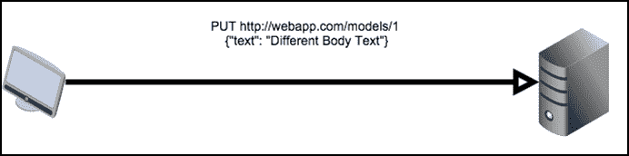

# 八、构建 RESTful API

代表性状态传输，或**REST**是一种在客户端和服务器之间传输信息的方法。在 Web 上，REST 是在 HTTP 之上使用的，它允许浏览器和服务器通过利用基本的 HTTP 命令轻松地进行通信。通过使用 HTTP 命令，REST 与平台和编程语言无关，并且将客户机和服务器解耦以便于开发。这通常用于需要在服务器上提取或更新用户信息的 JavaScript 应用中。REST 还用于为外部开发人员提供用户数据的公共接口。例如，Facebook 和 Twitter 在其应用程序界面（**API**中使用 REST），让开发者无需解析网站的 HTML 即可获取信息。

# 什么是休息

在深入了解 REST 的细节之前，让我们看一个例子。对于客户端（在本例中为 web 浏览器）和服务器，客户端通过 HTTP 向服务器发送针对某些型号的请求，如下所示：


然后服务器将用一个包含所有模型的文档进行响应。


然后，客户端可以通过`PUT`HTTP 请求修改服务器上的数据：



然后服务器将响应它已经修改了数据。这是一个非常简化的示例，但它将作为如何定义 REST 的背景。

REST 不是一个严格的标准，而是对通信设置了一组约束，以定义一种可以以多种方式实现的方法。这些约束是由于多年来对其他通信协议（如**远程过程调用**（**RPC**）或**简单对象访问协议**（**SOAP**）的反复试验而产生的。这些协议由于其严格性、冗长性以及使用它们创建 API 的困难性而被搁置一旁。确定了这些系统的问题，并创建了 REST 约束以防止这些问题再次发生。

第一个约束要求客户机和服务器必须分离关注点。客户端无法处理永久数据存储，服务器无法处理用户界面上的任何内容。

第二个约束是服务器必须是无状态的。这意味着处理请求所需的任何信息都存储在请求本身或由客户端存储。Flask 中的会话对象就是无状态服务器的一个例子。会话对象不将其信息存储在服务器上，而是将其存储在客户机上的 cookie 中。cookie 与服务器的每个请求一起发送，以解析和确定请求资源的必要数据是否存储在其中，而不是存储每个用户会话信息的服务器。

第三个限制是，提供的所有资源必须具有统一的接口。此约束有许多不同的部分，如下所示：

*   该接口基于资源，在我们的例子中，这些资源是模型。
*   服务器发送的数据不是服务器中的实际数据，而是表示形式。例如，实际数据库不是随每个请求一起发送的，而是数据的 JSON 抽象。
*   服务器发送的数据足以允许客户端修改服务器上的数据。在前面的示例中，传递给客户机的 ID 填充了此角色。
*   API 提供的每个资源必须以相同的方式表示和访问。例如，一个资源不能用 XML 表示，一个用 JSON 表示，一个用原始 TCP 表示，一个用 HTTP 表示。

最后一个约束是系统必须考虑层。负载平衡器、代理、缓存和其他服务器和服务可以在客户机和服务器之间运行，只要最终结果与它们不存在时相同。

当一个系统遵守所有这些约束时，它被认为是一个 RESTful 系统。RESTful 系统最常见的形式是由 HTTP 和 JSON 构建的。每个资源都位于其自己的 URL 路径上，并使用不同的 HTTP 请求类型进行修改。一般情况下，采取以下形式：

<colgroup><col style="text-align: left"> <col style="text-align: left"> <col style="text-align: left"></colgroup> 
| 

HTTP 方法

 | 

统一资源定位地址

 | 

行动

 |
| --- | --- | --- |
| `GET` | `http://host/resource` | 获取所有资源表示 |
| `GET` | `http://host/resource/1` | 获取 ID 为 1 的资源 |
| `POST` | `http://host/resource` | 从`POST`中的表单数据创建新资源 |
| `PUT` | `http://host/resource/1` | 修改 ID 为 1 的资源的已有数据 |
| `DELETE` | `http://host/resource/1` | 删除 ID 为 1 的资源 |

作为一个示例，对第二个`GET`请求的响应如下所示：

```py
{
    "id": 100,
    "date": "2015-03-02T00:24:36+00:00",
    "title": "Resource #98"
}
```

在 RESTAPI 中，返回正确的 HTTP 状态代码和响应数据也非常重要，以便在客户端不解析返回的消息的情况下将服务器上实际发生的情况通知客户端。下面列出了REST API 中使用的主要 HTTP 代码及其含义。

<colgroup><col style="text-align: left"> <col style="text-align: left"> <col style="text-align: left"></colgroup> 
| 

HTTP 代码

 | 

名称

 | 

意思

 |
| --- | --- | --- |
| 200 | 好啊 | HTTP 的默认代码。请求成功，返回了数据。 |
| 201 | 创建 | 请求成功，并在服务器上创建了新资源。 |
| 204 | 没有内容 | 请求成功，但响应未返回任何内容。 |
| 400 | 错误的请求 | 由于某些感知到的客户端错误（请求格式错误或缺少所需数据），请求被拒绝。 |
| 401 | 未经授权 | 请求被拒绝，因为客户端未经过身份验证，应该在再次请求此资源之前进行身份验证。 |
| 403 | 被禁止的 | 请求被拒绝，因为客户端没有访问此资源的权限。这与 401 代码相反，401 代码假定用户未经身份验证。403 代码表示，无论身份验证如何，都无法访问资源。 |
| 404 | 找不到 | 请求的资源不存在。 |
| 405 | 方法不允许 | 请求被拒绝，因为该 URL 的 HTTP 方法不可用。 |

# 设置 RESTful Flask API

在我们的应用中，我们将为数据库中的博客帖子数据创建一个 RESTful 界面。数据的表示形式将作为 JSON 发送。将使用上表中的常规表单检索和修改数据，但 URI 将为`/api/posts`。

我们可以使用标准的 Flask 视图来创建 API，但是 Flask 扩展**Flask Restful**使任务更容易。

要安装 Flask Restful，请执行以下操作：

```py
$ pip install Flask-Restful

```

在`extensions.py`文件中，初始化将处理所有路由的`Api`对象：

```py
from flask.ext.restful import Api
…
rest_api = Api()
```

Post API 的控制逻辑和视图应存储在`controllers`文件夹中名为`rest`的新文件夹中。在这个文件夹中，我们需要一个空的`__init__.py`和一个名为`post.py`的文件。在`post.py`中，让我们创建一个简单的*Hello World*示例：

```py
from flask.ext.restful import Resource

class PostApi(Resource):
    def get(self):
        return {'hello': 'world'}
```

在 Flask Restful 中，每个 REST 资源都定义为从`Resource`对象继承的类。与[第 4 章](04.html "Chapter 4. Creating Controllers with Blueprints")中所示的`MethodView`对象类似，*使用蓝图*创建控制器，从`Resource`对象继承的任何类都使用以 HTTP 方法命名的方法定义其逻辑。例如，当`GET`HTTP 方法命中`PostApi`类时，将执行`get`方法。

与我们使用的其他 Flask 扩展一样，`Api`对象需要在`__init__.py`文件中的 app 对象上初始化，该文件包含`create_app`函数。`PostApi`类还将使用`Api`对象的`add_resource()`方法定义其路由：

```py
from .extensions import (
    bcrypt,
    oid,
    login_manager,
    principals,
    rest_api
)
from .controllers.rest.post import PostApi

def create_app(object_name):
    …
    rest_api.add_resource(PostApi, '/api/post')
    rest_api.init_app(app)
```

现在，如果在浏览器中打开URI，就会显示*Hello World*JSON。

# 获取请求

对于部分`GET`、`PUT`和`DELETE`请求，我们的 API 需要修改帖子的 ID。`add_resource`方法可以采用多条路由，所以我们添加第二条捕获传递 ID 的路由：

```py
   rest_api.add_resource(
        PostApi,
        '/api/post',
        '/api/post/<int:post_id>',
        endpoint='api'
    )
```

现在`get`方法需要接受`post_id`作为关键字参数：

```py
class PostApi(Resource):
    def get(self, post_id=None):
        if post_id:
            return {"id": post_id}

        return {"hello": "world"}
```

发送到客户机的数据必须是 JSON 中 Post 对象的表示形式，那么如何翻译我们的 Post 对象呢？Flask Restful 提供了一种通过`fields`对象和`marshal_with`函数修饰符将任何对象转换为JSON 的方法。

## 输出格式

输出格式是通过创建表示基本类型的`field`对象字典来定义的。字段的键定义字段将尝试转换的属性。通过将字典传递给`marshal_with`装饰器，`get`方法试图返回的任何对象都将首先使用字典进行翻译。这也适用于对象列表：

```py
from flask import abort 
from flask.ext.restful import Resource, fields, marshal_with
from webapp.models import Post

post_fields = {
    'title': fields.String(),
    'text': fields.String(),
    'publish_date': fields.DateTime(dt_format='iso8601')
}

class PostApi(Resource):
    @marshal_with(post_fields)
    def get(self, post_id=None):
        if post_id:
            post = Post.query.get(post_id)
            if not post:
                abort(404)

            return post
        else:
            posts = Post.query.all()
            return posts
```

在浏览器中重新加载 API 时，每个 Post 对象都将以 JSON 格式显示。但是，问题是 API 不应该在创建后表单中从所见即所得编辑器返回 HTML。如前所述，服务器不应该关心 UI，HTML 纯粹用于输出规范。为了解决这个问题，我们需要一个自定义字段对象，它将 HTML 从字符串中剥离出来。在名为`fields.py`的`rest`文件夹中的新文件中，添加以下内容：

```py
from HTMLParser import HTMLParser
from flask.ext.restful import fields

class HTMLStripper(HTMLParser):
    def __init__(self):
        self.reset()
        self.fed = []

    def handle_data(self, d):
        self.fed.append(d)

    def get_data(self):
        return ''.join(self.fed)

    def strip_tags(html):
        s = HTMLStripper()
        s.feed(html)

    return s.get_data()

class HTMLField(fields.Raw):
    def format(self, value):
        return strip_tags(str(value))
```

现在，我们的`post_fields`词典应该进行更新，以适应新的领域：

```py
from .fields import HTMLField

post_fields = {
    'title': fields.String(),
    'text': HTMLField(),
    'publish_date': fields.DateTime(dt_format='iso8601')
}
```

使用标准库`HTMLParser`模块，我们现在有一个`strip_tags`函数，它将返回清除 HTML 标记后的任何字符串。通过继承`fields.Raw`类并通过`strip_tags`函数发送值，定义了一个新的字段类型`HTMLfield`。如果再次重新加载页面，则所有 HTML 都将消失，只保留文本。

Flask Restful提供了许多默认字段：

*   `fields.String`：使用`str()`转换值。
*   `fields.FormattedString`：传递 Python 格式的字符串，变量名在括号中。
*   `fields.Url`：提供与Flask`url_for`功能相同的功能。
*   `fields.DateTime`：此将 Python`date`或`datetime`对象转换为字符串。format 关键字参数指定字符串是`ISO8601`日期还是`RFC822`日期。
*   `fields.Float`：将值转换为浮点数的字符串表示形式。
*   `fields.Integer`：将值转换为整数的字符串表示形式。
*   `fields.Nested`：这允许嵌套对象由另一个字段对象字典表示。
*   `fields.List`：与 MongoEngine API 非常相似，该字段将另一个字段类型作为参数，并尝试将值列表转换为字段类型的 JSON 列表。
*   `fields.Boolean`：将值转换为布尔参数的字符串表示形式。

还有两个字段应该添加到返回的数据中：author 和 tags。注释将被忽略，因为它们应该包含在它们自己的资源下。

```py
nested_tag_fields = {
    'id': fields.Integer(),
    'title': fields.String()
}

post_fields = {
    'author': fields.String(attribute=lambda x: x.user.username),
    'title': fields.String(),
    'text': HTMLField(),
    'tags': fields.List(fields.Nested(nested_tag_fields)),
    'publish_date': fields.DateTime(dt_format='iso8601')
}
```

`author`字段使用`field`类的属性关键字参数。这允许表示对象的任何属性，而不仅仅是基本级别的属性。由于标记的多对多关系返回一个对象列表，因此同一解决方案不能用于标记。使用`ListField`中的`NestedField`类型和另一个字段字典，现在可以返回标记字典列表。这为 API 的最终用户带来了额外的好处，即为他们提供一个标签 ID，以便像查询标签 API 一样轻松地进行查询。

## 请求参数

在向资源库发送`GET`请求时，我们的 API 当前发送数据库中的所有 Post 对象。如果对象数量较少或使用 API 的人数较少，这是可以接受的。但是，如果其中一个增加，API 将给数据库带来很大的压力。与 Web 界面非常相似，API 也应该分页。

为了实现这一点，我们的 API 需要接受一个`GET`查询字符串参数`page`，该参数指定要加载的页面。Flask Restful 提供了一种获取请求数据并对其进行解析的方法。如果所需参数不存在，或者类型不匹配，Flask Restful 将自动创建 JSON 错误消息。在名为`parsers.py`的`rest`文件夹中的新文件中，添加以下代码：

```py
from flask.ext.restful import reqparse

post_get_parser = reqparse.RequestParser()
post_get_parser.add_argument(
    'page',
    type=int,
    location=['args', 'headers'],
    required=False
)
```

现在需要更新`PostApi`类以使用我们的解析器：

```py
from .parsers import post_get_parser

class PostApi(Resource):
    @marshal_with(post_fields)
    def get(self, post_id=None):
        if post_id:
            post = Post.query.get(post_id)
            if not post:
                abort(404)

            return post
        else:
            args = post_get_parser.parse_args()
            page = args['page'] or 1
            posts = Post.query.order_by(
                Post.publish_date.desc()
            ).paginate(page, 30)

            return posts.items
```

在前面的示例中，`RequestParser`在查询字符串或请求头中查找`page`变量，并从该页面返回 Post 对象页面。

使用`RequestParser`创建解析器对象后，可以使用`add_argument`方法添加参数。`add_argument`的第一个参数是要解析的参数的关键，但`add_argument`也需要很多关键字参数：

*   `action`：这是解析器在成功解析该值后对该值所做的操作。两个可用选项是`store`和`append`。`store`将解析后的值添加到返回的字典中。`append`将解析后的值添加到字典中列表的末尾。
*   `case_sensitive`：这是一个`boolean`参数，用于允许或禁止键不区分大小写。
*   `choices`：这类似于 MongoEngine，是参数允许值的列表。
*   `default`：如果请求中没有参数，则生成该值。
*   `dest`：此键用于在返回数据中添加解析后的值。
*   `help`：验证失败时返回给用户的消息。
*   `ignore`：这是一个`boolean`参数，用于允许或不允许类型转换失败。
*   `location`：表示在哪里查找数据。可供选择的地点包括：
    *   `args`查看`GET`查询字符串
    *   `headers`查看 HTTP 请求头
    *   `form`查看 HTTP`POST`数据
    *   `cookies`查看 HTTP cookies
    *   `json`查看任何发送的 JSON
    *   `files`查看`POST`文件数据
*   必需：此是一个`boolean`参数，用于确定该参数是否为可选参数。
*   store_missing：这是一个`boolean`参数，用于确定如果参数不在请求中，是否应存储默认值。
*   type：这是转换传递值的 Python 类型。

使用 Flask Restful 解析器，很容易向 API 添加新参数。例如，让我们添加一个用户参数，允许我们按用户搜索所有帖子。首先，在`parsers.py` 文件中，添加以下内容：

```py
post_get_parser = reqparse.RequestParser()
post_get_parser.add_argument(
    'page',
    type=int,
    location=['json', 'args', 'headers']
)
post_get_parser.add_argument(
    'user',
    type=str,
    location=['json', 'args', 'headers']
)
```

然后，在`post.py`中添加以下内容：

```py
class PostApi(Resource):
    @marshal_with(post_fields)
    def get(self, post_id=None):
        if post_id:
            post = Post.query.get(post_id)
            if not post:
                abort(404)

            return post
        else:
            args = post_get_parser.parse_args()
            page = args['page'] or 1

            if args['user']:
                user = User.query.filter_by(
                    username=args['user']
                ).first()
                if not user:
                    abort(404)

                posts = user.posts.order_by(
                    Post.publish_date.desc()
                ).paginate(page, 30)
            else:
                posts = Post.query.order_by(
                    Post.publish_date.desc()
                ).paginate(page, 30)

            return posts.items
```

当从`Resource`调用Flask`abort`函数时，Flask Restful 将自动创建一条错误消息，并返回状态代码。

# 发帖请求

使用我们对 Flask Restful 解析器的新知识，可以添加`POST`端点。首先，我们需要一个解析器，它将获取标题、正文和标记列表。在`parser.py`文件中，添加以下内容：

```py
post_post_parser = reqparse.RequestParser()
post_post_parser.add_argument(
    'title',
    type=str,
    required=True,
    help="Title is required"
)
post_post_parser.add_argument(
    'text',
    type=str,
    required=True,
    help="Body text is required"
)
post_post_parser.add_argument(
    'tags',
    type=str,
    action='append'
)
```

接下来，`PostApi`类将需要一个`post`方法来处理传入请求。`post`方法将使用标题和正文文本的给定值。此外，如果 tags 键存在，则将标记添加到 post，如果传递的标记不存在，则会创建新标记：

```py
import datetime
from .parsers import (
    post_get_parser,
    post_post_parser
)
from webapp.models import db, User, Post, Tag

class PostApi(Resource):
    …
    def post(self, post_id=None):
        if post_id:
            abort(400)
        else:
            args = post_post_parser.parse_args(strict=True)
            new_post = Post(args['title']) 
            new_post.date = datetime.datetime.now()
            new_post.text = args['text']

            if args['tags']:
                for item in args['tags']:
                    tag = Tag.query.filter_by(title=item).first()

                    # Add the tag if it exists.
                    # If not, make a new tag
                    if tag:
                        new_post.tags.append(tag)
                    else:
                        new_tag = Tag(item) 
                        new_post.tags.append(new_tag)

            db.session.add(new_post)
            db.session.commit()
            return new_post.id, 201
```

在`return`语句中，如果返回一个元组，则第二个参数被视为状态代码。还有第三个值通过传递字典充当额外的头值。

为了测试此代码，必须使用不同于 web 浏览器的工具，因为在浏览器中创建没有浏览器插件的自定义 POST 请求非常困难。将改用名为 curl 的工具。**Curl**是 Bash 中包含的一个命令行工具，允许创建和操作 HTTP 请求。要使用 curl 执行`GET`请求，只需传递 URL：

```py
$ curl http://localhost:5000/api/post/1

```

要传递`POST`变量，使用`d`标志：

```py
$ curl -d "title=From REST" \
-d "text=The body text from REST" \
-d "tag=Python" \
http://localhost:5000/api/post

```

应返回新创建的帖子的 id。但是，如果现在加载在浏览器中创建的帖子，则会出现错误。这是因为我们的`Post`对象没有与之关联的用户。为了将 Post 对象分配给用户，并且只有经过身份验证的网站用户才有权发布`POST`帖子，我们需要创建一个身份验证系统。

## 认证

为了解决我们的身份验证问题，可以使用 Flask 登录，并且可以检查登录中的 cookie 数据。但是，这需要希望使用我们的 API 的开发人员通过 web 界面登录程序。我们还可以让开发人员在每个请求中发送他们的登录数据，但是只有在绝对必要时才发送敏感信息是一种很好的设计实践。相反，我们的 API 将提供一个`auth`端点，允许他们发送登录凭据并获取访问令牌。

此`access`令牌将由 Python 库*创建，它很危险*，Flask 使用它在 cookie 上对会话数据进行编码，因此应该已经安装了它。令牌将是一个 Python 字典，由包含用户 id 的应用密钥加密签名。此令牌的内部编码有过期日期，过期后将不允许使用。这意味着，即使令牌被恶意用户窃取，它也只能在客户端重新验证之前的有限时间内有用。首先，需要一个新的解析器来处理用户名和密码数据的解析：

```py
user_post_parser = reqparse.RequestParser()
user_post_parser.add_argument('username', type=str, required=True)
user_post_parser.add_argument('password', type=str, required=True)
```

在`rest`文件夹内名为`auth.py`的新文件中，添加以下代码：

```py
from flask import abort, current_app

from .parsers import user_post_parser
from itsdangerous import TimedJSONWebSignatureSerializer as Serializer

class AuthApi(Resource):
    def post(self):
        args = user_post_parser.parse_args()
        user = User.query.filter_by(
            username=args['username']
        ).one()

        if user.check_password(args['password']):
            s = Serializer(
                current_app.config['SECRET_KEY'], 
                expires_in=600
            )
            return {"token": s.dumps({'id': user.id})}
        else:
            abort(401)
```

### 注

不允许用户通过不安全的连接发送其登录凭据！如果您希望保护用户的数据，则需要 HTTPS。最好的解决方案是对整个应用要求 HTTPS，以避免这种可能性。

我们 API 的用户必须将从该资源接收的令牌传递给任何需要用户凭据的方法。但是，首先我们需要一个验证令牌的函数。在`models.py`文件中，`verify_auth_token`将是`User`对象上的`staticmethod`：

```py
from itsdangerous import (
    TimedJSONWebSignatureSerializer as Serializer,
    BadSignature,
    SignatureExpired
)
from flask import current_app

class User(db.Model):
…
    @staticmethod
    def verify_auth_token(token):
        s = Serializer(current_app.config['SECRET_KEY'])

        try:
            data = s.loads(token)
        except SignatureExpired:
            return None
        except BadSignature:
            return None

        user = User.query.get(data['id'])
        return user
```

我们的`POST`解析器需要一个令牌参数来接受`auth`令牌：

```py
post_post_parser = reqparse.RequestParser()
post_post_parser.add_argument(
    'token',
    type=str,
    required=True,
    help="Auth Token is required to create posts"
)
```

现在，我们的`post`方法可以适当增加新职位，如下所示：

```py
class PostApi(Resource):
    def get(self, post_id=None):
       …

    def post(self, post_id=None):
        if post_id:
            abort(405)
        else:
            args = post_post_parser.parse_args(strict=True)

            user = User.verify_auth_token(args['token'])
            if not user:
                abort(401)

            new_post = Post(args['title'])
            new_post.user = user
            …
```

使用curl，我们的`auth`和`post`API 现在可以进行测试。为简洁起见，此处省略标记，因为它很长：

```py
$ curl -d "username=user" \
-d "password=password" \
http://localhost:5000/api/auth

{token: <the token>}

$ curl -d "title=From REST" \
-d "text=this is from REST" \
-d "token=<the token>" \
-d "tags=Python" \
-d "tags=Flask" \
http://localhost:5000/api/post

```

# PUT 请求

如本章开头的表所列，`PUT`请求用于更改现有资源的值。与`post`方法一样，首先要做的是在`parsers.py`中创建一个新的解析器：

```py
post_put_parser = reqparse.RequestParser()
post_put_parser.add_argument(
    'token',
    type=str,
    required=True,
    help="Auth Token is required to edit posts"
)
post_put_parser.add_argument(
    'title',
    type=str
)
post_put_parser.add_argument(
    'text',
    type=str
)
post_put_parser.add_argument(
    'tags',
    type=str,
    action='append'
)
```

`put`方法的逻辑与`post`方法非常相似。主要区别在于每个更改都是可选的，任何不提供`post_id`的请求都会被拒绝：

```py
from .parsers import (
    post_get_parser,
    post_post_parser,
    post_put_parser
)

class PostApi(Resource):
    @marshal_with(post_fields)
    def get(self, post_id=None):
        …

    def post(self, post_id=None):
        …

    def put(self, post_id=None):
        if not post_id:
            abort(400)

        post = Post.query.get(post_id)
        if not post:
            abort(404)

        args = post_put_parser.parse_args(strict=True)
        user = User.verify_auth_token(args['token'])
        if not user:
            abort(401)
        if user != post.user:
            abort(403)

        if args['title']:
            post.title = args['title']

        if args['text']:
            post.text = args['text']

        if args['tags']:
            for item in args['tags']:
                tag = Tag.query.filter_by(title=item).first()

                # Add the tag if it exists. If not, make a new tag
                if tag:
                    post.tags.append(tag)
                else:
                    new_tag = Tag(item)
                    post.tags.append(new_tag)

        db.session.add(post)
        db.session.commit()
        return post.id, 201
```

为了测试这个方法，curl 还可以创建带有`-X`标志的`PUT`请求：

```py
$ curl -X PUT \
-d "title=Modified From REST" \
-d "text=this is from REST" \
-d "token=<the token>" \
-d "tags=Python" -d "tags=Flask" -d "tags=REST" \
http://localhost:5000/api/post/101

```

# 删除请求

最后，我们有`DELETE`请求，这是四种受支持方法中最简单的一种。与`delete`方法的主要区别在于它不返回任何内容，这是`DELETE`请求的可接受标准：

```py
class PostApi(Resource):
    @marshal_with(post_fields)
    def get(self, post_id=None):
        …

    def post(self, post_id=None):
        …

    def put(self, post_id=None):
        …

    def delete(self, post_id=None):
        if not post_id:
            abort(400)

        post = Post.query.get(post_id)
        if not post:
            abort(404)

        args = post_delete_parser.parse_args(strict=True)
        user = verify_auth_token(args['token'])
        if user != post.user:
            abort(403)

        db.session.delete(post)
        db.session.commit()
        return "", 204
```

同样，我们可以测试：

```py
$ curl -X DELETE\
-d "token=<the token>"\
http://localhost:5000/api/post/102

```

如果所有内容都已成功删除，您将收到 204 状态码，并且不会显示任何内容。

在我们完全从 REST 开始之前，读者还有一个最后的挑战，那就是测试您对 Flask Restful 的理解。尝试创建一个评论 API，该 API 不仅可以从`http://localhost:5000/api/comments`修改，还允许开发人员使用 URL`http://localhost:5000/api/post/<int:post_id>/comments`仅修改特定帖子上的评论。

# 总结

我们的 PostAPI 现在是一个完整的功能。如果开发人员愿意，他们可以使用此 API 创建桌面或移动应用，而无需使用 HTML 抓取，这是一个非常繁琐和漫长的过程。让希望将您的网站用作平台的开发人员能够这样做将提高您网站的知名度，因为他们基本上会为您的应用或网站提供免费广告。

在下一章中，我们将使用流行的程序Celery与应用异步运行程序和任务。