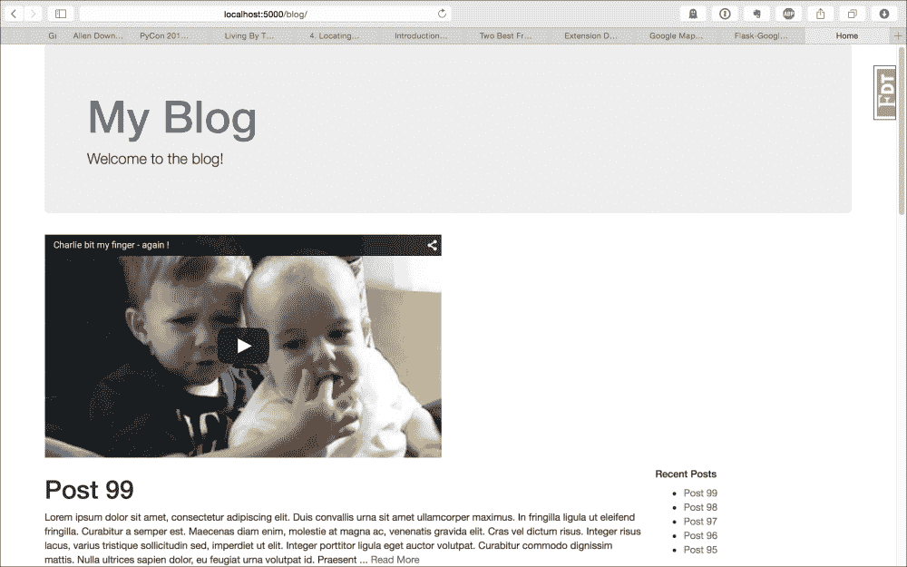

# 第 11 章，建立自己的分机

从本书的第一章开始，我们一直在为我们的应用程序添加 Flask 扩展，以添加新功能，并避免我们花费大量时间重新发明轮子。到目前为止，还不知道这些烧瓶扩展是如何工作的。在本章中，我们将创建两个简单的烧瓶扩展，以便更好地理解烧瓶的内部结构，并允许您使用自己的功能扩展烧瓶。

# 创建 YouTube Flask 扩展

首先，我们要创建的第一个扩展是一个简单的扩展，它允许在 Jinja 模板中嵌入带有以下标记的 YouTube 视频：

```py
{{ youtube(video_id) }}
```

`video_id`对象是任何 YouTube URL 中`v`之后的代码。例如，在 URL[中 https://www.youtube.com/watch?v=_OBlgSz8sSM](https://www.youtube.com/watch?v=_OBlgSz8sSM) ，`video_id`对象将是`_OBlgSz8sSM`。

目前，此扩展的代码将驻留在`extensions.py`中。但是，这仅用于开发和调试目的。当代码准备好共享时，它将被移动到自己的项目目录中。

任何 Flask 扩展都需要的第一件事是将在应用程序上初始化的对象。此对象将处理将其`Blueprint`对象添加到应用程序并在 Jinja 上注册`youtube`功能：

```py
from flask import Blueprint

class Youtube(object):
    def __init__(self, app=None, **kwargs):
        if app:
            self.init_app(app)

    def init_app(self, app):
        self.register_blueprint(app)

    def register_blueprint(self, app):
        module = Blueprint(
            "youtube",
            __name__,
            template_folder="templates"
        )
        app.register_blueprint(module)
        return module
```

到目前为止，这段代码所做的唯一一件事就是在`app`对象上初始化一个空蓝图。需要的下一段代码是视频的表示。以下是一个类，它将处理来自 Jinja 函数的参数，并呈现 HTML 以显示在模板中：

```py
from flask import (
    flash,
    redirect,
    url_for,
    session,
    render_template,
    Blueprint,
    Markup
)

class Video(object):
    def __init__(self, video_id, cls="youtube"):
        self.video_id = video_id
        self.cls = cls

    def render(self, *args, **kwargs):
        return render_template(*args, **kwargs)

    @property
    def html(self):
        return Markup(
            self.render('youtube/video.html', video=self)
        )
```

此对象将从模板中的`youtube`函数创建，模板中传递的任何参数都将提供给此对象以呈现 HTML。这段代码中还有一个新对象，`Markup`，我们以前从未使用过。`Markup`类是 Flask 自动转义 HTML 或将其标记为安全地包含在模板中的方法。如果我们只是返回 HTML，Jinja 会自动转义它，因为它不知道它是否安全。这是 Flask 保护您的站点免受**跨站点脚本攻击**的方法。

下一步是创建将在 Jinja 中注册的函数：

```py
def youtube(*args, **kwargs):
    video = Video(*args, **kwargs)
    return video.html
```

在`YouTube`类中，我们必须用`init_app`方法将函数注册到 Jinja：

```py
class Youtube(object):
    def __init__(self, app=None, **kwargs):
        if app:
            self.init_app(app)

    def init_app(self, app):
        self.register_blueprint(app)
        app.add_template_global(youtube)
```

最后，我们必须创建 HTML，将视频添加到页面中。在`templates`目录下名为`youtube`的新文件夹中，创建名为`video.html`的新 HTML 文件，并向其添加以下代码：

```py
<iframe
    class="{{ video.cls }}"
    width="560"
    height="315" 
    src="https://www.youtube.com/embed/{{ video.video_id }}"
    frameborder="0"
    allowfullscreen>
</iframe>
```

这是在模板中嵌入 YouTube 视频所需的全部代码。现在让我们来测试一下。在`extensions.py`中，初始化`Youtube`类定义下的`Youtube`类：

```py
youtube_ext = Youtube()
```

在`__init__.py`中，导入`youtube_ext`变量，使用我们创建的`init_app`方法在 app 上注册：

```py
from .extensions import (
    bcrypt,
    oid,
    login_manager,
    principals,
    rest_api,
    celery,
    debug_toolbar,
    cache,
    assets_env,
    main_js,
    main_css,
    admin,
    mail,
    youtube_ext
)

def create_app(object_name):
    …
    youtube_ext.init_app(app)
```

现在，作为一个简单的例子，将`youtube`函数添加到博客主页的顶部：

```py
{{ youtube("_OBlgSz8sSM") }}
```

这将产生以下结果：



## 创建 Python 包

为了使我们的新 Flask 扩展对其他人可用，我们必须根据我们目前编写的代码创建一个可安装的 Python 包。首先，我们需要在当前应用程序目录之外创建一个新的项目目录。我们需要两样东西：一个`setup.py`文件，我们稍后将填写该文件，以及一个名为`flask_youtube`的文件夹。在`flask_youtube`目录中，我们将有一个`__init__.py`文件，其中将包含我们为扩展名编写的所有代码。

以下是`__init__.py`文件中包含的代码的最终版本：

```py
from flask import render_template, Blueprint, Markup

class Video(object):
    def __init__(self, video_id, cls="youtube"):
        self.video_id = video_id
        self.cls = cls

    def render(self, *args, **kwargs):
        return render_template(*args, **kwargs)

    @property
    def html(self):
        return Markup(
            self.render('youtube/video.html', video=self)
        )

def youtube(*args, **kwargs):
    video = Video(*args, **kwargs)
    return video.html

class Youtube(object):
    def __init__(self, app=None, **kwargs):
        if app:
            self.init_app(app)

    def init_app(self, app):
        self.register_blueprint(app)
        app.add_template_global(youtube)

    def register_blueprint(self, app):
        module = Blueprint(
            "youtube",
            __name__,
            template_folder="templates"
        )
        app.register_blueprint(module)
        return module
```

同样在`flask_youtube`目录中，我们需要一个`templates`目录，它将保存我们放在应用程序`templates`目录中的`youtube`目录。

为了将此代码转换为 Python 包，我们将使用名为`setuptools`的库。`setuptools`是一个 Python 包，允许开发人员轻松地为其代码创建可安装的包。`setuptools`会捆绑代码，以便`pip`和`easy_install`能够自动安装，甚至会将您的包上传到**Python 包索引**（**PyPI**）。

### 注

我们从`pip`开始安装的所有软件包都来自 PyPI。要查看所有可用的套餐，请转至[https://pypi.python.org/pypi](https://pypi.python.org/pypi) 。

要获得此功能，只需填写`setup.py`文件：

```py
from setuptools import setup, find_packages
setup(
    name='Flask-YouTube',
    version='0.1',
    license='MIT',
    description='Flask extension to allow easy embedding of YouTube videos',
    author='Jack Stouffer',
    author_email='example@gmail.com',
    platforms='any',
    install_requires=['Flask'],
    packages=find_packages()
)
```

此代码使用`setuptools`中的`setup`函数查找源代码，并确保安装代码的机器具有所需的软件包。除了 package 属性外，大多数属性都是不言自明的，它使用了来自`setuptools`的`find_packages`函数。`package`属性的作用是找到源代码的哪些部分是要发布的包的一部分。我们使用`find_packages`方法自动查找要包含的代码部分。这是基于一些合理的默认设置，例如查找包含`__init__.py`文件的目录，并排除常见的文件扩展名。

虽然它不是强制性的，但此设置还包含有关作者和许可证的元数据，如果我们要将其上载到 PyPI 页面，这些元数据将包含在 PyPI 页面上。在`setup`功能中有更多的定制，因此我鼓励您阅读[中的文档http://pythonhosted.org/setuptools/](http://pythonhosted.org/setuptools/) 。

现在，您可以通过运行以下命令在计算机上安装此软件包：

```py
$ python setup.py build
$ python setup.py install

```

这将将您的代码安装到 Python`packages`目录中，或者如果您使用`virtualenv`，它将安装到本地`packages`目录中。然后，您可以通过以下方式导入包裹上的位置：

```py
from flask_youtube import Youtube
```

# 使用烧瓶扩展修改响应

因此，我们创建了一个扩展，在模板中添加了新的功能。但是，我们如何创建一个在请求级别修改应用程序行为的扩展呢？为了演示这一点，让我们创建一个扩展，通过压缩响应的内容来修改来自 Flask 的所有响应。为了加快页面加载时间，这是 web 开发中的一种常见做法，因为使用类似于**gzip**的方法压缩对象是非常快且相对便宜的 CPU 方式。通常，这将在服务器级别处理。因此，除非您希望仅使用 Python 代码托管您的应用程序（这是可能的，并且将在[第 13 章](13.html "Chapter 13. Deploying Flask Apps")、*部署 Flask 应用程序*中介绍），否则此扩展在现实世界中没有太多用途。

为了实现这一点，我们将使用 Python 标准库中的`gzip`模块在处理每个请求后压缩内容。我们还必须在响应中添加特殊的 HTTP 头，以便浏览器知道内容已被压缩。我们还需要在 HTTP 请求头中检查浏览器是否可以接受 gzip 内容。

与之前一样，我们的内容最初将驻留在`extensions.py`文件中：

```py
from flask import request 
from gzip import GzipFile
from io import BytesIO
…

class GZip(object):
    def __init__(self, app=None):
        self.app = app
        if app is not None:
            self.init_app(app)

    def init_app(self, app):
        app.after_request(self.after_request)

    def after_request(self, response):
        encoding = request.headers.get('Accept-Encoding', '')

        if 'gzip' not in encoding or \
           not response.status_code in (200, 201):
            return response

        response.direct_passthrough = False

        contents = BytesIO()
        with GzipFile(
            mode='wb',
            compresslevel=5,
            fileobj=contents) as gzip_file:
            gzip_file.write(response.get_data())

        response.set_data(bytes(contents.getvalue()))

        response.headers['Content-Encoding'] = 'gzip'
        response.headers['Content-Length'] = response.content_length

        return response

flask_gzip = GZip()
```

与前面扩展中的一样，压缩对象的初始值设定项同时适用于普通烧瓶设置和应用程序工厂设置。在`after_request`方法中，我们没有注册蓝图，而是在 after request 事件上注册一个新函数，以便我们的扩展可以压缩结果。

`after_request`方法是扩展的真正逻辑发挥作用的地方。首先，它通过查看请求头中的`Accept-Encoding`值来检查浏览器是否接受 gzip 编码。如果浏览器不接受 gzip，或者没有返回成功的响应，则函数只返回内容，不进行任何修改。但是，如果浏览器确实接受我们的内容并且响应成功，那么我们将压缩内容。我们使用另一个名为`BytesIO`的标准库类，它允许将文件流写入并存储在内存中，而不是中间文件中。这是必要的，因为`GzipFile`对象希望写入文件对象。

数据压缩后，我们将响应对象的数据设置为压缩结果，并在响应中设置必要的 HTTP 头值。最后，gzip 内容返回到浏览器，然后浏览器对内容进行解压缩，大大加快了页面加载时间。

为了测试浏览器中的功能，您必须禁用**Flask Debug Toolbar**，因为在撰写本文时的代码中存在一个 bug，它希望所有响应都以 UTF-8 编码。

如果您重新加载页面，则没有任何内容看起来不同。但是，如果您在选择的浏览器中使用开发人员工具并检查响应，您将看到它们被压缩。

# 总结

现在我们已经讨论了两个不同类型的烧瓶扩展的不同示例，您应该非常清楚地了解我们使用的大多数烧瓶扩展是如何工作的。利用您现在所掌握的知识，您应该能够为您的特定应用程序添加所需的任何额外功能。

在下一章中，我们将研究如何在应用程序中添加测试，以消除对代码所做更改是否破坏了应用程序的任何功能的猜测。